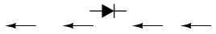
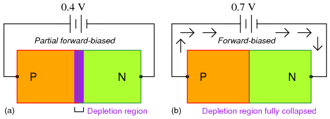
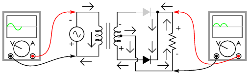
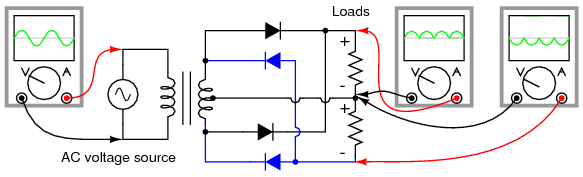
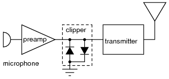
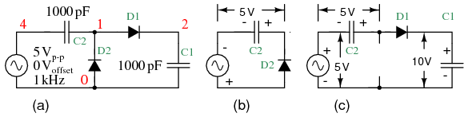
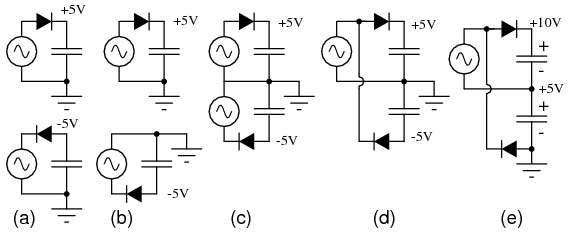
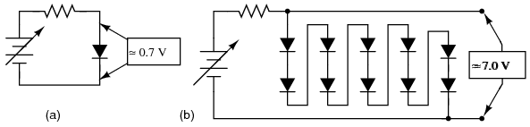

  

---

# Lessons In Electric Circuits \-- Volume III

# Chapter 3

# DIODES AND RECTIFIERS

- [[Introduction]](#xtocid15705650)
- [[Meter check of a diode]](#xtocid15705651)
- [[Diode ratings]](#xtocid15705652)
- [[Rectifier circuits]](#xtocid15705653)
- [[Peak detector]](#xtocid15705654)
- [[Clipper circuits]](#xtocid15705655)
- [[Clamper circuits]](#xtocid15705656)
- [[Voltage multipliers]](#xtocid15705657)
- [[Inductor commutating circuits]](#xtocid15705658)
- [[Diode switching circuits]](#xtocid15705659)
  - [[Logic]](#xtocid157056510)
  - [[Analog switch]](#xtocid157056511)
- [[Zener diodes]](#xtocid157056512)
- [[Special-purpose diodes]](#xtocid157056513)
  - [[Schottky diodes]](#xtocid157056514)
  - [[Tunnel diodes]](#xtocid157056515)
  - [[Light-emitting diodes]](#xtocid157056516)
  - [[Laser diodes]](#xtocid157056517)
  - [[Photodiodes]](#xtocid157056518)
  - [[Solar cells]](#xtocid157056519)
  - [[Varicap or varactor diodes]](#xtocid157056520)
  - [[Snap diode]](#xtocid157056521)
  - [[PIN diodes]](#xtocid157056522)
  - [[IMPATT diode]](#xtocid157056523)
  - [[Gunn diode]](#xtocid157056524)
  - [[Shockley diode]](#xtocid157056525)
  - [[Constant-current diodes]](#xtocid157056526)
- [[Other diode technologies]](#xtocid157056527)
  - [[SiC diodes]](#xtocid157056528)
  - [[Polymer diode]](#xtocid157056529)
- [[SPICE models]](#xtocid157056530)
- [[Contributors]](#xtocid157056531)
- [Bibliography](#xtocid157056532)

## Introduction{ #sec:xtocid15705650 }

A _diode_ is an electrical device allowing current to move through it in one direction with far greater ease than in the other. The most common kind of diode in modern circuit design is the _semiconductor_ diode, although other diode technologies exist. Semiconductor diodes are symbolized in schematic diagrams such as @fig:03246. The term "diode" is customarily reserved for small signal devices, I ≤ 1 A. The term _rectifier_ is used for power devices, I \> 1 A.

{ #fig:03246 width=75% }

_Semiconductor diode schematic symbol: Arrows indicate the direction of electron current flow._

When placed in a simple battery-lamp circuit, the diode will either allow or prevent current through the lamp, depending on the polarity of the applied voltage. (@fig:03247)

{ #fig:03247 width=75% }

_Diode operation: (a) Current flow is permitted; the diode is forward biased. (b) Current flow is prohibited; the diode is reversed biased._

When the polarity of the battery is such that electrons are allowed to flow through the diode, the diode is said to be _forward-biased_. Conversely, when the battery is "backward" and the diode blocks current, the diode is said to be _reverse-biased_. A diode may be thought of as like a switch: "closed" when forward-biased and "open" when reverse-biased.

[]{#Flow, electron vs. conventional}

Oddly enough, the direction of the diode symbol\'s "arrowhead" points _against_ the direction of electron flow. This is because the diode symbol was invented by engineers, who predominantly use _conventional flow_ notation in their schematics, showing current as a flow of charge from the positive (+) side of the voltage source to the negative (-). This convention holds true for all semiconductor symbols possessing "arrowheads:" the arrow points in the permitted direction of conventional flow, and against the permitted direction of electron flow.

[]{#Valve, “check”}

Diode behavior is analogous to the behavior of a hydraulic device called a _check valve_. A check valve allows fluid flow through it in only one direction as in @fig:03248.

{ #fig:03248 width=75% }

_Hydraulic check valve analogy: (a) Electron current flow permitted. (b) Current flow prohibited._

Check valves are essentially pressure-operated devices: they open and allow flow if the pressure across them is of the correct "polarity" to open the gate (in the analogy shown, greater fluid pressure on the right than on the left). If the pressure is of the opposite "polarity," the pressure difference across the check valve will close and hold the gate so that no flow occurs.

Like check valves, diodes are essentially "pressure-" operated (voltage-operated) devices. The essential difference between forward-bias and reverse-bias is the polarity of the voltage dropped across the diode. Let\'s take a closer look at the simple battery-diode-lamp circuit shown earlier, this time investigating voltage drops across the various components in @fig:03249.

{ #fig:03249 width=75% }

_Diode circuit voltage measurements: (a) Forward biased. (b) Reverse biased._

A forward-biased diode conducts current and drops a small voltage across it, leaving most of the battery voltage dropped across the lamp. If the battery\'s polarity is reversed, the diode becomes reverse-biased, and drops _all_ of the battery\'s voltage leaving none for the lamp. If we consider the diode to be a self-actuating switch (closed in the forward-bias mode and open in the reverse-bias mode), this behavior makes sense. The most substantial difference is that the diode drops a lot more voltage when conducting than the average mechanical switch (0.7 volts versus tens of millivolts).

This forward-bias voltage drop exhibited by the diode is due to the action of the depletion region formed by the P-N junction under the influence of an applied voltage. If no voltage applied is across a semiconductor diode, a thin depletion region exists around the region of the P-N junction, preventing current flow. (@fig:03250 (a)) The depletion region is almost devoid of available charge carriers, and acts as an insulator:

{ #fig:03250 width=75% }

_Diode representations: PN-junction model, schematic symbol, physical part._

The schematic symbol of the diode is shown in @fig:03250 (b) such that the anode (pointing end) corresponds to the P-type semiconductor at (a). The cathode bar, non-pointing end, at (b) corresponds to the N-type material at (a). Also note that the cathode stripe on the physical part (c) corresponds to the cathode on the symbol.

If a reverse-biasing voltage is applied across the P-N junction, this depletion region expands, further resisting any current through it. (@fig:03251)

{ #fig:03251 width=75% }

_Depletion region expands with reverse bias._

Conversely, if a forward-biasing voltage is applied across the P-N junction, the depletion region collapses becoming thinner. The diode becomes less resistive to current through it. In order for a sustained current to go through the diode; though, the depletion region must be fully collapsed by the applied voltage. This takes a certain minimum voltage to accomplish, called the _forward voltage_ as illustrated in @fig:03252.

{ #fig:03252 width=75% }

_Inceasing forward bias from (a) to (b) decreases depletion region thickness._

For silicon diodes, the typical forward voltage is 0.7 volts, nominal. For germanium diodes, the forward voltage is only 0.3 volts. The chemical constituency of the P-N junction comprising the diode accounts for its nominal forward voltage figure, which is why silicon and germanium diodes have such different forward voltages. Forward voltage drop remains approximately constant for a wide range of diode currents, meaning that diode voltage drop is not like that of a resistor or even a normal (closed) switch. For most simplified circuit analysis, the voltage drop across a conducting diode may be considered constant at the nominal figure and not related to the amount of current.

[]{#DioEqu <="" a=""}

Actually, forward voltage drop is more complex. An equation describes the exact current through a diode, given the voltage dropped across the junction, the temperature of the junction, and several physical constants. It is commonly known as the _diode equation_:

{ #fig:13047 width=75% }

The term kT/q describes the voltage produced within the P-N junction due to the action of temperature, and is called the _thermal voltage_, or V~t~ of the junction. At room temperature, this is about 26 millivolts. Knowing this, and assuming a "nonideality" coefficient of 1, we may simplify the diode equation and re-write it as such:

{ #fig:13048 width=75% }

You need not be familiar with the "diode equation" to analyze simple diode circuits. Just understand that the voltage dropped across a current-conducting diode _does_ change with the amount of current going through it, but that this change is fairly small over a wide range of currents. This is why many textbooks simply say the voltage drop across a conducting, semiconductor diode remains constant at 0.7 volts for silicon and 0.3 volts for germanium. However, some circuits intentionally make use of the P-N junction\'s inherent exponential current/voltage relationship and thus can only be understood in the context of this equation. Also, since temperature is a factor in the diode equation, a forward-biased P-N junction may also be used as a temperature-sensing device, and thus can only be understood if one has a conceptual grasp on this mathematical relationship.

A reverse-biased diode prevents current from going through it, due to the expanded depletion region. In actuality, a very small amount of current can and does go through a reverse-biased diode, called the _leakage current_, but it can be ignored for most purposes. The ability of a diode to withstand reverse-bias voltages is limited, as it is for any insulator. If the applied reverse-bias voltage becomes too great, the diode will experience a condition known as _breakdown_ (@fig:03253), which is usually destructive. A diode\'s maximum reverse-bias voltage rating is known as the _Peak Inverse Voltage_, or _PIV_, and may be obtained from the manufacturer. Like forward voltage, the PIV rating of a diode varies with temperature, except that PIV _increases_ with increased temperature and _decreases_ as the diode becomes cooler \-- exactly opposite that of forward voltage.

{ #fig:03253 width=75% }

_Diode curve: showing knee at 0.7 V forward bias for Si, and reverse breakdown._

Typically, the PIV rating of a generic "rectifier" diode is at least 50 volts at room temperature. Diodes with PIV ratings in the many thousands of volts are available for modest prices.

- **REVIEW:**
- A _diode_ is an electrical component acting as a one-way valve for current.
- When voltage is applied across a diode in such a way that the diode allows current, the diode is said to be _forward-biased_.
- When voltage is applied across a diode in such a way that the diode prohibits current, the diode is said to be _reverse-biased_.
- The voltage dropped across a conducting, forward-biased diode is called the _forward voltage_. Forward voltage for a diode varies only slightly for changes in forward current and temperature, and is fixed by the chemical composition of the P-N junction.
- Silicon diodes have a forward voltage of approximately 0.7 volts.
- Germanium diodes have a forward voltage of approximately 0.3 volts.
- The maximum reverse-bias voltage that a diode can withstand without "breaking down" is called the _Peak Inverse Voltage_, or _PIV_ rating.

## Meter check of a diode{ #sec:xtocid15705651 }

Being able to determine the polarity (cathode versus anode) and basic functionality of a diode is a very important skill for the electronics hobbyist or technician to have. Since we know that a diode is essentially nothing more than a one-way valve for electricity, it makes sense we should be able to verify its one-way nature using a DC (battery-powered) ohmmeter as in @fig:03254. Connected one way across the diode, the meter should show a very low resistance at (a). Connected the other way across the diode, it should show a very high resistance at (b) ("OL" on some digital meter models).

{ #fig:03254 width=75% }

_Determination of diode polarity: (a) Low resistance indicates forward bias, black lead is cathode and red lead anode (for most meters) (b) Reversing leads shows high resistance indicating reverse bias._

Of course, to determine which end of the diode is the cathode and which is the anode, you must know with certainty which test lead of the meter is positive (+) and which is negative (-) when set to the "resistance" or "Ω" function. With most digital multimeters I\'ve seen, the red lead becomes positive and the black lead negative when set to measure resistance, in accordance with standard electronics color-code convention. However, this is not guaranteed for all meters. Many analog multimeters, for example, actually make their black leads positive (+) and their red leads negative (-) when switched to the "resistance" function, because it is easier to manufacture it that way!

One problem with using an ohmmeter to check a diode is that the readings obtained only have qualitative value, not quantitative. In other words, an ohmmeter only tells you which way the diode conducts; the low-value resistance indication obtained while conducting is useless. If an ohmmeter shows a value of "1.73 ohms" while forward-biasing a diode, that figure of 1.73 Ω doesn\'t represent any real-world quantity useful to us as technicians or circuit designers. It neither represents the forward voltage drop nor any "bulk" resistance in the semiconductor material of the diode itself, but rather is a figure dependent upon both quantities and will vary substantially with the particular ohmmeter used to take the reading.

For this reason, some digital multimeter manufacturers equip their meters with a special "diode check" function which displays the actual forward voltage drop of the diode in volts, rather than a "resistance" figure in ohms. These meters work by forcing a small current through the diode and measuring the voltage dropped between the two test leads. (@fig:03256)

{ #fig:03256 width=75% }

_Meter with a "Diode check" function displays the forward voltage drop of 0.548 volts instead of a low resistance._

The forward voltage reading obtained with such a meter will typically be less than the "normal" drop of 0.7 volts for silicon and 0.3 volts for germanium, because the current provided by the meter is of trivial proportions. If a multimeter with diode-check function isn\'t available, or you would like to measure a diode\'s forward voltage drop at some non-trivial current, the circuit of @fig:03257 may be constructed using a battery, resistor, and voltmeter

{ #fig:03257 width=75% }

_Measuring forward voltage of a diode without"diode check" meter function: (a) Schematic diagram. (b) Pictorial diagram._

Connecting the diode backwards to this testing circuit will simply result in the voltmeter indicating the full voltage of the battery.

If this circuit were designed to provide a constant or nearly constant current through the diode despite changes in forward voltage drop, it could be used as the basis of a temperature-measurement instrument, the voltage measured across the diode being inversely proportional to diode junction temperature. Of course, diode current should be kept to a minimum to avoid self-heating (the diode dissipating substantial amounts of heat energy), which would interfere with temperature measurement.

Beware that some digital multimeters equipped with a "diode check" function may output a very low test voltage (less than 0.3 volts) when set to the regular "resistance" (Ω) function: too low to fully collapse the depletion region of a PN junction. The philosophy here is that the "diode check" function is to be used for testing semiconductor devices, and the "resistance" function for anything else. By using a very low test voltage to measure resistance, it is easier for a technician to measure the resistance of non-semiconductor components connected to semiconductor components, since the semiconductor component junctions will not become forward-biased with such low voltages.

Consider the example of a resistor and diode connected in parallel, soldered in place on a printed circuit board (PCB). Normally, one would have to unsolder the resistor from the circuit (disconnect it from all other components) before measuring its resistance, otherwise any parallel-connected components would affect the reading obtained. When using a multimeter which outputs a very low test voltage to the probes in the "resistance" function mode, the diode\'s PN junction will not have enough voltage impressed across it to become forward-biased, and will only pass negligible current. Consequently, the meter "sees" the diode as an open (no continuity), and only registers the resistor\'s resistance. (@fig:03329)

{ #fig:03329 width=75% }

_Ohmmeter equipped with a low test voltage (\<0.7 V) does not see diodes allowing it to measure parallel resistors._

If such an ohmmeter were used to test a diode, it would indicate a very high resistance (many mega-ohms) even if connected to the diode in the "correct" (forward-biased) direction. (@fig:03330)

{ #fig:03330 width=75% }

_Ohmmeter equipped with a low test voltage, too low to forward bias diodes, does not see diodes._

Reverse voltage strength of a diode is not as easily tested, because exceeding a normal diode\'s PIV usually results in destruction of the diode. Special types of diodes, though, which are designed to "break down" in reverse-bias mode without damage (called _zener diodes_), which are tested with the same voltage source / resistor / voltmeter circuit, provided that the voltage source is of high enough value to force the diode into its breakdown region. More on this subject in a later section of this chapter.

- **REVIEW:**
- An ohmmeter may be used to qualitatively check diode function. There should be low resistance measured one way and very high resistance measured the other way. When using an ohmmeter for this purpose, be sure you know which test lead is positive and which is negative! The actual polarity may not follow the colors of the leads as you might expect, depending on the particular design of meter.
- Some multimeters provide a "diode check" function that displays the actual forward voltage of the diode when its conducting current. Such meters typically indicate a slightly lower forward voltage than what is "nominal" for a diode, due to the very small amount of current used during the check.

## Diode ratings{ #sec:xtocid15705652 }

In addition to forward voltage drop (V~f~) and peak inverse voltage (PIV), there are many other ratings of diodes important to circuit design and component selection. Semiconductor manufacturers provide detailed specifications on their products \-- diodes included \-- in publications known as _datasheets_. Datasheets for a wide variety of semiconductor components may be found in reference books and on the internet. I prefer the internet as a source of component specifications because all the data obtained from manufacturer websites are up-to-date.

A typical diode datasheet will contain figures for the following parameters:

[Maximum repetitive reverse voltage] = V~RRM~, the maximum amount of voltage the diode can withstand in reverse-bias mode, in repeated pulses. Ideally, this figure would be infinite.

[Maximum DC reverse voltage] = V~R~ or V~DC~, the maximum amount of voltage the diode can withstand in reverse-bias mode on a continual basis. Ideally, this figure would be infinite.

[Maximum forward voltage] = V~F~, usually specified at the diode\'s rated forward current. Ideally, this figure would be zero: the diode providing no opposition whatsoever to forward current. In reality, the forward voltage is described by the "diode equation."

[Maximum (average) forward current] = I~F(AV)~, the maximum average amount of current the diode is able to conduct in forward bias mode. This is fundamentally a thermal limitation: how much heat can the PN junction handle, given that dissipation power is equal to current (I) multiplied by voltage (V or E) and forward voltage is dependent upon both current and junction temperature. Ideally, this figure would be infinite.

[Maximum (peak or surge) forward current] = I~FSM~ or i~f(surge)~, the maximum peak amount of current the diode is able to conduct in forward bias mode. Again, this rating is limited by the diode junction\'s thermal capacity, and is usually much higher than the average current rating due to thermal inertia (the fact that it takes a finite amount of time for the diode to reach maximum temperature for a given current). Ideally, this figure would be infinite.

[Maximum total dissipation] = P~D~, the amount of power (in watts) allowable for the diode to dissipate, given the dissipation (P=IE) of diode current multiplied by diode voltage drop, and also the dissipation (P=I^2^R) of diode current squared multiplied by bulk resistance. Fundamentally limited by the diode\'s thermal capacity (ability to tolerate high temperatures).

[Operating junction temperature] = T~J~, the maximum allowable temperature for the diode\'s PN junction, usually given in degrees Celsius (^o^C). Heat is the "Achilles\' heel" of semiconductor devices: they _must_ be kept cool to function properly and give long service life.

[Storage temperature range] = T~STG~, the range of allowable temperatures for storing a diode (unpowered). Sometimes given in conjunction with operating junction temperature (T~J~), because the maximum storage temperature and the maximum operating temperature ratings are often identical. If anything, though, maximum storage temperature rating will be greater than the maximum operating temperature rating.

[Thermal resistance] = R(Θ), the temperature difference between junction and outside air (R(Θ)~JA~) or between junction and leads (R(Θ)~JL~) for a given power dissipation. Expressed in units of degrees Celsius per watt (^o^C/W). Ideally, this figure would be zero, meaning that the diode package was a perfect thermal conductor and radiator, able to transfer all heat energy from the junction to the outside air (or to the leads) with no difference in temperature across the thickness of the diode package. A high thermal resistance means that the diode will build up excessive temperature at the junction (where its critical) despite best efforts at cooling the outside of the diode, and thus will limit its maximum power dissipation.

[Maximum reverse current] = I~R~, the amount of current through the diode in _reverse-bias_ operation, with the maximum rated inverse voltage applied (V~DC~). Sometimes referred to as _leakage current_. Ideally, this figure would be zero, as a perfect diode would block all current when reverse-biased. In reality, it is very small compared to the maximum forward current.

[Typical junction capacitance] = C~J~, the typical amount of capacitance intrinsic to the junction, due to the depletion region acting as a dielectric separating the anode and cathode connections. This is usually a very small figure, measured in the range of picofarads (pF).

[Reverse recovery time] = t~rr~, the amount of time it takes for a diode to "turn off" when the voltage across it alternates from forward-bias to reverse-bias polarity. Ideally, this figure would be zero: the diode halting conduction _immediately_ upon polarity reversal. For a typical rectifier diode, reverse recovery time is in the range of tens of microseconds; for a "fast switching" diode, it may only be a few nanoseconds.

Most of these parameters vary with temperature or other operating conditions, and so a single figure fails to fully describe any given rating. Therefore, manufacturers provide graphs of component ratings plotted against other variables (such as temperature), so that the circuit designer has a better idea of what the device is capable of.

## Rectifier circuits{ #sec:xtocid15705653 }

Now we come to the most popular application of the diode: _rectification_. Simply defined, rectification is the conversion of alternating current (AC) to direct current (DC). This involves a device that only allows one-way flow of electrons. As we have seen, this is exactly what a semiconductor diode does. The simplest kind of rectifier circuit is the _half-wave_ rectifier. It only allows one half of an AC waveform to pass through to the load. (@fig:03258)

{ #fig:03258 width=75% }

_Half-wave rectifier circuit._

For most power applications, half-wave rectification is insufficient for the task. The harmonic content of the rectifier\'s output waveform is very large and consequently difficult to filter. Furthermore, the AC power source only supplies power to the load one half every full cycle, meaning that half of its capacity is unused. Half-wave rectification is, however, a very simple way to reduce power to a resistive load. Some two-position lamp dimmer switches apply full AC power to the lamp filament for "full" brightness and then half-wave rectify it for a lesser light output. (@fig:03259)

{ #fig:03259 width=75% }

_Half-wave rectifier application: Two level lamp dimmer._

In the "Dim" switch position, the incandescent lamp receives approximately one-half the power it would normally receive operating on full-wave AC. Because the half-wave rectified power pulses far more rapidly than the filament has time to heat up and cool down, the lamp does not blink. Instead, its filament merely operates at a lesser temperature than normal, providing less light output. This principle of "pulsing" power rapidly to a slow-responding load device to control the electrical power sent to it is common in the world of industrial electronics. Since the controlling device (the diode, in this case) is either fully conducting or fully nonconducting at any given time, it dissipates little heat energy while controlling load power, making this method of power control very energy-efficient. This circuit is perhaps the crudest possible method of pulsing power to a load, but it suffices as a proof-of-concept application.

If we need to rectify AC power to obtain the full use of _both_ half-cycles of the sine wave, a different rectifier circuit configuration must be used. Such a circuit is called a _full-wave_ rectifier. One kind of full-wave rectifier, called the _center-tap_ design, uses a transformer with a center-tapped secondary winding and two diodes, as in @fig:03260.

{ #fig:03260 width=75% }

_Full-wave rectifier, center-tapped design._

This circuit\'s operation is easily understood one half-cycle at a time. Consider the first half-cycle, when the source voltage polarity is positive (+) on top and negative (-) on bottom. At this time, only the top diode is conducting; the bottom diode is blocking current, and the load "sees" the first half of the sine wave, positive on top and negative on bottom. Only the top half of the transformer\'s secondary winding carries current during this half-cycle as in @fig:03261.

{ #fig:03261 width=75% }

_Full-wave center-tap rectifier: Top half of secondary winding conducts during positive half-cycle of input, delivering positive half-cycle to load.._

During the next half-cycle, the AC polarity reverses. Now, the other diode and the other half of the transformer\'s secondary winding carry current while the portions of the circuit formerly carrying current during the last half-cycle sit idle. The load still "sees" half of a sine wave, of the same polarity as before: positive on top and negative on bottom. (@fig:03262)

{ #fig:03262 width=75% }

_Full-wave center-tap rectifier: During negative input half-cycle, bottom half of secondary winding conducts, delivering a positive half-cycle to the load._

One disadvantage of this full-wave rectifier design is the necessity of a transformer with a center-tapped secondary winding. If the circuit in question is one of high power, the size and expense of a suitable transformer is significant. Consequently, the center-tap rectifier design is only seen in low-power applications.

The full-wave center-tapped rectifier polarity at the load may be reversed by changing the direction of the diodes. Furthermore, the reversed diodes can be paralleled with an existing positive-output rectifier. The result is dual-polarity full-wave center-tapped rectifier in @fig:03444. Note that the connectivity of the diodes themselves is the same configuration as a bridge.

{ #fig:03444 width=75% }

_Dual polarity full-wave center tap rectifier_

Another, more popular full-wave rectifier design exists, and it is built around a four-diode bridge configuration. For obvious reasons, this design is called a _full-wave bridge_. (@fig:03263)

{ #fig:03263 width=75% }

_Full-wave bridge rectifier._

Current directions for the full-wave bridge rectifier circuit are as shown in @fig:03264 for positive half-cycle and @fig:03265 for negative half-cycles of the AC source waveform. Note that regardless of the polarity of the input, the current flows in the same direction through the load. That is, the negative half-cycle of source is a positive half-cycle at the load. The current flow is through two diodes in series for both polarities. Thus, two diode drops of the source voltage are lost (0.7·2=1.4 V for Si) in the diodes. This is a disadvantage compared with a full-wave center-tap design. This disadvantage is only a problem in very low voltage power supplies.

{ #fig:03264 width=75% }

_Full-wave bridge rectifier: Electron flow for positive half-cycles._

{ #fig:03265 width=75% }

_Full-wave bridge rectifier: Electron flow for negative half=cycles._

Remembering the proper layout of diodes in a full-wave bridge rectifier circuit can often be frustrating to the new student of electronics. I\'ve found that an alternative representation of this circuit is easier both to remember and to comprehend. It\'s the exact same circuit, except all diodes are drawn in a horizontal attitude, all "pointing" the same direction. (@fig:03266)

{ #fig:03266 width=75% }

_Alternative layout style for Full-wave bridge rectifier._

One advantage of remembering this layout for a bridge rectifier circuit is that it expands easily into a polyphase version in @fig:03267.

{ #fig:03267 width=75% }

_Three-phase full-wave bridge rectifier circuit._

Each three-phase line connects between a pair of diodes: one to route power to the positive (+) side of the load, and the other to route power to the negative (-) side of the load. Polyphase systems with more than three phases are easily accommodated into a bridge rectifier scheme. Take for instance the six-phase bridge rectifier circuit in @fig:03268.

{ #fig:03268 width=75% }

_Six-phase full-wave bridge rectifier circuit._

When polyphase AC is rectified, the phase-shifted pulses overlap each other to produce a DC output that is much "smoother" (has less AC content) than that produced by the rectification of single-phase AC. This is a decided advantage in high-power rectifier circuits, where the sheer physical size of filtering components would be prohibitive but low-noise DC power must be obtained. The diagram in @fig:03269 shows the full-wave rectification of three-phase AC.

{ #fig:03269 width=75% }

_Three-phase AC and 3-phase full-wave rectifier output._

In any case of rectification \-- single-phase or polyphase \-- the amount of AC voltage mixed with the rectifier\'s DC output is called _ripple voltage_. In most cases, since "pure" DC is the desired goal, ripple voltage is undesirable. If the power levels are not too great, filtering networks may be employed to reduce the amount of ripple in the output voltage.

Sometimes, the method of rectification is referred to by counting the number of DC "pulses" output for every 360^o^ of electrical "rotation." A single-phase, half-wave rectifier circuit, then, would be called a _1-pulse_ rectifier, because it produces a single pulse during the time of one complete cycle (360^o^) of the AC waveform. A single-phase, full-wave rectifier (regardless of design, center-tap or bridge) would be called a _2-pulse_ rectifier, because it outputs two pulses of DC during one AC cycle\'s worth of time. A three-phase full-wave rectifier would be called a _6-pulse_ unit.

Modern electrical engineering convention further describes the function of a rectifier circuit by using a three-field notation of _phases_, _ways_, and number of _pulses_. A single-phase, half-wave rectifier circuit is given the somewhat cryptic designation of 1Ph1W1P (1 phase, 1 way, 1 pulse), meaning that the AC supply voltage is single-phase, that current on each phase of the AC supply lines moves in only one direction (way), and that there is a single pulse of DC produced for every 360^o^ of electrical rotation. A single-phase, full-wave, center-tap rectifier circuit would be designated as 1Ph1W2P in this notational system: 1 phase, 1 way or direction of current in each winding half, and 2 pulses or output voltage per cycle. A single-phase, full-wave, bridge rectifier would be designated as 1Ph2W2P: the same as for the center-tap design, except current can go _both_ ways through the AC lines instead of just one way. The three-phase bridge rectifier circuit shown earlier would be called a 3Ph2W6P rectifier.

Is it possible to obtain more pulses than twice the number of phases in a rectifier circuit? The answer to this question is yes: especially in polyphase circuits. Through the creative use of transformers, sets of full-wave rectifiers may be paralleled in such a way that more than six pulses of DC are produced for three phases of AC. A 30^o^ phase shift is introduced from primary to secondary of a three-phase transformer when the winding configurations are not of the same type. In other words, a transformer connected either Y-Δ or Δ-Y will exhibit this 30^o^ phase shift, while a transformer connected Y-Y or Δ-Δ will not. This phenomenon may be exploited by having one transformer connected Y-Y feed a bridge rectifier, and have another transformer connected Y-Δ feed a second bridge rectifier, then parallel the DC outputs of both rectifiers. (@fig:03270) Since the ripple voltage waveforms of the two rectifiers\' outputs are phase-shifted 30^o^ from one another, their superposition results in less ripple than either rectifier output considered separately: 12 pulses per 360^o^ instead of just six:

{ #fig:03270 width=75% }

_Polyphase rectifier circuit: 3-phase 2-way 12-pulse (3Ph2W12P)_

- **REVIEW:**
- _Rectification_ is the conversion of alternating current (AC) to direct current (DC).
- A _half-wave_ rectifier is a circuit that allows only one half-cycle of the AC voltage waveform to be applied to the load, resulting in one non-alternating polarity across it. The resulting DC delivered to the load "pulsates" significantly.
- A _full-wave_ rectifier is a circuit that converts both half-cycles of the AC voltage waveform to an unbroken series of voltage pulses of the same polarity. The resulting DC delivered to the load doesn\'t "pulsate" as much.
- Polyphase alternating current, when rectified, gives a much "smoother" DC waveform (less _ripple_ voltage) than rectified single-phase AC.

## Peak detector{ #sec:xtocid15705654 }

A _peak detector_ is a series connection of a diode and a capacitor outputting a DC voltage equal to the peak value of the applied AC signal. The circuit is shown in @fig:03441 with the corresponding SPICE net list. An AC voltage source applied to the peak detector, charges the capacitor to the peak of the input. The diode conducts positive "half cycles," charging the capacitor to the waveform peak. When the input waveform falls below the DC "peak" stored on the capacitor, the diode is reverse biased, blocking current flow from capacitor back to the source. Thus, the capacitor retains the peak value even as the waveform drops to zero. Another view of the peak detector is that it is the same as a [half-wave rectifier](#half-W-R) with a filter capacitor added to the output.

[]{#03441.png <="" a=""}

+-----------------------+-----------------------+-----------------------+ | { #fig:03441 width=75% } | | \*SPICE 03441.eps | | | | C1 2 0 0.1u | | | | R1 1 3 1.0k | | | | | | | | V1 1 0 SIN(0 5 1k) | | | | D1 3 2 diode | | | | .model diode d | | | | .tran 0.01m 50mm | | | | .end | +-----------------------+-----------------------+-----------------------+

_Peak detector: Diode conducts on positive half cycles charging capacitor to the peak voltage (less diode forward drop)._

It takes a few cycles for the capacitor to charge to the peak as in @fig:23027 due to the series resistance (RC "time constant"). Why does the capacitor not charge all the way to 5 V? It would charge to 5 V if an "ideal diode" were obtainable. However, the silicon diode has a forward voltage drop of 0.7 V which subtracts from the 5 V peak of the input.

{ #fig:23027 width=75% }

_Peak detector: Capacitor charges to peak within a few cycles._

The circuit in @fig:03441 could represent a DC power supply based on a half-wave rectifier. The resistance would be a few Ohms instead of 1 kΩ due to a transformer secondary winding replacing the voltage source and resistor. A larger "filter" capacitor would be used. A power supply based on a 60 Hz source with a filter of a few hundred µF could supply up to 100 mA. Half-wave supplies seldom supply more due to the difficulty of filtering a half-wave.

The peak detector may be combined with other components to build a [crystal radio](SEMI_9.html#CrystalRadio) 03442.png.

## Clipper circuits{ #sec:xtocid15705655 }

A circuit which removes the peak of a waveform is known as a _clipper_. A negative clipper is shown in @fig:03437. This schematic diagram was produced with Xcircuit schematic capture program. Xcircuit produced the SPICE net list @fig:03437, except for the second, and next to last pair of lines which were inserted with a text editor.

[]{#03437.png <="" a=""}

+-----------------------+-----------------------+-----------------------+ | { #fig:03437 width=75% } | | _SPICE 03437.eps | | | | _ A K ModelName | | | | D1 0 2 diode | | | | R1 2 1 1.0k | | | | | | | | V1 1 0 SIN(0 5 1k) | | | | .model diode d | | | | .tran .05m 3m | | | | .end | +-----------------------+-----------------------+-----------------------+

_Clipper: clips negative peak at -0.7 V._

During the positive half cycle of the 5 V peak input, the diode is reversed biased. The diode does not conduct. It is as if the diode were not there. The positive half cycle is unchanged at the output V(2) in @fig:23024. Since the output positive peaks actually overlays the input sinewave V(1), the input has been shifted upward in the plot for clarity. In Nutmeg, the SPICE display module, the command "plot v(1)+1)" accomplishes this.

{ #fig:23024 width=75% }

_V(1)+1 is actually V(1), a 10 Vptp sinewave, offset by 1 V for display clarity. V(2) output is clipped at -0.7 V, by diode D1._

During the negative half cycle of sinewave input of @fig:23024, the diode is forward biased, that is, conducting. The negative half cycle of the sinewave is shorted out. The negative half cycle of V(2) would be clipped at 0 V for an ideal diode. The waveform is clipped at -0.7 V due to the forward voltage drop of the silicon diode. The spice model defaults to 0.7 V unless parameters in the model statement specify otherwise. Germanium or Schottky diodes clip at lower voltages.

Closer examination of the negative clipped peak (@fig:23024) reveals that it follows the input for a slight period of time while the sinewave is moving toward -0.7 V. The clipping action is only effective after the input sinewave exceeds -0.7 V. The diode is not conducting for the complete half cycle, though, during most of it.

The addition of an anti-parallel diode to the existing diode in @fig:03437 yields the symmetrical clipper in @fig:03438.

[]{#03438.png <="" a=""}

+-----------------------+-----------------------+-----------------------+ | { #fig:03438 width=75% } | | \*SPICE 03438.eps | | | | D1 0 2 diode | | | | D2 2 0 diode | | | | R1 2 1 1.0k | | | | | | | | V1 1 0 SIN(0 5 1k) | | | | .model diode d | | | | .tran 0.05m 3m | | | | .end | +-----------------------+-----------------------+-----------------------+

_Symmetrical clipper: Anti-parallel diodes clip both positive and negative peak, leaving a ± 0.7 V output._

Diode D1 clips the negative peak at -0.7 V as before. The additional diode D2 conducts for positive half cycles of the sine wave as it exceeds 0.7 V, the forward diode drop. The remainder of the voltage drops across the series resistor. Thus, both peaks of the input sinewave are clipped in @fig:23025. The net list is in @fig:03438

{ #fig:23025 width=75% }

_Diode D1 clips at -0.7 V as it conducts during negative peaks. D2 conducts for positive peaks, clipping at 0.7V._

The most general form of the diode clipper is shown in @fig:03439. For an ideal diode, the clipping occurs at the level of the clipping voltage, V1 and V2. However, the voltage sources have been adjusted to account for the 0.7 V forward drop of the real silicon diodes. D1 clips at 1.3V +0.7V=2.0V when the diode begins to conduct. D2 clips at -2.3V -0.7V=-3.0V when D2 conducts.

[]{#03439.png <="" a=""}

+-----------------------+-----------------------+-----------------------+ | { #fig:03439 width=75% } | | \*SPICE 03439.eps | | | | V1 3 0 1.3 | | | | V2 4 0 -2.3 | | | | D1 2 3 diode | | | | D2 4 2 diode | | | | R1 2 1 1.0k | | | | | | | | V3 1 0 SIN(0 5 1k) | | | | .model diode d | | | | .tran 0.05m 3m | | | | .end | +-----------------------+-----------------------+-----------------------+

_D1 clips the input sinewave at 2V. D2 clips at -3V._

The clipper in @fig:03439 does not have to clip both levels. To clip at one level with one diode and one voltage source, remove the other diode and source.

The net list is in @fig:03439. The waveforms in @fig:23026 show the clipping of v(1) at output v(2).

{ #fig:23026 width=75% }

_D1 clips the sinewave at 2V. D2 clips at -3V._

There is also a [zener diode clipper](#zenerclip) circuit in the "Zener diode" section. A zener diode replaces both the diode and the DC voltage source.

A practical application of a clipper is to prevent an amplified speech signal from overdriving a radio transmitter in @fig:03440. Over driving the transmitter generates spurious radio signals which causes interference with other stations. The clipper is a protective measure.

{ #fig:03440 width=75% }

_Clipper prevents over driving radio transmitter by voice peaks._

A sinewave may be squared up by overdriving a clipper. Another clipper application is the protection of exposed inputs of integrated circuits. The input of the IC is connected to a pair of diodes as at node "2" of @fig:03439. The voltage sources are replaced by the power supply rails of the IC. For example, CMOS IC\'s use 0V and +5 V. Analog amplifiers might use ±12V for the V1 and V2 sources.

- **REVIEW**
- A resistor and diode driven by an AC voltage source clips the signal observed across the diode.
- A pair of anti-parallel Si diodes clip symmetrically at ±0.7V
- The grounded end of a clipper diode(s) can be disconnected and wired to a DC voltage to clip at an arbitrary level.
- A clipper can serve as a protective measure, preventing a signal from exceeding the clip limits.

## Clamper circuits{ #sec:xtocid15705656 }

The circuits in @fig:03443 are known as _clampers_ or _DC restorers_. The corresponding netlist is in @fig:23028. These circuits clamp a peak of a waveform to a specific DC level compared with a capacitively coupled signal which swings about its average DC level (usually 0V). If the diode is removed from the clamper, it defaults to a simple coupling capacitor-- no clamping.

What is the clamp voltage? And, which peak gets clamped? In @fig:03443 (a) the clamp voltage is 0 V ignoring diode drop, (more exactly 0.7 V with Si diode drop). In @fig:23028, the positive peak of V(1) is clamped to the 0 V (0.7 V) clamp level. Why is this? On the first positive half cycle, the diode conducts charging the capacitor left end to +5 V (4.3 V). This is -5 V (-4.3 V) on the right end at V(1,4). Note the polarity marked on the capacitor in @fig:03443 (a). The right end of the capacitor is -5 V DC (-4.3 V) with respect to ground. It also has an AC 5 V peak sinewave coupled across it from source V(4) to node 1. The sum of the two is a 5 V peak sine riding on a - 5 V DC (-4.3 V) level. The diode only conducts on successive positive excursions of source V(4) if the peak V(4) exceeds the charge on the capacitor. This only happens if the charge on the capacitor drained off due to a load, not shown. The charge on the capacitor is equal to the positive peak of V(4) (less 0.7 diode drop). The AC riding on the negative end, right end, is shifted down. The positive peak of the waveform is clamped to 0 V (0.7 V) because the diode conducts on the positive peak.

{ #fig:03443 width=75% }

_Clampers: (a) Positive peak clamped to 0 V. (b) Negative peak clamped to 0 V. (c) Negative peak clamped to 5 V._

[]{#23028.png <="" a=""}

+-----------------------+-----------------------+-----------------------+ | { #fig:23028 width=75% } | | \*SPICE 03443.eps | | | | V1 6 0 5 | | | | D1 6 3 diode | | | | C1 4 3 1000p | | | | D2 0 2 diode | | | | C2 4 2 1000p | | | | C3 4 1 1000p | | | | D3 1 0 diode | | | | | | | | V2 4 0 SIN(0 5 1k) | | | | .model diode d | | | | .tran 0.01m 5m | | | | .end | +-----------------------+-----------------------+-----------------------+

_V(4) source voltage 5 V peak used in all clampers. V(1) clamper output from @fig:03443 (a). V(1,4) DC voltage on capacitor in Figure (a). V(2) clamper output from Figure (b). V(3) clamper output from Figure (c)._

Suppose the polarity of the diode is reversed as in @fig:03443 (b)? The diode conducts on the negative peak of source V(4). The negative peak is clamped to 0 V (-0.7 V). See V(2) in @fig:23028.

The most general realization of the clamper is shown in @fig:03443 (c) with the diode connected to a DC reference. The capacitor still charges during the negative peak of the source. Note that the polarities of the AC source and the DC reference are series aiding. Thus, the capacitor charges to the sum to the two, 10 V DC (9.3 V). Coupling the 5 V peak sinewave across the capacitor yields @fig:23028 V(3), the sum of the charge on the capacitor and the sinewave. The negative peak appears to be clamped to 5 V DC (4.3V), the value of the DC clamp reference (less diode drop).

Describe the waveform if the DC clamp reference is changed from 5 V to 10 V. The clamped waveform will shift up. The negative peak will be clamped to 10 V (9.3). Suppose that the amplitude of the sine wave source is increased from 5 V to 7 V? The negative peak clamp level will remain unchanged. Though, the amplitude of the sinewave output will increase.

An application of the clamper circuit is as a "DC restorer" in "composite video" circuitry in both television transmitters and receivers. An NTSC (US video standard) video signal "white level" corresponds to minimum (12.5%) transmitted power. The video "black level" corresponds to a high level (75% of transmitter power. There is a "blacker than black level" corresponding to 100% transmitted power assigned to synchronization signals. The NTSC signal contains both video and synchronization pulses. The problem with the composite video is that its average DC level varies with the scene, dark vs light. The video itself is supposed to vary. However, the sync must always peak at 100%. To prevent the sync signals from drifting with changing scenes, a "DC restorer" clamps the top of the sync pulses to a voltage corresponding to 100% transmitter modulation. [\[ATCO\]](#ATCO.bibitem)

- REVIEW:
- A capacitively coupled signal alternates about its average DC level (0 V).
- The signal out of a clamper appears the have one peak clamped to a DC voltage. Example: The negative peak is clamped to 0 VDC, the waveform appears to be shifted upward. The polarity of the diode determines which peak is clamped.
- An application of a clamper, or DC restorer, is in clamping the sync pulses of composite video to a voltage corresponding to 100% of transmitter power.

## Voltage multipliers{ #sec:xtocid15705657 }

A _voltage multiplier_ is a specialized rectifier circuit producing an output which is theoretically an integer times the AC peak input, for example, 2, 3, or 4 times the AC peak input. Thus, it is possible to get 200 VDC from a 100 V~peak~ AC source using a doubler, 400 VDC from a quadrupler. Any load in a practical circuit will lower these voltages.

A voltage doubler application is a DC power supply capable of using either a 240 VAC or 120 VAC source. The supply uses a switch selected full-wave bridge to produce about 300 VDC from a 240 VAC source. The 120 V position of the switch rewires the bridge as a doubler producing about 300 VDC from the 120 VAC. In both cases, 300 VDC is produced. This is the input to a switching regulator producing lower voltages for powering, say, a personal computer.

The half-wave voltage doubler in @fig:03255 (a) is composed of two circuits: a clamper at (b) and peak detector (half-wave rectifier) in Figure [prior](#03441.png){ #fig:03441 width=75% }, which is shown in modified form in @fig:03255 (c). C2 has been added to a peak detector (half-wave rectifier).

{ #fig:03255 width=75% }

_Half-wave voltage doubler (a) is composed of (b) a clamper and (c) a half-wave rectifier._

Referring to @fig:03255 (b), C2 charges to 5 V (4.3 V considering the diode drop) on the negative half cycle of AC input. The right end is grounded by the conducting D2. The left end is charged at the negative peak of the AC input. This is the operation of the clamper.

During the positive half cycle, the half-wave rectifier comes into play at @fig:03255 (c). Diode D2 is out of the circuit since it is reverse biased. C2 is now in series with the voltage source. Note the polarities of the generator and C2, series aiding. Thus, rectifier D1 sees a total of 10 V at the peak of the sinewave, 5 V from generator and 5 V from C2. D1 conducts waveform v(1) (@fig:23029), charging C1 to the peak of the sine wave riding on 5 V DC (@fig:23029 v(2)). Waveform v(2) is the output of the doubler, which stabilizes at 10 V (8.6 V with diode drops) after a few cycles of sinewave input.

[]{#23029.png <="" a=""}

+-----------------------+-----------------------+-----------------------+ | { #fig:23029 width=75% } | | \*SPICE 03255.eps | | | | C1 2 0 1000p | | | | D1 1 2 diode | | | | C2 4 1 1000p | | | | D2 0 1 diode | | | | | | | | V1 4 0 SIN(0 5 1k) | | | | .model diode d | | | | .tran 0.01m 5m | | | | .end | +-----------------------+-----------------------+-----------------------+

_Voltage doubler: v(4) input. v(1) clamper stage. v(2) half-wave rectifier stage, which is the doubler output._

The _full-wave voltage doubler_ is composed of a pair of series stacked half-wave rectifiers. (@fig:03273) The corresponding netlist is in @fig:03273. The bottom rectifier charges C1 on the negative half cycle of input. The top rectifier charges C2 on the positive halfcycle. Each capacitor takes on a charge of 5 V (4.3 V considering diode drop). The output at node 5 is the series total of C1 + C2 or 10 V (8.6 V with diode drops).

[]{#03273.png <="" a=""}

+-----------------------+-----------------------+-----------------------+ | { #fig:03273 width=75% } | | *SPICE 03273.eps | | | | *R1 3 0 100k | | | | \*R2 5 3 100k | | | | D1 0 2 diode | | | | D2 2 5 diode | | | | C1 3 0 1000p | | | | C2 5 3 1000p | | | | | | | | V1 2 3 SIN(0 5 1k) | | | | .model diode d | | | | .tran 0.01m 5m | | | | .end | +-----------------------+-----------------------+-----------------------+

_Full-wave voltage doubler consists of two half-wave rectifiers operating on alternating polarities._

Note that the output v(5) @fig:23030 reaches full value within one cycle of the input v(2) excursion.

{ #fig:23030 width=75% }

_Full-wave voltage doubler: v(2) input, v(3)voltage at mid point, v(5) voltage at output_

@fig:03274 illustrates the derivation of the full-wave doubler from a pair of opposite polarity half-wave rectifiers (a). The negative rectifier of the pair is redrawn for clarity (b). Both are combined at (c) sharing the same ground. At (d) the negative rectifier is re-wired to share one voltage source with the positive rectifier. This yields a ±5 V (4.3 V with diode drop) power supply; though, 10 V is measurable between the two outputs. The ground reference point is moved so that +10 V is available with respect to ground.

{ #fig:03274 width=75% }

_Full-wave doubler: (a) Pair of doublers, (b) redrawn, (c) sharing the ground, (d) share the same voltage source. (e) move the ground point._

A _voltage tripler_ (@fig:03283) is built from a combination of a doubler and a half wave rectifier (C3, D3). The half-wave rectifier produces 5 V (4.3 V) at node 3. The doubler provides another 10 V (8.4 V) between nodes 2 and 3. for a total of 15 V (12.9 V) at the output node 2 with respect to ground. The netlist is in @fig:23031.

{ #fig:03283 width=75% }

_Voltage tripler composed of doubler stacked atop a single stage rectifier._

Note that V(3) in @fig:23031 rises to 5 V (4.3 V) on the first negative half cycle. Input v(4) is shifted upward by 5 V (4.3 V) due to 5 V from the half-wave rectifier. And 5 V more at v(1) due to the clamper (C2, D2). D1 charges C1 (waveform v(2)) to the peak value of v(1).

[]{#23031.png <="" a=""}

+-----------------------+-----------------------+-----------------------+ | { #fig:23031 width=75% } | | \*SPICE 03283.eps | | | | C3 3 0 1000p | | | | D3 0 4 diode | | | | C1 2 3 1000p | | | | D1 1 2 diode | | | | C2 4 1 1000p | | | | D2 3 1 diode | | | | | | | | V1 4 3 SIN(0 5 1k) | | | | .model diode d | | | | .tran 0.01m 5m | | | | .end | +-----------------------+-----------------------+-----------------------+

_Voltage tripler: v(3) half-wave rectifier, v(4) input+ 5 V, v(1) clamper, v(2) final output._

A _voltage quadrupler_ is a stacked combination of two doublers shown in @fig:03286. Each doubler provides 10 V (8.6 V) for a series total at node 2 with respect to ground of 20 V (17.2 V). The netlist is in @fig:23032.

{ #fig:03286 width=75% }

_Voltage quadrupler, composed of two doublers stacked in series, with output at node 2._

The waveforms of the quadrupler are shown in @fig:23032. Two DC outputs are available: v(3), the doubler output, and v(2) the quadrupler output. Some of the intermediate voltages at clampers illustrate that the input sinewave (not shown), which swings by 5 V, is successively clamped at higher levels: at v(5), v(4) and v(1). Strictly v(4) is not a clamper output. It is simply the AC voltage source in series with the v(3) the doubler output. None the less, v(1) is a clamped version of v(4)

[]{#23032.png <="" a=""}

+-----------------------+-----------------------+-----------------------+ | { #fig:23032 width=75% } | | *SPICE 03441.eps | | | | *SPICE 03286.eps | | | | C22 4 5 1000p | | | | C11 3 0 1000p | | | | D11 0 5 diode | | | | D22 5 3 diode | | | | C1 2 3 1000p | | | | D1 1 2 diode | | | | C2 4 1 1000p | | | | D2 3 1 diode | | | | | | | | V1 4 3 SIN(0 5 1k) | | | | .model diode d | | | | .tran 0.01m 5m | | | | .end | +-----------------------+-----------------------+-----------------------+

_Voltage quadrupler: DC voltage available at v(3) and v(2). Intermediate waveforms: Clampers: v(5), v(4), v(1)._

Some notes on voltage multipliers are in order at this point. The circuit parameters used in the examples (V= 5 V 1 kHz, C=1000 pf) do not provide much current, microamps. Furthermore, load resistors have been omitted. Loading reduces the voltages from those shown. If the circuits are to be driven by a kHz source at low voltage, as in the examples, the capacitors are usually 0.1 to 1.0 µF so that milliamps of current are available at the output. If the multipliers are driven from 50/60 Hz, the capacitor are a few hundred to a few thousand microfarads to provide hundreds of milliamps of output current. If driven from line voltage, pay attention to the polarity and voltage ratings of the capacitors.

Finally, any direct line driven power supply (no transformer) is dangerous to the experimenter and line operated test equipment. Commercial direct driven supplies are safe because the hazardous circuitry is in an enclosure to protect the user. When breadboarding these circuits with electrolytic capacitors of any voltage, the capacitors will explode if the polarity is reversed. Such circuits should be powered up behind a safety shield.

A voltage multiplier of cascaded half-wave doublers of arbitrary length is known as a _Cockcroft-Walton_ multiplier as shown in @fig:03288. This multiplier is used when a high voltage at low current is required. The advantage over a conventional supply is that an expensive high voltage transformer is not required-- at least not as high as the output.

{ #fig:03288 width=75% }

_Cockcroft-Walton x8 voltage multiplier; output at v(8)._

The pair of diodes and capacitors to the left of nodes 1 and 2 in @fig:03288 constitute a half-wave doubler. Rotating the diodes by 45^o^ counterclockwise, and the bottom capacitor by 90^o^ makes it look like Figure [prior](#03255.png){ #fig:03255 width=75% } (a). Four of the doubler sections are cascaded to the right for a theoretical x8 multiplication factor. Node 1 has a clamper waveform (not shown), a sinewave shifted up by 1x (5 V). The other odd numbered nodes are sinewaves clamped to successively higher voltages. Node 2, the output of the first doubler, is a 2x DC voltage v(2) in @fig:23033. Successive even numbered nodes charge to successively higher voltages: v(4), v(6), v(8)

[]{#23033.png <="" a=""}

+-----------------------+-----------------------+-----------------------+ | { #fig:23033 width=75% } | | D1 7 8 diode | | | | C1 8 6 1000p | | | | D2 6 7 diode | | | | C2 5 7 1000p | | | | D3 5 6 diode | | | | C3 4 6 1000p | | | | D4 4 5 diode | | | | C4 3 5 1000p | | | | D5 3 4 diode | | | | C5 2 4 1000p | | | | D6 2 3 diode | | | | D7 1 2 diode | | | | C6 1 3 1000p | | | | C7 2 0 1000p | | | | C8 99 1 1000p | | | | D8 0 1 diode | | | | | | | | V1 99 0 SIN(0 5 1k) | | | | .model diode d | | | | .tran 0.01m 50m | | | | .end | +-----------------------+-----------------------+-----------------------+

_Cockcroft-Walton (x8) waveforms. Output is v(8)._

Without diode drops, each doubler yields 2Vin or 10 V, considering two diode drops (10-1.4)=8.6 V is realistic. For a total of 4 doublers one expects 4·8.6=34.4 V out of 40 V. Consulting @fig:23033, v(2) is about right;however, v(8) is \<30 V instead of the anticipated 34.4 V. The bane of the Cockcroft-Walton multiplier is that each additional stage adds less than the previous stage. Thus, a practical limit to the number of stages exist. It is possible to overcome this limitation with a modification to the basic circuit. [\[ABR\]](#ABR.bibitem) Also note the time scale of 40 msec compared with 5 ms for previous circuits. It required 40 msec for the voltages to rise to a terminal value for this circuit. The netlist in @fig:23033 has a ".tran 0.010m 50m" command to extend the simulation time to 50 msec; though, only 40 msec is plotted.

The Cockcroft-Walton multiplier serves as a more efficient high voltage source for photomultiplier tubes requiring up to 2000 V. [\[ABR\]](#ABR.bibitem) Moreover, the tube has numerous _dynodes_, terminals requiring connection to the lower voltage "even numbered" nodes. The series string of multiplier taps replaces a heat generating resistive voltage divider of previous designs.

An AC line operated Cockcroft-Walton multiplier provides high voltage to "ion generators" for neutralizing electrostatic charge and for air purifiers.

- **REVIEW:**
- A voltage multiplier produces a DC multiple (2,3,4, etc) of the AC peak input voltage.
- The most basic multiplier is a half-wave doubler.
- The full-wave double is a superior circuit as a doubler.
- A tripler is a half-wave doubler and a conventional rectifier stage (peak detector).
- A quadrupler is a pair of half-wave doublers
- A long string of half-wave doublers is known as a Cockcroft-Walton multiplier.

## Inductor commutating circuits{ #sec:xtocid15705658 }

A popular use of diodes is for the mitigation of inductive "kickback:" the pulses of high voltage produced when direct current through an inductor is interrupted. Take, for example, this simple circuit in @fig:03271 with no protection against inductive kickback.

{ #fig:03271 width=75% }

_Inductive kickback: (a) Switch open. (b) Switch closed, electron current flows from battery through coil which has polarity matching battery. Magnetic field stores energy. (c) Switch open, Current still flows in coil due to collapsing magnetic field. Note polarity change on coil. (d) Coil voltage vs time._

[]{#Faraday's Law}

When the pushbutton switch is actuated, current goes through the inductor, producing a magnetic field around it. When the switch is de-actuated, its contacts open, interrupting current through the inductor, and causing the magnetic field to rapidly collapse. Because the voltage induced in a coil of wire is directly proportional to the _rate of change_ over time of magnetic flux (Faraday\'s Law: e = NdΦ/dt), this rapid collapse of magnetism around the coil produces a high voltage "spike".

If the inductor in question is an electromagnet coil, such as in a solenoid or relay (constructed for the purpose of creating a physical force via its magnetic field when energized), the effect of inductive "kickback" serves no useful purpose at all. In fact, it is quite detrimental to the switch, as it causes excessive arcing at the contacts, greatly reducing their service life. Of the practical methods for mitigating the high voltage transient created when the switch is opened, none so simple as the so-called _commutating diode_ in @fig:03272.

{ #fig:03272 width=75% }

_Inductive kickback with protection: (a) Switch open. (b)Switch closed, storing energy in magnetic field. (c) Switch open, inductive kickback is shorted by diode._

In this circuit, the diode is placed in parallel with the coil, such that it will be reverse-biased when DC voltage is applied to the coil through the switch. Thus, when the coil is energized, the diode conducts no current in @fig:03272 (b).

However, when the switch is opened, the coil\'s inductance responds to the decrease in current by inducing a voltage of reverse polarity, in an effort to maintain current at the same magnitude and in the same direction. This sudden reversal of voltage polarity across the coil forward-biases the diode, and the diode provides a current path for the inductor\'s current, so that its stored energy is dissipated slowly rather than suddenly in @fig:03272 (c).

As a result, the voltage induced in the coil by its collapsing magnetic field is quite low: merely the forward voltage drop of the diode, rather than hundreds of volts as before. Thus, the switch contacts experience a voltage drop equal to the battery voltage plus about 0.7 volts (if the diode is silicon) during this discharge time.

In electronics parlance, _commutation_ refers to the reversal of voltage polarity or current direction. Thus, the purpose of a _commutating diode_ is to act whenever voltage reverses polarity, for example, on an inductor coil when current through it is interrupted. A less formal term for a commutating diode is _snubber_, because it "snubs" or "squelches" the inductive kickback.

[]{#Faraday's Law}

A noteworthy disadvantage of this method is the extra time it imparts to the coil\'s discharge. Because the induced voltage is clamped to a very low value, its rate of magnetic flux change over time is comparatively slow. Remember that Faraday\'s Law describes the magnetic flux rate-of-change (dΦ/dt) as being proportional to the induced, instantaneous voltage (_e_ or _v_). If the instantaneous voltage is limited to some low figure, then the rate of change of magnetic flux over time will likewise be limited to a low (slow) figure.

If an electromagnet coil is "snubbed" with a commutating diode, the magnetic field will dissipate at a relatively slow rate compared to the original scenario (no diode) where the field disappeared almost instantly upon switch release. The amount of time in question will most likely be less than one second, but it will be measurably slower than without a commutating diode in place. This may be an intolerable consequence if the coil is used to actuate an electromechanical relay, because the relay will possess a natural "time delay" upon coil de-energization, and an unwanted delay of even a fraction of a second may wreak havoc in some circuits.

Unfortunately, one cannot eliminate the high-voltage transient of inductive kickback _and_ maintain fast de-magnetization of the coil: Faraday\'s Law will not be violated. However, if slow de-magnetization is unacceptable, a compromise may be struck between transient voltage and time by allowing the coil\'s voltage to rise to some higher level (but not so high as without a commutating diode in place). The schematic in @fig:03275 shows how this can be done.

{ #fig:03275 width=75% }

_(a) Commutating diode with series resistor. (b) Voltage waveform. (c) Level with no diode. (d) Level with diode, no resistor. (e) Compromise level with diode and resistor._

A resistor placed in series with the commutating diode allows the coil\'s induced voltage to rise to a level greater than the diode\'s forward voltage drop, thus hastening the process of de-magnetization. This, of course, will place the switch contacts under greater stress, and so the resistor must be sized to limit that transient voltage at an acceptable maximum level.

## Diode switching circuits{ #sec:xtocid15705659 }

Diodes can perform switching and digital logic operations. Forward and reverse bias switch a diode between the low and high impedance states, respectively. Thus, it serves as a switch.

### Logic{ #sec:xtocid157056510 }

Diodes can perform digital logic functions: AND, and OR. Diode logic was used in early digital computers. It only finds limited application today. Sometimes it is convenient to fashion a single logic gate from a few diodes.

{ #fig:03461 width=75% }

_Diode AND gate_

An AND gate is shown in @fig:03461. Logic gates have inputs and an output (Y) which is a function of the inputs. The inputs to the gate are high (logic 1), say 10 V, or low, 0 V (logic 0). In the figure, the logic levels are generated by switches. If a switch is up, the input is effectively high (1). If the switch is down, it connects a diode cathode to ground, which is low (0). The output depends on the combination of inputs at A and B. The inputs and output are customarily recorded in a "truth table" at (c) to describe the logic of a gate. At (a) all inputs are high (1). This is recorded in the last line of the truth table at (c). The output, Y, is high (1) due to the V^+^ on the top of the resistor. It is unaffected by open switches. At (b) switch A pulls the cathode of the connected diode low, pulling output Y low (0.7 V). This is recorded in the third line of the truth table. The second line of the truth table describes the output with the switches reversed from (b). Switch B pulls the diode and output low. The first line of the truth table recordes the Output=0 for both input low (0). The truth table describes a logical AND function. Summary: both inputs A and B high yields a high (1) out.

A two input OR gate composed of a pair of diodes is shown in @fig:03462. If both inputs are logic low at (a) as simulated by both switches "downward," the output Y is pulled low by the resistor. This logic zero is recorded in the first line of the truth table at (c). If one of the inputs is high as at (b), or the other input is high, or both inputs high, the diode(s) conduct(s), pulling the output Y high. These results are reordered in the second through fourth lines of the truth table. Summary: any input "high" is a high out at Y.

{ #fig:03462 width=75% }

_OR gate: (a) First line, truth table (TT). (b) Third line TT. (d) Logical OR of power line supply and back-up battery._

A backup battery may be OR-wired with a line operated DC power supply in @fig:03462 (d) to power a load, even during a power failure. With AC power present, the line supply powers the load, assuming that it is a higher voltage than the battery. In the event of a power failure, the line supply voltage drops to 0 V; the battery powers the load. The diodes must be in series with the power sources to prevent a failed line supply from draining the battery, and to prevent it from over charging the battery when line power is available. Does your PC computer retain its BIOS setting when powered off? Does your VCR (video cassette recorder) retain the clock setting after a power failure? (PC Yes, old VCR no, new VCR yes.)

### Analog switch{ #sec:xtocid157056511 }

Diodes can switch analog signals. A reverse biased diode appears to be an open circuit. A forward biased diode is a low resistance conductor. The only problem is isolating the AC signal being switched from the DC control signal. The circuit in @fig:03463 is a parallel resonant network: resonant tuning inductor paralleled by one (or more) of the switched resonator capacitors. This parallel LC resonant circuit could be a preselector filter for a radio receiver. It could be the frequency determining network of an oscillator (not shown). The digital control lines may be driven by a microprocessor interface.

{ #fig:03463 width=75% }

_Diode switch: A digital control signal (low) selects a resonator capacitor by forward biasing the switching diode._

The large value DC blocking capacitor grounds the resonant tuning inductor for AC while blocking DC. It would have a low reactance compared to the parallel LC reactances. This prevents the anode DC voltage from being shorted to ground by the resonant tuning inductor. A switched resonator capacitor is selected by pulling the corresponding digital control low. This forward biases the switching diode. The DC current path is from +5 V through an RF choke (RFC), a switching diode, and an RFC to ground via the digital control. The purpose of the RFC at the +5 V is to keep AC out of the +5 V supply. The RFC in series with the digital control is to keep AC out of the external control line. The decoupling capacitor shorts the little AC leaking through the RFC to ground, bypassing the external digital control line.

With all three digital control lines high (≥+5 V), no switched resonator capacitors are selected due to diode reverse bias. Pulling one or more lines low, selects one or more switched resonator capacitors, respectively. As more capacitors are switched in parallel with the resonant tuning inductor, the resonant frequency decreases.

The reverse biased diode capacitance may be substantial compared with very high frequency or ultra high frequency circuits. [PIN diodes](#pindiode) may be used as switches for lower capacitance.

## Zener diodes{ #sec:xtocid157056512 }

If we connect a diode and resistor in series with a DC voltage source so that the diode is forward-biased, the voltage drop across the diode will remain fairly constant over a wide range of power supply voltages as in @fig:03284 (a).

According to the "diode equation" [here](#DioEqu), the current through a forward-biased PN junction is proportional to _e_ raised to the power of the forward voltage drop. Because this is an exponential function, current rises quite rapidly for modest increases in voltage drop. Another way of considering this is to say that voltage dropped across a forward-biased diode changes little for large variations in diode current. In the circuit shown in @fig:03284 (a), diode current is limited by the voltage of the power supply, the series resistor, and the diode\'s voltage drop, which as we know doesn\'t vary much from 0.7 volts. If the power supply voltage were to be increased, the resistor\'s voltage drop would increase almost the same amount, and the diode\'s voltage drop just a little. Conversely, a decrease in power supply voltage would result in an almost equal decrease in resistor voltage drop, with just a little decrease in diode voltage drop. In a word, we could summarize this behavior by saying that the diode is _regulating_ the voltage drop at approximately 0.7 volts.

Voltage regulation is a useful diode property to exploit. Suppose we were building some kind of circuit which could not tolerate variations in power supply voltage, but needed to be powered by a chemical battery, whose voltage changes over its lifetime. We could form a circuit as shown and connect the circuit requiring steady voltage across the diode, where it would receive an unchanging 0.7 volts.

This would certainly work, but most practical circuits of any kind require a power supply voltage in excess of 0.7 volts to properly function. One way we could increase our voltage regulation point would be to connect multiple diodes in series, so that their individual forward voltage drops of 0.7 volts each would add to create a larger total. For instance, if we had ten diodes in series, the regulated voltage would be ten times 0.7, or 7 volts in @fig:03284 (b).

{ #fig:03284 width=75% }

_Forward biased Si reference: (a) single diode, 0.7V, (b) 10-diodes in series 7.0V._

So long as the battery voltage never sagged below 7 volts, there would always be about 7 volts dropped across the ten-diode "stack."

If larger regulated voltages are required, we could either use more diodes in series (an inelegant option, in my opinion), or try a fundamentally different approach. We know that diode forward voltage is a fairly constant figure under a wide range of conditions, but so is _reverse breakdown voltage_, and breakdown voltage is typically much, much greater than forward voltage. If we reversed the polarity of the diode in our single-diode regulator circuit and increased the power supply voltage to the point where the diode "broke down" (could no longer withstand the reverse-bias voltage impressed across it), the diode would similarly regulate the voltage at that breakdown point, not allowing it to increase further as in @fig:03285 (a).

{ #fig:03285 width=75% }

_(a) Reverse biased Si small-signal diode breaks down at about 100V. (b) Symbol for Zener diode._

Unfortunately, when normal rectifying diodes "break down," they usually do so destructively. However, it is possible to build a special type of diode that can handle breakdown without failing completely. This type of diode is called a _zener diode_, and its symbol looks like @fig:03285 (b).

When forward-biased, zener diodes behave much the same as standard rectifying diodes: they have a forward voltage drop which follows the "diode equation" and is about 0.7 volts. In reverse-bias mode, they do not conduct until the applied voltage reaches or exceeds the so-called _zener voltage_, at which point the diode is able to conduct substantial current, and in doing so will try to limit the voltage dropped across it to that zener voltage point. So long as the power dissipated by this reverse current does not exceed the diode\'s thermal limits, the diode will not be harmed.

Zener diodes are manufactured with zener voltages ranging anywhere from a few volts to hundreds of volts. This zener voltage changes slightly with temperature, and like common carbon-composition resistor values, may be anywhere from 5 percent to 10 percent in error from the manufacturer\'s specifications. However, this stability and accuracy is generally good enough for the zener diode to be used as a voltage regulator device in common power supply circuit in @fig:03287.

{ #fig:03287 width=75% }

_Zener diode regulator circuit, Zener voltage = 12.6V)._

Please take note of the zener diode\'s orientation in the above circuit: the diode is _reverse-biased_, and intentionally so. If we had oriented the diode in the "normal" way, so as to be forward-biased, it would only drop 0.7 volts, just like a regular rectifying diode. If we want to exploit this diode\'s reverse breakdown properties, we must operate it in its reverse-bias mode. So long as the power supply voltage remains above the zener voltage (12.6 volts, in this example), the voltage dropped across the zener diode will remain at approximately 12.6 volts.

[]{#Joule's Law}

Like any semiconductor device, the zener diode is sensitive to temperature. Excessive temperature will destroy a zener diode, and because it both drops voltage and conducts current, it produces its own heat in accordance with Joule\'s Law (P=IE). Therefore, one must be careful to design the regulator circuit in such a way that the diode\'s power dissipation rating is not exceeded. Interestingly enough, when zener diodes fail due to excessive power dissipation, they usually fail _shorted_ rather than open. A diode failed in this manner is readily detected: it drops almost zero voltage when biased either way, like a piece of wire.

Let\'s examine a zener diode regulating circuit mathematically, determining all voltages, currents, and power dissipations. Taking the same form of circuit shown earlier, we\'ll perform calculations assuming a zener voltage of 12.6 volts, a power supply voltage of 45 volts, and a series resistor value of 1000 Ω (we\'ll regard the zener voltage to be _exactly_ 12.6 volts so as to avoid having to qualify all figures as "approximate" in @fig:03289 (a)

If the zener diode\'s voltage is 12.6 volts and the power supply\'s voltage is 45 volts, there will be 32.4 volts dropped across the resistor (45 volts - 12.6 volts = 32.4 volts). 32.4 volts dropped across 1000 Ω gives 32.4 mA of current in the circuit. (@fig:03289 (b))

{ #fig:03289 width=75% }

_(a) Zener Voltage regulator with 1000 Ω resistor. (b) Calculation of voltage drops and current._

Power is calculated by multiplying current by voltage (P=IE), so we can calculate power dissipations for both the resistor and the zener diode quite easily:

{ #fig:13049 width=75% }

A zener diode with a power rating of 0.5 watt would be adequate, as would a resistor rated for 1.5 or 2 watts of dissipation.

If excessive power dissipation is detrimental, then why not design the circuit for the least amount of dissipation possible? Why not just size the resistor for a very high value of resistance, thus severely limiting current and keeping power dissipation figures very low? Take this circuit, for example, with a 100 kΩ resistor instead of a 1 kΩ resistor. Note that both the power supply voltage and the diode\'s zener voltage in @fig:03290 are identical to the last example:

{ #fig:03290 width=75% }

_Zener regulator with 100 kΩ resistor._

With only 1/100 of the current we had before (324 µA instead of 32.4 mA), both power dissipation figures should be 100 times smaller:

{ #fig:13050 width=75% }

Seems ideal, doesn\'t it? Less power dissipation means lower operating temperatures for both the diode and the resistor, and also less wasted energy in the system, right? A higher resistance value _does_ reduce power dissipation levels in the circuit, but it unfortunately introduces another problem. Remember that the purpose of a regulator circuit is to provide a stable voltage _for another circuit_. In other words, we\'re eventually going to power something with 12.6 volts, and this something will have a current draw of its own. Consider our first regulator circuit, this time with a 500 Ω load connected in parallel with the zener diode in @fig:03291.

{ #fig:03291 width=75% }

_Zener regulator with 1000 Ω series resistor and 500 Ω load._

If 12.6 volts is maintained across a 500 Ω load, the load will draw 25.2 mA of current. In order for the 1 kΩ series "dropping" resistor to drop 32.4 volts (reducing the power supply\'s voltage of 45 volts down to 12.6 across the zener), it still must conduct 32.4 mA of current. This leaves 7.2 mA of current through the zener diode.

Now consider our "power-saving" regulator circuit with the 100 kΩ dropping resistor, delivering power to the same 500 Ω load. What it is supposed to do is maintain 12.6 volts across the load, just like the last circuit. However, as we will see, it _cannot_ accomplish this task. (@fig:03292)

{ #fig:03292 width=75% }

_Zener non-regulator with 100 KΩ series resistor with 500 Ω load.\>_

With the larger value of dropping resistor in place, there will only be about 224 mV of voltage across the 500 Ω load, far less than the expected value of 12.6 volts! Why is this? If we actually had 12.6 volts across the load, it would draw 25.2 mA of current, as before. This load current would have to go through the series dropping resistor as it did before, but with a new (much larger!) dropping resistor in place, the voltage dropped across that resistor with 25.2 mA of current going through it would be 2,520 volts! Since we obviously don\'t have that much voltage supplied by the battery, this cannot happen.

The situation is easier to comprehend if we temporarily remove the zener diode from the circuit and analyze the behavior of the two resistors alone in @fig:03293.

{ #fig:03293 width=75% }

_Non-regulator with Zener removed._

Both the 100 kΩ dropping resistor and the 500 Ω load resistance are in series with each other, giving a total circuit resistance of 100.5 kΩ. With a total voltage of 45 volts and a total resistance of 100.5 kΩ, Ohm\'s Law (I=E/R) tells us that the current will be 447.76 µA. Figuring voltage drops across both resistors (E=IR), we arrive at 44.776 volts and 224 mV, respectively. If we were to re-install the zener diode at this point, it would "see" 224 mV across it as well, being in parallel with the load resistance. This is far below the zener breakdown voltage of the diode and so it will not "break down" and conduct current. For that matter, at this low voltage the diode wouldn\'t conduct even if it were forward-biased! Thus, the diode ceases to regulate voltage. At least 12.6 volts must be dropped across to "activate" it.

The analytical technique of removing a zener diode from a circuit and seeing whether or not enough voltage is present to make it conduct is a sound one. Just because a zener diode happens to be connected in a circuit doesn\'t guarantee that the full zener voltage will always be dropped across it! Remember that zener diodes work by _limiting_ voltage to some maximum level; they cannot _make up_ for a lack of voltage.

In summary, any zener diode regulating circuit will function so long as the load\'s resistance is equal to or greater than some minimum value. If the load resistance is too low, it will draw too much current, dropping too much voltage across the series dropping resistor, leaving insufficient voltage across the zener diode to make it conduct. When the zener diode stops conducting current, it can no longer regulate voltage, and the load voltage will fall below the regulation point.

Our regulator circuit with the 100 kΩ dropping resistor must be good for some value of load resistance, though. To find this acceptable load resistance value, we can use a table to calculate resistance in the two-resistor series circuit (no diode), inserting the known values of total voltage and dropping resistor resistance, and calculating for an expected load voltage of 12.6 volts:

{ #fig:13051 width=75% }

With 45 volts of total voltage and 12.6 volts across the load, we should have 32.4 volts across R~dropping~:

{ #fig:13052 width=75% }

With 32.4 volts across the dropping resistor, and 100 kΩ worth of resistance in it, the current through it will be 324 µA:

{ #fig:13053 width=75% }

Being a series circuit, the current is equal through all components at any given time:

{ #fig:13054 width=75% }

Calculating load resistance is now a simple matter of Ohm\'s Law (R = E/I), giving us 38.889 kΩ:

{ #fig:13055 width=75% }

Thus, if the load resistance is exactly 38.889 kΩ, there will be 12.6 volts across it, diode or no diode. Any load resistance smaller than 38.889 kΩ will result in a load voltage less than 12.6 volts, diode or no diode. With the diode in place, the load voltage will be regulated to a maximum of 12.6 volts for any load resistance _greater_ than 38.889 kΩ.

With the original value of 1 kΩ for the dropping resistor, our regulator circuit was able to adequately regulate voltage even for a load resistance as low as 500 Ω. What we see is a tradeoff between power dissipation and acceptable load resistance. The higher-value dropping resistor gave us less power dissipation, at the expense of raising the acceptable minimum load resistance value. If we wish to regulate voltage for low-value load resistances, the circuit must be prepared to handle higher power dissipation.

Zener diodes regulate voltage by acting as complementary loads, drawing more or less current as necessary to ensure a constant voltage drop across the load. This is analogous to regulating the speed of an automobile by braking rather than by varying the throttle position: not only is it wasteful, but the brakes must be built to handle all the engine\'s power when the driving conditions don\'t demand it. Despite this fundamental inefficiency of design, zener diode regulator circuits are widely employed due to their sheer simplicity. In high-power applications where the inefficiencies would be unacceptable, other voltage-regulating techniques are applied. But even then, small zener-based circuits are often used to provide a "reference" voltage to drive a more efficient amplifier circuit controlling the main power.

Zener diodes are manufactured in standard voltage ratings listed in Table [below](#czdv.tbl). The table "Common zener diode voltages" lists common voltages for 0.3W and 1.3W parts. The wattage corresponds to die and package size, and is the power that the diode may dissipate without damage.

[]{#czdv.tbl}

_Common zener diode voltages_

---

0.5W 2.7V 3.0V 3.3V 3.6V 3.9V 4.3V 4.7V 5.1V 5.6V 6.2V 6.8V 7.5V 8.2V 9.1V 10V 11V 12V 13V 15V 16V 18V 20V 24V 27V 30V 1.3W 4.7V 5.1V 5.6V 6.2V 6.8V 7.5V 8.2V 9.1V 10V 11V 12V 13V 15V 16V 18V 20V 22V 24V 27V 30V 33V 36V 39V 43V 47V 51V 56V 62V 68V 75V 100V 200V

---

**Zener diode clipper:** A clipping circuit which clips the peaks of waveform at approximately the zener voltage of the diodes. The circuit of @fig:03445 has two zeners connected series opposing to symmetrically clip a waveform at nearly the Zener voltage. The resistor limits current drawn by the zeners to a safe value.

[]{#03445.png <="" a=""}

+-----------------------+-----------------------+-----------------------+ | { #fig:03445 width=75% } | | \*SPICE 03445.eps | | | | D1 4 0 diode | | | | D2 4 2 diode | | | | R1 2 1 1.0k | | | | | | | | V1 1 0 SIN(0 20 1k) | | | | | | | | .model diode d bv=10 | | | | .tran 0.001m 2m | | | | .end | +-----------------------+-----------------------+-----------------------+

_Zener diode clipper:_

The zener breakdown voltage for the diodes is set at 10 V by the diode model parameter "bv=10" in the spice net list in @fig:03445. This causes the zeners to clip at about 10 V. The back-to-back diodes clip both peaks. For a positive half-cycle, the top zener is reverse biased, breaking down at the zener voltage of 10 V. The lower zener drops approximately 0.7 V since it is forward biased. Thus, a more accurate clipping level is 10+0.7=10.7V. Similar negative half-cycle clipping occurs a -10.7 V. (@fig:23034) shows the clipping level at a little over ±10 V.

{ #fig:23034 width=75% }

_Zener diode clipper: v(1) input is clipped at waveform v(2)._

- **REVIEW:**
- Zener diodes are designed to be operated in reverse-bias mode, providing a relatively low, stable breakdown, or _zener_ voltage at which they begin to conduct substantial reverse current.
- A zener diode may function as a voltage regulator by acting as an accessory load, drawing more current from the source if the voltage is too high, and less if it is too low.

## [[Special-purpose diodes]{#xtocid157056513}]

### Schottky diodes{ #sec:xtocid157056514 }

_Schottky diodes_ are constructed of a _metal_-to-N junction rather than a P-N semiconductor junction. Also known as _hot-carrier_ diodes, Schottky diodes are characterized by fast switching times (low reverse-recovery time), low forward voltage drop (typically 0.25 to 0.4 volts for a metal-silicon junction), and low junction capacitance.

The schematic symbol for a schottky diode is shown in @fig:03277.

{ #fig:03277 width=75% }

_Schottky diode schematic symbol._

The forward voltage drop (V~F~), reverse-recovery time (t~rr~), and junction capacitance (C~J~) of Schottky diodes are closer to ideal than the average "rectifying" diode. This makes them well suited for high-frequency applications. Unfortunately, though, Schottky diodes typically have lower forward current (I~F~) and reverse voltage (V~RRM~ and V~DC~) ratings than rectifying diodes and are thus unsuitable for applications involving substantial amounts of power. Though they are used in low voltage switching regulator power supplies.

Schottky diode technology finds broad application in high-speed computer circuits, where the fast switching time equates to high speed capability, and the low forward voltage drop equates to less power dissipation when conducting.

Switching regulator power supplies operating at 100\'s of kHz cannot use conventional silicon diodes as rectifiers because of their slow switching speed . When the signal applied to a diode changes from forward to reverse bias, conduction continues for a short time, while carriers are being swept out of the depletion region. Conduction only ceases after this t~r~ _reverse recovery time_ has expired. Schottky diodes have a shorter reverse recovery time.

Regardless of switching speed, the 0.7 V forward voltage drop of silicon diodes causes poor efficiency in low voltage supplies. This is not a problem in, say, a 10 V supply. In a 1 V supply the 0.7 V drop is a substantial portion of the output. One solution is to use a schottky power diode which has a lower forward drop.

[]{#esakiTD <="" a=""}

### Tunnel diodes{ #sec:xtocid157056515 }

_Tunnel diodes_ exploit a strange quantum phenomenon called _resonant tunneling_ to provide a negative resistance forward-bias characteristics. When a small forward-bias voltage is applied across a tunnel diode, it begins to conduct current. (@fig:03278(b)) As the voltage is increased, the current increases and reaches a peak value called the _peak current_ (I~P~). If the voltage is increased a little more, the current actually begins to _decrease_ until it reaches a low point called the _valley current_ (I~V~). If the voltage is increased further yet, the current begins to increase again, this time without decreasing into another "valley." The schematic symbol for the tunnel diode shown in @fig:03278(a).

{ #fig:03278 width=75% }

_Tunnel diode (a) Schematic symbol. (b) Current vs voltage plot (c) Oscillator._

The forward voltages necessary to drive a tunnel diode to its peak and valley currents are known as peak voltage (V~P~) and valley voltage (V~V~), respectively. The region on the graph where current is decreasing while applied voltage is increasing (between V~P~ and V~V~ on the horizontal scale) is known as the region of _negative resistance_.

Tunnel diodes, also known as _Esaki diodes_ in honor of their Japanese inventor Leo Esaki, are able to transition between peak and valley current levels very quickly, "switching" between high and low states of conduction much faster than even Schottky diodes. Tunnel diode characteristics are also relatively unaffected by changes in temperature.

{ #fig:03469 width=75% }

_Reverse breakdown voltage versus doping level. After Sze [\[SGG\]](#SGG.bibitem)_

Tunnel diodes are heavily doped in both the P and N regions, 1000 times the level in a rectifier. This can be seen in @fig:03469. Standard diodes are to the far left, zener diodes near to the left, and tunnel diodes to the right of the dashed line. The heavy doping produces an unusually thin depletion region. This produces an unusually low reverse breakdown voltage with high leakage. The thin depletion region causes high capacitance. To overcome this, the tunnel diode junction area must be tiny. The forward diode characteristic consists of two regions: a normal forward diode characteristic with current rising exponentially beyond V~F~, 0.3 V for Ge, 0.7 V for Si. Between 0 V and V~F~ is an additional "negative resistance" characteristic peak. This is due to quantum mechanical tunneling involving the dual particle-wave nature of electrons. The depletion region is thin enough compared with the equivalent wavelength of the electron that they can tunnel through. They do not have to overcome the normal forward diode voltage V~F~. The energy level of the conduction band of the N-type material overlaps the level of the valence band in the P-type region. With increasing voltage, tunneling begins; the levels overlap; current increases, up to a point. As current increases further, the energy levels overlap less; current decreases with increasing voltage. This is the "negative resistance" portion of the curve.

Tunnel diodes are not good rectifiers, as they have relatively high "leakage" current when reverse-biased. Consequently, they find application only in special circuits where their unique tunnel effect has value. To exploit the tunnel effect, these diodes are maintained at a bias voltage somewhere between the peak and valley voltage levels, always in a forward-biased polarity (anode positive, and cathode negative).

Perhaps the most common application of a tunnel diode is in simple high-frequency oscillator circuits as in @fig:03278(c), where it allows a DC voltage source to contribute power to an LC "tank" circuit, the diode conducting when the voltage across it reaches the peak (tunnel) level and effectively insulating at all other voltages. The resistors bias the tunnel diode at a few tenths of a volt centered on the negative resistance portion of the characteristic curve. The L-C resonant circuit may be a section of waveguide for microwave operation. Oscillation to 5 GHz is possible.

At one time the tunnel diode was the only solid-state microwave amplifier available. Tunnel diodes were popular starting in the 1960\'s. They were longer lived than traveling wave tube amplifiers, an important consideration in satellite transmitters. Tunnel diodes are also resistant to radiation because of the heavy doping. Today various transistors operate at microwave frequencies. Even small signal tunnel diodes are expensive and difficult to find today. There is one remaining manufacturer of germanium tunnel diodes, and none for silicon devices. They are sometimes used in military equipment because they are insensitive to radiation and large temperature changes.

There has been some research involving possible integration of silicon tunnel diodes into CMOS integrated circuits. They are thought to be capable of switching at 100 GHz in digital circuits. The sole manufacturer of germanium devices produces them one at a time. A batch process for silicon tunnel diodes must be developed, then integrated with conventional CMOS processes. [\[SZL\]](#SZL.bibitem)

The Esaki tunnel diode should not be confused with the _resonant tunneling diode_ [CH 2](SEMI_2.html#resonantTD), of more complex construction from compound semiconductors. The RTD is a more recent development capable of higher speed.

### [[Light-emitting diodes]{#xtocid157056516}]

Diodes, like all semiconductor devices, are governed by the principles described in quantum physics. One of these principles is the emission of specific-frequency radiant energy whenever electrons fall from a higher energy level to a lower energy level. This is the same principle at work in a neon lamp, the characteristic pink-orange glow of ionized neon due to the specific energy transitions of its electrons in the midst of an electric current. The unique color of a neon lamp\'s glow is due to the fact that its _neon_ gas inside the tube, and not due to the particular amount of current through the tube or voltage between the two electrodes. Neon gas glows pinkish-orange over a wide range of ionizing voltages and currents. Each chemical element has its own "signature" emission of radiant energy when its electrons "jump" between different, quantized energy levels. Hydrogen gas, for example, glows red when ionized; mercury vapor glows blue. This is what makes spectrographic identification of elements possible.

Electrons flowing through a PN junction experience similar transitions in energy level, and emit radiant energy as they do so. The frequency of this radiant energy is determined by the crystal structure of the semiconductor material, and the elements comprising it. Some semiconductor junctions, composed of special chemical combinations, emit radiant energy within the spectrum of visible light as the electrons change energy levels. Simply put, these junctions _glow_ when forward biased. A diode intentionally designed to glow like a lamp is called a _light-emitting diode_, or _LED_.

Forward biased silicon diodes give off heat as electron and holes from the N-type and P-type regions, respectively, recombine at the junction. In a forward biased LED, the recombination of electrons and holes in the active region in @fig:03294 (c) yields photons. This process is known as _electroluminescence_. To give off photons, the potential barrier through which the electrons fall must be higher than for a silicon diode. The forward diode drop can range to a few volts for some color LEDs.

Diodes made from a combination of the elements gallium, arsenic, and phosphorus (called _gallium-arsenide-phosphide_) glow bright red, and are some of the most common LEDs manufactured. By altering the chemical constituency of the PN junction, different colors may be obtained. Early generations of LEDs were red, green, yellow, orange, and infra-red, later generations included blue and ultraviolet, with violet being the latest color added to the selection. Other colors may be obtained by combining two or more primary-color (red, green, and blue) LEDs together in the same package, sharing the same optical lens. This allowed for multicolor LEDs, such as tricolor LEDs (commercially available in the 1980\'s) using red and green (which can create yellow) and later RGB LEDs (red, green, and blue), which cover the entire color spectrum.

The schematic symbol for an LED is a regular diode shape inside of a circle, with two small arrows pointing away (indicating emitted light), shown in @fig:03294.

{ #fig:03294 width=75% }

_LED, Light Emitting Diode: (a) schematic symbol. (b) Flat side and short lead of device correspond to cathode, as well as the internal arrangement of the cathode. (c) Cross section of Led die._

This notation of having two small arrows pointing away from the device is common to the schematic symbols of all light-emitting semiconductor devices. Conversely, if a device is light-_activated_ (meaning that incoming light stimulates it), then the symbol will have two small arrows pointing _toward_ it. LEDs can sense light. They generate a small voltage when exposed to light, much like a solar cell on a small scale. This property can be gainfully applied in a variety of light-sensing circuits.

Because LEDs are made of different chemical substances than silicon diodes, their forward voltage drops will be different. Typically, LEDs have much larger forward voltage drops than rectifying diodes, anywhere from about 1.6 volts to over 3 volts, depending on the color. Typical operating current for a standard-sized LED is around 20 mA. When operating an LED from a DC voltage source greater than the LED\'s forward voltage, a series-connected "dropping" resistor must be included to prevent full source voltage from damaging the LED. Consider the example circuit in @fig:03295 (a) using a 6 V source.

{ #fig:03295 width=75% }

_Setting LED current at 20 ma. (a) for a 6 V source, (b) for a 24 V source._

With the LED dropping 1.6 volts, there will be 4.4 volts dropped across the resistor. Sizing the resistor for an LED current of 20 mA is as simple as taking its voltage drop (4.4 volts) and dividing by circuit current (20 mA), in accordance with Ohm\'s Law (R=E/I). This gives us a figure of 220 Ω. Calculating power dissipation for this resistor, we take its voltage drop and multiply by its current (P=IE), and end up with 88 mW, well within the rating of a 1/8 watt resistor. Higher battery voltages will require larger-value dropping resistors, and possibly higher-power rating resistors as well. Consider the example in @fig:03295 (b) for a supply voltage of 24 volts:

Here, the dropping resistor must be increased to a size of 1.12 kΩ to drop 22.4 volts at 20 mA so that the LED still receives only 1.6 volts. This also makes for a higher resistor power dissipation: 448 mW, nearly one-half a watt of power! Obviously, a resistor rated for 1/8 watt power dissipation or even 1/4 watt dissipation will overheat if used here.

Dropping resistor values need not be precise for LED circuits. Suppose we were to use a 1 kΩ resistor instead of a 1.12 kΩ resistor in the circuit shown above. The result would be a slightly greater circuit current and LED voltage drop, resulting in a brighter light from the LED and slightly reduced service life. A dropping resistor with too much resistance (say, 1.5 kΩ instead of 1.12 kΩ) will result in less circuit current, less LED voltage, and a dimmer light. LEDs are quite tolerant of variation in applied power, so you need not strive for perfection in sizing the dropping resistor.

Multiple LEDs are sometimes required, say in lighting. If LEDs are operated in parallel, each must have its own current limiting resistor as in @fig:03296 (a) to ensure currents dividing more equally. However, it is more efficient to operate LEDs in series (@fig:03296 (b)) with a single dropping resistor. As the number of series LEDs increases the series resistor value must decrease to maintain current, to a point. The number of LEDs in series (V~f~) cannot exceed the capability of the power supply. Multiple series strings may be employed as in @fig:03296 (c).

In spite of equalizing the currents in multiple LEDs, the brightness of the devices may not match due to variations in the individual parts. Parts can be selected for brightness matching for critical applications.

{ #fig:03296 width=75% }

_Multiple LEDs: (a) In parallel, (b) in series, (c) series-parallel_

Also because of their unique chemical makeup, LEDs have much, much lower peak-inverse voltage (PIV) ratings than ordinary rectifying diodes. A typical LED might only be rated at 5 volts in reverse-bias mode. Therefore, when using alternating current to power an LED, connect a protective rectifying diode anti-parallel with the LED to prevent reverse breakdown every other half-cycle as in @fig:03298 (a).

{ #fig:03298 width=75% }

_Driving an LED with AC_

The anti-parallel diode in @fig:03298 can be replaced with an anti-parallel LED. The resulting pair of anti-parallel LED\'s illuminate on alternating half-cycles of the AC sinewave. This configuration draws 20 ma, splitting it equally between the LED\'s on alternating AC half cycles. Each LED only receives 10 mA due to this sharing. The same is true of the LED anti-parallel combination with a rectifier. The LED only receives 10 ma. If 20 mA was required for the LED(s), The resistor value could be halved.

The forward voltage drop of LED\'s is inversely proportional to the wavelength (λ). As wavelength decreases going from infrared to visible colors to ultraviolet, V~f~ increases. While this trend is most obvious in the various devices from a single manufacturer, The voltage range for a particular color LED from various manufacturers varies. This range of voltages is shown in Table [below](#leds.tbl).

[]{#leds.tbl}

_Optical and electrical properties of LED\'s_

LED λ nm (= 10 ^-9^m) V~f~(from) V~f~ (to)

---

infrared 940 1.2 1.7 red 660 1.5 2.4 orange 602-620 2.1 2.2 yellow, green 560-595 1.7 2.8 white, blue, violet \- 3 4 ultraviolet 370 4.2 4.8

As lamps, LEDs are superior to incandescent bulbs in many ways. First and foremost is efficiency: LEDs output far more light power per watt of electrical input than an incandescent lamp. This is a significant advantage if the circuit in question is battery-powered, efficiency translating to longer battery life. Second is the fact that LEDs are far more reliable, having a much greater service life than incandescent lamps. This is because LEDs are "cold" devices: they operate at much cooler temperatures than an incandescent lamp with a white-hot metal filament, susceptible to breakage from mechanical and thermal shock. Third is the high speed at which LEDs may be turned on and off. This advantage is also due to the "cold" operation of LEDs: they don\'t have to overcome thermal inertia in transitioning from off to on or vice versa. For this reason, LEDs are used to transmit digital (on/off) information as pulses of light, conducted in empty space or through fiber-optic cable, at very high rates of speed (millions of pulses per second).

LEDs excel in monochromatic lighting applications like traffic signals and automotive tail lights. Incandescents are abysmal in this application since they require filtering, decreasing efficiency. LEDs do not require filtering.

One major disadvantage of using LEDs as sources of illumination is their monochromatic (single-color) emission. No one wants to read a book under the light of a red, green, or blue LED. However, if used in combination, LED colors may be mixed for a more broad-spectrum glow. A new broad spectrum light source is the white LED. While small white panel indicators have been available for many years, illumination grade devices are still in development.

[]{#lamps.tbl}

_Efficiency of lighting_

Lamp type Efficiency lumen/watt Life hrs notes

---

White LED 35 100,000 costly White LED, future 100 100,000 R&D target Incandescent 12 1000 inexpensive Halogen 15-17 2000 high quality light Compact fluorescent 50-100 10,000 cost effective Sodium vapor, lp 70-200 20,000 outdoor Mercury vapor 13-48 18,000 outdoor

A white LED is a blue LED exciting a phosphor which emits yellow light. The blue plus yellow approximates white light. The nature of the phosphor determines the characteristics of the light. A red phosphor may be added to improve the quality of the yellow plus blue mixture at the expense of efficiency. Table [above](#lamps.tbl) compares white illumination LEDs to expected future devices and other conventional lamps. Efficiency is measured in lumens of light output per watt of input power. If the 50 lumens/watt device can be improved to 100 lumens/watt, white LEDs will be comparable to compact fluorescent lamps in efficiency.

LEDs in general have been a major subject of R&D since the 1960\'s. Because of this it is impractical to cover all geometries, chemistries, and characteristics that have been created over the decades. The early devices were relatively dim and took moderate currents. The efficiencies have been improved in later generations to the point it is hazardous to look closely and directly into an illuminated LED. This can result in eye damage, and the LEDs only required a minor increase in dropping voltage (Vf) and current. Modern high intensity devices have reached 180 lumens using 0.7 Amps (82 lumens/watt, Luxeon Rebel series cool white), and even higher intensity models can use even higher currents with a corresponding increase in brightness. Other developments, such as quantum dots, are the subject of current research, so expect to see new things for these devices in the future

### Laser diodes{ #sec:xtocid157056517 }

The _laser diode_ is a further development upon the regular light-emitting diode, or LED. The term "laser" itself is actually an acronym, despite the fact its often written in lower-case letters. "Laser" stands for **L**ight **A**mplification by **S**timulated **E**mission of **R**adiation, and refers to another strange quantum process whereby characteristic light emitted by electrons falling from high-level to low-level energy states in a material stimulate other electrons in a substance to make similar "jumps," the result being a synchronized output of light from the material. This synchronization extends to the actual _phase_ of the emitted light, so that all light waves emitted from a "lasing" material are not just the same frequency (color), but also the same phase as each other, so that they reinforce one another and are able to travel in a very tightly-confined, nondispersing beam. This is why laser light stays so remarkably focused over long distances: each and every light wave coming from the laser is in step with each other.

{ #fig:03297 width=75% }

_(a) White light of many wavelengths. (b) Mono-chromatic LED light, a single wavelength. (c) Phase coherent laser light._

Incandescent lamps produce "white" (mixed-frequency, or mixed-color) light as in @fig:03297 (a). Regular LEDs produce monochromatic light: same frequency (color), but different phases, resulting in similar beam dispersion in @fig:03297 (b). Laser LEDs produce _coherent light_: light that is both monochromatic (single-color) and monophasic (single-phase), resulting in precise beam confinement as in @fig:03297 (c).

Laser light finds wide application in the modern world: everything from surveying, where a straight and nondispersing light beam is very useful for precise sighting of measurement markers, to the reading and writing of optical disks, where only the narrowness of a focused laser beam is able to resolve the microscopic "pits" in the disk\'s surface comprising the binary 1\'s and 0\'s of digital information.

Some laser diodes require special high-power "pulsing" circuits to deliver large quantities of voltage and current in short bursts. Other laser diodes may be operated continuously at lower power. In the continuous laser, laser action occurs only within a certain range of diode current, necessitating some form of current-regulator circuit. As laser diodes age, their power requirements may change (more current required for less output power), but it should be remembered that low-power laser diodes, like LEDs, are fairly long-lived devices, with typical service lives in the tens of thousands of hours.

### Photodiodes{ #sec:xtocid157056518 }

A _photodiode_ is a diode optimized to produce an electron current flow in response to irradiation by ultraviolet, visible, or infrared light. Silicon is most often used to fabricate photodiodes; though, germanium and gallium arsenide can be used. The junction through which light enters the semiconductor must be thin enough to pass most of the light on to the active region (depletion region) where light is converted to electron hole pairs.

In @fig:03446 a shallow P-type diffusion into an N-type wafer produces a PN junction near the surface of the wafer. The P-type layer needs to be thin to pass as much light as possible. A heavy N+ diffusion on the back of the wafer makes contact with metalization. The top metalization may be a fine grid of metallic fingers on the top of the wafer for large cells. In small photodiodes, the top contact might be a sole bond wire contacting the bare P-type silicon top.

{ #fig:03446 width=75% }

_Photodiode: Schematic symbol and cross section._

Light entering the top of the photodiode stack fall off exponentially in with depth of the silicon. A thin top P-type layer allows most photons to pass into the depletion region where electron-hole pairs are formed. The electric field across the depletion region due to the built in diode potential causes electrons to be swept into the N-layer, holes into the P-layer. Actually electron-hole pairs may be formed in any of the semiconductor regions. However, those formed in the depletion region are most likely to be separated into the respective N and P-regions. Many of the electron-hole pairs formed in the P and N-regions recombine. Only a few do so in the depletion region. Thus, a few electron-hole pairs in the N and P-regions, and most in the depletion region contribute to _photocurrent_, that current resulting from light falling on the photodiode.

The voltage out of a photodiode may be observed. Operation in this _photovoltaic_ (PV) mode is not linear over a large dynamic range, though it is sensitive and has low noise at frequencies less than 100 kHz. The preferred mode of operation is often _photocurrent (PC)_ mode because the current is linearly proportional to light flux over several decades of intensity, and higher frequency response can be achieved. PC mode is achieved with reverse bias or zero bias on the photodiode. A current amplifier (transimpedance amplifier) should be used with a photodiode in PC mode. Linearity and PC mode are achieved as long as the diode does not become forward biased.

High speed operation is often required of photodiodes, as opposed to solar cells. Speed is a function of diode capacitance, which can be minimized by decreasing cell area. Thus, a sensor for a high speed fiber optic link will use an area no larger than necessary, say 1 mm^2^. Capacitance may also be decreased by increasing the thickness of the depletion region, in the manufacturing process or by increasing the reverse bias on the diode.

[]{#PINphoto <="" a=""}

**PIN diode** The _p-i-n diode_ or _PIN diode_ is a photodiode with an intrinsic layer between the P and N-regions as in @fig:03447. The **P**-**I**ntrinsic-**N** structure increases the distance between the P and N conductive layers, decreasing capacitance, increasing speed. The volume of the photo sensitive region also increases, enhancing conversion efficiency. The bandwidth can extend to 10\'s of gHz. PIN photodiodes are the preferred for high sensitivity, and high speed at moderate cost.

{ #fig:03447 width=75% }

_PIN photodiode: The intrinsic region increases the thickness of the depletion region._

**Avalanche photo diode:**An *avalanche photodiode (APD)*designed to operate at high reverse bias exhibits an electron multiplier effect analogous to a photomultiplier tube. The reverse bias can run from 10\'s of volts to nearly 2000 V. The high level of reverse bias accelerates photon created electron-hole pairs in the intrinsic region to a high enough velocity to free additional carriers from collisions with the crystal lattice. Thus, many electrons per photon result. The motivation for the APD is to achieve amplification within the photodiode to overcome noise in external amplifiers. This works to some extent. However, the APD creates noise of its own. At high speed the APD is superior to a PIN diode amplifier combination, though not for low speed applications. APD\'s are expensive, roughly the price of a photomultiplier tube. So, they are only competitive with PIN photodiodes for niche applications. One such application is single photon counting as applied to nuclear physics.

### Solar cells{ #sec:xtocid157056519 }

A photodiode optimized for efficiently delivering power to a load is the _solar cell_. It operates in photovoltaic mode (PV) because it is forward biased by the voltage developed across the load resistance.

Monocrystalline solar cells are manufactured in a process similar to semiconductor processing. This involves growing a single crystal boule from molten high purity silicon (P-type), though, not as high purity as for semiconductors. The boule is diamond sawed or wire sawed into wafers. The ends of the boule must be discarded or recycled, and silicon is lost in the saw kerf. Since modern cells are nearly square, silicon is lost in squaring the boule. Cells may be etched to texture (roughen) the surface to help trap light within the cell. Considerable silicon is lost in producing the 10 or 15 cm square wafers. These days (2007) it is common for solar cell manufacturer to purchase the wafers at this stage from a supplier to the semiconductor industry.

P-type Wafers are loaded back-to-back into fused silica boats exposing only the outer surface to the N-type dopant in the diffusion furnace. The diffusion process forms a thin n-type layer on the top of the cell. The diffusion also shorts the edges of the cell front to back. The periphery must be removed by plasma etching to unshort the cell. Silver and or aluminum paste is screened on the back of the cell, and a silver grid on the front. These are sintered in a furnace for good electrical contact. (@fig:03448)

The cells are wired in series with metal ribbons. For charging 12 V batteries, 36 cells at approximately 0.5 V are vacuum laminated between glass, and a polymer metal back. The glass may have a textured surface to help trap light.

{ #fig:03448 width=75% }

_Silicon Solar cell_

The ultimate commercial high efficiency (21.5%) single crystal silicon solar cells have all contacts on the back of the cell. The active area of the cell is increased by moving the top (-) contact conductors to the back of the cell. The top (-) contacts are normally made to the N-type silicon on top of the cell. In @fig:03452 the (-) contacts are made to N^+^ diffusions on the bottom interleaved with (+) contacts. The top surface is textured to aid in trapping light within the cell.. [\[VSW\]](#VSW.bibitem)

{ #fig:03452 width=75% }

_High efficiency solar cell with all contacts on the back. Adapted from Figure 1 [\[VSW\]](#VSW.bibitem)_

**Multicyrstalline silicon cells** start out as molten silicon cast into a rectangular mold. As the silicon cools, it crystallizes into a few large (mm to cm sized) randomly oriented crystals instead of a single one. The remainder of the process is the same as for single crystal cells. The finished cells show lines dividing the individual crystals, as if the cells were cracked. The high efficiency is not quite as high as single crystal cells due to losses at crystal grain boundaries. The cell surface cannot be roughened by etching due to the random orientation of the crystals. However, an antireflectrive coating improves efficiency. These cells are competitive for all but space applications.

**Three layer cell**: The highest efficiency solar cell is a stack of three cells tuned to absorb different portions of the solar spectrum. Though three cells can be stacked atop one another, a monolithic single crystal structure of 20 semiconductor layers is more compact. At 32 % efficiency, it is now (2007) favored over silicon for space application. The high cost prevents it from finding many earth bound applications other than concentrators based on lenses or mirrors.

Intensive research has recently produced a version enhanced for terrestrial concentrators at 400 - 1000 suns and 40.7% efficiency. This requires either a big inexpensive Fresnel lens or reflector and a small area of the expensive semiconductor. This combination is thought to be competitive with inexpensive silicon cells for solar power plants. [\[RRK\]](#RRK.bibitem) [\[LZy\]](#LZy.bibitem)

_Metal organic chemical vapor deposition (MOCVD)_ deposits the layers atop a P-type germanium substrate. The top layers of N and P-type gallium indium phosphide (GaInP) having a band gap of 1.85 eV, absorbs ultraviolet and visible light. These wavelengths have enough energy to exceed the band gap. Longer wavelengths (lower energy) do not have enough energy to create electron-hole pairs, and pass on through to the next layer. A gallium arsenide layers having a band gap of 1.42 eV, absorbs near infrared light. Finally the germanium layer and substrate absorb far infrared. The series of three cells produce a voltage which is the sum of the voltages of the three cells. The voltage developed by each material is 0.4 V less than the band gap energy listed in Table [below](#3layercell.tbl). For example, for GaInP: 1.8 eV/e - 0.4 V = 1.4 V. For all three the voltage is 1.4 V + 1.0 V + 0.3 V = 2.7 V. [\[BRB\]](#BRB.bibitem)

[]{#3layercell.tbl}

_High efficiency triple layer solar cell._

Layer Band gap Light absorbed

---

Gallium indium phosphide 1.8 eV UV, visible Gallium arsenide 1.4 eV near infrared Germanium 0.7 eV far infrared

Crystalline solar cell arrays have a long usable life. Many arrays are guaranteed for 25 years, and believed to be good for 40 years. They do not suffer initial degradation compared with amorphous silicon.

Both single and multicrystalline solar cells are based on silicon wafers. The silicon is both the substrate and the active device layers. Much silicon is consumed. This kind of cell has been around for decades, and takes approximately 86% of the solar electric market. For further information about crystalline solar cells see Honsberg. [\[CHS\]](#CHS.bibitem)

**Amorphous silicon** thin film solar cells use tiny amounts of the active raw material, silicon. Approximately half the cost of conventional crystalline solar cells is the solar cell grade silicon. The thin film deposition process reduces this cost. The downside is that efficiency is about half that of conventional crystalline cells. Moreover, efficiency degrades by 15-35% upon exposure to sunlight. A 7% efficient cell soon ages to 5% efficiency. Thin film amorphous silicon cells work better than crystalline cells in dim light. They are put to good use in solar powered calculators.

Non-silicon based solar cells make up about 7% of the market. These are thin-film polycrystalline products. Various compound semiconductors are the subject of research and development. Some non-silicon products are in production. Generally, the efficiency is better than amorphous silicon, but not nearly as good as crystalline silicon.

**Cadmium telluride** as a polycrystalline thin film on metal or glass can have a higher efficiency than amorphous silicon thin films. If deposited on metal, that layer is the negative contact to the cadmium telluride thin film. The transparent P-type cadmium sulfide atop the cadmium telluride serves as a buffer layer. The positive top contact is transparent, electrically conductive fluorine doped tin oxide. These layers may be laid down on a sacrificial foil in place of the glass in the process in the following pargraph. The sacrificial foil is removed after the cell is mounted to a permanent substrate.

{ #fig:03449 width=75% }

_Cadmium telluride solar cell on glass or metal._

A process for depositing cadmium telluride on glass begins with the deposition of N-type transparent, electrically conducive, tin oxide on a glass substrate. The next layer is P-type cadmium telluride; though, N-type or intrinsic may be used. These two layers constitute the NP junction. A P^+^ (heavy P-type) layer of lead telluride aids in establishing a low resistance contact. A metal layer makes the final contact to the lead telluride. These layers may be laid down by vacuum deposition, chemical vapor deposition (CVD), screen printing, electrodeposition, or atmospheric pressure chemical vapor deposition (APCVD) in helium. [\[KWM\]](#KWM.bibitem)

A variation of cadmium telluride is mercury cadmium telluride. Having lower bulk resistance and lower contact resistance improves efficiency over cadmium telluride.

{ #fig:03450 width=75% }

_Cadmium Indium Gallium diSelenide solar cell (CIGS)_

**Cadmium Indium Gallium diSelenide**: A most promising thin film solar cell at this time (2007) is manufactured on a ten inch wide roll of flexible polyimide-- Cadmium Indium Gallium diSelenide (CIGS). It has a spectacular efficiency of 10%. Though, commercial grade crystalline silicon cells surpassed this decades ago, CIGS should be cost competitive. The deposition processes are at a low enough temperature to use a polyimide polymer as a substrate instead of metal or glass. (@fig:03450) The CIGS is manufactured in a roll to roll process, which should drive down costs. GIGS cells may also be produced by an inherently low cost electrochemical process. [\[EET\]](#EET.bibitem)

- **REVIEW**:
- Most solar cells are silicon single crystal or multicrystal because of their good efficiency and moderate cost.
- Less efficient thin films of various amorphous or polycrystalline materials comprise the rest of the market.
- Table [below](#solarcell.tbl) compares selected solar cells.

[]{#solarcell.tbl}

_Solar cell properties_

Solar cell type Maximum efficiency Practical efficiency Notes

---

Selenium, polycrystalline 0.7% \- 1883, Charles Fritts Silicon, single crystal \- 4% 1950\'s, first silicon solar cell Silicon, single crystal PERL, terrestrial, space 25% \- solar cars, cost=100x commercial Silicon, single crystal, commercial terrestrial 24% 14-17% \$5-\$10/peak watt Cypress Semiconductor, Sunpower, silicon single crystal 21.5% 19% all contacts on cell back Gallium Indium Phosphide/ Gallium Arsenide/ Germanium, single crystal, multilayer \- 32% Preferred for space. Advanced terrestrial version of above. \- 40.7% Uses optical concentrator. Silicon, multicrystalline 18.5% 15.5% \- Thin films, \- \- \- Silicon, amorphous 13% 5-7% Degrades in sun light. Good indoors for calculators or cloudy outdoors. Cadmium telluride, polycrystalline 16% \- glass or metal substrate Copper indium arsenide diselenide, polycrystalline 18% 10% 10 inch flexible polymer web. [\[NTH\]](#NTH.bibitem) Organic polymer, 100% plastic 4.5% \- R&D project

### Varicap or varactor diodes{ #sec:xtocid157056520 }

A variable capacitance diode is known as a _varicap diode_ or as a _varactor_. If a diode is reverse biased, an insulating depletion region forms between the two semiconductive layers. In many diodes the width of the depletion region may be changed by varying the reverse bias. This varies the capacitance. This effect is accentuated in varicap diodes. The schematic symbols is shown in @fig:03456, one of which is packaged as common cathode dual diode.

{ #fig:03456 width=75% }

_Varicap diode: Capacitance varies with reverse bias. This varies the frequency of a resonant network._

If a varicap diode is part of a resonant circuit as in @fig:03456, the frequency may be varied with a control voltage, V~control~. A large capacitance, low X~c~, in series with the varicap prevents V~control~ from being shorted out by inductor L. As long as the series capacitor is large, it has minimal effect on the frequency of resonant circuit. C~optional~ may be used to set the center resonant frequency. V~control~ can then vary the frequency about this point. Note that the required active circuitry to make the resonant network oscillate is not shown. For an example of a varicap diode tuned AM radio receiver see "electronic varicap diode tuning," [Ch 9](SEMI_9.html#03477.png){ #fig:03477 width=75% }

Some varicap diodes may be referred to as abrupt, hyperabrupt, or super hyper abrupt. These refer to the change in junction capacitance with changing reverse bias as being abrupt or hyper-abrupt, or super hyperabrupt. These diodes offer a relatively large change in capacitance. This is useful when oscillators or filters are swept over a large frequency range. Varying the bias of abrupt varicaps over the rated limits, changes capacitance by a 4:1 ratio, hyperabrupt by 10:1, super hyperabrupt by 20:1.

Varactor diodes may be used in frequency multiplier circuits. See "Practical analog semiconductor circuits," [Varactor multiplier](SEMI_9.html#varactormul)

### Snap diode{ #sec:xtocid157056521 }

The _snap diode_, also known as the _step recovery diode_ is designed for use in high ratio frequency multipliers up to 20 gHz. When the diode is forward biased, charge is stored in the PN junction. This charge is drawn out as the diode is reverse biased. The diode looks like a low impedance current source during forward bias. When reverse bias is applied it still looks like a low impedance source until all the charge is withdrawn. It then "snaps" to a high impedance state causing a voltage impulse, rich in harmonics. An applications is a comb generator, a generator of many harmonics. Moderate power 2x and 4x multipliers are another application.

### PIN diodes{ #sec:xtocid157056522 }

A _PIN diode_ is a fast low capacitance switching diode. Do not confuse a PIN switching diode with a PIN photo diode [here](#PINphoto). A PIN diode is manufactured like a silicon switching diode with an intrinsic region added between the PN junction layers. This yields a thicker depletion region, the insulating layer at the junction of a reverse biased diode. This results in lower capacitance than a reverse biased switching diode.

{ #fig:03460 width=75% }

_Pin diode: Cross section aligned with schematic symbol._

PIN diodes are used in place of switching diodes in radio frequency (RF) applications, for example, a T/R switch [here](SEMI_9.html#PinTR). The 1n4007 1000 V, 1 A general purpose power diode is reported to be usable as a PIN switching diode. The high voltage rating of this diode is achieved by the inclusion of an intrinsic layer dividing the PN junction. This intrinsic layer makes the 1n4007 a PIN diode. Another PIN diode application is as the antenna switch [here](SEMI_9.html#Pinant) for a direction finder receiver.

PIN diodes serve as variable resistors when the forward bias is varied. One such application is the voltage variable attenuator [here](SEMI_9.html#Pinatt). The low capacitance characteristic of PIN diodes, extends the frequency flat response of the attenuator to microwave frequencies.

### IMPATT diode{ #sec:xtocid157056523 }

IMPact Avalanche Transit Time diode is a high power radio frequency (RF) generator operating from 3 to 100 gHz. IMPATT diodes are fabricated from silicon, gallium arsenide, or silicon carbide.

An IMPATT diode is reverse biased above the breakdown voltage. The high doping levels produce a thin depletion region. The resulting high electric field rapidly accelerates carriers which free other carriers in collisions with the crystal lattice. Holes are swept into the P~+~ region. Electrons drift toward the N regions. The cascading effect creates an avalanche current which increases even as voltage across the junction decreases. The pulses of current lag the voltage peak across the junction. A "negative resistance" effect in conjunction with a resonant circuit produces oscillations at high power levels (high for semiconductors).

{ #fig:03458 width=75% }

_IMPATT diode: Oscillator circuit and heavily doped P and N layers._

The resonant circuit in the schematic diagram of @fig:03458 is the lumped circuit equivalent of a waveguide section, where the IMPATT diode is mounted. DC reverse bias is applied through a choke which keeps RF from being lost in the bias supply. This may be a section of waveguide known as a bias Tee. Low power RADAR transmitters may use an IMPATT diode as a power source. They are too noisy for use in the receiver. [\[YMCW\]](#YMCW.bibitem)

### Gunn diode{ #sec:xtocid157056524 }

_Diode, gunn_ _Gunn diode_

A _gunn diode_ is solely composed of N-type semiconductor. As such, it is not a true diode. @fig:03459 shows a lightly doped N^-^ layer surrounded by heavily doped N*+* layers. A voltage applied across the N-type gallium arsenide gunn diode creates a strong electric field across the lightly doped N^-^ layer.

{ #fig:03459 width=75% }

_Gunn diode: Oscillator circuit and cross section of only N-type semiconductor diode._

As voltage is increased, conduction increases due to electrons in a low energy conduction band. As voltage is increased beyond the threshold of approximately 1 V, electrons move from the lower conduction band to the higher energy conduction band where they no longer contribute to conduction. In other words, as voltage increases, current decreases, a negative resistance condition. The oscillation frequency is determined by the transit time of the conduction electrons, which is inversely related to the thickness of the N^-^ layer.

The frequency may be controlled to some extent by embedding the gunn diode into a resonant circuit. The lumped circuit equivalent shown in @fig:03459 is actually a coaxial transmission line or waveguide. Gallium arsenide gunn diodes are available for operation from 10 to 200 gHz at 5 to 65 mw power. Gunn diodes may also serve as amplifiers. [\[CHW\]](#CHW.bibitem) [\[IAP\]](#IAP.bibitem)

### Shockley diode{ #sec:xtocid157056525 }

The *Shockley diode*is a 4-layer thyristor used to trigger larger thyristors. It only conducts in one direction when triggered by a voltage exceeding the _breakover voltage_, about 20 V. See "Thyristors," [The Shockley Diode](SEMI_7.html#ShockleyDiode). The bidirectional version is called a _diac_. See "Thyristors," [The DIAC](SEMI_7.html#DIAClnk).

### [[Constant-current diodes]{#xtocid157056526}]

A _constant-current diode_, also known as a _current-limiting diode_, or _current-regulating diode_, does exactly what its name implies: it regulates current through it to some maximum level. The constant current diode is a two terminal version of a JFET. If we try to force more current through a constant-current diode than its current-regulation point, it simply "fights back" by dropping more voltage. If we were to build the circuit in @fig:03299(a) and plot diode current against diode voltage, we\'d get a graph that rises at first and then levels off at the current regulation point as in @fig:03299(b).

{ #fig:03299 width=75% }

_Constant current diode: (a) Test circuit, (b) current vs voltage characteristic._

One application for a constant-current diode is to automatically limit current through an LED or laser diode over a wide range of power supply voltages as in @fig:03300.

{ #fig:03300 width=75% }

_Constant current diode application: driving laser diode._

Of course, the constant-current diode\'s regulation point should be chosen to match the LED or laser diode\'s optimum forward current. This is especially important for the laser diode, not so much for the LED, as regular LEDs tend to be more tolerant of forward current variations.

Another application is in the charging of small secondary-cell batteries, where a constant charging current leads to predictable charging times. Of course, large secondary-cell battery banks might also benefit from constant-current charging, but constant-current diodes tend to be very small devices, limited to regulating currents in the milliamp range.

## Other diode technologies{ #sec:xtocid157056527 }

### SiC diodes{ #sec:xtocid157056528 }

Diodes manufactured from silicon carbide are capable of high temperature operation to 400^o^C. This could be in a high temperature environment: down hole oil well logging, gas turbine engines, auto engines. Or, operation in a moderate environment at high power dissipation. Nuclear and space applications are promising as SiC is 100 times more resistant to radiation compared with silicon. SiC is a better conductor of heat than any metal. Thus, SiC is better than silicon at conducting away heat. Breakdown voltage is several kV. SiC power devices are expected to reduce electrical energy losses in the power industry by a factor of 100.

### Polymer diode{ #sec:xtocid157056529 }

Diodes based on organic chemicals have been produced using low temperature processes. Hole rich and electron rich conductive polymers may be ink jet printed in layers. Most of the research and development is of the _organic LED_ (OLED). However, development of inexpensive printable organic RFID (radio frequency identification) tags is on going. In this effort, a pentacene organic rectifier has been operated at 50 MHz. Rectification to 800 MHz is a development goal. An inexpensive _metal insulator metal_ (MIM) diode acting like a back-to-back zener diode clipper has been delveloped. Also, a tunnel diode like device has been fabricated.

## SPICE models{ #sec:xtocid157056530 }

The SPICE circuit simulation program provides for modeling diodes in circuit simulations. The diode model is based on characterization of individual devices as described in a product data sheet and manufacturing process characteristics not listed. Some information has been extracted from a 1N4004 data sheet in @fig:03467.

{ #fig:03467 width=75% }

_Data sheet 1N4004 excerpt, after [\[DI4\]](#DI4.bibitem)._

The diode statement begins with a diode element name which must begin with "d" plus optional characters. Example diode element names include: d1, d2, dtest, da, db, d101. Two node numbers specify the connection of the anode and cathode, respectively, to other components. The node numbers are followed by a model name, referring to a subsequent ".model" statement.

The model statement line begins with ".model," followed by the model name matching one or more diode statements. Next, a "d" indicates a diode is being modeled. The remainder of the model statement is a list of optional diode parameters of the form ParameterName=ParameterValue. None are used in Example below. Example2 has some parameters defined. For a list of diode parameters, see Table [below](#diodespice.tbl).

     General form:  d[name] [anode] [cathode] [modelname]
                    .model ([modelname] d [parmtr1=x] [parmtr2=y] . . .)

     Example:       d1 1 2 mod1
                     .model mod1 d

     Example2:      D2 1 2 Da1N4004
                     .model Da1N4004 D (IS=18.8n RS=0 BV=400 IBV=5.00u CJO=30 M=0.333 N=2)

The easiest approach to take for a SPICE model is the same as for a data sheet: consult the manufacturer\'s web site. Table [below](#diodespice2.tbl) lists the model parameters for some selected diodes. A fallback strategy is to build a SPICE model from those parameters listed on the data sheet. A third strategy, not considered here, is to take measurements of an actual device. Then, calculate, compare and adjust the SPICE parameters to the measurements.

[]{#diodespice.tbl}

_Diode SPICE parameters_

Symbol Name Parameter Units Default

---

I~S~ IS Saturation current (diode equation) A 1E-14 R~S~ RS Parsitic resistance (series resistance) Ω 0 n N Emission coefficient, 1 to 2 \- 1 τ~D~ TT Transit time s 0 C~D~(0) CJO Zero-bias junction capacitance F 0 φ~0~ VJ Junction potential V 1 m M Junction grading coefficient \- 0.5 \- \-     0.33 for linearly graded junction \- \- \- \-     0.5 for abrupt junction \- \- E~g~ EG Activation energy: eV 1.11 \- \-     Si: 1.11 \- \- \- \-     Ge: 0.67 \- \- \- \-     Schottky: 0.69 \- \- p~i~ XTI IS temperature exponent \- 3.0 \- \-     pn junction: 3.0 \- \- \- \-     Schottky: 2.0 \- \- k~f~ KF Flicker noise coefficient \- 0 a~f~ AF Flicker noise exponent \- 1 FC FC Forward bias depletion capacitance coefficient \- 0.5 BV BV Reverse breakdown voltage V ∞ IBV IBV Reverse breakdown current A 1E-3

If diode parameters are not specified as in "Example" model above, the parameters take on the default values listed in Table [above](#diodespice.tbl) and Table [below](#diodespice2.tbl). These defaults model integrated circuit diodes. These are certainly adequate for preliminary work with discrete devices For more critical work, use SPICE models supplied by the manufacturer [\[DIn\]](#DIn.bibitem), SPICE vendors, and other sources. [\[smi\]](#smi.bibitem)

[]{#diodespice2.tbl}

_SPICE parameters for selected diodes; sk=schottky Ge=germanium; else silicon._

Part IS RS N TT CJO M VJ EG XTI BV IBV

---

Default 1E-14 0 1 0 0 0.5 1 1.11 3 ∞ 1m 1N5711 sk 315n 2.8 2.03 1.44n 2.00p 0.333 \- 0.69 2 70 10u 1N5712 sk 680p 12 1.003 50p 1.0p 0.5 0.6 0.69 2 20 \- 1N34 Ge 200p 84m 2.19 144n 4.82p 0.333 0.75 0.67 \- 60 15u 1N4148 35p 64m 1.24 5.0n 4.0p 0.285 0.6 \- \- 75 \- 1N3891 63n 9.6m 2 110n 114p 0.255 0.6 \- \- 250 \- 10A04 10A 844n 2.06m 2.06 4.32u 277p 0.333 \- \- \- 400 10u 1N4004 1A 76.9n 42.2m 1.45 4.32u 39.8p 0.333 \- \- \- 400 5u 1N4004 data sheet 18.8n \- 2 \- 30p 0.333 \- \- \- 400 5u

Otherwise, derive some of the parameters from the data sheet. First select a value for spice parameter N between 1 and 2. It is required for the diode equation (n). Massobrio [\[PAGM\]](#PAGM.bibitem) pp 9, recommends \".. n, the emission coefficient is usually about 2.\" In Table [above](#diodespice2.tbl), we see that power rectifiers 1N3891 (12 A), and 10A04 (10 A) both use about 2. The first four in the table are not relevant because they are schottky, schottky, germanium, and silicon small signal, respectively. The saturation current, IS, is derived from the diode equation, a value of (V~D~, I~D~) on the graph in @fig:03467, and N=2 (n in the diode equation).

\

          ID =  IS(eVD/nVT -1)

          VT = 26 mV at 25oC       n = 2.0    VD = 0.925 V at 1 A from graph

          1 A =  IS(e(0.925 V)/(2)(26 mV) -1)

          IS =  18.8E-9

The numerical values of IS=18.8n and N=2 are entered in last line of Table [above](#diodespice2.tbl) for comparison to the manufacturers model for 1N4004, which is considerably different. RS defaults to 0 for now. It will be estimated later. The important DC static parameters are N, IS, and RS.

Rashid [\[MHR\]](#MHR.bibitem) suggests that TT, τ~D~, the transit time, be approximated from the reverse recovery stored charge Q~RR~, a data sheet parameter (not available on our data sheet) and I~F~, forward current.

\

          ID =  IS(eVD/nVT -1)

          τD =  QRR/IF

We take the TT=0 default for lack of Q~RR~. Though it would be reasonable to take TT for a similar rectifier like the 10A04 at 4.32u. The 1N3891 TT is not a valid choice because it is a fast recovery rectifier. CJO, the zero bias junction capacitance is estimated from the V~R~ vs C~J~ graph in @fig:03467. The capacitance at the nearest to zero voltage on the graph is 30 pF at 1 V. If simulating high speed transient response, as in switching regulator power supplies, TT and CJO parameters must be provided.

The junction grading coefficient M is related to the doping profile of the junction. This is not a data sheet item. The default is 0.5 for an abrupt junction. We opt for M=0.333 corresponding to a linearly graded junction. The power rectifiers in Table [above](#diodespice2.tbl) use lower values for M than 0.5.

We take the default values for VJ and EG. Many more diodes use VJ=0.6 than shown in Table [above](#diodespice2.tbl). However the 10A04 rectifier uses the default, which we use for our 1N4004 model (Da1N4001 in Table [above](#diodespice.tbl)). Use the default EG=1.11 for silicon diodes and rectifiers. Table [above](#diodespice.tbl) lists values for schottky and germanium diodes. Take the XTI=3, the default IS temperature coefficient for silicon devices. See Table [above](#diodespice.tbl) for XTI for schottky diodes.

The abbreviated data sheet, @fig:03467, lists I~R~ = 5 µA @ V~R~ = 400 V, corresponding to IBV=5u and BV=400 respectively. The 1n4004 SPICE parameters derived from the data sheet are listed in the last line of Table [above](#diodespice2.tbl) for comparison to the manufacturer\'s model listed above it. BV is only necessary if the simulation exceeds the reverse breakdown voltage of the diode, as is the case for zener diodes. IBV, reverse breakdown current, is frequently omitted, but may be entered if provided with BV.

@fig:03468 shows a circuit to compare the manufacturers model, the model derived from the datasheet, and the default model using default parameters. The three dummy 0 V sources are necessary for diode current measurement. The 1 V source is swept from 0 to 1.4 V in 0.2 mV steps. See .DC statement in the netlist in Table [below](#03468.tbl). DI1N4004 is the manufacturer\'s diode model, Da1N4004 is our derived diode model.

{ #fig:03468 width=75% }

_SPICE circuit for comparison of manufacturer model (D1), calculated datasheet model (D2), and default model (D3)._

[]{#03468.tbl}

_SPICE netlist parameters: (D1) DI1N4004 manufacturer\'s model, (D2) Da1N40004 datasheet derived, (D3) default diode model._

    *SPICE circuit <03468.eps> from XCircuit v3.20
    D1 1 5 DI1N4004
    V1 5 0 0
    D2 1 3 Da1N4004
    V2 3 0 0
    D3 1 4 Default
    V3 4 0 0
    V4 1 0 1
    .DC V4 0 1400mV 0.2m
    .model Da1N4004 D (IS=18.8n RS=0      BV=400 IBV=5.00u CJO=30
    +M=0.333   N=2.0  TT=0)
    .MODEL DI1N4004 D (IS=76.9n RS=42.0m  BV=400 IBV=5.00u CJO=39.8p
    +M=0.333 N=1.45 TT=4.32u)
    .MODEL Default D
    .end

We compare the three models in @fig:23037. and to the datasheet graph data in Table [below](#diodespice3.tbl). VD is the diode voltage versus the diode currents for the manufacturer\'s model, our calculated datasheet model and the default diode model. The last column "1N4004 graph" is from the datasheet voltage versus current curve in @fig:03467 which we attempt to match. Comparison of the currents for the three model to the last column shows that the default model is good at low currents, the manufacturer\'s model is good at high currents, and our calculated datasheet model is best of all up to 1 A. Agreement is almost perfect at 1 A because the IS calculation is based on diode voltage at 1 A. Our model grossly over states current above 1 A.

{ #fig:23037 width=75% }

_First trial of manufacturer model, calculated datasheet model, and default model._

[]{#diodespice3.tbl}

_Comparison of manufacturer model, calculated datasheet model, and default model to 1N4004 datasheet graph of V vs I._

                         model        model       model      1N4004
    index    VD         manufacturer   datasheet    default      graph
    3500  7.000000e-01  1.612924e+00  1.416211e-02  5.674683e-03  0.01
    4001  8.002000e-01  3.346832e+00  9.825960e-02  2.731709e-01  0.13
    4500  9.000000e-01  5.310740e+00  6.764928e-01  1.294824e+01  0.7
    4625  9.250000e-01  5.823654e+00  1.096870e+00  3.404037e+01  1.0
    5000  1.000000e-00  7.395953e+00  4.675526e+00  6.185078e+02  2.0
    5500  1.100000e+00  9.548779e+00  3.231452e+01  2.954471e+04  3.3
    6000  1.200000e+00  1.174489e+01  2.233392e+02  1.411283e+06  5.3
    6500  1.300000e+00  1.397087e+01  1.543591e+03  6.741379e+07  8.0
    7000  1.400000e+00  1.621861e+01  1.066840e+04  3.220203e+09 12.0

The solution is to increase RS from the default RS=0. Changing RS from 0 to 8m in the datasheet model causes the curve to intersect 10 A (not shown) at the same voltage as the manufacturer\'s model. Increasing RS to 28.6m shifts the curve further to the right as shown in @fig:23038. This has the effect of more closely matching our datasheet model to the datasheet graph (@fig:03467). Table [below](#diodespice4.tbl) shows that the current 1.224470e+01 A at 1.4 V matches the graph at 12 A. However, the current at 0.925 V has degraded from 1.096870e+00 above to 7.318536e-01.

{ #fig:23038 width=75% }

_Second trial to improve calculated datasheet model compared with manufacturer model and default model._

[]{#diodespice4.tbl}

_Changing Da1N4004 model statement RS=0 to RS=28.6m decreases the current at VD=1.4 V to 12.2 A._

    .model Da1N4004 D (IS=18.8n RS=28.6m  BV=400 IBV=5.00u CJO=30
    +M=0.333   N=2.0  TT=0)
                            model            model           1N4001
    index      VD           manufacturer     datasheet        graph
    3505    7.010000e-01    1.628276e+00    1.432463e-02      0.01
    4000    8.000000e-01    3.343072e+00    9.297594e-02      0.13
    4500    9.000000e-01    5.310740e+00    5.102139e-01      0.7
    4625    9.250000e-01    5.823654e+00    7.318536e-01      1.0
    5000    1.000000e-00    7.395953e+00    1.763520e+00      2.0
    5500    1.100000e+00    9.548779e+00    3.848553e+00      3.3
    6000    1.200000e+00    1.174489e+01    6.419621e+00      5.3
    6500    1.300000e+00    1.397087e+01    9.254581e+00      8.0
    7000    1.400000e+00    1.621861e+01    1.224470e+01     12.

Suggested reader exercise: decrease N so that the current at VD=0.925 V is restored to 1 A. This may increase the current (12.2 A) at VD=1.4 V requiring an increase of RS to decrease current to 12 A.

**Zener diode:** There are two approaches to modeling a zener diode: set the BV parameter to the zener voltage in the model statement, or model the zener with a subcircuit containing a diode clamper set to the zener voltage. An example of the first approach sets the breakdown voltage BV to 15 for the 1n4469 15 V zener diode model (IBV optional):

    .model D1N4469 D ( BV=15 IBV=17m )

The second approach models the zener with a subcircuit. Clamper D1 and VZ in @fig:03470 models the 15 V reverse breakdown voltage of a 1N4477A zener diode. Diode DR accounts for the forward conduction of the zener in the subcircuit.

[]{#03470.png <="" a=""}

+-----------------------+-----------------------+-----------------------+ | { #fig:03470 width=75% } | | . | | | | SUBCKT DI-1N4744A 1 2 | | | | \* Terminals A K | | | | D1 1 2 DF | | | | DZ 3 1 DR | | | | VZ 2 3 13.7 | | | | .MODEL DF D ( IS= | | | | 27.5p RS=0.620 N=1.10 | | | | + CJO=78.3p VJ=1. | | | | 00 M=0.330 TT=50.1n ) | | | | | | | | .MODEL DR D ( IS=5. | | | | 49f RS=0.804 N=1.77 ) | | | | .ENDS | +-----------------------+-----------------------+-----------------------+

_Zener diode subcircuit uses clamper (D1 and VZ) to model zener._

**Tunnel diode:** A tunnel diode may be modeled by a pair of field effect transistors (JFET) in a SPICE subcircuit. [\[KHM\]](#KHM.bibitem) An oscillator circuit is also shown in this reference.

**Gunn diode:** A Gunn diode may also be modeled by a pair of JFET\'s. [\[ISG\]](#ISG.bibitem) This reference shows a microwave relaxation oscillator.

- **REVIEW:**
- Diodes are described in SPICE by a diode component statement referring to .model statement. The .model statement contains parameters describing the diode. If parameters are not provided, the model takes on default values.
- Static DC parameters include N, IS, and RS. Reverse breakdown parameters: BV, IBV.
- Accurate dynamic timing requires TT and CJO parameters
- Models provided by the manufacturer are highly recommended.

## Contributors{ #sec:xtocid157056531 }

Contributors to this chapter are listed in chronological order of their contributions, from most recent to first. See Appendix 2 (Contributor List) for dates and contact information.

**Jered Wierzbicki** (December 2002): Pointed out error in diode equation \-- Boltzmann\'s constant shown incorrectly.

## [Bibliography]{#xtocid157056532}

\

1.  [\[PAGM\] Paolo Antognetti, Giuseppe Massobrio "Semiconductor Device Modeling with SPICE," ISBN 0-07-002107-4, 1988]{#PAGM.bibitem}
2.  [\[ATCO\]ATCO Newsletter, Volume 14 No. 1, January 1997 at]{#ATCO.bibitem} <http://www.atco.tv/homepage/vol14_1.pdf>
3.  [\[ABR\]D.A. Brunner, et al,, "A Cockcroft-Walton Base for the FEU84-3 Photomultiplier Tube," Department of Physics, Indiana University, Bloomington, Indiana 47405 January 1998, at]{#ABR.bibitem} <http://dustbunny.physics.indiana.edu/~paul/cwbase/>
4.  [\[BRB\]Brenton Burnet, "The Basic Physics and Design of III-V Multijunction Solar," NREL, at]{#BRB.bibitem} [photochemistry.epfl.ch/EDEY/NREL.pdf](photochemistry.epfl.ch/EDEY/NREL.pdf)
5.  [\[DIn\] Diodes Incorporated]{#DIn.bibitem} <http://www.diodes.com/products/spicemodels/index.php>
6.  [\[DI4\] Diodes Incorporated, "1N4001/L - 1N4007/l, 1.0A rectifier," at]{#DI4.bibitem} <http://www.diodes.com/datasheets/ds28002.pdf>
7.  [\[EET\] "Solar firm gains \$30 million in funding," EE Times, 07/12/2007 at]{#EET.bibitem} <http://www.eetimes.com/news/latest/showArticle.jhtml?articleID=201001129>
8.  [\[CHS\] Christiana Honsberg, Stuart Bowden, "Photovoltaics CDROM," at]{#CHS.bibitem} [http://www.udel.edu/igert/pvcdrom/](%20http://www.udel.edu/igert/pvcdrom/)
9.  [\[RRK\]R. R. King, et. al., "40% efficient metamorphic GaInP/GaInAs/Ge multijunction solar cells", Applied Physics Letters, 90, 183516 (2007) , at]{#RRK.bibitem} <http://scitation.aip.org/getabs/servlet/GetabsServlet?prog=normal&id=APPLAB000090000018183516000001&idtype=cvips&gifs=yes>
10. [\[KWM\]Kim W Mitchell, "Method of making a thin film cadmium telluride solar cell," United States Patent 4734381,]{#KWM.bibitem}<http://www.freepatentsonline.com/4734381.html>
11. [\[KHM\] Karl H. Muller "RF/Microwave Analysis" Intusoft Newsletter #51, November 1997, at]{#KHM.bibitem} <http://www.intusoft.com/nlhtm/nl51.htm>
12. [\[ISG\] "A Gunn Diode Relaxation Oscillator," Intusoft Newsletter #52, February 1998, at]{#ISG.bibitem} <http://www.intusoft.com/nlhtm/nl52.htm>
13. [\[OAK\]OAK Solar., "Technical LED\'s LED color chart," at]{#OAK.bibitem} <http://www.oksolar.com/led/led_color_chart.htm>
14. [\[IAP\]Ian Poole, "Summary of the Gunn Diode," at]{#IAP.bibitem} [http://www.radio-electronics.com/nfo/data/semicond/gunndiode/gunndiode.php](,http://www.radio-electronics.com/info/data/semicond/gunndiode/gunndiode.php%20)
15. [\[MHR\] Muhammad H. Rashid, "SPICE for Power Electronics and Electric Power," ISBN 0-13-030420-4, 1993]{#MHR.bibitem}
16. [\[smi\] "SPICE model index," V2.16 30-Nov-05, at]{#smi.bibitem} <http://homepages.which.net/~paul.hills/Circuits/Spice/ModelIndex.html>
17. [\[NTH\] Neil Thomas, "Advancing CIGS Solar Cell Manufacturing Technology," April 6, 2007 at]{#NTH.bibitem} <http://www.renewableenergyaccess.com/rea/news/story?id=48033&src=rss>
18. [\[VSW\]P.J. Verlinden, Sinton, K. Wickham, R.M. Swanson Crane, "BACKSIDE-CONTACT SILICON SOLAR CELLS WITH IMPROVED EFFICIENCY." at]{#VSW.bibitem} <http://www.sunpowercorp.com/techpapers/EPSEC97.pdf>
19. [\[CHW\] Christian Wolff, "Radar Principles," Radar components, Gunn diodes at at]{#CHW.bibitem} <http://www.radartutorial.eu/17.bauteile/bt12.en.htm>
20. [\[YMCW\]L. Yuan, M. R. Melloch, J. A. Cooper, K. J. Webb,"Silicon Carbide IMPATT Oscillators for High-Power Microwave and Millimeter-Wave Generation," IEEE/Cornell Conference on Advanced Concepts in High Speed Semiconductor Devices and Circuits, Ithaca, NY, August 7-9, 2000. at]{#YMCW.bibitem} <http://www.ecn.purdue.edu/WBG/Device_Research/IMPATT_Diodes/Index.html>
21. [\[SZL\] Alan Seabaugh, Zhaoming HU, Qingmin LIU, David Rink, Jinli Wang, "Silicon Based Tunnel Diodes and Integrated Circuits," at]{#SZL.bibitem} <http://www.nd.edu/~nano/0a1003QFDpaper_v1.pdf>
22. [\[SGG\] S. M. Sze, G. Gibbons, "Avalanche breakdown voltages of abrupt and linearly graded p-n junctions in Ge, Si, GaAs, and Ga P," Appl. Phys. Lett., 8, 111 (1966).]{#SGG.bibitem}
23. [\[LZy\] Lisa Zyga, "40% efficient solar cells to be used for solar electricity", PhysOrgForum, at]{#LZy.bibitem} <http://www.physorg.com/news99904887.html>

\

---

_Lessons In Electric Circuits_ copyright (C) 2000-2023 Tony R. Kuphaldt, under the terms and conditions of the [CC BY License](SEMI_A3.html).

  
