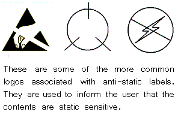
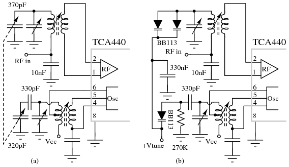
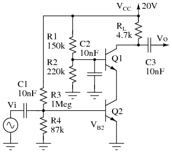
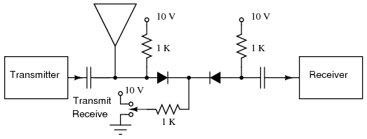
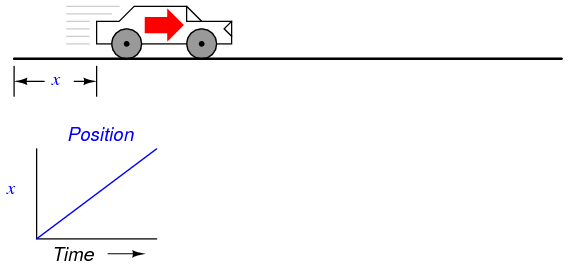
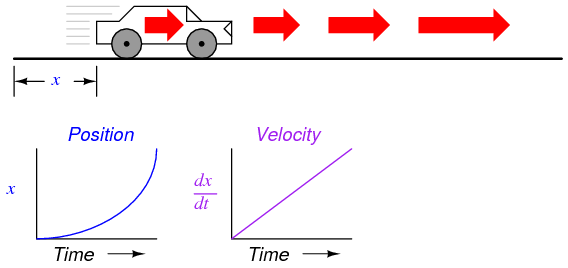
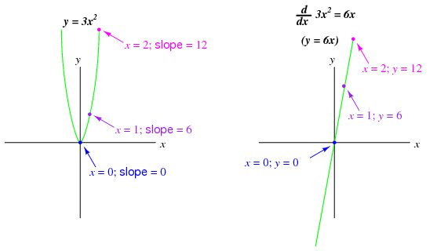
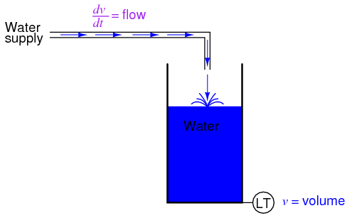

  

---

# Lessons In Electric Circuits \-- Volume III

# Chapter 9

# PRACTICAL ANALOG SEMICONDUCTOR CIRCUITS

- [[ElectroStatic Discharge]](#xtocid15706340)
  - [[ESD Damage Prevention]](#xtocid15706341)
  - [[Storage and Transportation of ESD sensitive component and boards]](#xtocid15706342)
  - [[Conclusion]](#xtocid15706343)
- [[Power Supply circuits]](#xtocid15706344)
  - [[Power Supply types]](#xtocid15706345)
  - [[Power Supply Introduction]](#xtocid15706346)
  - [[Linear power supplies]](#xtocid15706347)
- [[Amplifier circuits \-- PENDING]](#xtocid15706348)
- [[Oscillator circuits \-- INCOMPLETE]](#xtocid15706349)
  - [[Varactor multiplier]](#xtocid157063410)
- [[Phase-locked loops \-- PENDING]](#xtocid157063411)
- [[Radio circuits \-- INCOMPLETE]](#xtocid157063412)
- [[Computational circuits]](#xtocid157063413)
- [[Measurement circuits \-- INCOMPLETE]](#xtocid157063414)
- [[Control circuits \-- PENDING]](#xtocid157063415)
- [[Contributors]](#xtocid157063416)
- [Bibliography](#xtocid157063417)

**\*\*\* INCOMPLETE \*\*\***

## ElectroStatic Discharge{ #sec:xtocid15706340 }

Volume I chapter 1.1 discusses static electricity, and how it is created. This has a lot more significance than might be first assumed, as control of static electricity plays a large part in modern electronics and other professions. An ElectroStatic Discharge event is when a static charge is bled off in an uncontrolled fashion, and will be referred to as ESD hereafter.

ESD comes in many forms, it can be as small as 50 volts of electricity being equalized up to tens of thousands of volts. The actual power is extremely small, so small that no danger is generally offered to someone who is in the discharge path of ESD. It usually takes several thousand volts for a person to even notice ESD in the form of a spark and the familiar zap that accompanies it. The problem with ESD is even a small discharge that can go completely unnoticed can ruin semiconductors. A static charge of thousands of volts is common, however the reason it is not a threat is there is no current of any substantial duration behind it. These extreme voltages do allow ionization of the air and allow other materials to break down, which is the root of where the damage comes from.

ESD is not a new problem. Black powder manufacturing and other pyrotechnic industries have always been dangerous if an ESD event occurs in the wrong circumstance. During the era of tubes (AKA valves) ESD was a nonexistent issue for electronics, but with the advent of semiconductors, and the increase in miniaturization, it has become much more serious.

Damage to components can, and usually do, occur when the part is in the ESD path. Many parts, such as power diodes, are very robust and can handle the discharge, but if a part has a small or thin geometry as part of their physical structure then the voltage can break down that part of the semiconductor. Currents during these events become quite high, but are in the nanosecond to microsecond time frame. Part of the component is left permanently damaged by this, which can cause two types of failure modes. Catastrophic is the easy one, leaving the part completely nonfunctional. The other can be much more serious. Latent damage may allow the problem component to work for hours, days or even months after the initial damage before catastrophic failure. Many times these parts are referred to as \"walking wounded\", since they are working but bad. Figure [below](#53009.jpg) is shown an example of latent (\"walking wounded\") ESD damage. If these components end up in a life support role, such as medical or military use, then the consequences can be grim. For most hobbyists it is an inconvenience, but it can be an expensive one.

Even components that are considered fairly rugged can be damaged by ESD. Bipolar transistors, the earliest of the solid state amplifiers, are not immune, though less susceptible. Some of the newer high speed components can be ruined with as little as 3 volts. There are components that might not be considered at risk, such as some specialized resistors and capacitors manufactured using MOS (Metal Oxide Semiconductor) technology, that can be damaged via ESD.

[]{#53009.jpg}

### ESD Damage Prevention{ #sec:xtocid15706341 }

Before ESD can be prevented it is important to understand what causes it. Generally materials around the workbench can be broken up into 3 categories. These are ESD Generative, ESD Neutral, and ESD Dissipative (or ESD Conductive). ESD Generative materials are active static generators, such as most plastics, cat hair, and polyester clothing. ESD Neutral materials are generally insulative, but don\'t tend to generate or hold static charges very well. Examples of this include wood, paper, and cotton. This is not to say they can not be static generators or an ESD hazard, but the risk is somewhat minimized by other factors. Wood and wood products, for example, tend to hold moisture, which can make them slightly conductive. This is true of a lot of organic materials. A highly polished table would not fall under this category, because the gloss is usually plastic, or varnish, which are highly efficient insulators. ESD Conductive materials are pretty obvious, they are the metal tools laying around. Plastic handles can be a problem, but the metal will bleed a static charge away as fast as it is generated if it is on a grounded surface. There are a lot of other materials, such as some plastics, that are designed to be conductive. They would fall under the heading of ESD Dissipative. Dirt and concrete are also conductive, and fall under the ESD Dissipative heading.

There are a lot of activities that generate static, which you need to be aware of as part of an ESD control regimen. The simple act of pulling tape off a dispenser can generate extreme voltage. Rolling around in a chair is another static generator, as is scratching. In fact, any activity that allows 2 or more surfaces to rub against each other is pretty certain to generate some static charge. This was mentioned in the beginning of this book, but real world examples can be subtle. This is why a method for continuously bleeding off this voltage is needed. Things that generate huge amounts of static should be avoided while working on components.

Plastic is usually associated with the generation of static. This has been gotten around in the form of conductive plastics. The usual way to make conductive plastic is an additive that changes the electrical characteristics of the plastic from an insulator to a conductor, although it will likely still have a resistance of millions of ohms per square inch. Plastics have been developed that can be used as conductors is in low weight applications, such as those in the airline industries. These are specialist applications, and are not generally associated with ESD control.

It is not all bad news for ESD protection. The human body is a pretty decent conductor. High humidity in the air will also allow a static charge to dissipate harmlessly away, as well as making ESD Neutral materials more conductive. This is why cold winter days, where the humidity inside a house can be quite low, can increase the number of sparks on a doorknob. Summer, or rainy days, you would have to work quite hard to generate a substantial amount of static. Industry clean rooms and factory floors go the effort to regulate both temperature and humidity for this reason. Concrete floors are also conductive, so there may be some existing components in the home that can aid in setting up protections.

To establish ESD protection there has to be a standard voltage level that everything is referenced to. Such a level exists in the form of ground. There are very good safety reasons that ground is used around the house in outlets. In some ways this relates to static, but not directly. It does give us a place to dump our excess electrons, or acquire some if we are short, to neutralize any charges our bodies and tools might acquire. If everything on a workbench is connected directly or indirectly to ground via a conductor then static will dissipate long before an ESD event has a chance to occur.

A good grounding point can be made several different ways. In houses with modern wiring that is up to code the ground pin on the AC plug in can be used, or the screw that holds the outlets cover plate on. This is because house wiring actually has a wire or spike going into the earth somewhere where the power is tapped from the main power lines. For people whose house wiring isn\'t quite right a spike driven into the earth at least 3 feet or a simple electrical connection to metal plumbing (worst option) can be used. The main thing is to establish an electrical path to the earth outside the house.

Ten megohms is considered a conductor in the world of ESD control. Static electricity is voltage with no real current, and if a charge is bled off seconds after being generated it is nullified. Generally a 1 to 10 megohm resistor is used to connect any ESD protection for this reason. It has the benefit of slowing the discharge rate during an ESD event, which increases the likelihood of a component surviving undamaged. The faster the discharge, the higher the current spike going though the component. Another reason such a resistance is considered desirable is if the user is accidentally shorted to high voltage, such as household current, it won\'t be the ESD protections that kill them.

A large industry has grown up around controlling ESD in the electronics industry. The staple of any electronics construction is the workbench with a static conductive or dissipative surface. This surface can be bought commercially, or home made in the form of a sheet of metal or foil. In the case of a metal surface it might be a good idea to lay thin paper on top, although it is not necessary if you are not doing any powered tests on the surface. The commercial version is usually some form of conductive plastic whose resistance is high enough not to be a problem, which is a better solution. If you are making your own surface for the workbench be sure to add the 10 megohm resistor to ground, otherwise you have no protection at all.

The other big item that needs ESD grounded is you. People are walking static generators. Your body being conductive it is relatively easy to ground it though, this is usually done with a wrist strap. Commercial versions already have the resistor built in, and have a wide strap to offer a good contact surface with your skin. Disposable versions can be bought for a few dollars. A metal watchband is also a good ESD protection connection point. Just add a wire (with the resistor) to your grounding point. Most industries take the issue seriously enough to use real time monitors that will sound an alarm if the operator is not properly grounded.

{ #fig:43001 width=75% }

Another way of grounding yourself is a heel strap. A conductive plastic part is wrapped around the heel of your shoe, with a conductive plastic strap going up and under your sock for good contact with the skin. It only works on floors with conductive wax or concrete. The method will keep a person from generating large charges that can overwhelm other ESD protections, and is not considered adequate in and of itself. You can get the same effect by walking barefoot on a concrete floor.

Yet another ESD protection is to wear ESD conductive smocks. Like the heel strap, this is a secondary protection, not meant to replace the wrist strap. They are meant to short circuit any charges that your clothes may generate.

Moving air can also generate substantial static charges. When you blow dust off your electronics their will be static generated. An industrial solution to the problem to this issue is two fold: Firstly, air guns have a small, well shielded radioactive material implanted within the air gun to ionize the air. Ionized air is a conductor, and will bleed off static charges quite well. Secondly, use high voltage electricity to ionize the air coming out of a fan, which has the same effect as the air gun. This will effectively help a workstation reduce the potential for ESD generation by a large amount.

Another ESD protection is the simplest of all, distance. Many industries have rules stating all Neutral and Generative materials will be at least 12 inches or more from any work in progress.

The user can also reduce the possibility of ESD damage by simply not removing the part out of its protective packaging until it is time to insert it into the circuit. This will reduce the likelihood of ESD exposure, and while the circuit will still be vulnerable, the component will have some minor protection from the rest of the components, as the other components will offer different discharge paths for ESD.

### Storage and Transportation of ESD sensitive component and boards{ #sec:xtocid15706342 }

It does no good to follow ESD protections on the workbench if the parts are being damaged while storing or carrying them. The most common method is to use a variation of a Faraday cage, an ESD bag. An ESD bag surrounds the component with a conductive shield, and usually has a non static generating insulative layer inside. In permanent Faraday cages this shield is grounded, as in the case of RFI rooms, but with portable containers this isn\'t practical. By putting a ESD bag on a grounded surface the same thing is accomplished. Faraday cages work by routing the electric charge around the contents and grounding them immediately. A car struck by lightning is an extreme example of a Faraday cage.

Static bags are by far the most common method of storing components and boards. They are made using extremely thin layers of metal, so thin as to be almost transparent. A bag with a hole, even small ones, or one that is not folded on top to seal the content from outside charges is ineffective.

Another method of protecting parts in storage is totes or tubes. In these cases the parts are put into conductive boxes, with a lid of the same material. This effectively forms a Faraday cage. A tube is meant for ICs and other devices with a lot of pins, and stores the parts in a molded conductive plastic tube that keeps the parts safe both mechanically and electrically.

{ #fig:43002 width=75% }

### Conclusion{ #sec:xtocid15706343 }

ESD can be a minor unfelt event measuring a few volts, or a massive event presenting real dangers to operators. All ESD protections can be overwhelmed by circumstance, but this can be circumvented by awareness of what it is and how to prevent it. Many projects have been built with no ESD protections at all and worked well. Given that protecting these projects is a minor inconvenience it is better to make the effort.

Industry takes the problem very seriously, as both a potential life threatening issue and a quality issue. Someone who buys an expensive piece of electronics or high tech hardware is not going to be happy if they have to return it in 6 months. When a reputation is on the line it is easier to do the right thing.

## Power Supply circuits{ #sec:xtocid15706344 }

### Power Supply types{ #sec:xtocid15706345 }

There are three major kinds of power supplies: _unregulated_ (also called _brute force_), _linear regulated_, and _switching_. A fourth type of power supply circuit called the _ripple-regulated_, is a hybrid between the \"brute force\" and \"switching\" designs, and merits a subsection to itself.

**Unregulated**

An unregulated power supply is the most rudimentary type, consisting of a transformer, rectifier, and low-pass filter. These power supplies typically exhibit a lot of ripple voltage (i.e. rapidly-varying instability) and other AC \"noise\" superimposed on the DC power. If the input voltage varies, the output voltage will vary by a proportional amount. The advantage of an unregulated supply is that its cheap, simple, and efficient.

See [Rectifier circuits](SEMI_3.html#half-W-R) in the Diodes chapter for the various configurations of the rectifiers used in unregulated power supplies. Note that those circuits are unfiltered, A low pass filter is normally added to the output of the rectifier circuit to remove some of the ripple.

A linear regulated supply is simply a \"brute force\" (unregulated) power supply followed by a transistor circuit operating in its \"active,\" or \"linear\" mode, hence the name _linear_ regulator. (Obvious in retrospect, isn\'t it?) A typical linear regulator is designed to output a fixed voltage for a wide range of input voltages, and it simply drops any excess input voltage to allow a maximum output voltage to the load. This excess voltage drop results in significant power dissipation in the form of heat. If the input voltage gets too low, the transistor circuit will lose regulation, meaning that it will fail to keep the voltage steady. It can only drop excess voltage, not make up for a deficiency in voltage from the brute force section of the circuit. Therefore, you have to keep the input voltage at least 1 to 3 volts higher than the desired output, depending on the regulator type. This means the power equivalent of at _least_ 1 to 3 volts multiplied by the full load current will be dissipated by the regulator circuit, generating a lot of heat. This makes linear regulated power supplies rather inefficient. Also, to get rid of all that heat they have to use large heat sinks which makes them large, heavy, and expensive.

**Switching**

A switching regulated power supply (\"switcher\") is an effort to realize the advantages of both brute force and linear regulated designs (small, efficient, and cheap, but also \"clean,\" stable output voltage). Switching power supplies work on the principle of rectifying the incoming AC power line voltage into DC, re-converting it into high-frequency square-wave AC through transistors operated as on/off switches, stepping that AC voltage up or down by using a lightweight transformer, then rectifying the transformer\'s AC output into DC and filtering for final output. Voltage regulation is achieved by altering the \"duty cycle\" of the DC-to-AC inversion on the transformer\'s primary side. In addition to lighter weight because of a smaller transformer core, switchers have another tremendous advantage over the prior two designs: this type of power supply can be made so totally independent of the input voltage that it can work on any electric power system in the world; these are called \"universal\" power supplies.

The downside of switchers is that they are more complex, and due to their operation they tend to generate a lot of high-frequency AC \"noise\" on the power line. Most switchers also have significant ripple voltage on their outputs. With the cheaper types, this noise and ripple can be as bad as for an unregulated power supply; such low-end switchers aren\'t worthless, because they still provide a stable average output voltage, and there\'s the \"universal\" input capability.

Expensive switchers are ripple-free and have noise nearly as low as for some a linear types; these switchers tend to be as expensive as linear supplies. The reason to use an expensive switcher instead of a good linear is if you need universal power system compatibility or high efficiency. High efficiency, light weight, and small size are the reasons switching power supplies are almost universally used for powering digital computer circuitry.

**Ripple regulated**

A ripple-regulated power supply is an alternative to the linear regulated design scheme: a \"brute force\" power supply (transformer, rectifier, filter) constitutes the \"front end\" of the circuit, but a transistor operated strictly in its on/off (saturation/cutoff) modes transfers DC power to a large capacitor as needed to maintain the output voltage between a high and a low setpoint. As in switchers, the transistor in a ripple regulator never passes current while in its \"active,\" or \"linear,\" mode for any substantial length of time, meaning that very little energy will be wasted in the form of heat. However, the biggest drawback to this regulation scheme is the necessary presence of some ripple voltage on the output, as the DC voltage varies between the two voltage control setpoints. Also, this ripple voltage varies in frequency depending on load current, which makes final filtering of the DC power more difficult.

Ripple regulator circuits tend to be quite a bit simpler than switcher circuitry, and they need not handle the high power line voltages that switcher transistors must handle, making them safer to work on.

### Power Supply Introduction{ #sec:xtocid15706346 }

Power supply circuits are a class of circuits that are designed to convert electrical energy for some load. Every power supply consists of at least three parts:

- An input power source, which delivers power at some voltage or range of voltages V1
- A load, which requires power delivered at some voltage or range of voltages V2
- Conversion circuitry, which receives voltage V1 as an input and generates voltage V2 as an output

Some devices are simple enough that they can operate properly without any modifications to the voltage and current provided by the input source. For example, the lightbulb inside a low-cost flashlight is designed to emit light when connected in series with a few batteries, meaning the entire conversion circuit is just wires. In a similar way, household incandescent lightbulbs are designed to operate properly when connected to an AC source, operated at a well-regulated voltage and line frequency. But for the majority of electronic devices, it is impractical to operate an entire circuit at voltages commonly available. Computers, cell phones, car stereos, aircraft sensors, traffic lights, and pacemakers all have elements which require drastically different voltages than those delivered by any common power source. Well-designed power supply circuits convert almost all of the energy supplied by batteries, solar cells, AC lines and other power sources to voltage levels suitable for the operation of intricate electronic devices.

These are some of the typical considerations when designing a power supply circuit:

**Efficiency**

Efficiency is defined as the output power divided by the total input power. The maximum theoretical efficiency of a circuit is 100%, and this makes sense: the only place output power can come from in a power supply is the input power source. Energy that is consumed in the conversion process, and is not delivered as output power, is called power loss. All power supply circuits have some losses, even if those losses are very small. Maximizing efficiency and minimizing losses is of key importance in power supply design. Highly efficient devices can last longer on a single battery charge, cost less money to operate from a utility AC line, and generate less heat.

**Heat**

Power loss is dissipated away from a power supply circuit as heat. Very small semiconductor components may only be able to dissipate a few hundred milliwatts before they become too hot and fail. On the other hand, very large power supplies can convert multiple kilowatts of power, and routinely see tens of watts dissipated across only a few components. Further complicating issues, many power supplies are designed to operate in hot or cold environments, where temperatures can vary by over 100^o^ C. At hotter temperatures, devices must be thermally derated to avoid overheating, which significantly reduces the maximum output power available. At colder temperatures, considerable deviations in component values can be expected, and rapid changes in loading can lead to thermal shock effects, where repeated heating and cooling stresses components to failure. In most cases, cold temperature performance can be guaranteed with proper component selection; removing waste heat and preventing damage from overheating receive much greater consideration.

In order to prevent component failures, high dissipation components are usually connected to heat sinks. Sometimes the only heat sink needed is a solid connection to a copper plane in a printed circuit board. But for anything beyond a few watts, components need to be connected to a separate, thermally conductive metal block. By putting long metal fins on these blocks, the surface area can be boosted to increase convective heat transfer. A fan can also be used to increase airflow. Some designs even use water or oil traveling through the block to more effectively remove waste heat.

As a general rule, most semiconductors begin experiencing damage when the circuit\'s internal temperature reaches 150^o^C, though some devices are designed to withstand even higher temperatures. Other components such as inductors and capacitors are available in a wide range of operating temperatures and tolerances, with a premium charged for more extreme temperatures and tighter tolerances.

**Size**

In some devices such as cell phones or smart watches, there can be dozens or hundreds of components made to fit within only a few square centimeters. Power supply circuits in these types of devices must be small leave room for other, feature-rich components. In other devices such as aircraft electronics, the power requirements are large enough that many components must be attached to a heat sink. This can add significant weight to the overall design, which reduces fuel economy of the aircraft. Size is directly related to the amount of power being converted, and the efficiency of the conversion. The more power being converted, the larger the components must be to spread out self-heating and to withstand the high voltages used for larger power conversions. Improvements in efficiency can help to reduce supply size, since less heat sinking is required.

**Cost**

Unsurprisingly, cost is a critical factor. Generally, as both power and efficiency are increased, the cost of the power supply increases as well. This cost increase comes from a combination of expensive but well-optimized components, increased complexity leading to longer design and test cycles, and costs associated with regulatory compliance. As in any engineering challenge, power supply design is a tradeoff of acceptable performance and cost. Since all electronic devices require one or more power supply circuits, aggressive cost optimization is common. In high-volume manufacturing, saving even a few cents per product can reduce build costs by thousands of dollars.

**Line Regulation**

Line regulation is a measure of how well a power supply circuit can respond to changes in input source voltage. Many input power sources present a wide voltage range to a power supply input: battery voltages can vary by 30% or more across one charge cycle, solar cell voltages vary proportionally to incident sunlight, and AC line voltages can (on rare occasion) deviate by as much as 20% in either direction. Line regulation is defined as the output voltage at the maximum/minimum input voltage, minus the output voltage at the nominal input voltage. It can also be given as a percentage of the nominal output voltage value. An ideal power supply has perfect line regulation, ±0V or ±0% change. It is not uncommon for modern power supplies to see values \< ±5mV or \< ±0.1%.

**Load Regulation**

Load regulation is a measure of how well a power supply circuit can respond to changes in output loading. As output power increases, heating from power loss causes changes in reference parameters used by the circuit to control the output. Power supply designers use carefully designed reference circuits to minimize the effects of temperature variations, but observable effects still exist. Load regulation is defined as the output voltage at full load, minus the output voltage at no load. It can also be given as a percentage of the nominal output voltage value. An ideal power supply has perfect load regulation, 0V or 0% change. Modern power supply circuits can achieve values similar to line regulation.

**Ripple Rejection**

For many power supply circuits with an AC line as input, the line frequency is coupled through the supply to the output. Some power supply circuits specify a ripple rejection, usually in dB, which is defined as the magnitude of a specific frequency on the output (commonly 100Hz or 120Hz) relative to the magnitude of that same specific frequency on the input.

**Quiescent Current**

Even at no load, some power is required to keep a power supply in regulation. The housekeeping current used to power the control circuitry of the supply is called the quiescent current. This value has a wide range, spanning from hundreds of milliamps all the way down to hundreds of nanoamps.

**Output Impedance**

An ideal voltage source has zero output impedance. Practical converters see some small output impedance, which tends to grow at higher frequencies. For a power supply to effectively regulate against loads that change in milliseconds or less, low output impedance is mandatory. Otherwise, sudden changes in load current will produce severe changes in output voltage. Nearly all converters can easily achieve output impedances of less than an ohm; \< 10mΩ at DC is not uncommon.

**Output Voltage Noise**

Electrons flowing in resistors and transistors are susceptible to thermodynamic events, statistical fluctuations in current density, and other complex particle-scale phenomena. These tendencies manifest in all circuits, including power supply circuits, as noise on the output voltage. Although the average value of a power supply output is constant, noise can cause the output to experience millivolt excursions on a microsecond or submicrosecond scale. For lower power analog circuits that depend on tightly regulated power supply voltages such as high-resolution analog-to-digital converters or high-frequency oscillators, power supply noise can cripple performance. Because noise sources tend to be a function of frequency, noise is commonly listed as a value integrated over a frequency range (in RMS Volts), or is specified as a plot of noise spectral density comparing noise (in Volts/Hz) vs. frequency. Wideband (10Hz to 100kHz) integrated noise can be controlled to \< 10µVrms, and noise at high frequencies can approach \< 10nV/Hz.

Higher power designs tend to introduce noise on the order of tens or hundreds of millivolts, concentrated at specific frequencies, as a function of their construction. Though some designs exist which can tightly control even high-power supply noise, they are costly and are therefore reserved for specialized test and measurement equipment. Virtually all practical power supplies above a few watts will generate millivolts of noise on the output, and for many types of load this does not affect device performance in the slightest. It is common to use an effective but noisy power supply for insensitive loads, and as the input to a second, quieter power supply.

### Linear power supplies{ #sec:xtocid15706347 }

There are two major types of power supplies whose output behavior can be determined according to linear equations: shunt regulators, and series regulators. Shunt regulators (pictured in @fig:03511 are so named because they shunt away unnecessary load current to keep the output in regulation. In a shunt regulator, high quiescent current is necessary, since the shunt must be able to redirect the full load current at no load conditions. This can lead to high power dissipation, especially for appreciably large full load currents. On the bright side, they are relatively simple, often made of entirely passive elements, and can be reduced to two-terminal devices.

{ #fig:03511 width=75% }

_Shunt regulators_

{ #fig:13083 width=75% }

Series regulators, in contrast, regulate the input current with a pass element to control the output current delivered to a load pictured in @fig:03512. This can be utilized to reduce quiescent current to almost nothing at light or no load, though some current must always pass through the series element to ensure proper output voltage regulation. However, the series regulator must control both the voltage drop across and the current through the series element to regulate the output voltage, and no passive element can be used to guarantee this behavior. Because of the need for some form of output sensing circuitry, a three terminal solution is almost always required.

{ #fig:03512 width=75% }

_Series regulators_

{ #fig:13084 width=75% }

For the sake of illustrating the common terms seen in power supply design, consider the following specification: Suppose there is a need to take a static 15V output from a converter, and step it down to a 5V level. The input voltage may vary by as much as ±3V, and the output current must be 500mA maximum. In the following examples, several basic topologies will be explored, and the relative strengths and weaknesses of the different approaches compared.

**Example Supply: Resistor Divider**

{ #fig:03513 width=75% }

_Resistor divider power supply_

The humble resistor divider circuit of @fig:03513 is perhaps the simplest power supply circuit. While its behavior is entirely linear, it is hard to say whether such a supply should be considered a shunt or series regulator, since the output voltage is a function of both the shunt and series elements. For the purposes of this first example, the distinction is unimportant. The nonidealities of this circuit, especially when constrained by the specification above, make it useful to conceptualize the common terms used in power supply design.

The resistor values must be small to simultaneously allow 500mA through the pass element without causing too much of a voltage drop, and maintain a nominal output voltage of 5V from a 15V supply. The values 15Ω and 7.5Ω are selected for R1 and R2, respectively. The behavior of the circuit can be described by a system of equations, first using ohm\'s law at the output, second by using the standard divider equation considering R2 and the load in parallel:

{ #fig:13085 width=75% }

By selecting values for Vin and one other parameter, and solving for the remaining unknowns, the performance of this circuit may be interrogated. The key points are summarized below.

**Efficiency:** To achieve the maximum output current of 500mA with nominal input conditions (Vin = 15V), solving the system of equations gives:

{ #fig:13086 width=75% }

Meanwhile, the input power is the input voltage multiplied by the input current, and the input current is found as:

{ #fig:13087 width=75% }

Therefore,

{ #fig:13088 width=75% }

Our efficiency at full load is then:

{ #fig:13089 width=75% }

It can also be shown using calculus that the maximum efficiency is achieved with a load resistance of 5Ω, yielding only 10.1% efficiency. These values are unimpressive. Interestingly, a quick calculation will reveal that this maximum efficiency is the same, regardless of input voltage. This makes sense, since output power is ratiometric with input power for the same circuit.

**Quiescent current:** At no load, the circuit draws:

{ #fig:13090 width=75% }

This is more than the maximum output by some margin, and is very wasteful compared to what might be achievable with other topologies. Worse still, the total current only increases with increasing load.

**Heat:** At no load, the circuit dissipates 10W power, and at full load this increases to 12.5W. Under short circuit conditions, this increases to 15W, all dissipated in R1. Both R1 and R2 would need to be large wirewound resistors, or would require active cooling, for this supply to function at ambient temperature. Performance above ambient temperature is more difficult.

**Load regulation:** At full load, the output voltage drops from 5V to 2.5V. From the load regulation equation, we find that this supply has the following load regulation:

{ #fig:13091 width=75% }

This is atrocious. Any improvement in load regulation is also practically infeasible; to make the parallel combination of R2 and the load negligibly different from the load, even at full load, the value of R1 and R2 would need to be further decreased by more than an order of magnitude, which would necessarily increase the quiescent current and decrease the efficiency by the same degree. It is unreasonable to require over 100W of power dissipation to maintain a reasonable load regulation from a resistor divider. Ideally, it shouldn\'t even take milliwatts.

**Line regulation:** At 18V with no load, the output voltage is:

{ #fig:13092 width=75% }

Meanwhile, at 12V, the output voltage is:

{ #fig:13093 width=75% }

This corresponds to a line regulation of ±1V, or ±20%. This is quite terrible.

While on the subject of input voltage variations, consider that the values of quiescent current and load regulation will change for different input voltages. As the input voltage increases, the quiescent current increases, and the heat generation increases. The output will deliver 500mA to a 7Ω load at 3.5V. At \<15V the output voltage decreases substantially, delivering 500mA to a 3Ω load at 1.5V. Since the output voltage is directly proportional to the input voltage, the output is dependent on a stable input voltage, which is not always possible.

**Output Impedance:** By small signal analysis, the voltage source at Vin is shorted, and the output impedance is plainly the parallel combination of R1\|\|R2, or 5Ω. Since this output impedance is static across all changes in input voltage and output current, it is understandable why the output voltage varies so much with every change in input and load conditions.

**Output Noise:** Although this resistor will be affected by thermal noise, standard 1/f noise, and excess noise due to resistor construction, ultimately noise is unlikely to be the biggest concern in this design, and true noise analysis will be saved for more deserving circuits.

The performance of this circuit as a power supply is nothing short of abysmal. In fairness to the resistor divider, the most common use for such a circuit is voltage division into high-impedance loads, such as amplifier input pins and transistor gates. For these high-impedance load conditions, the divider may be treated as very close to ideal, and as such it is not often thought of as a power supply circuit. Nevertheless, when operating conditions begin to change (such as with supply voltage variations or even small load current increases), high impedance amplifier inputs and transistors can still be made to misbehave.

In this impractical example it should be clear that a resistor divider is unsuited for any serious power delivery, with completely unusable line and load regulation and horrible overall efficiency. However, with only a minor modification, this circuit can be augmented with vastly improved line and load regulation. This is explored in the following example.

**Example Supply:** Zener Divider

{ #fig:03514 width=75% }

_Zener Divder Power Supply_

The circuit of @fig:03514 is a Zener divider (Zener diodes are discussed in chapter 3). By substituting a reverse-biased Zener diode in place of R2 in the previous circuit, the shifting Zener impedance above a certain reverse current knee point can be exploited to guarantee a stable output voltage over different line and load conditions. Keeping in mind that Zener diodes can only be constructed with certain reverse voltages, the closest stable output to 5V is chosen, giving a Zener voltage of 5.1V. At no load, all available current will be passed through the Zener diode. By choosing this load current to be slightly over 500mA at maximum load (say by 10mA), regulation can be ensured even when the the full load current is delivered to the load. R1 is selected for all voltages within the tolerance of the input voltage range: the worst case, at 12V, requires that:

{ #fig:13094 width=75% }

As long as the Zener diode has current through it, a load of 10.2Ω can now be attached, with any input supply voltage in the specified range, and 500mA will be delivered to it. To prove this assertion, test the behavior at Vin = 12V and Vin = 18V:

{ #fig:13095 width=75% }

In theory, this design should therefore be capable of meeting all the requirements. A closer examination of the affected parameters offers some caveats.

**Efficiency:** The Zener regulator efficiency differs depending on input voltage and output loading. The best case efficiency for any input voltage is at full load, and the best case efficiency for any load is at the minimum input voltage. In this condition, we find that:

{ #fig:13096 width=75% }

This is better than the resistor divider, but not by much, and only at one extreme corner of operation. At the other corner the results are less impressive:

{ #fig:13097 width=75% }

**Quiescent current:** At no load, the full operating current of the Zener regulator must travel through the Zener diode. Best case, this is always more than the maximum output current; worst case, it can be much greater. At 17V, this regulator consumes almost double the maximum output current!

**Heat:** Since the Zener regulator quiescent current is always greater than the maximum operating current, the worst case power dissipation leads to a great deal of heat dissipated in both R1 and in the diode. However, as the load current increases, the Zener diode dissipates less and less power, since the current and therefore the power must be diverted from the diode to the output load. Meanwhile, R1 power dissipation remains almost constant across loading, but benefits from a lower input voltage. If for any reason the output current exceeds the quiescent current (such as during a short circuit), the power dissipation in R1 increases above the typical worst case operating point, requiring a larger component or better cooling to endure this stress. Even under normal operating conditions, R1 still dissipates enough to require a large wirewound resistor and probably some form of active cooling:

{ #fig:13098 width=75% }

It is worth noting, in passing, that at worst case the Zener diode must dissipate close to 5W; while there exist Zener diodes capable of this, 5W is an uncommonly large value for a Zener diode. With smaller maximum load current requirements, low power Zeners may be used at substantially decreased costs.

**Line and load regulation:** From an ideal standpoint, the Zener voltage is always 5.1V, across all line and load conditions. In reality, however, the Zener diode has some temperature related effects which cause the Zener voltage to change. Worse still, the temperature effects do not all act in the same direction. Low voltage Zener diodes behave predominantly according to the Zener effect, an electron tunneling process, which has a negative temperature coefficient (Zener voltage decreases with increasing heat). Higher voltage Zener diodes behave predominantly according to the avalanche effect, a form of current multiplication that has a positive temperature coefficient (Zener voltage increases with increasing heat). At around 4V to 6V, and dependent on the Zener current, the temperature coefficients of these two mechanisms will combine and can occasionally cancel out almost entirely. Unfortunately, there is still some effect at 5.1V; A 5W rated 1N5338B, for example, can see a difference of almost 0.4V across temperature, typically increasing in voltage.

A basic approximation of this effect can explain the difficulty. With a 15V supply voltage, at no load the Zener current and power are found to be:

{ #fig:13099 width=75% }

Assuming the change in Zener voltage is up to 0.4V at 5W for the given Zener diode, and the change is both linear and positive, the Zener voltage may increase in response to increasing junction temperature by as much as:

{ #fig:13100 width=75% }

This changes the Zener current and power to:

{ #fig:13101 width=75% }

Iteration shows this change in Zener voltage with temperature eventually stabilizes; still, the output is far from its ideal value. As load current increases, Zener current decreases, returning the output voltage to a lower value. Line and load regulation are difficult to estimate precisely, since the exact location of the Zener knee, the effect of process variation on the temperature coefficient, and the variation of the temperature coefficient with Zener current cannot always be predicted. Both are frequently verified experimentally or with a spice simulation. Broadly speaking, with a maximum specified regulation swing of about 0.4V, and assuming this can be either positive or negative for a 5.1V Zener diode, the combined line and load regulation can be stated as:

{ #fig:13102 width=75% }

**Output Impedance:** For the small signal analysis, voltage sources are shorted. The impedance looking into the output is just R1\|\|RZ. But RZ is a dynamic value, based on the Zener voltage (Vout) and the Zener current (Iz).

{ #fig:13103 width=75% }

In the limit as RL approaches infinity, Zout becomes Vout x R1 / Vin, approximately 4.59Ω at 15V input. Interestingly, from this equation we can discover that the output impedance increases as a function of increasing load, to a maximum of R1 at a dead short across the output. The output is regulated because the output impedance continuously changes to match the level of loading.

**Output Noise:** The topic of output noise for Zener diodes is complicated. Due to the different mechanisms of Zener diode behavior, there are different sources of noise for different Zener voltages and currents. Some attempt to simplify these topics will be made here.

Low voltage Zener diodes operate on the Zener effect, where discrete electrons tunnel across a barrier. Since this is a discrete, random process centered around a mean value, it follows a Poisson distribution and generates corresponding shot noise. The noise level is proportional to the square root of the number of discrete events. Thus, as current increases, shot noise increases as well. For a given Zener current I~Z~ and Zener voltage V~Z~ and recalling the electron elementary charge q = 1.6 x 10-19 coulombs, the shot noise is:

{ #fig:13104 width=75% }

At no load, this effect is almost negligible, since it is inversely proportional to I~Z~. But at full load, I~Z~ shrinks considerably. The noise at full load for V~in~ = 12V is 7x worse than the noise at no load. At 18V, since the difference in I~Z~ at no load and at full load is smaller, the effect is much less pronounced.

High voltage Zener diodes operate on the avalanche effect, where one carrier collides with many others and causes an avalanche multiplication of carrier movements, resulting in wide-bandwidth noise that can exceed simple shot noise by orders of magnitude. In fact, the equation is almost identical, but depends to some extent on the recombination lifetime of each new electron in the avalanche. Without getting too deeply into the physics, it is usually sufficient to introduce some large multiplier to the original shot noise equation. Whereas a low voltage Zener diode might measure its wideband noise in the hundreds of nV, a high voltage Zener diode might measure its wideband noise in hundreds of µvolts or even low millivolts.

To keep a Zener diode at the lowest possible noise, there are only two requirements: first, use a low voltage Zener diode, to minimize avalanche noise; second, use a large Zener current, even at full load. Though increasing the current increases the power dissipation, potentially leading to greater thermal noise, remember that thermal noise is proportional to Zener impedance, and that Zener impedance shrinks faster than absolute temperature grows. In power supply design Zener noise is once again rarely an issue, since other regulators can be created with less noise, more efficiency, and better line and load regulation.

In general, shunt regulators are used in cases where the power dissipation is negligible, and the load current is small (tens of milliamps or fewer). More complex shunt regulators can incorporate compensation schemes which minimize the effects of line, load, and temperature variations. The exact mechanisms of these compensation schemes are beyond the scope of this discussion, but line and load regulation values of \<1% are achievable with shunt regulation schemes, over a very wide range of temperatures and input voltages.

## [[Amplifier circuits \-- PENDING]{#xtocid15706348}]

Note, Q~3~ and Q~4~ in @fig:03475 are complementary, NPN and PNP respectively. This circuit works well for moderate power audio amplifiers. For an explanation of this circuit see "Direct coupled complementary-pair," [Ch 4](SEMI_4.html#03474.png){ #fig:03474 width=75% } .

{ #fig:03475 width=75% }

_Direct coupled complementary symmetry 3 w audio amplifier. After Mullard. [\[MUL\]](#MUL.bibitem)_

## [[Oscillator circuits \-- INCOMPLETE]{#xtocid15706349}]

{ #fig:03473 width=75% }

_Phase shift oscillator. R~1~C~1~, R~2~C~2~, and R~3~C~3~ each provide 60^o^ of phase shift._

The phase shift oscillator of @fig:03473 produces a sinewave output in the audio frequency range. Resistive feedback from the collector would be negative feedback due to 180^o^ phasing (base to collector phase inversion). However, the three 60^o^ RC phase shifters ( R~1~C~1~, R~2~C~2~, and R~3~C~3~) provide an additional 180^o^ for a total of 360^o^. This in-phase feedback constitutes positive feedback. Oscillations result if transistor gain exceeds feedback network losses.

### Varactor multiplier{ #sec:xtocid157063410 }

A Varactor or variable capacitance diode with a nonlinear capacitance vs frequency characteristic distorts the applied sinewave f1 in @fig:03457, generating harmonics, f3.

{ #fig:03457 width=75% }

_Varactor diode, having a nonlinear capacitance vs voltage characteristic, serves in frequency multiplier._

The fundamental filter passes f1, blocking the harmonics from returning to the generator. The choke passes DC, and blocks radio frequencies (RF) from entering the V~bias~ supply. The harmonic filter passes the desired harmonic, say the 3rd, to the output, f3. The capacitor at the bottom of the inductor is a large value, low reactance, to block DC but ground the inductor for RF. The varicap diode in parallel with the indctor constitutes a parallel resonant network. It is tuned to the desired harmonic. Note that the reverse bias, V~bias~, is fixed.

The varicap multiplier is primarily used to generate microwave signals which cannot be directly produced by oscillators. The lumped circuit representation in @fig:03457 is actually stripline or waveguide sections. Frequenies up to hundreds of gHz may be produced by varactor multipliers.

## [[Phase-locked loops \-- PENDING]{#xtocid157063411}]

## [[Radio circuits \-- INCOMPLETE]{#xtocid157063412}]

{ #fig:03442 width=75% }

_(a) Crystal radio. (b) Modulated RF at antenna. (c) Rectified RF at diode cathode, without C2 filter capacitor. (d) Demodualted audio to headphones._

An antenna ground system, tank circuit, peak detector, and headphones are the the main components of a _crystal radio_. See @fig:03442 (a). The antenna absorbs transimtted radio signals (b) which flow to ground via the other components. The combination of C1 and L1 comprise a resonant circuit, refered to as a _tank circuit_. Its purpose is to select one out of many available radios signals. The variable capacitor C1 allows for _tuning_ to the various signals. The diode passes the positive half cycles of the RF, removing the negative half cycles (c). C2 is sized to filter the radio frequencies from the RF envelope (c), passing audio frequencies (d) to the headset. Note that no power supply is required for a crystal radio. A germanium diode, which has a lower forward voltage drop provides greater sensitvity than a silicon diode.

While 2000Ω magnetic headphones are shown above, a ceramic earphone, sometimes called a crystal earphone, is more sensitive. The ceramic earphone is desirable for all but the strongest radio signals

[]{#TRone <="" a=""}

The circuit in @fig:03492 produces a stronger output than the crystal detector. Since the transistor is not biased in the linear region (no base bias resistor), it only conducts for positive half cycles of RF input, detecting the audio modulation. An advantage of a transistor detector is amplification in addition to detection. This more powerful circuit can readily drive 2000Ω magnetic headphones. Note the transistor is a germanuim PNP device. This is probably more sensitive, due to the lower 0.2V V~BE~, compared with silicon. However, a silicon device should still work. Reverse battery polarity for NPN silicon devices.

{ #fig:03492 width=75% }

_TR One, one transistor radio. No-bias-resistor causes operation as a detector. After Stoner, Figure 4.4A. [\[DLS\]](#DLS.bibitem)_

The 2000Ω headphones are no longer a widely available item. However, the low impedance earbuds commonly used with portable audio equipment may be substituted when paired with a suitable audio transformer. See Volume 6 Experiments, AC Circuits, Sensitive audio detector for details.

[]{#TRtwo <="" a=""}

The circuit in @fig:03493 adds an audio amplifier to the crystal detector for greater headphone volume. The original circuit used a germanium diode and transistor. [\[DLS\]](#DLS.bibitem) A schottky diode may be substituted for the germanium diode. A silicon transistor may be used if the base-bias resistor is changed according to the table.

{ #fig:03493 width=75% }

_Crystal radio with one transistor audio amplifer, base-bias. After Stoner, Figure 4.3A. [\[DLS\]](#DLS.bibitem)_

For more crystal radio circuits, simple one-transistor radios, and more advanced low transistor count radios, see Wenzel [\[CW1\]](#CW1.bibitem)

[]{#RegencyTr1 <="" a=""}

{ #fig:03453 width=75% }

_Regency TR1: First mass produced transistor radio, 1954._

The circuit in @fig:03476 is an integrated circuit AM radio containing all the active radio frequency circuitry within a single IC. All capacitors and inductors, along with a few resistors, are external to the IC. The 370 Pf variable capacitor tunes the desired RF signal. The 320 pF variable capacitor tunes the local oscillator 455 KHz above the RF input signal. The RF signal and local oscillator frequencies mix producing the sun and difference of the two at pin 15. The external 455 KHz ceramic filter between pins 15 and 12, selects the 455 KHz difference frequency. Most of the amplification is in the intermediate frequency (IF) amplifier between pins 12 and 7. A diode at pin 7 recovers audio from the IF. Some automatic gain control (AGC) is recovered and filtered to DC and fed back into pin 9.

{ #fig:03476 width=75% }

_IC radio, After Signetics [\[SIG\]](#SIG.bibitem)_

@fig:03477 shows conventional mecahnical tuning (a) of the RF input tuner and the local oscillator with varactor diode tuning (b). The meshed plates of a dual variable capacitor make for a bulky component. It is ecconomic to replace it with varicap tuning diodes. Increasing the reverse bias V~tune~ decreases capacitance which increases frequency. V~tune~ could be produced by a potentiometer.

{ #fig:03477 width=75% }

_IC radio comparison of (a) mechanical tuning to (b) electronic varicap diode tuning.[\[SIG\]](#SIG.bibitem)_

@fig:03480 shows an even lower parts count AM radio. Sony engineers have included the intermediate frequency (IF) bandpass filter within the 8-pin IC. This eliminates external IF transformers and an IF ceramic filter. L-C tuning components are still required for the radio frequency (RF) input and the local oscillator. Though, the variable capacitors could be replaced by varicap tuning diodes.

{ #fig:03480 width=75% }

_Compact IC radio eliminates external IF filters. After Sony [\[SNE\]](#SNE.bibitem)_

@fig:03491 shows a low-parts-count FM radio based on a TDA7021T integrated circuit by NXP Wireless. The bulky external IF filter transformers have been replaced by R-C filters. The resistors are integrated, the capacitors external. This circuit has been simplified from Figure 5 in the NXP Datasheet. See Figure 5 or 8 of the datasheet for the omitted signal strength circuit. The simple tuning circuit is from the Figure 5 Test Circuit. Figure 8 has a more elaborate tuner. Datasheet Figure 8 shows a stereo FM radio with an audio amplifier for driving a speaker. [\[NXP\]](#NXP.bibitem)

{ #fig:03491 width=75% }

_IC FM radio, signal strength circuit not shown. After NXP Wireless Figure 5. [\[NXP\]](#NXP.bibitem)_

For a construction project, the simplified FM Radio in @fig:03491 is recommended. For the 56nH inductor, wind 8 turns of #22 AWG bare wire or magnet wire on a 0.125 inch drill bit or other mandrel. Remove the mandrel and strech to 0.6 inch length. The tuning capacitor may be a miniature trimmer capacitor.

@fig:03478 is an example of a common-base (CB) RF amplifier. It is a good illustration because it looks like a CB for lack of a bias network. Since there is no bias, this is a class C amplifier. The transistor conducts for less than 180^o^ of the input signal because at least 0.7 V bias would be required for 180^o^ class B. The common-base configuration has higher power gain at high RF frequencies than common-emitter. This is a power amplifier (3/4 W) as opposed to a small signal amplifier. The input and output π-networks match the emitter and collector to the 50 Ω input and output coaxial terminations, respectively. The output π-network also helps filter harmonics generated by the class C amplifier. Though, more sections would likely be required by modern radiated emissions standards.

{ #fig:03478 width=75% }

_Class C common-base 750 mW RF power amplifier. L1 = #10 Cu wire 1/2 turn, 5/8 in. ID by 3/4 in. high. L2 = #14 tinned Cu wire 1 1/2 turns, 1/2 in. ID by 1/3 in. spacing. After Texas Instruments [\[TX1\]](#TX1.bibitem)_

An example of a high gain common-base RF amplifier is shown in @fig:03479. The common-base circuit can be pushed to a higher frequency than other configurations. This is a common base configuration because the transistor bases are grounded for AC by 1000 pF capacitors. The capacitors are necessary (unlike the class C, Figure [previous](#03478.png){ #fig:03478 width=75% }) to allow the 1KΩ-4KΩ voltage divider to bias the transistor base for class A operation. The 500Ω resistors are emitter bias resistors. They stablize the collector current. The 850Ω resistors are collector DC loads. The three stage amplifier provides an overall gain of 38 dB at 100 MHz with a 9 MHz bandwidth.

{ #fig:03479 width=75% }

_Class A common-base small-signal high gain amplifier. After Texas Instruments [\[TX2\]](#TX2.bibitem)_

[]{#CASCODEA <="" a=""}

A cascode amplifier has a wide bandwdth like a common-base amplifier and a moderately high input impedance like a common emitter arrangement. The biasing for this cascode amplifier (@fig:03503) is worked out in an example problem [Ch 4](SEMI_4.html#CASCODEB) .

{ #fig:03503 width=75% }

_Class A cascode small-signal high gain amplifier._

This circuit (@fig:03503) is simulated in the "Cascode" section of the BJT chapter [Ch 4](SEMI_4.html#CASCODES) . Use RF or microwave transistors for best high frequency response.

[]{#PinTR <="" a=""}

{ #fig:03464 width=75% }

_PIN diode T/R switch disconnects receiver from antenna during transmit._

[]{#Pinant <="" a=""}

{ #fig:03465 width=75% }

_PIN diode antenna switch for direction finder receiver._

[]{#Pinatt <="" a=""}

{ #fig:03466 width=75% }

_PIN diode attenuator: PIN diodes function as voltage variable resistors. After Lin [\[LCC\]](#LCC.bibitem)._

The PIN diodes are arranged in a π-attenuator network. The anti-series diodes cancel some harmonic distortion compared with a single series diode. The fixed 1.25 V supply forward biases the parallel diodes, which not only conducting DC current from ground via the resistors, but also, conduct RF to ground through the diodes\' capacitors. The control voltage V~control~, increases current through the parallel diodes as it increases. This decreases the resistance and attenuation, passing more RF from input to output. Attenuation is about 3 dB at V~control~= 5 V. Attenuation is 40 dB at V~control~= 1 V with flat frequency response to 2 gHz. At V~control~= 0.5 V, attenuation is 80 dB at 10 MHz. However, the frequency response varies too much to use. [\[LCC\]](#LCC.bibitem)

## Computational circuits{ #sec:xtocid157063413 }

When someone mentions the word \"computer,\" a digital device is what usually comes to mind. Digital circuits represent numerical quantities in _binary_ format: patterns of 1\'s and 0\'s represented by a multitude of transistor circuits operating in saturated or cutoff states. However, analog circuitry may also be used to represent numerical quantities and perform mathematical calculations, by using variable voltage signals instead of discrete on/off states.

Here is a simple example of binary (digital) representation versus analog representation of the number \"twenty-five:\"

{ #fig:03333 width=75% }

\

{ #fig:03334 width=75% }

Digital circuits are very different from circuits built on analog principles. Digital computational circuits can be incredibly complex, and calculations must often be performed in sequential \"steps\" to obtain a final answer, much as a human being would perform arithmetical calculations in steps with pencil and paper. Analog computational circuits, on the other hand, are quite simple in comparison, and perform their calculations in continuous, real-time fashion. There is a disadvantage to using analog circuitry to represent numbers, though: imprecision. The digital circuit shown above is representing the number twenty-five, precisely. The analog circuit shown above may or may not be exactly calibrated to 25.000 volts, but is subject to \"drift\" and error.

In applications where precision is not critical, analog computational circuits are very practical and elegant. Shown here are a few op-amp circuits for performing analog computation:

{ #fig:03335 width=75% }

\

{ #fig:03336 width=75% }

\

{ #fig:03337 width=75% }

\

{ #fig:03338 width=75% }

\

{ #fig:03342 width=75% }

\

{ #fig:03340 width=75% }

\

{ #fig:03339 width=75% }

Each of these circuits may be used in modular fashion to create a circuit capable of multiple calculations. For instance, suppose that we needed to subtract a certain fraction of one variable from another variable. By combining a divide-by-constant circuit with a subtractor circuit, we could obtain the required function:

{ #fig:03341 width=75% }

Devices called _analog computers_ used to be common in universities and engineering shops, where dozens of op-amp circuits could be \"patched\" together with removable jumper wires to model mathematical statements, usually for the purpose of simulating some physical process whose underlying equations were known. Digital computers have made analog computers all but obsolete, but analog computational circuitry cannot be beaten by digital in terms of sheer elegance and economy of necessary components.

Analog computational circuitry excels at performing the calculus operations _integration_ and _differentiation_ with respect to time, by using capacitors in an op-amp feedback loop. To fully understand these circuits\' operation and applications, though, we must first grasp the meaning of these fundamental calculus concepts. Fortunately, the application of op-amp circuits to real-world problems involving calculus serves as an excellent means to teach basic calculus. In the words of John I. Smith, taken from his outstanding textbook, _Modern Operational Circuit Design_:

> _\"A note of encouragement is offered to certain readers: integral calculus is one of the mathematical disciplines that operational \[amplifier\] circuitry exploits and, in the process, rather demolishes as a barrier to understanding.\"_ (pg. 4)

Mr. Smith\'s sentiments on the pedagogical value of analog circuitry as a learning tool for mathematics are not unique. Consider the opinion of engineer George Fox Lang, in an article he wrote for the August 2000 issue of the journal _Sound and Vibration_, entitled, \"Analog was [not] a Computer Trademark!\":

> _\"Creating a real physical entity (a circuit) governed by a particular set of equations and interacting with it provides unique insight into those mathematical statements. There is no better way to develop a \"gut feel\" for the interplay between physics and mathematics than to experience such an interaction. The analog computer was a powerful interdisciplinary teaching tool; its obsolescence is mourned by many educators in a variety of fields.\"_ (pg. 23)

Differentiation is the first operation typically learned by beginning calculus students. Simply put, differentiation is determining the instantaneous rate-of-change of one variable as it relates to another. In analog differentiator circuits, the independent variable is time, and so the rates of change we\'re dealing with are rates of change for an electronic signal (voltage or current) with respect to time.

Suppose we were to measure the position of a car, traveling in a direct path (no turns), from its starting point. Let us call this measurement, _x_. If the car moves at a rate such that its distance from \"start\" increases steadily over time, its position will plot on a graph as a _linear_ function (straight line):

{ #fig:03343 width=75% }

If we were to calculate the _derivative_ of the car\'s position with respect to time (that is, determine the rate-of-change of the car\'s position with respect to time), we would arrive at a quantity representing the car\'s velocity. The differentiation function is represented by the fractional notation _d/d_, so when differentiating position (_x_) with respect to time (_t_), we denote the result (the derivative) as _dx/dt_:

{ #fig:03344 width=75% }

For a linear graph of _x_ over time, the derivate of position (_dx/dt_), otherwise and more commonly known as _velocity_, will be a flat line, unchanging in value. The derivative of a mathematical function may be graphically understood as its _slope_ when plotted on a graph, and here we can see that the position (_x_) graph has a constant slope, which means that its derivative (_dx/dt_) must be constant over time.

Now, suppose the distance traveled by the car increased exponentially over time: that is, it began its travel in slow movements, but covered more additional distance with each passing period in time. We would then see that the derivative of position (_dx/dt_), otherwise known as velocity (_v_), would not be constant over time, but would increase:

{ #fig:03345 width=75% }

The height of points on the velocity graph correspond to the rates-of-change, or slope, of points at corresponding times on the position graph:

{ #fig:03346 width=75% }

What does this have to do with analog electronic circuits? Well, if we were to have an analog voltage signal represent the car\'s position (think of a huge potentiometer whose wiper was attached to the car, generating a voltage proportional to the car\'s position), we could connect a differentiator circuit to this signal and have the circuit continuously _calculate_ the car\'s velocity, displaying the result via a voltmeter connected to the differentiator circuit\'s output:

{ #fig:03347 width=75% }

Recall from the last chapter that a differentiator circuit outputs a voltage proportional to the input voltage\'s _rate-of-change over time_ (_d/dt_). Thus, if the input voltage is changing over time at a constant _rate_, the output voltage will be at a constant value. If the car moves in such a way that its elapsed distance over time builds up at a steady rate, then that means the car is traveling at a constant velocity, and the differentiator circuit will output a constant voltage proportional to that velocity. If the car\'s elapsed distance over time changes in a non-steady manner, the differentiator circuit\'s output will likewise be non-steady, but always at a level representative of the input\'s rate-of-change over time.

Note that the voltmeter registering velocity (at the output of the differentiator circuit) is connected in \"reverse\" polarity to the output of the op-amp. This is because the differentiator circuit shown is _inverting_: outputting a negative voltage for a positive input voltage rate-of-change. If we wish to have the voltmeter register a positive value for velocity, it will have to be connected to the op-amp as shown. As impractical as it may be to connect a giant potentiometer to a moving object such as an automobile, the concept should be clear: by electronically performing the calculus function of differentiation on a signal representing position, we obtain a signal representing velocity.

Beginning calculus students learn symbolic techniques for differentiation. However, this requires that the equation describing the original graph be known. For example, calculus students learn how to take a function such as _y = 3x_ and find its derivative with respect to _x_ (_d/dx_), _3_, simply by manipulating the equation. We may verify the accuracy of this manipulation by comparing the graphs of the two functions:

{ #fig:03353 width=75% }

Nonlinear functions such as _y = 3x^2^_ may also be differentiated by symbolic means. In this case, the derivative of _y = 3x^2^_ with respect to _x_ is _6x_:

{ #fig:03354 width=75% }

In real life, though, we often cannot describe the behavior of any physical event by a simple equation like _y = 3x_, and so symbolic differentiation of the type learned by calculus students may be impossible to apply to a physical measurement. If someone wished to determine the derivative of our hypothetical car\'s position (_dx/dt_ = velocity) by symbolic means, they would first have to obtain an equation describing the car\'s position over time, based on position measurements taken from a real experiment \-- a nearly impossible task unless the car is operated under carefully controlled conditions leading to a very simple position graph. However, an analog differentiator circuit, by exploiting the behavior of a capacitor with respect to voltage, current, and time _i = C(dv/dt)_, naturally differentiates any real signal in relation to time, and would be able to output a signal corresponding to instantaneous velocity (_dx/dt_) at any moment. By logging the car\'s position signal along with the differentiator\'s output signal using a chart recorder or other data acquisition device, both graphs would naturally present themselves for inspection and analysis.

We may take the principle of differentiation one step further by applying it to the velocity signal using another differentiator circuit. In other words, use it to calculate the rate-of-change of velocity, which we know is the rate-of-change of position. What practical measure would we arrive at if we did this? Think of this in terms of the units we use to measure position and velocity. If we were to measure the car\'s position from its starting point in miles, then we would probably express its velocity in units of miles _per hour_ (_dx/dt_). If we were to differentiate the velocity (measured in miles per hour) with respect to time, we would end up with a unit of miles per hour _per hour_. Introductory physics classes teach students about the behavior of falling objects, measuring position in _meters_, velocity in _meters per second_, and change in velocity over time in _meters per second, per second_. This final measure is called _acceleration_: the rate of change of velocity over time:

{ #fig:03348 width=75% }

The expression _d^2^x/dt^2^_ is called the _second derivative_ of position (_x_) with regard to time (_t_). If we were to connect a second differentiator circuit to the output of the first, the last voltmeter would register acceleration:

{ #fig:03349 width=75% }

Deriving velocity from position, and acceleration from velocity, we see the principle of differentiation very clearly illustrated. These are not the only physical measurements related to each other in this way, but they are, perhaps, the most common. Another example of calculus in action is the relationship between liquid flow (_q_) and liquid volume (_v_) accumulated in a vessel over time:

{ #fig:03357 width=75% }

A \"Level Transmitter\" device mounted on a water storage tank provides a signal directly proportional to water level in the tank, which \-- if the tank is of constant cross-sectional area throughout its height \-- directly equates water volume stored. If we were to take this volume signal and differentiate it with respect to time (_dv/dt_), we would obtain a signal proportional to the water _flow rate_ through the pipe carrying water to the tank. A differentiator circuit connected in such a way as to receive this volume signal would produce an output signal proportional to flow, possibly substituting for a flow-measurement device (\"Flow Transmitter\") installed in the pipe.

Returning to the car experiment, suppose that our hypothetical car were equipped with a tachogenerator on one of the wheels, producing a voltage signal directly proportional to velocity. We could differentiate the signal to obtain acceleration with one circuit, like this:

{ #fig:03350 width=75% }

By its very nature, the tachogenerator differentiates the car\'s position with respect to time, generating a voltage proportional to how rapidly the wheel\'s angular position changes over time. This provides us with a raw signal already representative of velocity, with only a single step of differentiation needed to obtain an acceleration signal. A tachogenerator measuring velocity, of course, is a far more practical example of automobile instrumentation than a giant potentiometer measuring its physical position, but what we gain in practicality we lose in position measurement. No matter how many times we differentiate, we can never infer the car\'s position from a velocity signal. If the process of differentiation brought us from position to velocity to acceleration, then somehow we need to perform the \"reverse\" process of differentiation to go from velocity to position. Such a mathematical process does exist, and it is called _integration_. The \"integrator\" circuit may be used to perform this function of integration with respect to time:

{ #fig:03351 width=75% }

Recall from the last chapter that an integrator circuit outputs a voltage whose rate-of-change over time is proportional to the input voltage\'s magnitude. Thus, given a constant input voltage, the output voltage will _change_ at a constant _rate_. If the car travels at a constant velocity (constant voltage input to the integrator circuit from the tachogenerator), then its distance traveled will increase steadily as time progresses, and the integrator will output a steadily changing voltage proportional to that distance. If the car\'s velocity is not constant, then neither will the rate-of-change over time be of the integrator circuit\'s output, but the output voltage _will_ faithfully represent the amount of distance traveled by the car at any given point in time.

The symbol for integration looks something like a very narrow, cursive letter \"S\" (∫). The equation utilizing this symbol (∫*v dt = x*) tells us that we are integrating velocity (_v_) with respect to time (_dt_), and obtaining position (_x_) as a result.

So, we may express three measures of the car\'s motion (position, velocity, and acceleration) in terms of velocity (_v_) just as easily as we could in terms of position (_x_):

{ #fig:03352 width=75% }

If we had an accelerometer attached to the car, generating a signal proportional to the rate of acceleration or deceleration, we could (hypothetically) obtain a velocity signal with one step of integration, and a position signal with a second step of integration:

{ #fig:03355 width=75% }

Thus, all three measures of the car\'s motion (position, velocity, and acceleration) may be expressed in terms of acceleration:

{ #fig:03356 width=75% }

As you might have suspected, the process of integration may be illustrated in, and applied to, other physical systems as well. Take for example the water storage tank and flow example shown earlier. If flow rate is the _derivative_ of tank volume with respect to time (_q = dv/dt_), then we could also say that volume is the _integral_ of flow rate with respect to time:

{ #fig:03358 width=75% }

If we were to use a \"Flow Transmitter\" device to measure water flow, then by time-integration we could calculate the volume of water accumulated in the tank over time. Although it is theoretically possible to use a capacitive op-amp integrator circuit to derive a volume signal from a flow signal, mechanical and digital electronic \"integrator\" devices are more suitable for integration over long periods of time, and find frequent use in the water treatment and distribution industries.

Just as there are symbolic techniques for differentiation, there are also symbolic techniques for integration, although they tend to be more complex and varied. Applying symbolic integration to a real-world problem like the acceleration of a car, though, is still contingent on the availability of an equation precisely describing the measured signal \-- often a difficult or impossible thing to derive from measured data. However, electronic integrator circuits perform this mathematical function continuously, in real time, and for _any_ input signal profile, thus providing a powerful tool for scientists and engineers.

Having said this, there are caveats to the using calculus techniques to derive one type of measurement from another. Differentiation has the undesirable tendency of amplifying \"noise\" found in the measured variable, since the noise will typically appear as frequencies much higher than the measured variable, and high frequencies by their very nature possess high rates-of-change over time.

To illustrate this problem, suppose we were deriving a measurement of car acceleration from the velocity signal obtained from a tachogenerator with worn brushes or commutator bars. Points of poor contact between brush and commutator will produce momentary \"dips\" in the tachogenerator\'s output voltage, and the differentiator circuit connected to it will interpret these dips as very rapid changes in velocity. For a car moving at constant speed \-- neither accelerating nor decelerating \-- the acceleration signal should be 0 volts, but \"noise\" in the velocity signal caused by a faulty tachogenerator will cause the differentiated (acceleration) signal to contain \"spikes,\" falsely indicating brief periods of high acceleration and deceleration:

{ #fig:03359 width=75% }

Noise voltage present in a signal to be differentiated need not be of significant amplitude to cause trouble: all that is required is that the noise profile have fast rise or fall times. In other words, any electrical noise with a high _dv/dt_ component will be problematic when differentiated, even if it is of low amplitude.

It should be noted that this problem is not an artifact (an idiosyncratic error of the measuring/computing instrument) of the analog circuitry; rather, it is inherent to the process of differentiation. No matter how we might perform the differentiation, \"noise\" in the velocity signal will invariably corrupt the output signal. Of course, if we were differentiating a signal twice, as we did to obtain both velocity and acceleration from a position signal, the amplified noise signal output by the first differentiator circuit will be amplified again by the next differentiator, thus compounding the problem:

{ #fig:03362 width=75% }

Integration does not suffer from this problem, because integrators act as low-pass filters, attenuating high-frequency input signals. In effect, all the high and low peaks resulting from noise on the signal become averaged together over time, for a diminished net result. One might suppose, then, that we could avoid all trouble by measuring acceleration directly and integrating that signal to obtain velocity; in effect, calculating in \"reverse\" from the way shown previously:

{ #fig:03360 width=75% }

Unfortunately, following this methodology might lead us into other difficulties, one being a common artifact of analog integrator circuits known as _drift_. All op-amps have some amount of input bias current, and this current will tend to cause a charge to accumulate on the capacitor in addition to whatever charge accumulates as a result of the input voltage signal. In other words, all analog integrator circuits suffer from the tendency of having their output voltage \"drift\" or \"creep\" even when there is absolutely no voltage input, accumulating error over time as a result. Also, imperfect capacitors will tend to lose their stored charge over time due to internal resistance, resulting in \"drift\" toward zero output voltage. These problems _are_ artifacts of the analog circuitry, and may be eliminated through the use of digital computation.

Circuit artifacts notwithstanding, possible errors may result from the integration of one measurement (such as acceleration) to obtain another (such as velocity) simply because of the way integration works. If the \"zero\" calibration point of the raw signal sensor is not perfect, it will output a slight positive or negative signal even in conditions when it should output nothing. Consider a car with an imperfectly calibrated accelerometer, or one that is influenced by gravity to detect a slight acceleration unrelated to car motion. Even with a perfect integrating computer, this sensor error will cause the integrator to accumulate error, resulting in an output signal indicating a change of velocity when the car is neither accelerating nor decelerating.

{ #fig:03361 width=75% }

As with differentiation, this error will also compound itself if the integrated signal is passed on to another integrator circuit, since the \"drifting\" output of the first integrator will very soon present a significant positive or negative signal for the next integrator to integrate. Therefore, care should be taken when integrating sensor signals: if the \"zero\" adjustment of the sensor is not _perfect_, the integrated result will drift, even if the integrator circuit itself is perfect.

So far, the only integration errors discussed have been artificial in nature: originating from imperfections in the circuitry and sensors. There also exists a source of error inherent to the process of integration itself, and that is the _unknown constant_ problem. Beginning calculus students learn that whenever a function is integrated, there exists an unknown constant (usually represented as the variable _C_) added to the result. This uncertainty is easiest to understand by comparing the derivatives of several functions differing only by the addition of a constant value:

{ #fig:03373 width=75% }

Note how each of the parabolic curves (_y = 3x^2^ + C_) share the exact same shape, differing from each other in regard to their vertical offset. However, they all share the exact same derivative function: _y\' = (d/dx)( 3x^2^ + C) = 6x_, because they all share identical _rates of change_ (slopes) at corresponding points along the _x_ axis. While this seems quite natural and expected from the perspective of differentiation (different equations sharing a common derivative), it usually strikes beginning students as odd from the perspective of integration, because there are multiple correct answers for the integral of a function. Going from an equation to its derivative, there is only one answer, but going from that derivative back to the original equation leads us to a range of correct solutions. In honor of this uncertainty, the symbolic function of integration is called the _indefinite integral_.

When an integrator performs live signal integration with respect to time, the output is the sum of the integrated input signal over time _and_ an initial value of arbitrary magnitude, representing the integrator\'s pre-existing output at the time integration began. For example, if I integrate the velocity of a car driving in a straight line away from a city, calculating that a constant velocity of 50 miles per hour over a time of 2 hours will produce a distance (∫*v dt*) of 100 miles, that does not necessarily mean the car will be 100 miles away from the city after 2 hours. All it tells us is that the car will be 100 miles _further_ away from the city after 2 hours of driving. The actual distance from the city after 2 hours of driving depends on how far the car was from the city when integration began. If we do not know this initial value for distance, we cannot determine the car\'s exact distance from the city after 2 hours of driving.

This same problem appears when we integrate acceleration with respect to time to obtain velocity:

{ #fig:03374 width=75% }

In this integrator system, the calculated velocity of the car will only be valid if the integrator circuit is _initialized_ to an output value of zero when the car is stationary (_v_ = 0). Otherwise, the integrator could very well be outputting a non-zero signal for velocity (_v~0~_) when the car is stationary, for the accelerometer cannot tell the difference between a stationary state (0 miles per hour) and a state of constant velocity (say, 60 miles per hour, unchanging). This uncertainty in integrator output is inherent to the process of integration, and not an artifact of the circuitry or of the sensor.

In summary, if maximum accuracy is desired for any physical measurement, it is best to measure that variable directly rather than compute it from other measurements. This is not to say that computation is worthless. Quite to the contrary, often it is the only practical means of obtaining a desired measurement. However, the limits of computation must be understood and respected in order that precise measurements be obtained.

## [[Measurement circuits \-- INCOMPLETE]{#xtocid157063414}]

@fig:03455 shows a photodiode amplifier for measuring low levels of light. Best sensitivity and bandwidth are obtained with a _transimpedance amplifier_, a current to voltage amplifier, instead of a conventional operational amplifier. The photodiode remains reverse biased for lowest diode capacitance, hence wider bandwidth, and lower noise. The feedback resistor sets the "gain", the current to voltage amplification factor. Typical values are 1 to 10 Meg Ω. Higher values yield higher gain. A capacitor of a few pF may be required to compensate for photodiode capacitance, and prevents instability at the high gain. The wiring at the summing node must be as compact as possible. This point is sensitive to circuit board contaminants and must be thoroughly cleaned. The most sensitive amplifiers contain the photodiode and amplifier within a hybrid microcircuit package or single die.

{ #fig:03455 width=75% }

_Photodiode amplifier._

## [[Control circuits \-- PENDING]{#xtocid157063415}]

## Contributors{ #sec:xtocid157063416 }

Contributors to this chapter are listed in chronological order of their contributions, from most recent to first. See Appendix 2 (Contributor List) for dates and contact information.

**Warren Young** (August 2002): Initial idea and text for \"Power supply circuits\" section. Paragraphs modified by Tony Kuphaldt (changes in vocabulary, plus inclusion of additional concepts).

**Bill Marsden** (April 2008) Author of "ElectroStatic Discharge" section.

## [Bibliography]{#xtocid157063417}

\

1.  [\[LCC\]Chin-Leong Lim, Lim Yeam Ch\'ng, Goh Swee Chye, "Diode Quad Is Foundation For PIN Diode Attenuator," Microwaves & RF, May 2006, at]{#LCC.bibitem} <http://www.mwrf.com/Articles/Index.cfm?Ad=1&ArticleID=12523>
2.  [\[MUL\]"Transistor Audio and Radio Circuits," TP1399, 2nd Ed., pp 39-40, Mullard, London, 1972.]{#MUL.bibitem}
3.  [\[SIG\]"AM Receiver Circuit TCA440," Analog Data Manual, 2nd Ed., pp 14-20 to 14-26, Signetics, 1982.]{#SIG.bibitem}
4.  [\[SNE\]Sony "8-pin Single-Chip AM Radio with Builot-in Power Amplifier," pp 5, at]{#SNE.bibitem} <http://www.datasheetcatalog.com/datasheets_pdf/C/X/A/1/CXA1600.shtml>
5.  [\[TX1\]Texas Instruments "Solid State Communications," pp 318, McGraw-Hill, N.Y., 1966.]{#TX1.bibitem}
6.  [\[TX2\]Texas Instruments "Transistor Circuit Design," pp 290, McGraw-Hill, N.Y., 1963.]{#TX2.bibitem}
7.  [\[NXP\] "Datasheet TDA7021T", STR-NXP Wireless, at]{#NXP.bibitem} <http://www.nxp.com/acrobat_download/datasheets/TDA7021T_CNV_2.pdf>
8.  [\[DLS\]Donald L. Stoner, L. A. Earnshaw, "The Transistor Radio Handbook," pp 76, Editors and Eenineers, Sumerland, CA, 1963.]{#DLS.bibitem}
9.  [\[CW1\],Charles Wenzel, "Crystal Radio Circuits," at]{#CW1.bibitem} <http://www.techlib.com/electronics/crystal.html>.

\

---

_Lessons In Electric Circuits_ copyright (C) 2000-2023 Tony R. Kuphaldt, under the terms and conditions of the [CC BY License](SEMI_A3.html).

  
