# Chapter 1: Useful Equations and Conversion Factors

## DC circuit equations and laws { #sec:xtocid15777050 }

### Ohm\'s and Joule\'s Laws { #sec:xtocid15777051 }

[]{#Ohm's Law} []{#Joule's Law} []{#E, symbol for voltage} []{#I, symbol for current} []{#R, symbol for resistance} []{#P, symbol for power}

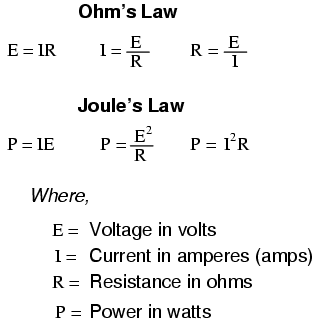{ #fig:11001 width=75% }

NOTE: the symbol \"V\" (\"U\" in Europe) is sometimes used to represent voltage instead of \"E\". In some cases, an author or circuit designer may choose to exclusively use \"V\" for voltage, never using the symbol \"E.\" Other times the two symbols are used interchangeably, or \"E\" is used to represent voltage from a power source while \"V\" is used to represent voltage across a load (voltage \"drop\").

\

### Kirchhoff\'s Laws { #sec:xtocid15777052 }

> _\"The algebraic sum of all voltages in a loop must equal zero.\"_
>
> **Kirchhoff\'s Voltage Law (KVL)**

\

> _\"The algebraic sum of all currents entering and exiting a node must equal zero.\"_
>
> **Kirchhoff\'s Current Law (KCL)**

## Series circuit rules { #sec:xtocid15777053 }

- Components in a series circuit share the same current. I~total~ = I~1~ = I~2~ = . . . I~n~
- Total resistance in a series circuit is equal to the sum of the individual resistances, making it _greater_ than any of the individual resistances. R~total~ = R~1~ + R~2~ + . . . R~n~
- Total voltage in a series circuit is equal to the sum of the individual voltage drops. E~total~ = E~1~ + E~2~ + . . . E~n~

## Parallel circuit rules { #sec:xtocid15777054 }

- Components in a parallel circuit share the same voltage. E~total~ = E~1~ = E~2~ = . . . E~n~
- Total resistance in a parallel circuit is _less_ than any of the individual resistances. R~total~ = 1 / (1/R~1~ + 1/R~2~ + . . . 1/R~n~)
- Total current in a parallel circuit is equal to the sum of the individual branch currents. I~total~ = I~1~ + I~2~ + . . . I~n~

## Series and parallel component equivalent values { #sec:xtocid15777055 }

[]{#Series circuits} []{#Parallel circuits}

### Series and parallel resistances { #sec:xtocid15777056 }

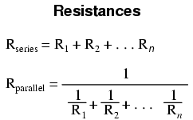{ #fig:11002 width=75% }

\

### Series and parallel inductances { #sec:xtocid15777057 }

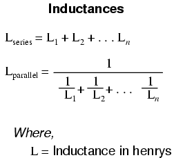{ #fig:11003 width=75% }

\

### Series and Parallel Capacitances { #sec:xtocid15777058 }

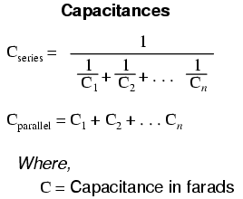{ #fig:11004 width=75% }

## Capacitor sizing equation { #sec:xtocid15777059 }

[]{#Capacitance equation}

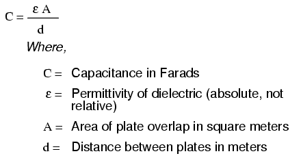{ #fig:10230 width=75% }

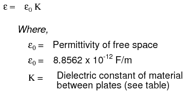{ #fig:11095 width=75% }

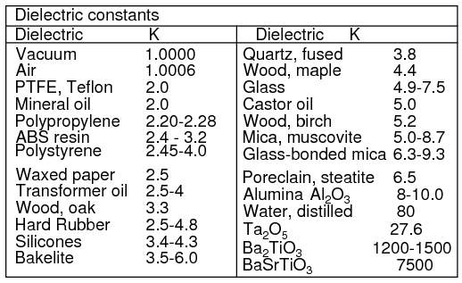{ #fig:11096 width=75% }

A formula for capacitance in picofarads using practical dimensions:

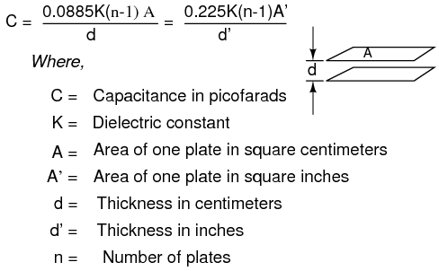{ #fig:10277 width=75% }

## Inductor sizing equation { #sec:xtocid157770510 }

[]{#Inductance equation}

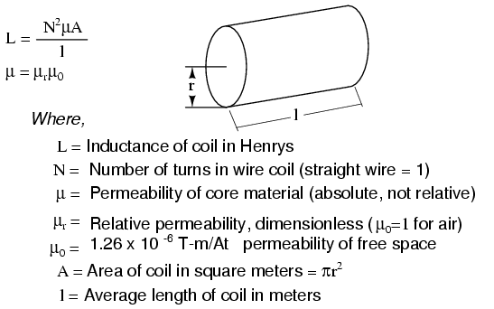{ #fig:11102 width=75% }

Wheeler\'s formulas for inductance of air core coils which follow are useful for radio frequency inductors. The following formula for the inductance of a single layer air core solenoid coil is accurate to approximately 1% for 2r/l \< 3. The thick coil formula is 1% accurate when the denominator terms are approximately equal. Wheeler\'s spiral formula is 1% accurate for c\>0.2r. While this is a \"round wire\" formula, it may still be applicable to printed circuit spiral inductors at reduced accuracy.

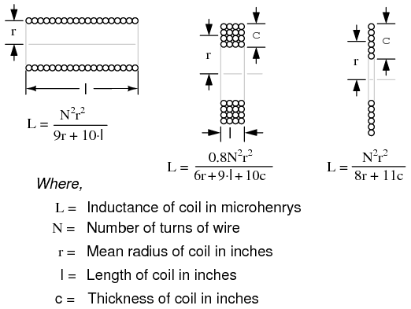{ #fig:11098 width=75% }

The inductance in henries of a square printed circuit inductor is given by two formulas where p=q, and p≠q.

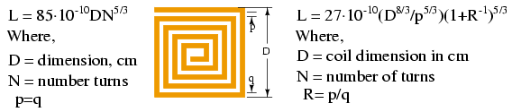{ #fig:11100 width=75% }

#### Wire sizing for inductors { #sec:xtocid157770511 }

[]{#AWGcm}

The wire table provides \"turns per inch\" for enamel magnet wire for use with the inductance formulas for coils. The circular-mil cross-section area determines current carrying capacity of wires.

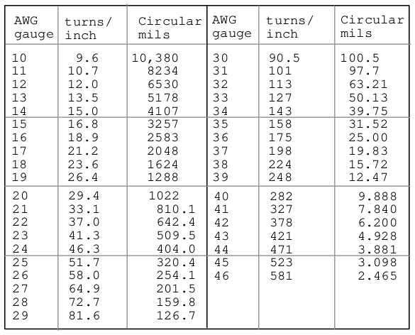{ #fig:11099 width=75% }

## Time constant equations { #sec:xtocid157770512 }

[]{#Time constant equations}

### Value of time constant in series RC and RL circuits { #sec:xtocid157770513 }

Time constant in seconds = RC

Time constant in seconds = L/R

\

### Calculating voltage or current at specified time { #sec:xtocid157770514 }

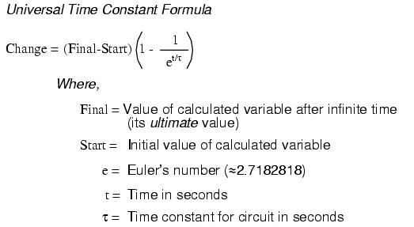{ #fig:10245 width=75% }

\

### Calculating time at specified voltage or current { #sec:xtocid157770515 }

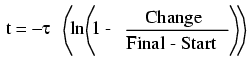{ #fig:10264 width=75% }

## AC circuit equations { #sec:xtocid157770516 }

[]{#Reactance} []{#Impedance} []{#Resonance} []{#Power factor}

### Inductive reactance { #sec:xtocid157770517 }

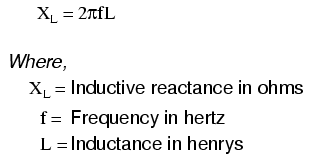{ #fig:11005 width=75% }

\

### Capacitive reactance { #sec:xtocid157770518 }

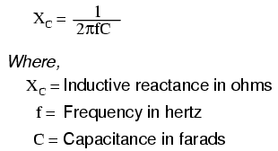{ #fig:11006 width=75% }

\

### Impedance in relation to R and X { #sec:xtocid157770519 }

> Z~L~ = R + jX~L~

> Z~C~ = R - jX~C~

\

### Ohm\'s Law for AC { #sec:xtocid157770520 }

[]{#Ohm's Law, AC}

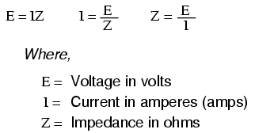{ #fig:11009 width=75% }

\

### Series and Parallel Impedances { #sec:xtocid157770521 }

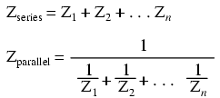{ #fig:11008 width=75% }

NOTE: All impedances must be calculated in _complex_ number form for these equations to work.

\

### Resonance { #sec:xtocid157770522 }

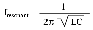{ #fig:11010 width=75% }

NOTE: This equation applies to a non-resistive LC circuit. In circuits containing resistance as well as inductance and capacitance, this equation applies only to series configurations and to parallel configurations where R is very small.

\

### AC power { #sec:xtocid157770523 }

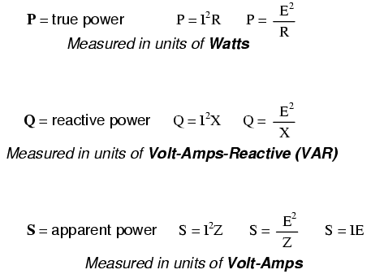{ #fig:12123 width=75% }

\

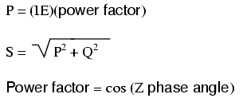{ #fig:11011 width=75% }

## Decibels { #sec:xtocid157770524 }

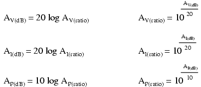{ #fig:11063 width=75% }

\

## Metric prefixes and unit conversions { #sec:xtocid157770525 }

[]{#Metric system} []{#Prefix, metric} []{#Conversion factor} []{#Factor, conversion}

- **Metric prefixes**
- Yotta = 10^24^ Symbol: Y
- Zetta = 10^21^ Symbol: Z
- Exa = 10^18^ Symbol: E
- Peta = 10^15^ Symbol: P
- Tera = 10^12^ Symbol: T
- Giga = 10^9^ Symbol: G
- Mega = 10^6^ Symbol: M
- Kilo = 10^3^ Symbol: k
- Hecto = 10^2^ Symbol: h
- Deca = 10^1^ Symbol: da
- Deci = 10^-1^ Symbol: d
- Centi = 10^-2^ Symbol: c
- Milli = 10^-3^ Symbol: m
- Micro = 10^-6^ Symbol: µ
- Nano = 10^-9^ Symbol: n
- Pico = 10^-12^ Symbol: p
- Femto = 10^-15^ Symbol: f
- Atto = 10^-18^ Symbol: a
- Zepto = 10^-21^ Symbol: z
- Yocto = 10^-24^ Symbol: y

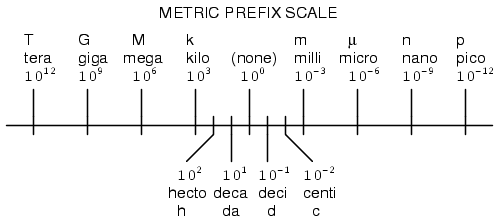{ #fig:00356 width=75% }

\

- **Conversion factors for temperature**
- ^o^F = (^o^C)(9/5) + 32
- ^o^C = (^o^F - 32)(5/9)
- ^o^R = ^o^F + 459.67
- ^o^K = ^o^C + 273.15

\

**Conversion equivalencies for volume**

> 1 US gallon (gal) = 231.0 cubic inches (in^3^) = 4 quarts (qt) = 8 pints (pt) = 128 fluid ounces (fl. oz.) = 3.7854 liters (l)

> 1 Imperial gallon (gal) = 160 fluid ounces (fl. oz.) = 4.546 liters (l)

\

**Conversion equivalencies for distance**

> 1 inch (in) = 2.540000 centimeter (cm)

\

**Conversion equivalencies for velocity**

> 1 mile per hour (mi/h) = 88 feet per minute (ft/m) = 1.46667 feet per second (ft/s) = 1.60934 kilometer per hour (km/h) = 0.44704 meter per second (m/s) = 0.868976 knot (knot \-- international)

\

**Conversion equivalencies for weight**

> 1 pound (lb) = 16 ounces (oz) = 0.45359 kilogram (kg)

\

**Conversion equivalencies for force**

> 1 pound-force (lbf) = 4.44822 newton (N)

\

**Acceleration of gravity (free fall), Earth standard**

> 9.806650 meters per second per second (m/s^2^) = 32.1740 feet per second per second (ft/s^2^)

\

**Conversion equivalencies for area**

> 1 acre = 43560 square feet (ft^2^) = 4840 square yards (yd^2^) = 4046.86 square meters (m^2^)

\

**Conversion equivalencies for pressure**

> 1 pound per square inch (psi) = 2.03603 inches of mercury (in. Hg) = 27.6807 inches of water (in. W.C.) = 6894.757 pascals (Pa) = 0.0680460 atmospheres (Atm) = 0.0689476 bar (bar)

\

**Conversion equivalencies for energy or work**

> 1 british thermal unit (BTU \-- \"International Table\") = 251.996 calories (cal \-- \"International Table\") = 1055.06 joules (J) = 1055.06 watt-seconds (W-s) = 0.293071 watt-hour (W-hr) = 1.05506 x 10^10^ ergs (erg) = 778.169 foot-pound-force (ft-lbf)

\

**Conversion equivalencies for power**

> 1 horsepower (hp \-- 550 ft-lbf/s) = 745.7 watts (W) = 2544.43 british thermal units per hour (BTU/hr) = 0.0760181 boiler horsepower (hp \-- boiler)

\

**Conversion equivalencies for motor torque**

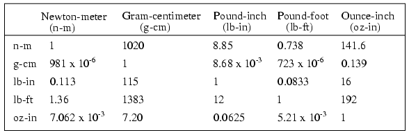{ #fig:11094 width=75% }

Locate the row corresponding to known unit of torque along the left of the table. Multiply by the factor under the column for the desired units. For example, to convert 2 oz-in torque to n-m, locate oz-in row at table left. Locate 7.062 x 10^-3^ at intersection of desired n-m units column. Multiply 2 oz-in x (7.062 x 10^-3^ ) = 14.12 x 10^-3^ n-m.

\

Converting between units is easy if you have a set of equivalencies to work with. Suppose we wanted to convert an energy quantity of 2500 calories into watt-hours. What we would need to do is find a set of equivalent figures for those units. In our reference here, we see that 251.996 calories is physically equal to 0.293071 watt hour. To convert from calories into watt-hours, we must form a \"unity fraction\" with these physically equal figures (a fraction composed of different figures and different units, the numerator and denominator being _physically_ equal to one another), placing the desired unit in the numerator and the initial unit in the denominator, and then multiply our initial value of calories by that fraction.

Since both terms of the \"unity fraction\" are physically equal to one another, the fraction as a whole has a _physical_ value of 1, and so does not change the true value of any figure when multiplied by it. When units are canceled, however, there will be a change in units. For example, 2500 calories multiplied by the unity fraction of (0.293071 w-hr / 251.996 cal) = 2.9075 watt-hours.

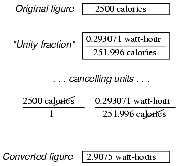{ #fig:11064 width=75% }

The \"unity fraction\" approach to unit conversion may be extended beyond single steps. Suppose we wanted to convert a fluid flow measurement of 175 gallons per hour into liters per day. We have two units to convert here: gallons into liters, and hours into days. Remember that the word \"per\" in mathematics means \"divided by,\" so our initial figure of 175 gallons _per_ hour means 175 gallons divided by hours. Expressing our original figure as such a fraction, we multiply it by the necessary unity fractions to convert gallons to liters (3.7854 liters = 1 gallon), and hours to days (1 day = 24 hours). The units must be arranged in the unity fraction in such a way that undesired units cancel each other out above and below fraction bars. For this problem it means using a gallons-to-liters unity fraction of (3.7854 liters / 1 gallon) and a hours-to-days unity fraction of (24 hours / 1 day):

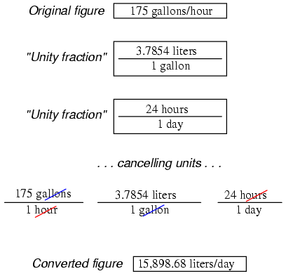{ #fig:11065 width=75% }

Our final (converted) answer is 15898.68 liters per day.

## Data { #sec:xtocid157770526 }

Conversion factors were found in the 78^th^ edition of the _CRC Handbook of Chemistry and Physics_, and the 3^rd^ edition of Bela Liptak\'s _Instrument Engineers\' Handbook \-- Process Measurement and Analysis_.

## Contributors { #sec:xtocid157770527 }

Contributors to this chapter are listed in chronological order of their contributions, from most recent to first. See Appendix 2 (Contributor List) for dates and contact information.

**Gerald Gardner** (January 2003): Addition of Imperial gallons conversion.
