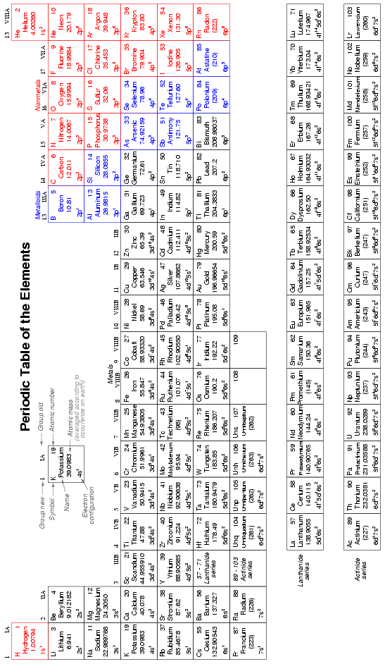
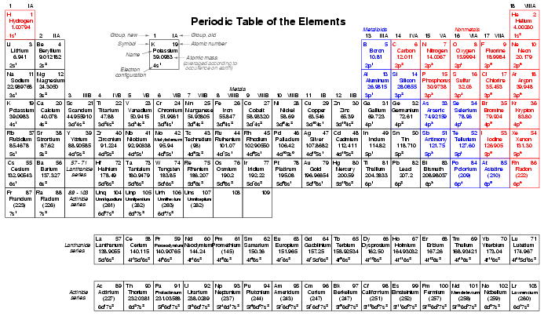

# Chapter 10: Periodic Table of the Elements

## Table (landscape view) { #sec:xtocid15791150 }

See Figure [below](@fig:01064).

[]{#01064.png}

{ #fig:01064 width=75% }

## Table (portrait view) { #sec:xtocid15791151}}

[]{#01065.png}

{ #fig:01065 width=75% }

## Data { #sec:xtocid15791152 }

Atomic masses shown in parentheses indicate the _most stable_ isotope (longest half-life) known.

Electron configuration data was taken from Douglas C. Giancoli's _Physics_, 3rd edition. Average atomic masses were taken from Kenneth W. Whitten's, Kenneth D. Gailey's, and Raymond E. Davis' _General Chemistry_, 3rd edition. In the latter book, the masses were specified as 1985 IUPAC values.
