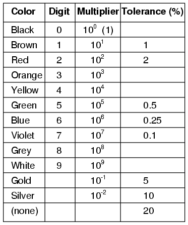
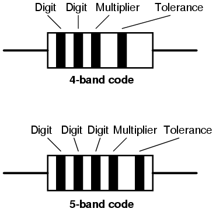
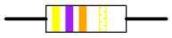
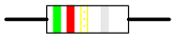
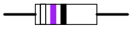
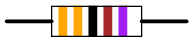
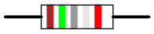
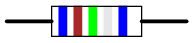

# Chapter 2: Color Codes

## Resistor Color Codes { #sec:xtocid15777920 }

Components and wires are coded with colors to identify their value and function.

[]{#Resistor color codes}

{ #fig:11066 width=75% }

The colors brown, red, green, blue, and violet are used as tolerance codes on 5-band resistors only. All 5-band resistors use a colored tolerance band. The blank (20%) \"band\" is only used with the \"4-band\" code (3 colored bands + a blank \"band\").

\

{ #fig:11067 width=75% }

### Example #1 { #sec:xtocid15777921 }

{ #fig:11012 width=75% }

A resistor colored _Yellow-Violet-Orange-Gold_ would be 47 kΩ with a tolerance of +/- 5%.

### Example #2 { #sec:xtocid15777922 }

{ #fig:11013 width=75% }

A resistor colored _Green-Red-Gold-Silver_ would be 5.2 Ω with a tolerance of +/- 10%.

### Example #3 { #sec:xtocid15777923 }

{ #fig:11014 width=75% }

A resistor colored _White-Violet-Black_ would be 97 Ω with a tolerance of +/- 20%. When you see only three color bands on a resistor, you know that it is actually a 4-band code with a blank (20%) tolerance band.

### Example #4 { #sec:xtocid15777924 }

{ #fig:11015 width=75% }

A resistor colored _Orange-Orange-Black-Brown-Violet_ would be 3.3 kΩ with a tolerance of +/- 0.1%.

### Example #5 { #sec:xtocid15777925 }

{ #fig:11016 width=75% }

A resistor colored _Brown-Green-Grey-Silver-Red_ would be 1.58 Ω with a tolerance of +/- 2%.

### Example #6 { #sec:xtocid15777926 }

{ #fig:11017 width=75% }

A resistor colored _Blue-Brown-Green-Silver-Blue_ would be 6.15 Ω with a tolerance of +/- 0.25%.

## Wiring Color Codes { #sec:xtocid15777927 }

Wiring for AC and DC power distribution branch circuits are color coded for identification of individual wires. In some jurisdictions all wire colors are specified in legal documents. In other jurisdictions, only a few conductor colors are so codified. In that case, local custom dictates the "optional" wire colors.

**IEC, AC:** Most of Europe abides by IEC (International Electrotechnical Commission) wiring color codes for AC branch circuits. These are listed in Table [below](#wire.tbl). The older color codes in the table reflect the previous style which did not account for proper phase rotation. The protective ground wire (listed as green-yellow) is green with yellow stripe.

[]{#wire.tbl}

_IEC (most of Europe) AC power circuit wiring color codes._

Function label Color, IEC Color, old IEC

---

Protective earth PE green-yellow green-yellow Neutral N blue blue Line, single phase L brown brown or black Line, 3-phase L1 brown brown or black Line, 3-phase L2 black brown or black Line, 3-phase L3 grey brown or black

\

**UK, AC:** The United Kingdom now follows the IEC AC wiring color codes. Table [below](#wire2.tbl) lists these along with the obsolete domestic color codes. For adding new colored wiring to existing old colored wiring see Cook. (@PCk)

[]{#wire2.tbl}

_UK AC power circuit wiring color codes._

Function label Color, IEC Old UK color

---

Protective earth PE green-yellow green-yellow Neutral N blue black Line, single phase L brown red Line, 3-phase L1 brown red Line, 3-phase L2 black yellow Line, 3-phase L3 grey blue

\

**US, AC:**The US National Electrical Code only mandates white (or grey) for the neutral power conductor and bare copper, green, or green with yellow stripe for the protective ground. In principle any other colors except these may be used for the power conductors. The colors adopted as local practice are shown in Table [below](#wire3.tbl). Black, red, and blue are used for 208 VAC three-phase; brown, orange and yellow are used for 480 VAC. Conductors larger than #6 AWG are only available in black and are color taped at the ends.

[]{#wire3.tbl}

_US AC power circuit wiring color codes._

Function label Color, common Color, alternative

---

Protective ground PG bare, green, or green-yellow green Neutral N white grey Line, single phase L black or red (2nd hot) Line, 3-phase L1 black brown Line, 3-phase L2 red orange Line, 3-phase L3 blue yellow

**Canada:** Canadian wiring is governed by the CEC (Canadian Electric Code). See Table [below](#wire6.tbl). The protective ground is green or green with yellow stripe. The neutral is white, the hot (live or active) single phase wires are black , and red in the case of a second active. Three-phase lines are red, black, and blue.

[]{#wire6.tbl}

_Canada AC power circuit wiring color codes._

Function label Color, common

---

Protective ground PG green or green-yellow Neutral N white Line, single phase L black or red (2nd hot) Line, 3-phase L1 red Line, 3-phase L2 black Line, 3-phase L3 blue

**IEC, DC:** DC power installations, for example, solar power and computer data centers, use color coding which follows the AC standards. The IEC color standard for DC power cables is listed in Table [below](#wire4.tbl), adapted from Table 2, Cook. (@PCk)

[]{#wire4.tbl}

_IEC DC power circuit wiring color codes._

Function label Color

---

Protective earth PE green-yellow  2-wire unearthed DC Power System Positive L+ brown Negative L- grey  2-wire earthed DC Power System Positive (of a negative earthed) circuit L+ brown Negative (of a negative earthed) circuit M blue Positive (of a positive earthed) circuit M blue Negative (of a positive earthed) circuit L- grey  3-wire earthed DC Power System Positive L+ brown Mid-wire M blue Negative L- grey

**US DC power:** The US National Electrical Code (for both AC and DC) mandates that the grounded neutral conductor of a power system be white or grey. The protective ground must be bare, green or green-yellow striped. Hot (active) wires may be any other colors except these. However, common practice (per local electrical inspectors) is for the first hot (live or active) wire to be black and the second hot to be red. The recommendations in Table [below](#wire5.tbl) are by Wiles. (@JWi) He makes no recommendation for ungrounded power system colors. Usage of the ungrounded system is discouraged for safety. However, red (+) and black (-) follows the coloring of the grounded systems in the table.

[_US recommended DC power circuit wiring color codes._]{#wire5.tbl}

Function label Color

---

Protective ground PG bare, green, or green-yellow  2-wire ungrounded DC Power System Positive L+ no recommendation (red) Negative L- no recommendation (black)  2-wire grounded DC Power System Positive (of a negative grounded) circuit L+ red Negative (of a negative grounded) circuit N white Positive (of a positive grounded) circuit N white Negative (of a positive grounded) circuit L- black  3-wire grounded DC Power System Positive L+ red Mid-wire (center tap) N white Negative L- black

## [Bibliography]{#xtocid15777928}

1.  [\[PCk\]Paul Cook, "Harmonised colours and alphanumeric marking", IEE Wiring Matters, Spring 2004 at]{#PCk.bibitem} <http://www.iee.org/Publish/WireRegs/IEE_Harmonized_colours.pdf>
2.  [\[JWi\]John Wiles, "Photovoltaic Power Systems and the National Electrical Code: Suggested Practices", Southwest Technology Development Institute, New Mexico State University, March 2001 at]{#JWi.bibitem} <http://www.re.sandia.gov/en/ti/tu/Copy%20of%20NEC2000.pdf>
