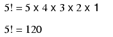
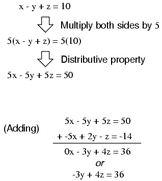

# Chapter 4: Algebra Reference

## Basic identities { #sec:xtocid15782810 }

[]{#Algebraic identities}

{ #fig:11018 width=75% }

Note: while division by zero is popularly thought to be equal to infinity, this is not technically true. In some practical applications it may be helpful to think the result of such a fraction _approaching_ positive infinity as a positive denominator _approaches_ zero (imagine calculating current I=E/R in a circuit with resistance approaching zero --- current would approach infinity), but the actual fraction of anything divided by zero is undefined in the scope of either real or complex numbers.

## Arithmetic properties { #sec:xtocid15782811 }

[]{#Properties, arithmetic}

### The associative property { #sec:xtocid15782812 }

In addition and multiplication, terms may be arbitrarily _associated_ with each other through the use of parentheses:

{ #fig:11019 width=75% }

### The commutative property { #sec:xtocid15782813 }

In addition and multiplication, terms may be arbitrarily interchanged, or _commutated_:

{ #fig:11020 width=75% }

### The distributive property { #sec:xtocid15782814 }

{ #fig:11021 width=75% }

## Properties of exponents { #sec:xtocid15782815 }

[]{#Properties, exponents}

{ #fig:11022 width=75% }

## Radicals { #sec:xtocid15782816 }

[]{#Properties, radicals }

### Definition of a radical { #sec:xtocid15782817 }

When people talk of a \"square root,\" they're referring to a radical with a root of 2. This is mathematically equivalent to a number raised to the power of 1/2. This equivalence is useful to know when using a calculator to determine a strange root. Suppose for example you needed to find the fourth root of a number, but your calculator lacks a \"4th root\" button or function. If it has a y^x^ function (which any scientific calculator should have), you can find the fourth root by raising that number to the 1/4 power, or x^0.25^.

{ #fig:11023 width=75% }

It is important to remember that when solving for an _even_ root (square root, fourth root, etc.) of any number, there are _two_ valid answers. For example, most people know that the square root of nine is three, but _negative_ three is also a valid answer, since (-3)^2^ = 9 just as 3^2^ = 9.

### Properties of radicals { #sec:xtocid15782818 }

{ #fig:11024 width=75% }

## Important constants { #sec:xtocid15782819 }

[]{#Constants, mathematical}

### Euler's number { #sec:xtocid157828110 }

Euler's constant is an important value for exponential functions, especially scientific applications involving decay (such as the decay of a radioactive substance). It is especially important in calculus due to its uniquely self-similar properties of integration and differentiation.

    e approximately equals:
    2.71828 18284 59045 23536 02874 71352 66249 77572 47093 69996

{ #fig:11025 width=75% }

### Pi { #sec:xtocid157828111 }

Pi (π) is defined as the ratio of a circle's circumference to its diameter.

    Pi approximately equals:
    3.14159 26535 89793 23846 26433 83279 50288 41971 69399 37511

\

**Note:** For both Euler's constant (_e_) and pi (π), the spaces shown between each set of five digits have no mathematical significance. They are placed there just to make it easier for your eyes to \"piece\" the number into five-digit groups when manually copying.

## Logarithms { #sec:xtocid157828112 }

### Definition of a logarithm { #sec:xtocid157828113 }

[]{#Logarithm}

{ #fig:11026 width=75% }

\"log\" denotes a common logarithm (base = 10), while \"ln\" denotes a natural logarithm (base = e).

### Properties of logarithms { #sec:xtocid157828114 }

{ #fig:11027 width=75% }

[]{#Transform function, definition of}

These properties of logarithms come in handy for performing complex multiplication and division operations. They are an example of something called a _transform function_, whereby one type of mathematical operation is transformed into another type of mathematical operation that is simpler to solve. Using a table of logarithm figures, one can multiply or divide numbers by adding or subtracting their logarithms, respectively. then looking up that logarithm figure in the table and seeing what the final product or quotient is.

[]{#Slide rule}

Slide rules work on this principle of logarithms by performing multiplication and division through addition and subtraction of distances on the slide.

{ #fig:01044 width=75% }

Marks on a slide rule's scales are spaced in a logarithmic fashion, so that a linear positioning of the scale or cursor results in a nonlinear indication as read on the scale(s). Adding or subtracting lengths on these logarithmic scales results in an indication equivalent to the product or quotient, respectively, of those lengths.

Most slide rules were also equipped with special scales for trigonometric functions, powers, roots, and other useful arithmetic functions.

## Factoring equivalencies { #sec:xtocid157828115 }

[]{#Factoring}

{ #fig:11028 width=75% }

## The quadratic formula { #sec:xtocid157828116 }

[]{#Quadratic formula}

{ #fig:11029 width=75% }

## Sequences { #sec:xtocid157828117 }

[]{#Sequences} []{#Arithmetic sequence} []{#Common difference} []{#Difference, common}

### Arithmetic sequences { #sec:xtocid157828118 }

An _arithmetic sequence_ is a series of numbers obtained by adding (or subtracting) the same value with each step. A child's counting sequence (1, 2, 3, 4, . . .) is a simple arithmetic sequence, where the _common difference_ is 1: that is, each adjacent number in the sequence differs by a value of one. An arithmetic sequence counting only even numbers (2, 4, 6, 8, . . .) or only odd numbers (1, 3, 5, 7, 9, . . .) would have a common difference of 2.

In the standard notation of sequences, a lower-case letter \"a\" represents an element (a single number) in the sequence. The term \"a~n~\" refers to the element at the n^th^ step in the sequence. For example, \"a~3~\" in an even-counting (common difference = 2) arithmetic sequence starting at 2 would be the number 6, \"a\" representing 4 and \"a~1~\" representing the starting point of the sequence (given in this example as 2).

A capital letter \"A\" represents the _sum_ of an arithmetic sequence. For instance, in the same even-counting sequence starting at 2, A~4~ is equal to the sum of all elements from a~1~ through a~4~, which of course would be 2 + 4 + 6 + 8, or 20.

{ #fig:11030 width=75% }

### Geometric sequences { #sec:xtocid157828119 }

[]{#Geometric sequence} []{#Common ratio} []{#Ratio, common}

A _geometric sequence_, on the other hand, is a series of numbers obtained by multiplying (or dividing) by the same value with each step. A binary place-weight sequence (1, 2, 4, 8, 16, 32, 64, . . .) is a simple geometric sequence, where the _common ratio_ is 2: that is, each adjacent number in the sequence differs by a _factor_ of two.

{ #fig:11031 width=75% }

## Factorials { #sec:xtocid157828120 }

[]{#Factorial} []{#! (factorial)}

### Definition of a factorial { #sec:xtocid157828121 }

Denoted by the symbol \"!\" after an integer; the product of that integer and all integers in descent to 1.

Example of a factorial:

{ #fig:11032 width=75% }

### Strange factorials { #sec:xtocid157828122 }

{ #fig:11033 width=75% }

## Solving simultaneous equations { #sec:xtocid157828123 }

[]{#Simultaneous equations} []{#Systems of linear equations}

The terms _simultaneous equations_ and _systems of equations_ refer to conditions where two or more unknown variables are related to each other through an equal number of equations. Consider the following example:

{ #fig:11068 width=75% }

For this set of equations, there is but a single combination of values for `x` and `y` that will satisfy both. Either equation, considered separately, has an infinitude of valid `(x,y)` solutions, but _together_ there is only one. Plotted on a graph, this condition becomes obvious:

{ #fig:11069 width=75% }

Each line is actually a continuum of points representing possible `x` and `y` solution pairs for each equation. Each equation, separately, has an infinite number of ordered pair (`x`,`y`) solutions. There is only one point where the two linear functions `x + y = 24` and `2x - y = -6` intersect (where one of their many independent solutions happen to work for both equations), and that is where `x` is equal to a value of 6 and `y` is equal to a value of 18.

Usually, though, graphing is not a very efficient way to determine the simultaneous solution set for two or more equations. It is especially impractical for systems of three or more variables. In a three-variable system, for example, the solution would be found by the point intersection of three planes in a three-dimensional coordinate space --- not an easy scenario to visualize.

### Substitution method { #sec:xtocid157828124 }

[]{#Substitution method, simultaneous equations}

Several algebraic techniques exist to solve simultaneous equations. Perhaps the easiest to comprehend is the _substitution_ method. Take, for instance, our two-variable example problem:

{ #fig:11068 width=75% }

In the substitution method, we manipulate one of the equations such that one variable is defined in terms of the other:

{ #fig:11070 width=75% }

Then, we take this new _definition_ of one variable and _substitute_ it for the same variable in the other equation. In this case, we take the definition of `y`, which is `24 - x` and substitute this for the `y` term found in the other equation:

{ #fig:11071 width=75% }

Now that we have an equation with just a single variable (`x`), we can solve it using \"normal\" algebraic techniques:

{ #fig:11072 width=75% }

Now that `x` is known, we can plug this value into any of the original equations and obtain a value for y. Or, to save us some work, we can plug this value (6) into the equation we just generated to define `y` in terms of `x`, being that it is already in a form to solve for `y`:

{ #fig:11073 width=75% }

Applying the substitution method to systems of three or more variables involves a similar pattern, only with more work involved. This is generally true for any method of solution: the number of steps required for obtaining solutions increases rapidly with each additional variable in the system.

To solve for three unknown variables, we need at least three equations. Consider this example:

{ #fig:11074 width=75% }

Being that the first equation has the simplest coefficients (1, -1, and 1, for `x`, `y`, and `z`, respectively), it seems logical to use it to develop a definition of one variable in terms of the other two. In this example, I'll solve for `x` in terms of `y` and `z`:

{ #fig:11075 width=75% }

Now, we can substitute this definition of `x` where `x` appears in the other two equations:

{ #fig:11076 width=75% }

Reducing these two equations to their simplest forms:

{ #fig:11077 width=75% }

So far, our efforts have reduced the system from three variables in three equations to two variables in two equations. Now, we can apply the substitution technique again to the two equations `4y - z = 4` and `-3y + 4z = 36` to solve for either `y` or `z`. First, I'll manipulate the first equation to define `z` in terms of `y`:

{ #fig:11078 width=75% }

Next, we'll substitute this definition of `z` in terms of `y` where we see `z` in the other equation:

{ #fig:11079 width=75% }

Now that `y` is a known value, we can plug it into the equation defining `z` in terms of `y` and obtain a figure for `z`:

{ #fig:11080 width=75% }

Now, with values for `y` and `z` known, we can plug these into the equation where we defined `x` in terms of `y` and `z`, to obtain a value for `x`:

{ #fig:11081 width=75% }

In closing, we've found values for `x`, `y`, and `z` of 2, 4, and 12, respectively, that satisfy all three equations.

### Addition method { #sec:xtocid157828125 }

[]{#Addition method, simultaneous equations}

While the substitution method may be the easiest to grasp on a conceptual level, there are other methods of solution available to us. One such method is the so-called _addition_ method, whereby equations are added to one another for the purpose of canceling variable terms.

Let's take our two-variable system used to demonstrate the substitution method:

{ #fig:11068 width=75% }

One of the most-used rules of algebra is that you may perform any arithmetic operation you wish to an equation so long as you do it _equally to both sides_. With reference to addition, this means we may add any quantity we wish to both sides of an equation --- so long as its the _same_ quantity --- without altering the truth of the equation.

An option we have, then, is to add the corresponding sides of the equations together to form a new equation. Since each equation is an expression of equality (the same quantity on either side of the `=` sign), adding the left-hand side of one equation to the left-hand side of the other equation is valid so long as we add the two equations' right-hand sides together as well. In our example equation set, for instance, we may add `x + y` to `2x - y`, and add `24` and `-6` together as well to form a new equation. What benefit does this hold for us? Examine what happens when we do this to our example equation set:

{ #fig:11082 width=75% }

Because the top equation happened to contain a positive `y` term while the bottom equation happened to contain a negative `y` term, these two terms canceled each other in the process of addition, leaving no `y` term in the sum. What we have left is a new equation, but one with only a single unknown variable, `x`! This allows us to easily solve for the value of `x`:

{ #fig:11083 width=75% }

Once we have a known value for `x`, of course, determining `y`'s value is a simply matter of substitution (replacing `x` with the number `6`) into one of the original equations. In this example, the technique of adding the equations together worked well to produce an equation with a single unknown variable. What about an example where things aren't so simple? Consider the following equation set:

{ #fig:11084 width=75% }

We could add these two equations together --- this being a completely valid algebraic operation --- but it would not profit us in the goal of obtaining values for `x` and `y`:

{ #fig:11085 width=75% }

The resulting equation still contains two unknown variables, just like the original equations do, and so we're no further along in obtaining a solution. However, what if we could manipulate one of the equations so as to have a negative term that _would_ cancel the respective term in the other equation when added? Then, the system would reduce to a single equation with a single unknown variable just as with the last (fortuitous) example.

If we could only turn the `y` term in the lower equation into a `- 2y` term, so that when the two equations were added together, both `y` terms in the equations would cancel, leaving us with only an `x` term, this would bring us closer to a solution. Fortunately, this is not difficult to do. If we _multiply_ each and every term of the lower equation by a `-2`, it will produce the result we seek:

{ #fig:11086 width=75% }

Now, we may add this new equation to the original, upper equation:

{ #fig:11087 width=75% }

Solving for `x`, we obtain a value of `3`:

{ #fig:11088 width=75% }

Substituting this new-found value for `x` into one of the original equations, the value of `y` is easily determined:

{ #fig:11089 width=75% }

Using this solution technique on a three-variable system is a bit more complex. As with substitution, you must use this technique to reduce the three-equation system of three variables down to two equations with two variables, then apply it again to obtain a single equation with one unknown variable. To demonstrate, I'll use the three-variable equation system from the substitution section:

{ #fig:11074 width=75% }

Being that the top equation has coefficient values of `1` for each variable, it will be an easy equation to manipulate and use as a cancellation tool. For instance, if we wish to cancel the `3x` term from the middle equation, all we need to do is take the top equation, multiply each of its terms by `-3`, then add it to the middle equation like this:

{ #fig:11090 width=75% }

We can rid the bottom equation of its `-5x` term in the same manner: take the original top equation, multiply each of its terms by `5`, then add that modified equation to the bottom equation, leaving a new equation with only `y` and `z` terms:

{ #fig:11091 width=75% }

At this point, we have two equations with the same two unknown variables, `y` and `z`:

{ #fig:11092 width=75% }

By inspection, it should be evident that the `-z` term of the upper equation could be leveraged to cancel the `4z` term in the lower equation if only we multiply each term of the upper equation by `4` and add the two equations together:

{ #fig:11093 width=75% }

Taking the new equation `13y = 52` and solving for `y` (by dividing both sides by `13`), we get a value of `4` for `y`. Substituting this value of `4` for `y` in either of the two-variable equations allows us to solve for `z`. Substituting both values of `y` and `z` into any one of the original, three-variable equations allows us to solve for `x`. The final result (I'll spare you the algebraic steps, since you should be familiar with them by now!) is that `x = 2`, `y = 4`, and `z = 12`.

## Contributors { #sec:xtocid157828126 }

Contributors to this chapter are listed in chronological order of their contributions, from most recent to first. See Appendix 2 (Contributor List) for dates and contact information.

**Chirvasuta Constantin** (April 2, 2003): Pointed out error in quadratic equation formula.
