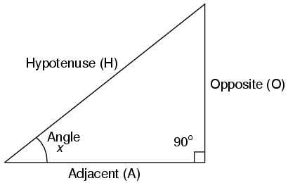
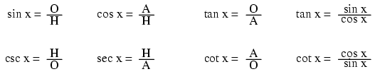
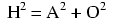
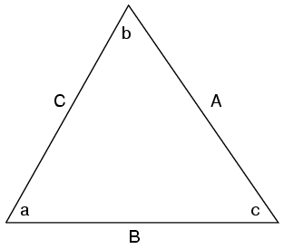
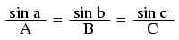
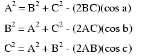
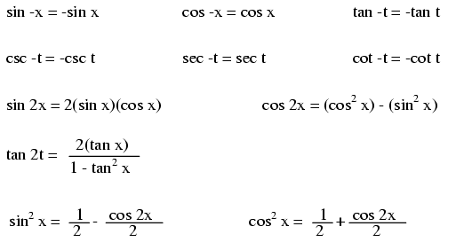
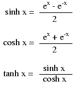

# Chapter 5: Trigonometry Reference

## Right triangle trigonometry { #sec:xtocid15784580 }

{ #fig:01001 width=75% }

A _right triangle_ is defined as having one angle precisely equal to 90^o^ (a _right angle_).

### Trigonometric identities { #sec:xtocid15784581 }

[]{#Trigonometric identities}

{ #fig:11034 width=75% }

[]{#Hypotenuse} []{#Opposite} []{#Adjacent}

H is the _Hypotenuse_, always being opposite the right angle. Relative to angle x, O is the _Opposite_ and A is the _Adjacent_.

\"Arc\" functions such as \"arcsin\", \"arccos\", and \"arctan\" are the complements of normal trigonometric functions. These functions return an angle for a ratio input. For example, if the tangent of 45^o^ is equal to 1, then the \"arctangent\" (arctan) of 1 is 45^o^. \"Arc\" functions are useful for finding angles in a right triangle if the side lengths are known.

### The Pythagorean theorem { #sec:xtocid15784582 }

[]{#Pythagorean Theorem}

{ #fig:11035 width=75% }

## [[Non-right triangle trigonometry]{#xtocid15784583}]{.underline}

{ #fig:01002 width=75% }

### [[The Law of Sines (for]{#xtocid15784584} _any_ triangle)]{.underline}

[]{#Law of sines} []{#Sines, law of}

{ #fig:11036 width=75% }

### [[The Law of Cosines (for]{#xtocid15784585} _any_ triangle)]{.underline}

[]{#Law of cosines} []{#Cosines, law of}

{ #fig:11037 width=75% }

## Trigonometric equivalencies { #sec:xtocid15784586 }

[]{#Trigonometric equivalencies}

{ #fig:11038 width=75% }

## Hyperbolic functions { #sec:xtocid15784587 }

[]{#Hyperbolic functions} []{#Radian} []{#Unit, radian}

{ #fig:11039 width=75% }

Note: all angles (x) must be expressed in units of _radians_ for these hyperbolic functions. There are 2π radians in a circle (360^o^).

## Contributors { #sec:xtocid15784588 }

Contributors to this chapter are listed in chronological order of their contributions, from most recent to first. See Appendix 2 (Contributor List) for dates and contact information.

**Harvey Lew** (??? 2003): Corrected typographical error: \"tangent\" should have been \"cotangent\".
