# Chapter 6: Calculus Reference

## Rules for limits { #sec:xtocid15784910 }

[]{#Limits, calculus}

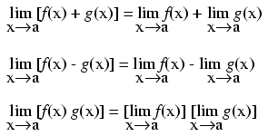{ #fig:11040 width=75% }

## Derivative of a constant { #sec:xtocid15784911 }

[]{#Derivative of a constant}

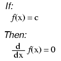{ #fig:11041 width=75% }

(\"c\" being a constant)

## Common derivatives { #sec:xtocid15784912 }

[]{#Derivative of power and log functions}

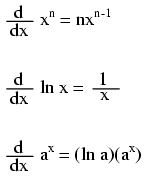{ #fig:11042 width=75% }

## [[Derivatives of power functions of]{#xtocid15784913} _e_]{.underline}

[]{#Derivative of <i>e</i> functions}

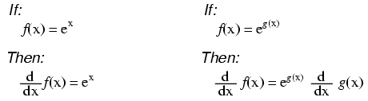{ #fig:11043 width=75% }

\

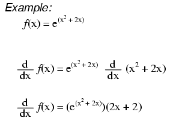{ #fig:11044 width=75% }

## Trigonometric derivatives { #sec:xtocid15784914 }

[]{#Trigonometric derivatives }

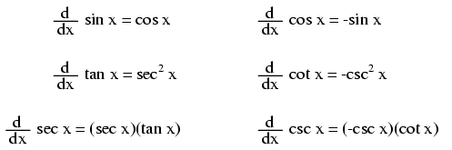{ #fig:11045 width=75% }

## Rules for derivatives { #sec:xtocid15784915 }

[]{#Derivative rules}

### Constant rule { #sec:xtocid15784916 }

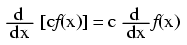{ #fig:11046 width=75% }

### Rule of sums { #sec:xtocid15784917 }

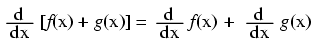{ #fig:11047 width=75% }

### Rule of differences { #sec:xtocid15784918 }

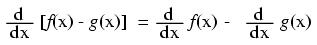{ #fig:11048 width=75% }

### Product rule { #sec:xtocid15784919 }

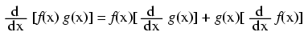{ #fig:11049 width=75% }

### Quotient rule { #sec:xtocid157849110 }

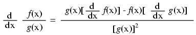{ #fig:11050 width=75% }

### Power rule { #sec:xtocid157849111 }

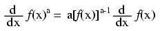{ #fig:11051 width=75% }

### Functions of other functions { #sec:xtocid157849112 }

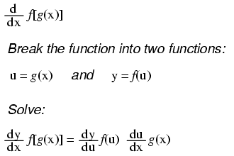{ #fig:11052 width=75% }

## [[The antiderivative (Indefinite integral)]{#xtocid157849113}]{.underline}

[]{#Antiderivatives} []{#Integral, indefinite}

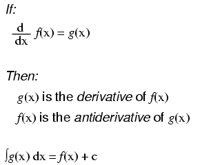{ #fig:11053 width=75% }

Notice something important here: taking the derivative of f(x) may precisely give you g(x), but taking the antiderivative of g(x) does not necessarily give you f(x) in its original form. Example:

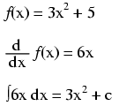{ #fig:11054 width=75% }

Note that the constant c is unknown! The original function f(x) could have been 3x^2^ + 5, 3x^2^ + 10, 3x^2^ + _anything_, and the derivative of f(x) would have still been 6x. Determining the antiderivative of a function, then, is a bit less certain than determining the derivative of a function.

## Common antiderivatives { #sec:xtocid157849114 }

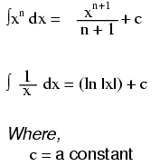{ #fig:11055 width=75% }

\

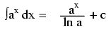{ #fig:11062 width=75% }

## [[Antiderivatives of power functions of]{#xtocid157849115} _e_]{.underline}

[]{#Antiderivative of <i>e</i> functions}

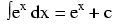{ #fig:11059 width=75% }

Note: this is a very unique and useful property of e. As in the case of derivatives, the antiderivative of such a function is that same function. In the case of the antiderivative, a constant term \"c\" is added to the end as well.

## Rules for antiderivatives { #sec:xtocid157849116 }

[]{#Rules for antiderivatives}

### Constant rule { #sec:xtocid157849117 }

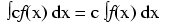{ #fig:11056 width=75% }

### Rule of sums { #sec:xtocid157849118 }

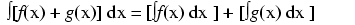{ #fig:11057 width=75% }

### Rule of differences { #sec:xtocid157849119 }

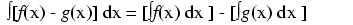{ #fig:11058 width=75% }

## Definite integrals and the fundamental theorem of calculus { #sec:xtocid157849120 }

[]{#Integral, definite}

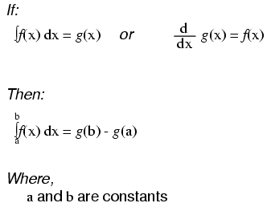{ #fig:11060 width=75% }

\

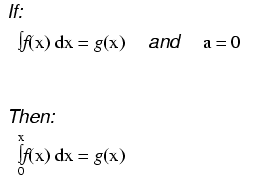{ #fig:11061 width=75% }

## Differential equations { #sec:xtocid157849121 }

[]{#Differential Equations}

As opposed to normal equations where the solution is a number, a differential equation is one where the solution is actually a function, and which at least one derivative of that unknown function is part of the equation.

[]{#General solution} []{#Particular solution} []{#Independent variable}

As with finding antiderivatives of a function, we are often left with a solution that encompasses more than one possibility (consider the many possible values of the constant \"c\" typically found in antiderivatives). The set of functions which answer any differential equation is called the \"general solution\" for that differential equation. Any one function out of that set is referred to as a \"particular solution\" for that differential equation. The variable of reference for differentiation and integration within the differential equation is known as the \"independent variable.\"
