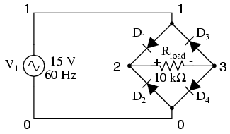

# Chapter 7: Using The _SPICE_ Circuit Simulation Program

## Introduction { #sec:xtocid15789290 }

[]{#<i>Electronics Workbench</i>} []{#SPICE}

> _\"With Electronics Workbench, you can create circuit schematics that look just the same as those you're already familiar with on paper --- plus you can flip the power switch so the schematic behaves like a real circuit. With other electronics simulators, you may have to type in SPICE node lists as text files --- an abstract representation of a circuit beyond the capabilities of all but advanced electronics engineers.\"_
>
> **(Electronics Workbench User's guide --- version 4, page 7)**

This introduction comes from the operating manual for a circuit simulation program called _Electronics Workbench_. Using a graphic interface, it allows the user to draw a circuit schematic and then have the computer analyze that circuit, displaying the results in graphic form. It is a very valuable analysis tool, but it has its shortcomings. For one, it and other graphic programs like it tend to be unreliable when analyzing complex circuits, as the translation from picture to computer code is not quite the exact science we would want it to be (yet). Secondly, due to its graphics requirements, it tends to need a significant amount of computational \"horsepower\" to run, and a computer operating system that supports graphics. Thirdly, these graphic programs can be costly.

However, underneath the graphics skin of _Electronics Workbench_ lies a robust (and free!) program called SPICE, which analyzes a circuit based on a text-file description of the circuit's components and connections. What the user pays for with _Electronics Workbench_ and other graphic circuit analysis programs is the convenient \"point and click\" interface, while SPICE does the actual mathematical analysis.

By itself, SPICE does not require a graphic interface and demands little in system resources. It is also very reliable. The makers of Electronic Workbench would like you to think that using SPICE in its native text mode is a task suited for rocket scientists, but I'm writing this to prove them wrong. SPICE is fairly easy to use for simple circuits, and its non-graphic interface actually lends itself toward the analysis of circuits that can be difficult to draw. I think it was the programming expert Donald Knuth who quipped, \"What you see is all you get\" when it comes to computer applications. Graphics may look more attractive, but abstracted interfaces (text) are actually more efficient.

This document is not intended to be an exhaustive tutorial on how to use SPICE. I'm merely trying to show the interested user how to apply it to the analysis of simple circuits, as an alternative to proprietary (\$\$\$) and buggy programs. Once you learn the basics, there are other tutorials better suited to take you further. Using SPICE --- a program originally intended to develop integrated circuits --- to analyze some of the really simple circuits showcased here may seem a bit like cutting butter with a chain saw, but it works!

[]{#SPICE2g6}

All options and examples have been tested on SPICE version 2g6 on both MS-DOS and Linux operating systems. As far as I know, I'm not using features specific to version 2g6, so these simple functions should work on most versions of SPICE.

## History of SPICE { #sec:xtocid15789291 }

SPICE is a computer program designed to simulate analog electronic circuits. It original intent was for the development of integrated circuits, from which it derived its name: **S**imulation **P**rogram with **I**ntegrated **C**ircuit **E**mphasis.

The origin of SPICE traces back to another circuit simulation program called CANCER. Developed by professor Ronald Rohrer of U.C. Berkeley along with some of his students in the late 1960's, CANCER continued to be improved through the early 1970's. When Rohrer left Berkeley, CANCER was re-written and re-named to SPICE, released as version 1 to the public domain in May of 1972. Version 2 of SPICE was released in 1975 (version 2g6 --- the version used in this book --- is a minor revision of this 1975 release). Instrumental in the decision to release SPICE as a public-domain computer program was professor Donald Pederson of Berkeley, who believed that all significant technical progress happens when information is freely shared. I for one thank him for his vision.

[]{#FORTRAN, computer language} []{#C, computer language}

A major improvement came about in March of 1985 with version 3 of SPICE (also released under public domain). Written in the C language rather than FORTRAN, version 3 incorporated additional transistor types (the MESFET, for example), and switch elements. Version 3 also allowed the use of alphabetical node labels rather than only numbers. Instructions written for version 2 of SPICE should still run in version 3, though.

Despite the additional power of version 3, I have chosen to use version 2g6 throughout this book because it seems to be the easiest version to acquire and run on different computer systems.

## Fundamentals of SPICE programming { #sec:xtocid15789292 }

[]{#Programming, SPICE} []{#SPICE programming}

Programming a circuit simulation with SPICE is much like programming in any other computer language: you must type the commands as text in a file, save that file to the computer's hard drive, and then process the contents of that file with a program (compiler or interpreter) that understands such commands.

In an interpreted computer language, the computer holds a special program called an _interpreter_ that translates the program you wrote (the so-called _source file_) into the computer's own language, on the fly, as its being executed:

[]{#Interpreter}

{ #fig:01041 width=75% }

\
[]{#Compiler}

In a compiled computer language, the program you wrote is translated all at once into the computer's own language by a special program called a _compiler_. After the program you've written has been \"compiled,\" the resulting _executable_ file needs no further translation to be understood directly by the computer. It can now be \"run\" on a computer whether or not compiler software has been installed on that computer:

{ #fig:01042 width=75% }

SPICE is an interpreted language. In order for a computer to be able to understand the SPICE instructions you type, it must have the SPICE program (interpreter) installed:

{ #fig:01043 width=75% }

[]{#FORTRAN, computer language} []{#BASIC, computer language} []{#PASCAL, computer language} []{#Netlist, SPICE}

SPICE source files are commonly referred to as \"netlists,\" although they are sometimes known as \"decks\" with each line in the file being called a \"card.\" Cute, don't you think? Netlists are created by a person like yourself typing instructions line-by-line using a word processor or text editor. Text editors are much preferred over word processors for any type of computer programming, as they produce pure ASCII text with no special embedded codes for text highlighting (like _italic_ or **boldface** fonts), which are uninterpretable by interpreter and compiler software.

As in general programming, the source file you create for SPICE must follow certain conventions of programming. It is a computer language in itself, albeit a simple one. Having programmed in BASIC and C/C++, and having some experience reading PASCAL and FORTRAN programs, it is my opinion that the language of SPICE is much simpler than any of these. It is about the same complexity as a markup language such as HTML, perhaps less so.

There is a cycle of steps to be followed in using SPICE to analyze a circuit. The cycle starts when you first invoke the text editing program and make your first draft of the netlist. The next step is to run SPICE on that new netlist and see what the results are. If you are a novice user of SPICE, your first attempts at creating a good netlist will be fraught with small errors of syntax. Don't worry --- as every computer programmer knows, proficiency comes with lots of practice. If your trial run produces error messages or results that are obviously incorrect, you need to re-invoke the text editing program and modify the netlist. After modifying the netlist, you need to run SPICE again and check the results. The sequence, then, looks something like this:

- Compose a new netlist with a text editing program. Save that netlist to a file with a name of your choice.
- Run SPICE on that netlist and observe the results.
- If the results contain errors, start up the text editing program again and modify the netlist.
- Run SPICE again and observe the new results.
- If there are still errors in the output of SPICE, re-edit the netlist again with the text editing program. Repeat this cycle of edit/run as many times as necessary until you are getting the desired results.
- Once you've \"debugged\" your netlist and are getting good results, run SPICE again, only this time redirecting the output to a new file instead of just observing it on the computer screen.
- Start up a text editing program _or_ a word processor program and open the SPICE output file you just created. Modify that file to suit your formatting needs and either save those changes to disk and/or print them out on paper.

To \"run\" a SPICE \"program,\" you need to type in a command at a terminal prompt interface, such as that found in MS-DOS, UNIX, or the MS-Windows DOS prompt option:

\

    spice < example.cir

\

The word \"spice\" invokes the SPICE interpreting program (providing that the SPICE software has been installed on the computer!), the \"\<\" symbol redirects the contents of the source file to the SPICE interpreter, and `example.cir` is the name of the source file for this circuit example. The file extension \"`.cir`\" is not mandatory; I have seen \"`.inp`\" (for \"input\") and just plain \"`.txt`\" work well, too. It will even work when the netlist file has no extension. SPICE doesn't care what you name it, so long as it has a name compatible with the filesystem of your computer (for old MS-DOS machines, for example, the filename must be no more than 8 characters in length, with a 3 character extension, and no spaces or other non-alphanumerical characters).

When this command is typed in, SPICE will read the contents of the `example.cir` file, analyze the circuit specified by that file, and send a text report to the computer terminal's standard output (usually the screen, where you can see it scroll by). A typical SPICE output is several screens worth of information, so you might want to look it over with a slight modification of the command:

\

    spice < example.cir | more

\

This alternative \"pipes\" the text output of SPICE to the \"more\" utility, which allows only one page to be displayed at a time. What this means (in English) is that the text output of SPICE is halted after one screen-full, and waits until the user presses a keyboard key to display the next screen-full of text. If you're just testing your example circuit file and want to check for any errors, this is a good way to do it.

\

    spice < example.cir > example.txt

\

This second alternative (above) redirects the text output of SPICE to another file, called `example.txt`, where it can be viewed or printed. This option corresponds to the last step in the development cycle listed earlier. It is recommended by this author that you use this technique of \"redirection\" to a text file only after you've proven your example circuit netlist to work well, so that you don't waste time invoking a text editor just to see the output during the stages of \"debugging.\"

Once you have a SPICE output stored in a `.txt` file, you can use a text editor or (better yet!) a word processor to edit the output, deleting any unnecessary banners and messages, even specifying alternative fonts to highlight the headings and/or data for a more polished appearance. Then, of course, you can print the output to paper if you so desire. Being that the direct SPICE output is plain ASCII text, such a file will be universally interpretable on any computer whether SPICE is installed on it or not. Also, the plain text format ensures that the file will be very small compared to the graphic screen-shot files generated by \"point-and-click\" simulators.

The netlist file format required by SPICE is quite simple. A netlist file is nothing more than a plain ASCII text file containing multiple lines of text, each line describing either a circuit component or special SPICE command. Circuit architecture is specified by assigning numbers to each component's connection points in each line, connections between components designated by common numbers. Examine the following example circuit diagram and its corresponding SPICE file. Please bear in mind that the circuit diagram exists only to make the simulation easier for human beings to understand. SPICE only understands netlists:

{ #fig:01004 width=75% }

\

    Example netlist
    v1 1 0 dc 15
    r1 1 0 2.2k
    r2 1 2 3.3k
    r3 2 0 150
    .end

\

Each line of the source file shown above is explained here:

- `v1` represents the battery (voltage source 1), positive terminal numbered 1, negative terminal numbered 0, with a DC voltage output of 15 volts.
- `r1` represents resistor R~1~ in the diagram, connected between points 1 and 0, with a value of 2.2 kΩ.
- `r2` represents resistor R~2~ in the diagram, connected between points 1 and 2, with a value of 3.3 kΩ.
- `r3` represents resistor R~3~ in the diagram, connected between points 2 and 0, with a value of 150 kΩ.

[]{#Nodes, SPICE}

Electrically common points (or \"nodes\") in a SPICE circuit description share common numbers, much in the same way that wires connecting common points in a large circuit typically share common wire labels.

To simulate this circuit, the user would type those six lines of text on a text editor and save them as a file with a unique name (such as `example.cir`). Once the netlist is composed and saved to a file, the user then processes that file with one of the command-line statements shown earlier (`spice < example.cir`), and will receive this text output on their computer's screen:

\

    1*******10/10/99 ******** spice 2g.6 3/15/83 ********07:32:42*****

    0example netlist

    0****   input listing                 temperature =   27.000 deg c

     v1 1 0 dc 15
     r1 1 0 2.2k
     r2 1 2 3.3k
     r3 2 0 150
     .end

    *****10/10/99 *********  spice 2g.6  3/15/83 ******07:32:42******

    0example netlist
    0****   small signal bias solution     temperature =   27.000 deg c

      node   voltage     node   voltage

     (  1)   15.0000    (  2)    0.6522

         voltage source currents
         name       current

         v1       -1.117E-02

         total power dissipation   1.67E-01  watts

            job concluded
    0         total job time            0.02
    1*******10/10/99 ********  spice 2g.6  3/15/83 ******07:32:42*****

    0****   input listing                 temperature =   27.000 deg c

\

SPICE begins by printing the time, date, and version used at the top of the output. It then lists the input parameters (the lines of the source file), followed by a display of DC voltage readings from each node (reference number) to ground (always reference number 0). This is followed by a list of current readings through each voltage source (in this case there's only one, v1). Finally, the total power dissipation and computation time in seconds is printed.

All output values provided by SPICE are displayed in scientific notation.

The SPICE output listing shown above is a little verbose for most peoples' taste. For a final presentation, it might be nice to trim all the unnecessary text and leave only what matters. Here is a sample of that same output, redirected to a text file (`spice < example.cir > example.txt`), then trimmed down judiciously with a text editor for final presentation and printed:

\

    example netlist
    v1 1 0 dc 15
    r1 1 0 2.2k
    r2 1 2 3.3k
    r3 2 0 150
    .end

\

    node    voltage    node     voltage
    (  1)   15.0000    (  2)    0.6522

\

    voltage source currents
    name       current
    v1       -1.117E-02

\

    total power dissipation   1.67E-01  watts

\

One of the very nice things about SPICE is that both input and output formats are plain-text, which is the most universal and easy-to-edit electronic format around. Practically _any_ computer will be able to edit and display this format, even if the SPICE program itself is not resident on that computer. If the user desires, he or she is free to use the advanced capabilities of word processing programs to make the output look fancier. Comments can even be inserted between lines of the output for further clarity to the reader.

## [[The command-line interface]{#xtocid15789293}]{.underline}

If you've used DOS or UNIX operating systems before in a command-line shell environment, you may wonder why we have to use the \"\<\" symbol between the word \"spice\" and the name of the netlist file to be interpreted. Why not just enter the file name as the first argument to the command \"spice\" as we do when we invoke the text editor? The answer is that SPICE has the option of an _interactive_ mode, whereby each line of the netlist can be interpreted as it is entered through the computer's Standard Input (stdin). If you simple type \"spice\" at the prompt and press **\[Enter\]**, SPICE will begin to interpret anything you type in to it (live).

For most applications, its nice to save your netlist work in a separate file and then let SPICE interpret that file when you're ready. This is the way I encourage SPICE to be used, and so this is the way its presented in this lesson. In order to use SPICE this way in a command-line environment, we need to use the \"\<\" redirection symbol to direct the contents of your netlist file to Standard Input (stdin), which SPICE can then process.

## Circuit components { #sec:xtocid15789294 }

Remember that this tutorial is not exhaustive by any means, and that all descriptions for elements in the SPICE language are documented here in condensed form. SPICE is a very capable piece of software with lots of options, and I'm only going to document a few of them.

_All_ components in a SPICE source file are primarily identified by the first letter in each respective line. Characters following the identifying letter are used to distinguish one component of a certain type from another of the same type (r1, r2, r3, rload, rpullup, etc.), and need not follow any particular naming convention, so long as no more than eight characters are used in both the component identifying letter and the distinguishing name.

[]{#Component names, SPICE}

For example, suppose you were simulating a digital circuit with \"pullup\" and \"pulldown\" resistors. The name `rpullup` would be valid because it is seven characters long. The name `rpulldown`, however, is nine characters long. This may cause problems when SPICE interprets the netlist.

You can actually get away with component names in excess of eight total characters if there are no other similarly-named components in the source file. SPICE only pays attention to the first eight characters of the first field in each line, so `rpulldown` is actually interpreted as `rpulldow` with the \"n\" at the end being ignored. Therefore, any other resistor having the first eight characters in its first field will be seen by SPICE as the same resistor, defined twice, which will cause an error (i.e. `rpulldown1` and `rpulldown2` would be interpreted as the same name, `rpulldow`).

It should also be noted that SPICE ignores character case, so `r1` and `R1` are interpreted by SPICE as one and the same.

SPICE allows the use of metric prefixes in specifying component values, which is a very handy feature. However, the prefix convention used by SPICE differs somewhat from standard metric symbols, primarily due to the fact that netlists are restricted to standard ASCII characters (ruling out Greek letters such as µ for the prefix \"micro\") and that SPICE is case-insensitive, so \"m\" (which is the standard symbol for \"milli\") and \"M\" (which is the standard symbol for \"Mega\") are interpreted identically. Here are a few examples of prefixes used in SPICE netlists:

[]{#Metric prefixes, SPICE}\

`r1 1 0 2t` (Resistor R~1~, 2t = 2 Tera-ohms = 2 TΩ)

`r2 1 0 4g` (Resistor R~2~, 4g = 4 Giga-ohms = 4 GΩ)

`r3 1 0 47meg` (Resistor R~3~, 47meg = 47 Mega-ohms = 47 MΩ)

`r4 1 0 3.3k` (Resistor R~4~, 3.3k = 3.3 kilo-ohms = 3.3 kΩ)

`r5 1 0 55m` (Resistor R~5~, 55m = 55 milli-ohms = 55 mΩ)

`r6 1 0 10u` (Resistor R~6~, 10u = 10 micro-ohms 10 µΩ)

`r7 1 0 30n` (Resistor R~7~, 30n = 30 nano-ohms = 30 nΩ)

`r8 1 0 5p` (Resistor R~8~, 5p = 5 pico-ohms = 5 pΩ)

`r9 1 0 250f` (Resistor R~9~, 250f = 250 femto-ohms = 250 fΩ)

\
[]{#Scientific notation, SPICE}

Scientific notation is also allowed in specifying component values. For example:

\

`r10 1 0 4.7e3` (Resistor R~10~, 4.7e3 = 4.7 x 10^3^ ohms = 4.7 kilo-ohms = 4.7 kΩ)

`r11 1 0 1e-12` (Resistor R~11~, 1e-12 = 1 x 10^-12^ ohms = 1 pico-ohm = 1 pΩ)

\

The unit (ohms, volts, farads, henrys, etc.) is automatically determined by the type of component being specified. SPICE \"knows\" that all of the above examples are \"ohms\" because they are all resistors (r1, r2, r3, . . . ). If they were capacitors, the values would be interpreted as \"farads,\" if inductors, then \"henrys,\" etc.

### Passive components { #sec:xtocid15789295 }

#### [CAPACITORS]{#xtocid15789296}

[]{#Capacitors, SPICE}

    General form:  c[name] [node1] [node2] [value] ic=[initial voltage]
    Example 1:     c1 12 33 10u
    Example 2:     c1 12 33 10u ic=3.5

**Comments:** The \"initial condition\" (`ic=`) variable is the capacitor's voltage in units of _volts_ at the start of DC analysis. It is an optional value, with the starting voltage assumed to be zero if unspecified. Starting current values for capacitors are interpreted by SPICE only if the `.tran` analysis option is invoked (with the \"`uic`\" option).

#### [INDUCTORS]{#xtocid15789297}

[]{#Inductors, SPICE}

    General form:  l[name] [node1] [node2] [value] ic=[initial current]
    Example 1:     l1 12 33 133m
    Example 2:     l1 12 33 133m ic=12.7m

**Comments:** The \"initial condition\" (`ic=`) variable is the inductor's current in units of _amps_ at the start of DC analysis. It is an optional value, with the starting current assumed to be zero if unspecified. Starting current values for inductors are interpreted by SPICE only if the .tran analysis option is invoked.

#### [INDUCTOR COUPLING (transformers)]{#xtocid15789298}

[]{#Mutual inductance, SPICE} []{#Transformers, SPICE}

    General form:  k[name] l[name] l[name] [coupling factor]
    Example 1:     k1 l1 l2 0.999

**Comments:** SPICE will only allow coupling factor values between 0 and 1 (non-inclusive), with 0 representing no coupling and 1 representing perfect coupling. The order of specifying coupled inductors (l1, l2 or l2, l1) is irrelevant.

#### [RESISTORS]{#xtocid15789299}

[]{#Resistors, SPICE}

    General form:  r[name] [node1] [node2] [value]
    Example:       rload 23 15 3.3k

**Comments:** In case you were wondering, there is no declaration of resistor power dissipation rating in SPICE. All components are assumed to be indestructible. If only real life were this forgiving!

### Active components { #sec:xtocid157892910 }

[]{#Model, SPICE} []{#Semiconductor model, SPICE}

All semiconductor components must have their electrical characteristics described in a line starting with the word \"`.model`\", which tells SPICE exactly how the device will behave. Whatever parameters are not explicitly defined in the `.model` card will default to values pre-programmed in SPICE. However, the `.model` card _must_ be included, and at least specify the model name and device type (d, npn, pnp, njf, pjf, nmos, or pmos).

#### [DIODES]{#xtocid157892911}

[]{#Diodes, SPICE}

    General form:  d[name] [anode] [cathode] [model]
    Example:       d1 1 2 mod1

**DIODE MODELS:**

    General form:  .model [modelname] d [parmtr1=x] [parmtr2=x] . . .
    Example:       .model mod1 d
    Example:       .model mod2 d vj=0.65 rs=1.3

diodeparameter

_Parameter definitions:_

`is` = saturation current in amps

`rs` = junction resistance in ohms

`n` = emission coefficient (unitless)

`tt` = transit time in seconds

`cjo` = zero-bias junction capacitance in farads

`vj` = junction potential in volts

`m` = grading coefficient (unitless)

`eg` = activation energy in electron-volts

`xti` = saturation-current temperature exponent (unitless)

`kf` = flicker noise coefficient (unitless)

`af` = flicker noise exponent (unitless)

`fc` = forward-bias depletion capacitance coefficient (unitless)

`bv` = reverse breakdown voltage in volts

`ibv` = current at breakdown voltage in amps

\

**Comments:** The model name _must_ begin with a letter, not a number. If you plan to specify a model for a 1N4003 rectifying diode, for instance, you cannot use \"1n4003\" for the model name. An alternative might be \"m1n4003\" instead.

#### [TRANSISTORS, bipolar junction --- BJT]{#xtocid157892912}

[]{#Transistors, bipolar, SPICE}

    General form:  q[name] [collector] [base] [emitter] [model]
    Example:       q1 2 3 0 mod1

**BJT TRANSISTOR MODELS:**

    General form:  .model [modelname] [npn or pnp] [parmtr1=x] . . .
    Example:       .model mod1 pnp
    Example:       .model mod2 npn bf=75 is=1e-14

The model examples shown above are very nonspecific. To accurately model real-life transistors, more parameters are necessary. Take these two examples, for the popular 2N2222 and 2N2907 transistors (the \"`+`\") characters represent line-continuation marks in SPICE, when you wish to break a single line (card) into two or more separate lines on your text editor:

    Example:       .model m2n2222 npn is=19f bf=150 vaf=100 ikf=.18
    +                     ise=50p ne=2.5 br=7.5 var=6.4 ikr=12m
    +                     isc=8.7p nc=1.2 rb=50 re=0.4 rc=0.4 cje=26p
    +                     tf=0.5n cjc=11p tr=7n xtb=1.5 kf=0.032f af=1

    Example:       .model m2n2907 pnp is=1.1p bf=200 nf=1.2 vaf=50
    +                     ikf=0.1 ise=13p ne=1.9 br=6 rc=0.6 cje=23p
    +                     vje=0.85 mje=1.25 tf=0.5n cjc=19p vjc=0.5
    +                     mjc=0.2 tr=34n xtb=1.5

_Parameter definitions:_

`is` = transport saturation current in amps

`bf` = ideal maximum forward Beta (unitless)

`nf` = forward current emission coefficient (unitless)

`vaf` = forward Early voltage in volts

`ikf` = corner for forward Beta high-current rolloff in amps

`ise` = B-E leakage saturation current in amps

`ne` = B-E leakage emission coefficient (unitless)

`br` = ideal maximum reverse Beta (unitless)

`nr` = reverse current emission coefficient (unitless)

`bar` = reverse Early voltage in volts

`ikr`ikr = corner for reverse Beta high-current rolloff in amps

`isc`isc = B-C leakage saturation current in amps

`nc` = B-C leakage emission coefficient (unitless)

`rb` = zero bias base resistance in ohms

`irb` = current for base resistance halfway value in amps

`rbm` = minimum base resistance at high currents in ohms

`re` = emitter resistance in ohms

`rc` = collector resistance in ohms

`cje` = B-E zero-bias depletion capacitance in farads

`vje` = B-E built-in potential in volts

`mje` = B-E junction exponential factor (unitless)

`tf` = ideal forward transit time (seconds)

`xtf` = coefficient for bias dependence of transit time (unitless)

`vtf` = B-C voltage dependence on transit time, in volts

`itf` = high-current parameter effect on transit time, in amps

`ptf` = excess phase at f=1/(transit time)(2)(pi) Hz, in degrees

`cjc` = B-C zero-bias depletion capacitance in farads

`vjc` = B-C built-in potential in volts

`mjc` = B-C junction exponential factor (unitless)

`xjcj` = B-C depletion capacitance fraction connected in base node (unitless)

`tr` = ideal reverse transit time in seconds

`cjs` = zero-bias collector-substrate capacitance in farads

`vjs` = substrate junction built-in potential in volts

`mjs` = substrate junction exponential factor (unitless)

`xtb` = forward/reverse Beta temperature exponent

`eg` = energy gap for temperature effect on transport saturation current in electron-volts

`xti` = temperature exponent for effect on transport saturation current (unitless)

`kf` = flicker noise coefficient (unitless)

`af` = flicker noise exponent (unitless)

`fc` = forward-bias depletion capacitance formula coefficient (unitless)

\

**Comments:** Just as with diodes, the model name given for a particular transistor type _must_ begin with a letter, not a number. That's why the examples given above for the 2N2222 and 2N2907 types of BJTs are named \"m2n2222\" and \"q2n2907\" respectively.

As you can see, SPICE allows for very detailed specification of transistor properties. Many of the properties listed above are well beyond the scope and interest of the beginning electronics student, and aren't even useful apart from knowing the equations SPICE uses to model BJT transistors. For those interested in learning more about transistor modeling in SPICE, consult other books, such as Andrei Vladimirescu's _The Spice Book_ (ISBN 0-471-60926-9).

#### [JFET, junction field-effect transistor]{#xtocid157892913}

[]{#Transistors, jfet, SPICE}

    General form:  j[name] [drain] [gate] [source] [model]
    Example:       j1 2 3 0 mod1

**JFET TRANSISTOR MODELS:**

    General form:     .model [modelname] [njf or pjf] [parmtr1=x] . . .
    Example:          .model mod1 pjf
    Example:          .model mod2 njf lambda=1e-5 pb=0.75

_Parameter definitions:_

`vto` = threshold voltage in volts

`beta` = transconductance parameter in amps/volts^2^

`lambda` = channel length modulation parameter in units of 1/volts

`rd` = drain resistance in ohms

`rs` = source resistance in ohms

`cgs` = zero-bias G-S junction capacitance in farads

`cgd` = zero-bias G-D junction capacitance in farads

`pb` = gate junction potential in volts

`is` = gate junction saturation current in amps

`kf` = flicker noise coefficient (unitless)

`af` = flicker noise exponent (unitless)

`fc` = forward-bias depletion capacitance coefficient (unitless)

#### [MOSFET, transistor]{#xtocid157892914}

[]{#Transistors, mosfet, SPICE}

    General form:  m[name] [drain] [gate] [source] [substrate] [model]
    Example:       m1 2 3 0 0 mod1

**MOSFET TRANSISTOR MODELS:**

    General form:  .model [modelname] [nmos or pmos] [parmtr1=x] . . .
    Example:       .model mod1 pmos
    Example:       .model mod2 nmos level=2 phi=0.65 rd=1.5
    Example:       .model mod3 nmos vto=-1   (depletion)
    Example:       .model mod4 nmos vto=1    (enhancement)
    Example:       .model mod5 pmos vto=1    (depletion)
    Example:       .model mod6 pmos vto=-1   (enhancement)

**Comments:** In order to distinguish between enhancement mode and depletion-mode (also known as depletion-enhancement mode) transistors, the model parameter \"`vto`\" (zero-bias threshold voltage) must be specified. Its default value is zero, but a positive value (+1 volts, for example) on a P-channel transistor or a negative value (-1 volts) on an N-channel transistor will specify that transistor to be a _depletion_ (otherwise known as _depletion-enhancement_) _mode_ device. Conversely, a negative value on a P-channel transistor or a positive value on an N-channel transistor will specify that transistor to be an _enhancement mode_ device.

Remember that enhancement mode transistors are normally-off devices, and must be turned on by the application of gate voltage. Depletion-mode transistors are normally \"on,\" but can be \"pinched off\" as well as enhanced to greater levels of drain current by applied gate voltage, hence the alternate designation of \"depletion-enhancement\" MOSFETs. The \"`vto`\" parameter specifies the threshold gate voltage for MOSFET conduction.

### Sources { #sec:xtocid157892915 }

[]{#Voltage sources, AC, SPICE}

**AC SINEWAVE VOLTAGE SOURCES (when using .ac card to specify frequency):**

    General form:  v[name] [+node] [-node] ac [voltage] [phase] sin
    Example 1:     v1 1 0 ac 12 sin
    Example 2:     v1 1 0 ac 12 240 sin   (12 V ∠ 240o)

**Comments:** This method of specifying AC voltage sources works well if you're using multiple sources at different phase angles from each other, but all at the same frequency. If you need to specify sources at different frequencies in the same circuit, you must use the next method!

\

**AC SINEWAVE VOLTAGE SOURCES (when NOT using .ac card to specify frequency):**

    General form:  v[name] [+node] [-node] sin([offset] [voltage]
    +               [freq] [delay] [damping factor])
    Example 1:     v1 1 0 sin(0 12 60 0 0)

_Parameter definitions:_

`offset` = DC bias voltage, offsetting the AC waveform by a specified voltage.

`voltage` = peak, or crest, AC voltage value for the waveform.

`freq` = frequency in Hertz.

`delay` = time delay, or phase offset for the waveform, in seconds.

`damping factor` = a figure used to create waveforms of decaying amplitude.

**Comments:** This method of specifying AC voltage sources works well if you're using multiple sources at different frequencies from each other. Representing phase shift is tricky, though, necessitating the use of the _delay_ factor.

\
[]{#Voltage sources, DC, SPICE}

**DC VOLTAGE SOURCES (when using .dc card to specify voltage):**

    General form:  v[name] [+node] [-node] dc
    Example 1:     v1 1 0 dc

**Comments:** If you wish to have SPICE output voltages _not_ in reference to node 0, you must use the `.dc` analysis option, and to use this option you must specify at least one of your DC sources in this manner.

\

**DC VOLTAGE SOURCES (when NOT using .dc card to specify voltage):**

    General form:  v[name] [+node] [-node] dc [voltage]
    Example 1:     v1 1 0 dc 12

**Comments:** Nothing noteworthy here!

\
[]{#Voltage sources, pulse, SPICE}

**PULSE VOLTAGE SOURCES**

    General form:  v[name] [+node] [-node] pulse ([i] [p] [td] [tr]
    +              [tf] [pw] [pd])

_Parameter definitions:_

`i` = initial value

`p` = pulse value

`td` = delay time (all time parameters in units of seconds)

`tr` = rise time

`tf` = fall time

`pw` = pulse width

`pd` = period

    Example 1:     v1 1 0 pulse (-3 3 0 0 0 10m 20m)

**Comments:** Example 1 is a perfect square wave oscillating between -3 and +3 volts, with zero rise and fall times, a 20 millisecond period, and a 50 percent duty cycle (+3 volts for 10 ms, then -3 volts for 10 ms).

\
[]{#Current sources, AC, SPICE}

**AC SINEWAVE CURRENT SOURCES (when using .ac card to specify frequency):**

    General form:  i[name] [+node] [-node] ac [current] [phase] sin
    Example 1:     i1 1 0 ac 3 sin        (3 amps)
    Example 2:     i1 1 0 ac 1m 240 sin   (1 mA ∠ 240o)

**Comments:** The same comments apply here (and in the next example) as for AC voltage sources.

\

**AC SINEWAVE CURRENT SOURCES (when NOT using .ac card to specify frequency):**

    General form:  i[name] [+node] [-node] sin([offset]
    +              [current] [freq] 0 0)
    Example 1:     i1 1 0 sin(0 1.5 60 0 0)

\
[]{#Current sources, DC, SPICE}

**DC CURRENT SOURCES (when using .dc card to specify current):**

    General form:  i[name] [+node] [-node] dc
    Example 1:     i1 1 0 dc

\

**DC CURRENT SOURCES (when NOT using .dc card to specify current):**

    General form:  i[name] [+node] [-node] dc [current]
    Example 1:     i1 1 0 dc 12

**Comments:** Even though the books all say that the first node given for the DC current source is the positive node, that's not what I've found to be in practice. In actuality, a DC current source in SPICE pushes current in the same direction as a voltage source (battery) would with its _negative_ node specified first.

\
[]{#Current sources, pulse, SPICE}

**PULSE CURRENT SOURCES**

    General form:  i[name] [+node] [-node] pulse ([i] [p] [td] [tr]
    +              [tf] [pw] [pd])

_Parameter definitions:_

`i` = initial value

`p` = pulse value

`td` = delay time

`tr` = rise time

`tf` = fall time

`pw` = pulse width

`pd` = period

    Example 1:     i1 1 0 pulse (-3m 3m 0 0 0 17m 34m)

**Comments:** Example 1 is a perfect square wave oscillating between -3 mA and +3 mA, with zero rise and fall times, a 34 millisecond period, and a 50 percent duty cycle (+3 mA for 17 ms, then -3 mA for 17 ms).

\
[]{#Voltage sources, dependent, SPICE}

**VOLTAGE SOURCES (dependent):**

    General form:  e[name] [out+node] [out-node] [in+node] [in-node]
    +               [gain]
    Example 1:     e1 2 0 1 2 999k

**Comments:** Dependent voltage sources are great to use for simulating operational amplifiers. Example 1 shows how such a source would be configured for use as a voltage follower, inverting input connected to output (node 2) for negative feedback, and the noninverting input coming in on node 1. The gain has been set to an arbitrarily high value of 999,000. One word of caution, though: SPICE does not recognize the input of a dependent source as being a load, so a voltage source tied only to the input of an independent voltage source will be interpreted as \"open.\" See op-amp circuit examples for more details on this.

\
[]{#Current sources, dependent, SPICE}

**CURRENT SOURCES (dependent):**

## Analysis options { #sec:xtocid157892916 }

[]{#Analysis, AC, SPICE}

**AC ANALYSIS:**

    General form:  .ac [curve] [points] [start] [final]
    Example 1:     .ac lin 1 1000 1000

**Comments:** The \[curve\] field can be \"lin\" (linear), \"dec\" (decade), or \"oct\" (octave), specifying the (non)linearity of the frequency sweep. specifies how many points within the frequency sweep to perform analyses at (for decade sweep, the number of points per decade; for octave, the number of points per octave). The \[start\] and \[final\] fields specify the starting and ending frequencies of the sweep, respectively. One final note: the \"start\" value cannot be zero!

\
[]{#Analysis, DC, SPICE}

**DC ANALYSIS:**

    General form:     .dc [source] [start] [final] [increment]
    Example 1:        .dc vin 1.5 15 0.5

**Comments:** The .dc card is necessary if you want to print or plot any voltage between two nonzero nodes. Otherwise, the default \"small-signal\" analysis only prints out the voltage between each nonzero node and node zero.

\
[]{#Analysis, transient, SPICE}

**TRANSIENT ANALYSIS:**

    General form:  .tran [increment] [stop_time] [start_time]
    +                    [comp_interval]
    Example 1:     .tran 1m 50m uic
    Example 2:     .tran .5m 32m 0 .01m

**Comments:** Example 1 has an increment time of 1 millisecond and a stop time of 50 milliseconds (when only two parameters are specified, they are _increment time_ and _stop time_, respectively). Example 2 has an increment time of 0.5 milliseconds, a stop time of 32 milliseconds, a start time of 0 milliseconds (no delay on start), and a computation interval of 0.01 milliseconds.

Default value for start time is zero. Transient analysis _always_ beings at time zero, but storage of data only takes place between start time and stop time. Data output interval is increment time, or (stop time - start time)/50, which ever is smallest. However, the computing interval variable can be used to force a computational interval smaller than either. For large total interval counts, the `itl5` variable in the `.options` card may be set to a higher number. The \"`uic`\" option tells SPICE to \"use initial conditions.\"

\
[]{#Plot output, SPICE}

**PLOT OUTPUT:**

    General form:  .plot [type] [output1] [output2] . . . [output n]
    Example 1:     .plot dc v(1,2) i(v2)
    Example 2:     .plot ac v(3,4) vp(3,4) i(v1) ip(v1)
    Example 3:     .plot tran v(4,5) i(v2)

**Comments:** SPICE can't handle more than eight data point requests on a single `.plot` or `.print` card. If requesting more than eight data points, use multiple cards!

Also, here's a major caveat when using SPICE version 3: if you're performing AC analysis and you ask SPICE to plot an AC voltage as in example #2, the `v(3,4)` command will only output the _real_ component of a rectangular-form complex number! SPICE version 2 outputs the _polar_ magnitude of a complex number: a much more meaningful quantity if only a single quantity is asked for. To coerce SPICE3 to give you polar magnitude, you will have to re-write the `.print` or `.plot` argument as such: `vm(3,4)`.

\
[]{#Print output, SPICE}

**PRINT OUTPUT:**

    General form:  .print [type] [output1] [output2] . . . [output n]
    Example 1:     .print dc v(1,2) i(v2)
    Example 2:     .print ac v(2,4) i(vinput) vp(2,3)
    Example 3:     .print tran v(4,5) i(v2)

**Comments:** SPICE can't handle more than eight data point requests on a single `.plot` or `.print` card. If requesting more than eight data points, use multiple cards!

\
[]{#Analysis, Fourier, SPICE}

**FOURIER ANALYSIS:**

    General form:  .four [freq] [output1] [output2] . . . [output n]
    Example 1:     .four 60 v(1,2)

**Comments:** The `.four` card relies on the `.tran` card being present somewhere in the deck, with the proper time periods for analysis of adequate cycles. Also, SPICE may \"crash\" if a `.plot` analysis isn't done along with the `.four` analysis, even if all `.tran` parameters are technically correct. Finally, the `.four` analysis option only works when the frequency of the AC source is specified in that source's card line, and _not_ in an `.ac` analysis option line.

It helps to include a computation interval variable in the `.tran` card for better analysis precision. A Fourier analysis of the voltage or current specified is performed up to the 9th harmonic, with the \[freq\] specification being the fundamental, or starting frequency of the analysis spectrum.

\
[]{#Options, miscellaneous, SPICE}

**MISCELLANEOUS:**

    General form:  .options [option1] [option2]
    Example 1:     .options limpts=500
    Example 2:     .options itl5=0
    Example 3:     .options method=gear
    Example 4:     .options list
    Example 5:     .options nopage
    Example 6:     .options numdgt=6

[]{#Option, <i>limpts</i>, SPICE}

**Comments:** There are lots of options that can be specified using this card. Perhaps the one most needed by beginning users of SPICE is the \"`limpts`\" setting. When running a simulation that requires more than 201 points to be printed or plotted, this calculation point limit must be increased or else SPICE will terminate analysis. The example given above (`limpts=500`) tells SPICE to allocate enough memory to handle at least 500 calculation points in whatever type of analysis is specified (DC, AC, or transient).

[]{#Option, <i>itl5</i>, SPICE}

In example 2, we see an _iteration_ variable (`itl5`) being set to a value of 0. There are actually six different iteration variables available for user manipulation. They control the iteration cycle limits for solution of nonlinear equations. The variable `itl5` sets the maximum number of iterations for a transient analysis. Similar to the `limpts` variable, `itl5` usually needs to be set when a small computation interval has been specified on a `.tran` card. Setting `itl5` to a value of 0 turns off the limit entirely, allowing the computer infinite iteration cycles (infinite time) to compute the analysis. _Warning: this may result in long simulation times!_

[]{#Option, <i>method</i>, SPICE}

Example 3 with \"`method=gear`\" sets the numerical integration method used by SPICE. The default is \"trapezoid\" rather than \"gear,\" trapezoid being a simple geometric approximation of area under a curve found by slicing up the curve into trapezoids to approximate the shape. The \"gear\" method is based on second-order or better polynomial equations and is named after C.W. Gear (_Numerical Integration of Stiff Ordinary Equations_, Report 221, Department of Computer Science, University of Illinois, Urbana). The Gear method of integration is more demanding of the computer (computationally \"expensive\") and will sometimes give slightly different results from the trapezoid method.

[]{#Option, <i>list</i>, SPICE}

The \"`list`\" option shown in example 4 gives a verbose summary of all circuit components and their respective values in the final output.

[]{#Option, <i>nopage</i>, SPICE}

By default, SPICE will insert ASCII page-break control codes in the output to separate different sections of the analysis. Specifying the \"`nopage`\" option (example 5) will prevent such pagination.

[]{#Option, <i>numdgt</i>, SPICE}

The \"`numdgt`\" option shown in example 6 specifies the number of significant digits output when using one of the \"`.print`\" data output options. SPICE defaults at a precision of 4 significant digits.

\

**WIDTH CONTROL:**

    General form:  .width in=[columns] out=[columns]
    Example 1:     .width out=80

[]{#Option, <i>width</i>, SPICE}

**Comments:** The `.width` card can be used to control the width of text output lines upon analysis. This is especially handy when plotting graphs with the `.plot` card. The default value is 120, which can cause problems on 80-character terminal displays unless set to 80 with this command.

## Quirks { #sec:xtocid157892917 }

> _\"Garbage in, garbage out.\"_
>
> **Anonymous**

SPICE is a very reliable piece of software, but it does have its little quirks that take some getting used to. By \"quirk\" I mean a demand placed upon the user to write the source file in a particular way in order for it to work without giving error messages. I do _not_ mean any kind of fault with SPICE which would produce erroneous or misleading results: that would be more properly referred to as a \"bug.\" Speaking of bugs, SPICE has a few of them as well.

Some (or all) of these quirks may be unique to SPICE version 2g6, which is the only version I've used extensively. They may have been fixed in later versions.

### A good beginning { #sec:xtocid157892918 }

SPICE demands that the source file begin with something other than the first \"card\" in the circuit description \"deck.\" This first character in the source file can be a linefeed, title line, or a comment: there just has to be _something_ there before the first component-specifying line of the file. If not, SPICE will refuse to do an analysis at all, claiming that there is a serious error (such as improper node connections) in the \"deck.\"

### A good ending { #sec:xtocid157892919 }

[]{#.end command, SPICE}

SPICE demands that the `.end` line at the end of the source file not be terminated with a linefeed or carriage return character. In other words, when you finish typing \"`.end`\" you should not hit the **\[Enter\]** key on your keyboard. The cursor on your text editor should stop immediately to the right of the \"d\" after the \"`.end`\" and go no further. Failure to heed this quirk will result in a \"_missing .end card_\" error message at the end of the analysis output. The actual circuit analysis is not affected by this error, so I normally ignore the message. However, if you're looking to receive a \"perfect\" output, you must pay heed to this idiosyncrasy.

### Must have a node 0 { #sec:xtocid157892920 }

[]{#Nodes, SPICE}

You are given much freedom in numbering circuit nodes, but you _must_ have a node 0 somewhere in your netlist in order for SPICE to work. Node 0 is the default node for circuit ground, and it is the point of reference for all voltages specified at single node locations.

When simple DC analysis is performed by SPICE, the output will contain a listing of voltages at all non-zero nodes in the circuit. The point of reference (ground) for all these voltage readings is node 0. For example:

\

    node    voltage    node     voltage
    (  1)   15.0000    (  2)    0.6522

\

In this analysis, there is a DC voltage of 15 volts between node 1 and ground (node 0), and a DC voltage of 0.6522 volts between node 2 and ground (node 0). In both these cases, the voltage polarity is negative at node 0 with reference to the other node (in other words, both nodes 1 and 2 are positive with respect to node 0).

### Avoid open circuits { #sec:xtocid157892921 }

[]{#Open circuits, SPICE}

SPICE cannot handle open circuits of any kind. If your netlist specifies a circuit with an open voltage source, for example, SPICE will refuse to perform an analysis. A prime example of this type of error is found when \"connecting\" a voltage source to the input of a voltage-dependent source (used to simulate an operational amplifier). SPICE needs to see a complete path for current, so I usually tie a high-value resistor (call it `rbogus`!) across the voltage source to act as a minimal load.

### Avoid certain component loops { #sec:xtocid157892922 }

SPICE cannot handle certain uninterrupted loops of components in a circuit, namely voltage sources and inductors. The following loops will cause SPICE to abort analysis:

{ #fig:01005 width=75% }

    netlist
    l1 2 4 10m
    l2 2 4 50m
    l3 2 4 25m

\

{ #fig:01006 width=75% }

    netlist
    v1 1 0 dc 12
    l1 1 0 150m

\

{ #fig:01007 width=75% }

    netlist
    c1 5 6 33u
    c2 6 7 47u

\

The reason SPICE can't handle these conditions stems from the way it performs DC analysis: by treating all inductors as shorts and all capacitors as opens. Since short-circuits (0 Ω) and open circuits (infinite resistance) either contain or generate mathematical infinitudes, a computer simply cannot deal with them, and so SPICE will discontinue analysis if any of these conditions occur.

In order to make these component configurations acceptable to SPICE, you must insert resistors of appropriate values into the appropriate places, eliminating the respective short-circuits and open-circuits. If a series resistor is required, choose a very low resistance value. Conversely, if a parallel resistor is required, choose a very high resistance value. For example:

To fix the parallel inductor problem, insert a very low-value resistor in series with each offending inductor.

{ #fig:01008 width=75% }

    original netlist
    l1 2 4 10m
    l2 2 4 50m
    l3 2 4 25m

\

    fixed netlist
    rbogus1 2 3 1e-12
    rbogus2 2 5 1e-12
    l1 3 4 10m
    l2 2 4 50m
    l3 5 4 25m

\

The extremely low-resistance resistors R~bogus1~ and R~bogus2~ (each one with a mere 1 pico-ohm of resistance) \"break up\" the direct parallel connections that existed between L~1~, L~2~, and L~3~. It is important to choose very low resistances here so that circuit operation is not substantially impacted by the \"fix.\"

To fix the voltage source / inductor loop, insert a very low-value resistor in series with the two components.

{ #fig:01009 width=75% }

    original netlist
    v1 1 0 dc 12
    l1 1 0 150m

\

    fixed netlist
    v1 1 0 dc 12
    l1 2 0 150m
    rbogus 1 2 1e-12

\

As in the previous example with parallel inductors, it is important to make the correction resistor (R~bogus~) very low in resistance, so as to not substantially impact circuit operation.

To fix the series capacitor circuit, one of the capacitors must have a resistor shunting across it. SPICE requires a DC current path to each capacitor for analysis.

{ #fig:01010 width=75% }

    original netlist
    c1 5 6 33u
    c2 6 7 47u

\

    fixed netlist
    c1 5 6 33u
    c2 6 7 47u
    rbogus 6 7 9e12

\

The R~bogus~ value of 9 Tera-ohms provides a DC current path to C~1~ (and around C~2~) without substantially impacting the circuit's operation.

### Current measurement { #sec:xtocid157892923 }

[]{#Current measurement, SPICE}

Although printing or plotting of voltage is quite easy in SPICE, the output of current values is a bit more difficult. Voltage measurements are specified by declaring the appropriate circuit nodes. For example, if we desire to know the voltage across a capacitor whose leads connect between nodes 4 and 7, we might make out `.print` statement look like this:

{ #fig:01011 width=75% }

    c1 4 7 22u
    .print ac v(4,7)

\

However, if we wanted to have SPICE measure the _current_ through that capacitor, it wouldn't be quite so easy. Currents in SPICE must be specified in relation to a voltage source, not any arbitrary component. For example:

{ #fig:01012 width=75% }

    c1 4 7 22u
    vinput 6 4 ac 1 sin
    .print ac i(vinput)

\

This `.print` card instructs SPICE to print the current through voltage source V~input~, which happens to be the same as the current through our capacitor between nodes 4 and 7. But what if there is no such voltage source in our circuit to reference for current measurement? One solution is to insert a shunt resistor into the circuit and measure voltage across it. In this case, I have chosen a shunt resistance value of 1 Ω to produce 1 volt per amp of current through C~1~:

{ #fig:01013 width=75% }

    c1 4 7 22u
    rshunt 6 4 1
    .print ac v(6,4)

\

However, the insertion of an extra resistance into our circuit large enough to drop a meaningful voltage for the intended range of current might adversely affect things. A better solution for SPICE is this, although one would never seek such a current measurement solution in real life:

{ #fig:01014 width=75% }

    c1 4 7 22u
    vbogus 6 4 dc 0
    .print ac i(vbogus)

\

Inserting a \"bogus\" DC voltage source of zero volts doesn't affect circuit operation at all, yet it provides a convenient place for SPICE to take a current measurement. Interestingly enough, it doesn't matter that V~bogus~ is a DC source when we're looking to measure AC current! The fact that SPICE will output an AC current reading is determined by the \"`ac`\" specification in the `.print` card and nothing more.

It should also be noted that the way SPICE assigns a polarity to current measurements is a bit odd. Take the following circuit as an example:

{ #fig:01015 width=75% }

    example
    v1 1 0
    r1 1 2 5k
    r2 2 0 5k
    .dc v1 10 10 1
    .print dc i(v1)
    .end

\

With 10 volts total voltage and 10 kΩ total resistance, you might expect SPICE to tell you there's going to be 1 mA (1e-03) of current through voltage source V~1~, but in actuality SPICE will output a figure of _negative_ 1 mA (-1e-03)! SPICE regards current out of the negative end of a DC voltage source (the normal direction) to be a negative value of current rather than a positive value of current. There are times I'll throw in a \"bogus\" voltage source in a DC circuit like this simply to get SPICE to output a _positive_ current value:

{ #fig:01016 width=75% }

    example
    v1 1 0
    r1 1 2 5k
    r2 2 3 5k
    vbogus 3 0 dc 0
    .dc v1 10 10 1
    .print dc i(vbogus)
    .end

\

Notice how V~bogus~ is positioned so that the circuit current will enter its positive side (node 3) and exit its negative side (node 0). This orientation will ensure a positive output figure for circuit current.

### Fourier analysis { #sec:xtocid157892924 }

[]{#Analysis, Fourier, SPICE}

When performing a Fourier (frequency-domain) analysis on a waveform, I have found it necessary to either print or plot the waveform using the `.print` or `.plot` cards, respectively. If you don't print or plot it, SPICE will pause for a moment during analysis and then abort the job after outputting the \"initial transient solution.\"

Also, when analyzing a square wave produced by the \"`pulse`\" source function, you must give the waveform some finite rise and fall time, or else the Fourier analysis results will be incorrect. For some reason, a perfect square wave with zero rise/fall time produces significant levels of _even_ harmonics according to SPICE's Fourier analysis option, which is not true for real square waves.

## Example circuits and netlists { #sec:xtocid157892925 }

The following circuits are pre-tested netlists for SPICE 2g6, complete with short descriptions when necessary. Feel free to \"copy\" and \"paste\" any of the netlists to your own SPICE source file for analysis and/or modification. My goal here is twofold: to give practical examples of SPICE netlist design to further understanding of SPICE netlist syntax, and to show how simple and compact SPICE netlists can be in analyzing simple circuits.

All output listings for these examples have been \"trimmed\" of extraneous information, giving you the most succinct presentation of the SPICE output as possible. I do this primarily to save space on this document. Typical SPICE outputs contain lots of headers and summary information not necessarily germane to the task at hand. So don't be surprised when you run a simulation on your own and find that the output doesn't _exactly_ look like what I have shown here!

### [[Multiple-source DC resistor network, part 1]{#xtocid157892926}]{.underline}

{ #fig:01017 width=75% }

Without a `.dc` card and a `.print` or `.plot` card, the output for this netlist will only display voltages for nodes 1, 2, and 3 (with reference to node 0, of course).

\

**Netlist:**

    Multiple dc sources
    v1 1 0 dc 24
    v2 3 0 dc 15
    r1 1 2 10k
    r2 2 3 8.1k
    r3 2 0 4.7k
    .end

\

**Output:**

    node    voltage    node     voltage   node    voltage
    (  1)   24.0000    (  2)    9.7470    (  3)   15.0000

\

    voltage source currents
    name       current
    v1       -1.425E-03
    v2       -6.485E-04

\

    total power dissipation   4.39E-02  watts

### [[Multiple-source DC resistor network, part 2]{#xtocid157892927}]{.underline}

{ #fig:01017 width=75% }

By adding a `.dc` analysis card and specifying source V~1~ from 24 volts to 24 volts in 1 step (in other words, 24 volts steady), we can use the `.print` card analysis to print out voltages between any two points we desire. Oddly enough, when the `.dc` analysis option is invoked, the default voltage printouts for each node (to ground) disappears, so we end up having to explicitly specify them in the `.print` card to see them at all.

\

**Netlist:**

    Multiple dc sources
    v1 1 0
    v2 3 0 15
    r1 1 2 10k
    r2 2 3 8.1k
    r3 2 0 4.7k
    .dc v1 24 24 1
    .print dc v(1) v(2) v(3) v(1,2) v(2,3)
    .end

\

**Output:**

    v1           v(1)        v(2)        v(3)        v(1,2)      v(2,3)
    2.400E+01    2.400E+01   9.747E+00   1.500E+01   1.425E+01  -5.253E+00

### [[RC time-constant circuit]{#xtocid157892928}]{.underline}

{ #fig:01018 width=75% }

For DC analysis, the initial conditions of any reactive component (C or L) must be specified (voltage for capacitors, current for inductors). This is provided by the last data field of each capacitor card (`ic=0`). To perform a DC analysis, the `.tran` (\"_transient_\") analysis option must be specified, with the first data field specifying time increment in seconds, the second specifying total analysis timespan in seconds, and the \"`uic`\" telling it to \"use initial conditions\" when analyzing.

\

**Netlist:**

    RC time delay circuit
    v1 1 0 dc 10
    c1 1 2 47u ic=0
    c2 1 2 22u ic=0
    r1 2 0 3.3k
    .tran .05 1 uic
    .print tran v(1,2)
    .end

\

**Output:**

    time          v(1,2)
    0.000E+00     7.701E-06
    5.000E-02     1.967E+00
    1.000E-01     3.551E+00
    1.500E-01     4.824E+00
    2.000E-01     5.844E+00
    2.500E-01     6.664E+00
    3.000E-01     7.322E+00
    3.500E-01     7.851E+00
    4.000E-01     8.274E+00
    4.500E-01     8.615E+00
    5.000E-01     8.888E+00
    5.500E-01     9.107E+00
    6.000E-01     9.283E+00
    6.500E-01     9.425E+00
    7.000E-01     9.538E+00
    7.500E-01     9.629E+00
    8.000E-01     9.702E+00
    8.500E-01     9.761E+00
    9.000E-01     9.808E+00
    9.500E-01     9.846E+00
    1.000E+00     9.877E+00

### Plotting and analyzing a simple AC sinewave voltage { #sec:xtocid157892929 }

{ #fig:01019 width=75% }

This exercise does show the proper setup for plotting instantaneous values of a sine-wave voltage source with the `.plot` function (as a _transient_ analysis). Not surprisingly, the Fourier analysis in this deck also requires the `.tran` (transient) analysis option to be specified over a suitable time range. The time range in this particular deck allows for a Fourier analysis with rather poor accuracy. The more cycles of the fundamental frequency that the transient analysis is performed over, the more precise the Fourier analysis will be. This is not a quirk of SPICE, but rather a basic principle of waveforms.

\

**Netlist:**

    v1 1 0 sin(0 15 60 0 0)
    rload 1 0 10k
    * change tran card to the following for better Fourier precision
    * .tran 1m 30m .01m     and include .options card:
    * .options itl5=30000
    .tran 1m 30m
    .plot tran v(1)
    .four 60 v(1)
    .end

\

**Output:**

    time      v(1)     -2.000E+01  -1.000E+01    0.000E+00    1.000E+01
    - - - - - - - - - - - - - - - - - - - - - - - - - - - - - - - - - -
    0.000E+00  0.000E+00 .         .             *             .       .
    1.000E-03  5.487E+00 .         .             .       *     .       .
    2.000E-03  1.025E+01 .         .             .             *       .
    3.000E-03  1.350E+01 .         .             .             .    *  .
    4.000E-03  1.488E+01 .         .             .             .      *.
    5.000E-03  1.425E+01 .         .             .             .     * .
    6.000E-03  1.150E+01 .         .             .             . *     .
    7.000E-03  7.184E+00 .         .             .         *   .       .
    8.000E-03  1.879E+00 .         .             .  *          .       .
    9.000E-03 -3.714E+00 .         .        *    .             .       .
    1.000E-02 -8.762E+00 .         . *           .             .       .
    1.100E-02 -1.265E+01 .     *   .             .             .       .
    1.200E-02 -1.466E+01 .  *      .             .             .       .
    1.300E-02 -1.465E+01 .  *      .             .             .       .
    1.400E-02 -1.265E+01 .     *   .             .             .       .
    1.500E-02 -8.769E+00 .         . *           .             .       .
    1.600E-02 -3.709E+00 .         .        *    .             .       .
    1.700E-02  1.876E+00 .         .             .  *          .       .
    1.800E-02  7.191E+00 .         .             .         *   .       .
    1.900E-02  1.149E+01 .         .             .             . *     .
    2.000E-02  1.425E+01 .         .             .             .     * .
    2.100E-02  1.489E+01 .         .             .             .      *.
    2.200E-02  1.349E+01 .         .             .             .    *  .
    2.300E-02  1.026E+01 .         .             .             *       .
    2.400E-02  5.491E+00 .         .             .       *     .       .
    2.500E-02  1.553E-03 .         .             *             .       .
    2.600E-02 -5.514E+00 .         .     *       .             .       .
    2.700E-02 -1.022E+01 .         *             .             .       .
    2.800E-02 -1.349E+01 .    *    .             .             .       .
    2.900E-02 -1.495E+01 .  *      .             .             .       .
    3.000E-02 -1.427E+01 .   *     .             .             .       .
    - - - - - - - - - - - - - - - - - - - - - - - - - - - - - - - - - -

\

     fourier components of transient response v(1)
    dc component =  -1.885E-03
    harmonic   frequency    fourier    normalized    phase     normalized
    no            (hz)     component    component    (deg)    phase (deg)
    1          6.000E+01   1.494E+01     1.000000   -71.998       0.000
    2          1.200E+02   1.886E-02     0.001262   -50.162      21.836
    3          1.800E+02   1.346E-03     0.000090   102.674     174.671
    4          2.400E+02   1.799E-02     0.001204   -10.866      61.132
    5          3.000E+02   3.604E-03     0.000241   160.923     232.921
    6          3.600E+02   5.642E-03     0.000378  -176.247    -104.250
    7          4.200E+02   2.095E-03     0.000140   122.661     194.658
    8          4.800E+02   4.574E-03     0.000306  -143.754     -71.757
    9          5.400E+02   4.896E-03     0.000328  -129.418     -57.420
    total harmonic distortion =      0.186350  percent

### [[Simple AC resistor-capacitor circuit]{#xtocid157892930}]{.underline}

{ #fig:01021 width=75% }

The `.ac` card specifies the points of ac analysis from 60Hz to 60Hz, at a single point. This card, of course, is a bit more useful for multi-frequency analysis, where a range of frequencies can be analyzed in steps. The `.print` card outputs the AC voltage between nodes 1 and 2, and the AC voltage between node 2 and ground.

\

**Netlist:**

    Demo of a simple AC circuit
    v1 1 0 ac 12 sin
    r1 1 2 30
    c1 2 0 100u
    .ac lin 1 60 60
    .print ac v(1,2) v(2)
    .end

\

**Output:**

    freq          v(1,2)      v(2)
    6.000E+01     8.990E+00   7.949E+00

### [[Low-pass filter]{#xtocid157892931}]{.underline}

{ #fig:01022 width=75% }

This low-pass filter blocks AC and passes DC to the R~load~ resistor. Typical of a filter used to suppress ripple from a rectifier circuit, it actually has a resonant frequency, technically making it a band-pass filter. However, it works well anyway to pass DC and block the high-frequency harmonics generated by the AC-to-DC rectification process. Its performance is measured with an AC source sweeping from 500 Hz to 15 kHz. If desired, the `.print` card can be substituted or supplemented with a `.plot` card to show AC voltage at node 4 graphically.

\

**Netlist:**

    Lowpass filter
    v1 2 1 ac 24 sin
    v2 1 0 dc 24
    rload 4 0 1k
    l1 2 3 100m
    l2 3 4 250m
    c1 3 0 100u
    .ac lin 30 500 15k
    .print ac v(4)
    .plot ac v(4)
    .end

\

    freq          v(4)
    5.000E+02     1.935E-01
    1.000E+03     3.275E-02
    1.500E+03     1.057E-02
    2.000E+03     4.614E-03
    2.500E+03     2.402E-03
    3.000E+03     1.403E-03
    3.500E+03     8.884E-04
    4.000E+03     5.973E-04
    4.500E+03     4.206E-04
    5.000E+03     3.072E-04
    5.500E+03     2.311E-04
    6.000E+03     1.782E-04
    6.500E+03     1.403E-04
    7.000E+03     1.124E-04
    7.500E+03     9.141E-05
    8.000E+03     7.536E-05
    8.500E+03     6.285E-05
    9.000E+03     5.296E-05
    9.500E+03     4.504E-05
    1.000E+04     3.863E-05
    1.050E+04     3.337E-05
    1.100E+04     2.903E-05
    1.150E+04     2.541E-05
    1.200E+04     2.237E-05
    1.250E+04     1.979E-05
    1.300E+04     1.760E-05
    1.350E+04     1.571E-05
    1.400E+04     1.409E-05
    1.450E+04     1.268E-05
    1.500E+04     1.146E-05

\

    freq       v(4)  1.000E-06     1.000E-04    1.000E-02    1.000E+00
    - - - - - - - - - - - - - - - - - - - - - - - - - - - - - - - - - -
    5.000E+02  1.935E-01 .             .             .        *    .
    1.000E+03  3.275E-02 .             .             .   *         .
    1.500E+03  1.057E-02 .             .             *             .
    2.000E+03  4.614E-03 .             .           * .             .
    2.500E+03  2.402E-03 .             .         *   .             .
    3.000E+03  1.403E-03 .             .       *     .             .
    3.500E+03  8.884E-04 .             .      *      .             .
    4.000E+03  5.973E-04 .             .    *        .             .
    4.500E+03  4.206E-04 .             .   *         .             .
    5.000E+03  3.072E-04 .             .  *          .             .
    5.500E+03  2.311E-04 .             .  *          .             .
    6.000E+03  1.782E-04 .             . *           .             .
    6.500E+03  1.403E-04 .             .*            .             .
    7.000E+03  1.124E-04 .             *             .             .
    7.500E+03  9.141E-05 .             *             .             .
    8.000E+03  7.536E-05 .            *.             .             .
    8.500E+03  6.285E-05 .            *.             .             .
    9.000E+03  5.296E-05 .           * .             .             .
    9.500E+03  4.504E-05 .           * .             .             .
    1.000E+04  3.863E-05 .          *  .             .             .
    1.050E+04  3.337E-05 .          *  .             .             .
    1.100E+04  2.903E-05 .         *   .             .             .
    1.150E+04  2.541E-05 .         *   .             .             .
    1.200E+04  2.237E-05 .        *    .             .             .
    1.250E+04  1.979E-05 .        *    .             .             .
    1.300E+04  1.760E-05 .        *    .             .             .
    1.350E+04  1.571E-05 .       *     .             .             .
    1.400E+04  1.409E-05 .       *     .             .             .
    1.450E+04  1.268E-05 .       *     .             .             .
    1.500E+04  1.146E-05 .      *      .             .             .
    - - - - - - - - - - - - - - - - - - - - - - - - - - - - - - - - - -

### [[Multiple-source AC network]{#xtocid157892932}]{.underline}

{ #fig:01023 width=75% }

One of the idiosyncrasies of SPICE is its inability to handle any loop in a circuit exclusively composed of series voltage sources and inductors. Therefore, the \"loop\" of V~1~-L~1~-L~2~-V~2~-V~1~ is unacceptable. To get around this, I had to insert a _low_-resistance resistor somewhere in that loop to break it up. Thus, we have R~bogus~ between 3 and 4 (with 1 pico-ohm of resistance), and V~2~ between 4 and 0. The circuit above is the original design, while the circuit below has R~bogus~ inserted to avoid the SPICE error.

{ #fig:01024 width=75% }

\

**Netlist:**

    Multiple ac source
    v1 1 0 ac 55 0 sin
    v2 4 0 ac 43 25 sin
    l1 1 2 450m
    c1 2 0 330u
    l2 2 3 150m
    rbogus 3 4 1e-12
    .ac lin 1 30 30
    .print ac v(2)
    .end

\

**Output:**

    freq          v(2)
    3.000E+01     1.413E+02

### AC phase shift demonstration { #sec:xtocid157892933 }

{ #fig:01025 width=75% }

The currents through each leg are indicated by the voltage drops across each respective shunt resistor (1 amp = 1 volt through 1 Ω), output by the `v(1,2)` and `v(1,3)` terms of the `.print` card. The phase of the currents through each leg are indicated by the phase of the voltage drops across each respective shunt resistor, output by the `vp(1,2)` and `vp(1,3)` terms in the `.print` card.

\

**Netlist:**

    phase shift
    v1 1 0 ac 4 sin
    rshunt1 1 2 1
    rshunt2 1 3 1
    l1 2 0 1
    r1 3 0 6.3k
    .ac lin 1 1000 1000
    .print ac v(1,2) v(1,3) vp(1,2) vp(1,3)
    .end

\

**Output:**

    freq          v(1,2)      v(1,3)      vp(1,2)     vp(1,3)
    1.000E+03     6.366E-04   6.349E-04  -9.000E+01   0.000E+00

### Transformer circuit { #sec:xtocid157892934 }

{ #fig:01040 width=75% }

SPICE understands transformers as a set of mutually coupled inductors. Thus, to simulate a transformer in SPICE, you must specify the primary and secondary windings as separate inductors, then instruct SPICE to link them together with a \"`k`\" card specifying the coupling constant. For ideal transformer simulation, the coupling constant would be unity (1). However, SPICE can't handle this value, so we use something like 0.999 as the coupling factor.

Note that _all_ winding inductor pairs must be coupled with their own `k` cards in order for the simulation to work properly. For a two-winding transformer, a single `k` card will suffice. For a three-winding transformer, three `k` cards must be specified (to link L~1~ with L~2~, L~2~ with L~3~, and L~1~ with L~3~).

The L~1~/L~2~ inductance ratio of 100:1 provides a 10:1 step-down voltage transformation ratio. With 120 volts in we should see 12 volts out of the L~2~ winding. The L~1~/L~3~ inductance ratio of 100:25 (4:1) provides a 2:1 step-down voltage transformation ratio, which should give us 60 volts out of the L~3~ winding with 120 volts in.

\

**Netlist:**

    transformer
    v1 1 0 ac 120 sin
    rbogus0 1 6 1e-3
    l1 6 0 100
    l2 2 4 1
    l3 3 5 25
    k1 l1 l2 0.999
    k2 l2 l3 0.999
    k3 l1 l3 0.999
    r1 2 4 1000
    r2 3 5 1000
    rbogus1 5 0 1e10
    rbogus2 4 0 1e10
    .ac lin 1 60 60
    .print ac v(1,0) v(2,0) v(3,0)
    .end

\

**Output:**

    freq          v(1)        v(2)        v(3)
    6.000E+01     1.200E+02   1.199E+01   5.993E+01

In this example, R~bogus0~ is a very low-value resistor, serving to break up the source/inductor loop of V~1~/L~1~. R~bogus1~ and R~bogus2~ are very high-value resistors necessary to provide DC paths to ground on each of the isolated circuits. Note as well that one side of the primary circuit is directly grounded. Without these ground references, SPICE will produce errors!

### [[Full-wave bridge rectifier]{#xtocid157892935}]{.underline}

{ #fig:01026 width=75% }

Diodes, like all semiconductor components in SPICE, must be modeled so that SPICE knows all the nitty-gritty details of how they're supposed to work. Fortunately, SPICE comes with a few generic models, and the diode is the most basic. Notice the `.model` card which simply specifies \"`d`\" as the generic diode model for `mod1`. Again, since we're plotting the waveforms here, we need to specify all parameters of the AC source in a single card and print/plot all values using the `.tran` option.

\

**Netlist:**

    fullwave bridge rectifier
    v1 1 0 sin(0 15 60 0 0)
    rload 1 0 10k
    d1 1 2 mod1
    d2 0 2 mod1
    d3 3 1 mod1
    d4 3 0 mod1
    .model mod1 d
    .tran .5m 25m
    .plot tran v(1,0) v(2,3)
    .end

\

**Output:**

    legend:

    *: v(1)
    +: v(2,3)

        time      v(1)

    (*)--------- -2.000E+01  -1.000E+01   0.000E+00   1.000E+01  2.000E+01
    (+)--------- -5.000E+00   0.000E+00   5.000E+00   1.000E+01  1.500E+01
    - - - - - - - - - - - - - - - - - - - - - - - - - - - - - - - - - -
    0.000E+00  0.000E+00 .       +            *            .           .
    5.000E-04  2.806E+00 .       .      +     .   *        .           .
    1.000E-03  5.483E+00 .       .            +      *     .           .
    1.500E-03  7.929E+00 .       .            .     +   *  .           .
    2.000E-03  1.013E+01 .       .            .           +*           .
    2.500E-03  1.198E+01 .       .            .            .  * +      .
    3.000E-03  1.338E+01 .       .            .            .    *  +   .
    3.500E-03  1.435E+01 .       .            .            .     *    +.
    4.000E-03  1.476E+01 .       .            .            .      *    +
    4.500E-03  1.470E+01 .       .            .            .      *    +
    5.000E-03  1.406E+01 .       .            .            .     *   + .
    5.500E-03  1.299E+01 .       .            .            .   *  +    .
    6.000E-03  1.139E+01 .       .            .            . *+        .
    6.500E-03  9.455E+00 .       .            .         + *.           .
    7.000E-03  7.113E+00 .       .            .   +    *   .           .
    7.500E-03  4.591E+00 .       .           +.    *       .           .
    8.000E-03  1.841E+00 .       .   +        . *          .           .
    8.500E-03 -9.177E-01 .       .  +        *.            .           .
    9.000E-03 -3.689E+00 .       .        *+  .            .           .
    9.500E-03 -6.380E+00 .       .    *       . +          .           .
    1.000E-02 -8.784E+00 .       . *          .        +   .           .
    1.050E-02 -1.075E+01 .      *.            .            .+          .
    1.100E-02 -1.255E+01 .   *   .            .            .     +     .
    1.150E-02 -1.372E+01 .  *    .            .            .        +  .
    1.200E-02 -1.460E+01 . *     .            .            .           +
    1.250E-02 -1.476E+01 .*      .            .            .           +
    1.300E-02 -1.460E+01 . *     .            .            .           +
    1.350E-02 -1.373E+01 .  *    .            .            .        +  .
    1.400E-02 -1.254E+01 .   *   .            .            .     +     .
    1.450E-02 -1.077E+01 .      *.            .            .+          .
    1.500E-02 -8.726E+00 .       . *          .       +    .           .
    1.550E-02 -6.293E+00 .       .    *       . +          .           .
    1.600E-02 -3.684E+00 .       .        x   .            .           .
    1.650E-02 -9.361E-01 .       .      +    *.            .           .
    1.700E-02  1.875E+00 .       .      +     . *          .           .
    1.750E-02  4.552E+00 .       .           +.    *       .           .
    1.800E-02  7.170E+00 .       .            .   +    *   .           .
    1.850E-02  9.401E+00 .       .            .         + *.           .
    1.900E-02  1.146E+01 .       .            .            . *+        .
    1.950E-02  1.293E+01 .       .            .            .   *  +    .
    2.000E-02  1.414E+01 .       .            .            .     *    +.
    2.050E-02  1.464E+01 .       .            .            .     *     +
    2.100E-02  1.483E+01 .       .            .            .      *    +
    2.150E-02  1.430E+01 .       .            .            .     *    +.
    2.200E-02  1.344E+01 .       .            .            .    *   +  .
    2.250E-02  1.195E+01 .       .            .            .  *+       .
    2.300E-02  1.016E+01 .       .            .           +*           .
    2.350E-02  7.917E+00 .       .            .     +   *  .           .
    2.400E-02  5.460E+00 .       .            +      *     .           .
    2.450E-02  2.809E+00 .       .      +     .  *         .           .
    2.500E-02 -8.297E-04 .       +            *            .           .
    - - - - - - - - - - - - - - - - - - - - - - - - - - - - - - - - - -

### [[Common-base BJT transistor amplifier]{#xtocid157892936}]{.underline}

{ #fig:01027 width=75% }

This analysis sweeps the input voltage (Vin) from 0 to 5 volts in 0.1 volt increments, then prints out the voltage between the collector and emitter leads of the transistor v(2,3). The transistor (Q1) is an NPN with a forward Beta of 50.

\

**Netlist:**

    Common-base BJT amplifier
    vsupply 1 0 dc 24
    vin 0 4 dc
    rc 1 2 800
    re 3 4 100
    q1 2 0 3 mod1
    .model mod1 npn bf=50
    .dc vin 0 5 0.1
    .print dc v(2,3)
    .plot dc v(2,3)
    .end

\

**Output:**

    vin           v(2,3)
    0.000E+00     2.400E+01
    1.000E-01     2.410E+01
    2.000E-01     2.420E+01
    3.000E-01     2.430E+01
    4.000E-01     2.440E+01
    5.000E-01     2.450E+01
    6.000E-01     2.460E+01
    7.000E-01     2.466E+01
    8.000E-01     2.439E+01
    9.000E-01     2.383E+01
    1.000E+00     2.317E+01
    1.100E+00     2.246E+01
    1.200E+00     2.174E+01
    1.300E+00     2.101E+01
    1.400E+00     2.026E+01
    1.500E+00     1.951E+01
    1.600E+00     1.876E+01
    1.700E+00     1.800E+01
    1.800E+00     1.724E+01
    1.900E+00     1.648E+01
    2.000E+00     1.572E+01
    2.100E+00     1.495E+01
    2.200E+00     1.418E+01
    2.300E+00     1.342E+01
    2.400E+00     1.265E+01
    2.500E+00     1.188E+01
    2.600E+00     1.110E+01
    2.700E+00     1.033E+01
    2.800E+00     9.560E+00
    2.900E+00     8.787E+00
    3.000E+00     8.014E+00
    3.100E+00     7.240E+00
    3.200E+00     6.465E+00
    3.300E+00     5.691E+00
    3.400E+00     4.915E+00
    3.500E+00     4.140E+00
    3.600E+00     3.364E+00
    3.700E+00     2.588E+00
    3.800E+00     1.811E+00
    3.900E+00     1.034E+00
    4.000E+00     2.587E-01
    4.100E+00     9.744E-02
    4.200E+00     7.815E-02
    4.300E+00     6.806E-02
    4.400E+00     6.141E-02
    4.500E+00     5.657E-02
    4.600E+00     5.281E-02
    4.700E+00     4.981E-02
    4.800E+00     4.734E-02
    4.900E+00     4.525E-02
    5.000E+00     4.346E-02

\

    vin        v(2,3) 0.000E+00    1.000E+01    2.000E+01     3.000E+01
    - - - - - - - - - - - - - - - - - - - - - - - - - - - - - - - - - -
    0.000E+00  2.400E+01 .             .             .     *       .
    1.000E-01  2.410E+01 .             .             .     *       .
    2.000E-01  2.420E+01 .             .             .     *       .
    3.000E-01  2.430E+01 .             .             .     *       .
    4.000E-01  2.440E+01 .             .             .     *       .
    5.000E-01  2.450E+01 .             .             .     *       .
    6.000E-01  2.460E+01 .             .             .     *       .
    7.000E-01  2.466E+01 .             .             .      *      .
    8.000E-01  2.439E+01 .             .             .     *       .
    9.000E-01  2.383E+01 .             .             .    *        .
    1.000E+00  2.317E+01 .             .             .   *         .
    1.100E+00  2.246E+01 .             .             .  *          .
    1.200E+00  2.174E+01 .             .             . *           .
    1.300E+00  2.101E+01 .             .             .*            .
    1.400E+00  2.026E+01 .             .             *             .
    1.500E+00  1.951E+01 .             .            *.             .
    1.600E+00  1.876E+01 .             .           * .             .
    1.700E+00  1.800E+01 .             .          *  .             .
    1.800E+00  1.724E+01 .             .         *   .             .
    1.900E+00  1.648E+01 .             .        *    .             .
    2.000E+00  1.572E+01 .             .       *     .             .
    2.100E+00  1.495E+01 .             .      *      .             .
    2.200E+00  1.418E+01 .             .     *       .             .
    2.300E+00  1.342E+01 .             .    *        .             .
    2.400E+00  1.265E+01 .             .   *         .             .
    2.500E+00  1.188E+01 .             .  *          .             .
    2.600E+00  1.110E+01 .             . *           .             .
    2.700E+00  1.033E+01 .             *             .             .
    2.800E+00  9.560E+00 .            *.             .             .
    2.900E+00  8.787E+00 .           * .             .             .
    3.000E+00  8.014E+00 .          *  .             .             .
    3.100E+00  7.240E+00 .         *   .             .             .
    3.200E+00  6.465E+00 .        *    .             .             .
    3.300E+00  5.691E+00 .       *     .             .             .
    3.400E+00  4.915E+00 .      *      .             .             .
    3.500E+00  4.140E+00 .     *       .             .             .
    3.600E+00  3.364E+00 .    *        .             .             .
    3.700E+00  2.588E+00 .   *         .             .             .
    3.800E+00  1.811E+00 .  *          .             .             .
    3.900E+00  1.034E+00 .*            .             .             .
    4.000E+00  2.587E-01 *             .             .             .
    4.100E+00  9.744E-02 *             .             .             .
    4.200E+00  7.815E-02 *             .             .             .
    4.300E+00  6.806E-02 *             .             .             .
    4.400E+00  6.141E-02 *             .             .             .
    4.500E+00  5.657E-02 *             .             .             .
    4.600E+00  5.281E-02 *             .             .             .
    4.700E+00  4.981E-02 *             .             .             .
    4.800E+00  4.734E-02 *             .             .             .
    4.900E+00  4.525E-02 *             .             .             .
    5.000E+00  4.346E-02 *             .             .             .
    - - - - - - - - - - - - - - - - - - - - - - - - - - - - - - - - - -

### [[Common-source JFET amplifier with self-bias]{#xtocid157892937}]{.underline}

{ #fig:01028 width=75% }

**Netlist:**

    common source jfet amplifier
    vin 1 0 sin(0 1 60 0 0)
    vdd 3 0 dc 20
    rdrain 3 2 10k
    rsource 4 0 1k
    j1 2 1 4 mod1
    .model mod1 njf
    .tran 1m 30m
    .plot tran v(2,0) v(1,0)
    .end

\

**Output:**

    legend:
    *: v(2)
    +: v(1)
    time      v(2)
    (*)---------  1.400E+01    1.600E+01   1.800E+01  2.000E+01 2.200E+01
    (+)--------- -1.000E+00   -5.000E-01   0.000E+00  5.000E-01 1.000E+00
    - - - - - - - - - - - - - - - - - - - - - - - - - - - - - - - - - -
    0.000E+00  1.708E+01 .           .     *    +          .           .
    1.000E-03  1.609E+01 .           .*         .        + .           .
    2.000E-03  1.516E+01 .       *   .          .          .  +        .
    3.000E-03  1.448E+01 .  *        .          .          .        +  .
    4.000E-03  1.419E+01 .*          .          .          .           +
    5.000E-03  1.432E+01 . *         .          .          .          +.
    6.000E-03  1.490E+01 .     *     .          .          .    +      .
    7.000E-03  1.577E+01 .         * .          .         +.           .
    8.000E-03  1.676E+01 .           .  *       .  +       .           .
    9.000E-03  1.768E+01 .           .    +    *.          .           .
    1.000E-02  1.841E+01 .         + .          . *        .           .
    1.100E-02  1.890E+01 .   +       .          .    *     .           .
    1.200E-02  1.912E+01 .+          .          .      *   .           .
    1.300E-02  1.912E+01 .+          .          .      *   .           .
    1.400E-02  1.890E+01 .   +       .          .    *     .           .
    1.500E-02  1.842E+01 .         + .          . *        .           .
    1.600E-02  1.768E+01 .           .    +    *.          .           .
    1.700E-02  1.676E+01 .           .  *       .  +       .           .
    1.800E-02  1.577E+01 .         * .          .         +.           .
    1.900E-02  1.491E+01 .     *     .          .          .    +      .
    2.000E-02  1.432E+01 . *         .          .          .          +.
    2.100E-02  1.419E+01 .*          .          .          .           +
    2.200E-02  1.449E+01 .  *        .          .          .        +  .
    2.300E-02  1.516E+01 .       *   .          .          .  +        .
    2.400E-02  1.609E+01 .           .*         .        + .           .
    2.500E-02  1.708E+01 .           .     *    +          .           .
    2.600E-02  1.796E+01 .           . +        *          .           .
    2.700E-02  1.861E+01 .        +  .          .  *       .           .
    2.800E-02  1.900E+01 .  +        .          .     *    .           .
    2.900E-02  1.916E+01 +           .          .      *   .           .
    3.000E-02  1.908E+01 .+          .          .      *   .           .
    - - - - - - - - - - - - - - - - - - - - - - - - - - - - - - - - - -

### [[Inverting op-amp circuit]{#xtocid157892938}]{.underline}

{ #fig:01029 width=75% }

To simulate an ideal operational amplifier in SPICE, we use a voltage-dependent voltage source as a differential amplifier with extremely high gain. The \"`e`\" card sets up the dependent voltage source with four nodes, 3 and 0 for voltage output, and 1 and 0 for voltage input. No power supply is needed for the dependent voltage source, unlike a real operational amplifier. The voltage gain is set at 999,000 in this case. The input voltage source (V~1~) sweeps from 0 to 3.5 volts in 0.05 volt steps.

\

**Netlist:**

    Inverting opamp
    v1 2 0 dc
    e 3 0 0 1 999k
    r1 3 1 3.29k
    r2 1 2 1.18k
    .dc v1 0 3.5 0.05
    .print dc v(3,0)
    .end

\

**Output:**

    v1            v(3)
    0.000E+00     0.000E+00
    5.000E-02    -1.394E-01
    1.000E-01    -2.788E-01
    1.500E-01    -4.182E-01
    2.000E-01    -5.576E-01
    2.500E-01    -6.970E-01
    3.000E-01    -8.364E-01
    3.500E-01    -9.758E-01
    4.000E-01    -1.115E+00
    4.500E-01    -1.255E+00
    5.000E-01    -1.394E+00
    5.500E-01    -1.533E+00
    6.000E-01    -1.673E+00
    6.500E-01    -1.812E+00
    7.000E-01    -1.952E+00
    7.500E-01    -2.091E+00
    8.000E-01    -2.231E+00
    8.500E-01    -2.370E+00
    9.000E-01    -2.509E+00
    9.500E-01    -2.649E+00
    1.000E+00    -2.788E+00
    1.050E+00    -2.928E+00
    1.100E+00    -3.067E+00
    1.150E+00    -3.206E+00
    1.200E+00    -3.346E+00
    1.250E+00    -3.485E+00
    1.300E+00    -3.625E+00
    1.350E+00    -3.764E+00
    1.400E+00    -3.903E+00
    1.450E+00    -4.043E+00
    1.500E+00    -4.182E+00
    1.550E+00    -4.322E+00
    1.600E+00    -4.461E+00
    1.650E+00    -4.600E+00
    1.700E+00    -4.740E+00
    1.750E+00    -4.879E+00
    1.800E+00    -5.019E+00
    1.850E+00    -5.158E+00
    1.900E+00    -5.297E+00
    1.950E+00    -5.437E+00
    2.000E+00    -5.576E+00
    2.050E+00    -5.716E+00
    2.100E+00    -5.855E+00
    2.150E+00    -5.994E+00
    2.200E+00    -6.134E+00
    2.250E+00    -6.273E+00
    2.300E+00    -6.413E+00
    2.350E+00    -6.552E+00
    2.400E+00    -6.692E+00
    2.450E+00    -6.831E+00
    2.500E+00    -6.970E+00
    2.550E+00    -7.110E+00
    2.600E+00    -7.249E+00
    2.650E+00    -7.389E+00
    2.700E+00    -7.528E+00
    2.750E+00    -7.667E+00
    2.800E+00    -7.807E+00
    2.850E+00    -7.946E+00
    2.900E+00    -8.086E+00
    2.950E+00    -8.225E+00
    3.000E+00    -8.364E+00
    3.050E+00    -8.504E+00
    3.100E+00    -8.643E+00
    3.150E+00    -8.783E+00
    3.200E+00    -8.922E+00
    3.250E+00    -9.061E+00
    3.300E+00    -9.201E+00
    3.350E+00    -9.340E+00
    3.400E+00    -9.480E+00
    3.450E+00    -9.619E+00
    3.500E+00    -9.758E+00

### [[Noninverting op-amp circuit]{#xtocid157892939}]{.underline}

{ #fig:01030 width=75% }

Another example of a SPICE quirk: since the dependent voltage source \"`e`\" isn't considered a load to voltage source V~1~, SPICE interprets V~1~ to be open-circuited and will refuse to analyze it. The fix is to connect R~bogus~ in parallel with V~1~ to act as a DC load. Being directly connected across V~1~, the resistance of R~bogus~ is not crucial to the operation of the circuit, so 10 kΩ will work fine. I decided not to sweep the V~1~ input voltage at all in this circuit for the sake of keeping the netlist and output listing simple.

\

**Netlist:**

    noninverting opamp
    v1 2 0 dc 5
    rbogus 2 0 10k
    e 3 0 2 1 999k
    r1 3 1 20k
    r2 1 0 10k
    .end

\

**Output:**

    node     voltage   node     voltage   node    voltage
    (  1)    5.0000    (  2)    5.0000    (  3)   15.0000

### Instrumentation amplifier { #sec:xtocid157892940 }

{ #fig:01031 width=75% }

Note the very high-resistance R~bogus1~ and R~bogus2~ resistors in the netlist (not shown in schematic for brevity) across each input voltage source, to keep SPICE from thinking V~1~ and V~2~ were open-circuited, just like the other op-amp circuit examples.

\

**Netlist:**

    Instrumentation amplifier
    v1 1 0
    rbogus1 1 0 9e12
    v2 4 0 dc 5
    rbogus2 4 0 9e12
    e1 3 0 1 2 999k
    e2 6 0 4 5 999k
    e3 9 0 8 7 999k
    rload 9 0 10k
    r1 2 3 10k
    rgain 2 5 10k
    r2 5 6 10k
    r3 3 7 10k
    r4 7 9 10k
    r5 6 8 10k
    r6 8 0 10k
    .dc v1 0 10 1
    .print dc v(9) v(3,6)
    .end

\

**Output:**

    v1            v(9)        v(3,6)
    0.000E+00     1.500E+01  -1.500E+01
    1.000E+00     1.200E+01  -1.200E+01
    2.000E+00     9.000E+00  -9.000E+00
    3.000E+00     6.000E+00  -6.000E+00
    4.000E+00     3.000E+00  -3.000E+00
    5.000E+00     9.955E-11  -9.956E-11
    6.000E+00    -3.000E+00   3.000E+00
    7.000E+00    -6.000E+00   6.000E+00
    8.000E+00    -9.000E+00   9.000E+00
    9.000E+00    -1.200E+01   1.200E+01
    1.000E+01    -1.500E+01   1.500E+01

### [[Op-amp integrator with sinewave input]{#xtocid157892941}]{.underline}

{ #fig:01032 width=75% }

\

**Netlist:**

    Integrator with sinewave input
    vin 1 0 sin (0 15 60 0 0)
    r1 1 2 10k
    c1 2 3 150u ic=0
    e 3 0 0 2 999k
    .tran 1m 30m uic
    .plot tran v(1,0) v(3,0)
    .end

\

**Output:**

    legend:
    *: v(1)
    +: v(3)
    time       v(1)
    (*)-------- -2.000E+01    -1.000E+01     0.000E+00     1.000E+01
    (+)-------- -6.000E-02    -4.000E-02    -2.000E-02     0.000E+00
    - - - - - - - - - - - - - - - - - - - - - - - - - - - - - - - - - -
    0.000E+00  6.536E-08 .        .             *             +       .
    1.000E-03  5.516E+00 .        .             .       *    +.       .
    2.000E-03  1.021E+01 .        .             .        +    *       .
    3.000E-03  1.350E+01 .        .             .  +          .    *  .
    4.000E-03  1.495E+01 .        .          +  .             .      *.
    5.000E-03  1.418E+01 .        .   +         .             .     * .
    6.000E-03  1.150E+01 .      + .             .             . *     .
    7.000E-03  7.214E+00 . +      .             .         *   .       .
    8.000E-03  1.867E+00 .+       .             .  *          .       .
    9.000E-03 -3.709E+00 . +      .        *    .             .       .
    1.000E-02 -8.805E+00 .   +    . *           .             .       .
    1.100E-02 -1.259E+01 .    *   +             .             .       .
    1.200E-02 -1.466E+01 . *      .     +       .             .       .
    1.300E-02 -1.471E+01 . *      .            +.             .       .
    1.400E-02 -1.259E+01 .    *   .             .    +        .       .
    1.500E-02 -8.774E+00 .        . *           .         +   .       .
    1.600E-02 -3.723E+00 .        .        *    .            +.       .
    1.700E-02  1.870E+00 .        .             .  *          +       .
    1.800E-02  7.188E+00 .        .             .         * + .       .
    1.900E-02  1.154E+01 .        .             .      +      . *     .
    2.000E-02  1.418E+01 .        .             .+            .     * .
    2.100E-02  1.490E+01 .        .       +     .             .      *.
    2.200E-02  1.355E+01 .        . +           .             .    *  .
    2.300E-02  1.020E+01 .    +   .             .             *       .
    2.400E-02  5.496E+00 . +      .             .       *     .       .
    2.500E-02 -1.486E-03 .+       .             *             .       .
    2.600E-02 -5.489E+00 . +      .     *       .             .       .
    2.700E-02 -1.021E+01 .    +   *             .             .       .
    2.800E-02 -1.355E+01 .   *    . +           .             .       .
    2.900E-02 -1.488E+01 . *      .       +     .             .       .
    3.000E-02 -1.427E+01 .  *     .             .+            .       .
    - - - - - - - - - - - - - - - - - - - - - - - - - - - - - - - - - -

### [[Op-amp integrator with squarewave input]{#xtocid157892942}]{.underline}

{ #fig:01033 width=75% }

\

**Netlist:**

    Integrator with squarewave input
    vin 1 0 pulse (-1 1 0 0 0 10m 20m)
    r1 1 2 1k
    c1 2 3 150u ic=0
    e 3 0 0 2 999k
    .tran 1m 50m uic
    .plot tran v(1,0) v(3,0)
    .end

\

**Output:**

    legend:
    *: v(1)
    +: v(3)
    time       v(1)
    (*)-------- -1.000E+00   -5.000E-01     0.000E+00  5.000E-01  1.000E+00
    (+)-------- -1.000E-01   -5.000E-02     0.000E+00  5.000E-02  1.000E-01
    - - - - - - - - - - - - - - - - - - - - - - - - - - - - - - - - - -
    0.000E+00 -1.000E+00 *         .             +           .         .
    1.000E-03  1.000E+00 .         .             +           .         *
    2.000E-03  1.000E+00 .         .           + .           .         *
    3.000E-03  1.000E+00 .         .         +   .           .         *
    4.000E-03  1.000E+00 .         .       +     .           .         *
    5.000E-03  1.000E+00 .         .      +      .           .         *
    6.000E-03  1.000E+00 .         .    +        .           .         *
    7.000E-03  1.000E+00 .         .  +          .           .         *
    8.000E-03  1.000E+00 .         .+            .           .         *
    9.000E-03  1.000E+00 .        +.             .           .         *
    1.000E-02  1.000E+00 .      +  .             .           .         *
    1.100E-02  1.000E+00 .    +    .             .           .         *
    1.200E-02 -1.000E+00 *    +    .             .           .         .
    1.300E-02 -1.000E+00 *      +  .             .           .         .
    1.400E-02 -1.000E+00 *        +.             .           .         .
    1.500E-02 -1.000E+00 *         .+            .           .         .
    1.600E-02 -1.000E+00 *         .  +          .           .         .
    1.700E-02 -1.000E+00 *         .    +        .           .         .
    1.800E-02 -1.000E+00 *         .      +      .           .         .
    1.900E-02 -1.000E+00 *         .       +     .           .         .
    2.000E-02 -1.000E+00 *         .         +   .           .         .
    2.100E-02  1.000E+00 .         .         +   .           .         *
    2.200E-02  1.000E+00 .         .       +     .           .         *
    2.300E-02  1.000E+00 .         .      +      .           .         *
    2.400E-02  1.000E+00 .         .    +        .           .         *
    2.500E-02  1.000E+00 .         .  +          .           .         *
    2.600E-02  1.000E+00 .         .+            .           .         *
    2.700E-02  1.000E+00 .        +.             .           .         *
    2.800E-02  1.000E+00 .      +  .             .           .         *
    2.900E-02  1.000E+00 .    +    .             .           .         *
    3.000E-02  1.000E+00 .  +      .             .           .         *
    3.100E-02  1.000E+00 . +       .             .           .         *
    3.200E-02 -1.000E+00 * +       .             .           .         .
    3.300E-02 -1.000E+00 *  +      .             .           .         .
    3.400E-02 -1.000E+00 *    +    .             .           .         .
    3.500E-02 -1.000E+00 *      +  .             .           .         .
    3.600E-02 -1.000E+00 *        +.             .           .         .
    3.700E-02 -1.000E+00 *         .+            .           .         .
    3.800E-02 -1.000E+00 *         .  +          .           .         .
    3.900E-02 -1.000E+00 *         .    +        .           .         .
    4.000E-02 -1.000E+00 *         .      +      .           .         .
    4.100E-02  1.000E+00 .         .      +      .           .         *
    4.200E-02  1.000E+00 .         .    +        .           .         *
    4.300E-02  1.000E+00 .         .  +          .           .         *
    4.400E-02  1.000E+00 .         .+            .           .         *
    4.500E-02  1.000E+00 .        +.             .           .         *
    4.600E-02  1.000E+00 .      +  .             .           .         *
    4.700E-02  1.000E+00 .    +    .             .           .         *
    4.800E-02  1.000E+00 .  +      .             .           .         *
    4.900E-02  1.000E+00 . +       .             .           .         *
    5.000E-02  1.000E+00 +         .             .           .         *
    - - - - - - - - - - - - - - - - - - - - - - - - - - - - - - - - - -

\
