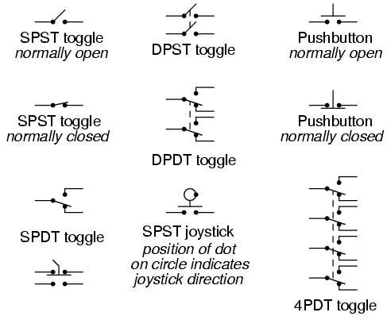

# Chapter 9: Circuit Schematic Symbols

- [[Wires and connections]{.underline}](#xtocid15791060)
- [[Power sources]{.underline}](#xtocid15791061)
- [_Resistors_](#xtocid15791062)
- [_Capacitors_](#xtocid15791063)
- [_Inductors_](#xtocid15791064)
- [[Mutual inductors]{.underline}](#xtocid15791065)
- [[Switches, hand actuated]{.underline}](#xtocid15791066)
- [[Switches, process actuated]{.underline}](#xtocid15791067)
- [[Switches, electrically actuated (relays)]{.underline}](#xtocid15791068)
- [_Connectors_](#xtocid15791069)
- [_Diodes_](#xtocid157910610)
- [[Transistors, bipolar]{.underline}](#xtocid157910611)
- [[Transistors, junction field-effect (JFET)]{.underline}](#xtocid157910612)
- [[Transistors, insulated-gate field-effect (IGFET or MOSFET)]{.underline}](#xtocid157910613)
- [[Transistors, hybrid]{.underline}](#xtocid157910614)
- [_Thyristors_](#xtocid157910615)
- [[Integrated circuits]{.underline}](#xtocid157910616)
- [[Electron tubes]{.underline}](#xtocid157910617)

## Wires and connections { #sec:xtocid15791060 }

{ #fig:01047 width=75% }

Older electrical schematics showed connecting wires crossing, while non-connecting wires \"jumped\" over each other with little half-circle marks. Newer electrical schematics show connecting wires joining with a dot, while non-connecting wires cross with no dot. However, some people still use the older convention of connecting wires crossing with no dot, which may create confusion.

For this reason, I opt to use a hybrid convention, with connecting wires unambiguously connected by a dot, and non-connecting wires unambiguously \"jumping\" over one another with a half-circle mark. While this may be frowned upon by some, it leaves no room for interpretational error: in each case, the intent is clear and unmistakable:

{ #fig:01048 width=75% }

## Power sources { #sec:xtocid15791061 }

{ #fig:01045 width=75% }

\

## Resistors { #sec:xtocid15791062 }

{ #fig:01046 width=75% }

\

## Capacitors { #sec:xtocid15791063 }

{ #fig:01049 width=75% }

\

## Inductors { #sec:xtocid15791064 }

{ #fig:01050 width=75% }

\

## Mutual inductors { #sec:xtocid15791065 }

{ #fig:01051 width=75% }

\

## [[Switches, hand actuated]{#xtocid15791066}]{.underline}

{ #fig:01052 width=75% }

\

## [[Switches, process actuated]{#xtocid15791067}]{.underline}

{ #fig:01053 width=75% }

It is very important to keep in mind that the \"normal\" contact status of a process-actuated switch refers to its status when the process is absent and/or inactive, _not_ \"normal\" in the sense of process conditions as expected during routine operation. For instance, a _normally-closed_ low-flow detection switch installed on a coolant pipe will be maintained in the actuated state (open) when there is regular coolant flow through the pipe. If the coolant flow stops, the flow switch will go to its \"normal\" (unactuated) status of closed.

A _limit_ switch is one actuated by contact with a moving machine part. An _electronic limit_ switch senses mechanical motion, but does so using light, magnetic fields, or other non-contact means.

## [[Switches, electrically actuated (relays)]{#xtocid15791068}]{.underline}

{ #fig:01054 width=75% }

## Connectors { #sec:xtocid15791069 }

{ #fig:01055 width=75% }

\

## Diodes { #sec:xtocid157910610 }

{ #fig:01056 width=75% }

\

## [[Transistors, bipolar]{#xtocid157910611}]{.underline}

{ #fig:01057 width=75% }

\

## [[Transistors, junction field-effect (JFET)]{#xtocid157910612}]{.underline}

{ #fig:01058 width=75% }

\

## [[Transistors, insulated-gate field-effect (IGFET or MOSFET)]{#xtocid157910613}]{.underline}

{ #fig:01059 width=75% }

\

## [[Transistors, hybrid]{#xtocid157910614}]{.underline}

{ #fig:01060 width=75% }

\

## Thyristors { #sec:xtocid157910615 }

{ #fig:01061 width=75% }

\

## Integrated circuits { #sec:xtocid157910616 }

{ #fig:01063 width=75% }

{ #fig:01066 width=75% }

\

## Electron tubes { #sec:xtocid157910617 }

{ #fig:01062 width=75% }

\
\
