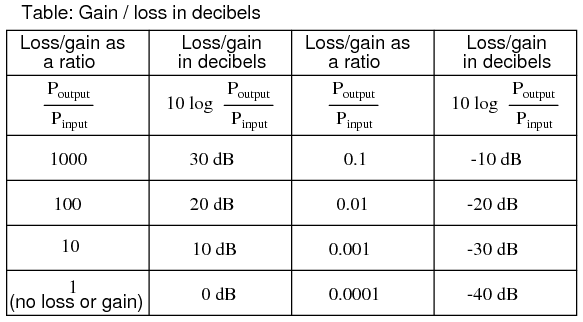
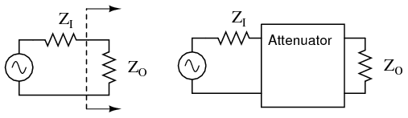
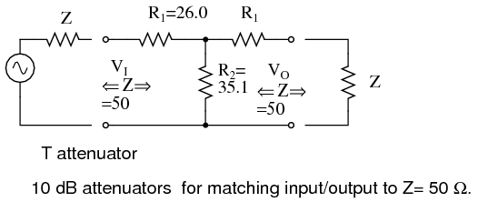
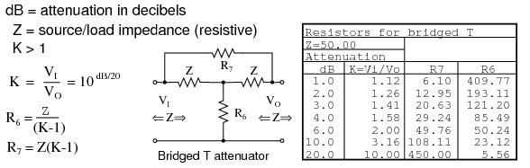
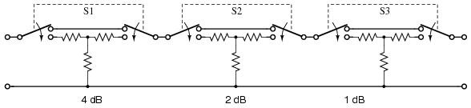

# Chapter 1: Amplifiers and Active Devices

## From Electric to Electronic{ #sec:xtocid15698970 }

This third volume of the book series _Lessons In Electric Circuits_ makes a departure from the former two in that the transition between _electric_ circuits and _electronic_ circuits is formally crossed. Electric circuits are connections of conductive wires and other devices whereby the uniform flow of electrons occurs. Electronic circuits add a new dimension to electric circuits in that some means of _control_ is exerted over the flow of electrons by another electrical signal, either a voltage or a current.

In and of itself, the control of electron flow is nothing new to the student of electric circuits. Switches control the flow of electrons, as do potentiometers, especially when connected as variable resistors (rheostats). Neither the switch nor the potentiometer should be new to your experience by this point in your study. The threshold marking the transition from electric to electronic, then, is defined by _how_ the flow of electrons is controlled rather than whether or not any form of control exists in a circuit. Switches and rheostats control the flow of electrons according to the positioning of a mechanical device, which is actuated by some physical force external to the circuit. In electronics, however, we are dealing with special devices able to control the flow of electrons according to another flow of electrons, or by the application of a static voltage. In other words, in an electronic circuit, _electricity is able to control electricity_.

The historic precursor to the modern electronics era was invented by Thomas Edison in 1880 while developing the electric incandescent lamp. Edison found that a small current passed from the heated lamp filament to a metal plate mounted inside the vacuum envelop. (@fig:03375 (a)) Today this is known as the "Edison effect". Note that the battery is only necessary to heat the filament. Electrons would still flow if a non-electrical heat source was used.

{ #fig:03375 width=75% }

By 1904 Marconi Wireless Company adviser John Flemming found that an externally applied current (plate battery) only passed in one direction from filament to plate (@fig:03375 (b)), but not the reverse direction (not shown). This invention was the vacuum diode, used to convert alternating currents to DC. The addition of a third electrode by Lee DeForest (@fig:03375 (c)) allowed a small signal to control the larger electron flow from filament to plate.

Historically, the era of electronics began with the invention of the _Audion tube_, a device controlling the flow of an electron stream through a vacuum by the application of a small voltage between two metal structures within the tube. A more detailed summary of so-called _electron tube_ or _vacuum tube_ technology is available in the last chapter of this volume for those who are interested.

Electronics technology experienced a revolution in 1948 with the invention of the _transistor_. This tiny device achieved approximately the same effect as the Audion tube, but in a vastly smaller amount of space and with less material. Transistors control the flow of electrons through solid _semiconductor_ substances rather than through a vacuum, and so transistor technology is often referred to as _solid-state_ electronics.

## Active versus Passive Devices{ #sec:xtocid15698971 }

An _active_ device is any type of circuit component with the ability to electrically control electron flow (electricity controlling electricity). In order for a circuit to be properly called _electronic_, it must contain at least one active device. Components incapable of controlling current by means of another electrical signal are called _passive_ devices. Resistors, capacitors, inductors, transformers, and even diodes are all considered passive devices. Active devices include, but are not limited to, vacuum tubes, transistors, silicon-controlled rectifiers (SCRs), and TRIACs. A case might be made for the saturable reactor to be defined as an active device, since it is able to control an AC current with a DC current, but I've never heard it referred to as such. The operation of each of these active devices will be explored in later chapters of this volume.

All active devices control the flow of electrons through them. Some active devices allow a voltage to control this current while other active devices allow another current to do the job. Devices utilizing a static voltage as the controlling signal are, not surprisingly, called _voltage-controlled_ devices. Devices working on the principle of one current controlling another current are known as _current-controlled_ devices. For the record, vacuum tubes are voltage-controlled devices while transistors are made as either voltage-controlled or current controlled types. The first type of transistor successfully demonstrated was a current-controlled device.

## Amplifiers{ #sec:xtocid15698972 }

The practical benefit of active devices is their _amplifying_ ability. Whether the device in question be voltage-controlled or current-controlled, the amount of power required of the controlling signal is typically far less than the amount of power available in the controlled current. In other words, an active device doesn't just allow electricity to control electricity; it allows a _small_ amount of electricity to control a _large_ amount of electricity.

Because of this disparity between _controlling_ and _controlled_ powers, active devices may be employed to govern a large amount of power (controlled) by the application of a small amount of power (controlling). This behavior is known as _amplification_.

It is a fundamental rule of physics that energy can neither be created nor destroyed. Stated formally, this rule is known as the Law of Conservation of Energy, and no exceptions to it have been discovered to date. If this Law is true --- and an overwhelming mass of experimental data suggests that it is --- then it is impossible to build a device capable of taking a small amount of energy and magically transforming it into a large amount of energy. All machines, electric and electronic circuits included, have an upper efficiency limit of 100 percent. At best, power out equals power in as in @fig:03165.

{ #fig:03165 width=75% }

Usually, machines fail even to meet this limit, losing some of their input energy in the form of heat which is radiated into surrounding space and therefore not part of the output energy stream. (@fig:03166)

{ #fig:03166 width=75% }

Many people have attempted, without success, to design and build machines that output more power than they take in. Not only would such a _perpetual motion_ machine prove that the Law of Conservation of Energy was not a Law after all, but it would usher in a technological revolution such as the world has never seen, for it could power itself in a circular loop and generate excess power for "free". (@fig:03167)

{ #fig:03167 width=75% }

Despite much effort and many unscrupulous claims of "free energy" or _over-unity_ machines, not one has ever passed the simple test of powering itself with its own energy output and generating energy to spare.

There does exist, however, a class of machines known as _amplifiers_, which are able to take in small-power signals and output signals of much greater power. The key to understanding how amplifiers can exist without violating the Law of Conservation of Energy lies in the behavior of active devices.

Because active devices have the ability to _control_ a large amount of electrical power with a small amount of electrical power, they may be arranged in circuit so as to duplicate the form of the input signal power from a larger amount of power supplied by an external power source. The result is a device that appears to magically magnify the power of a small electrical signal (usually an AC voltage waveform) into an identically-shaped waveform of larger magnitude. The Law of Conservation of Energy is not violated because the additional power is supplied by an external source, usually a DC battery or equivalent. The amplifier neither creates nor destroys energy, but merely reshapes it into the waveform desired as shown in @fig:03168.

{ #fig:03168 width=75% }

In other words, the current-controlling behavior of active devices is employed to _shape_ DC power from the external power source into the same waveform as the input signal, producing an output signal of like shape but different (greater) power magnitude. The transistor or other active device within an amplifier merely forms a larger _copy_ of the input signal waveform out of the "raw" DC power provided by a battery or other power source.

Amplifiers, like all machines, are limited in efficiency to a maximum of 100 percent. Usually, electronic amplifiers are far less efficient than that, dissipating considerable amounts of energy in the form of waste heat. Because the efficiency of an amplifier is always 100 percent or less, one can never be made to function as a "perpetual motion" device.

The requirement of an external source of power is common to all types of amplifiers, electrical and non-electrical. A common example of a non-electrical amplification system would be power steering in an automobile, amplifying the power of the driver's arms in turning the steering wheel to move the front wheels of the car. The source of power necessary for the amplification comes from the engine. The active device controlling the driver's "input signal" is a hydraulic valve shuttling fluid power from a pump attached to the engine to a hydraulic piston assisting wheel motion. If the engine stops running, the amplification system fails to amplify the driver's arm power and the car becomes very difficult to turn.

### Amplifier gain{ #sec:xtocid15698973 }

Because amplifiers have the ability to increase the magnitude of an input signal, it is useful to be able to rate an amplifier's amplifying ability in terms of an output/input ratio. The technical term for an amplifier's output/input magnitude ratio is _gain_. As a ratio of equal units (power out / power in, voltage out / voltage in, or current out / current in), gain is naturally a unitless measurement. Mathematically, gain is symbolized by the capital letter "A".

For example, if an amplifier takes in an AC voltage signal measuring 2 volts RMS and outputs an AC voltage of 30 volts RMS, it has an AC voltage gain of 30 divided by 2, or 15:

$$A_v = \frac{V_{output}}{V_{input}}$$

$$A_v = \frac{30\,\text{V}}{2\,\text{V}}$$

$$A_v = 15 $$

Correspondingly, if we know the gain of an amplifier and the magnitude of the input signal, we can calculate the magnitude of the output. For example, if an amplifier with an AC current gain of 3.5 is given an AC input signal of 28 mA RMS, the output will be 3.5 times 28 mA, or 98 mA:

$$I_{output} = (A_1)\;(I_{input})$$

$$I_{output} = (3.5)\;(28\text{mA})$$

$$I_{output} = 98\,\text{mA}$$

In the last two examples I specifically identified the gains and signal magnitudes in terms of "AC." This was intentional, and illustrates an important concept: electronic amplifiers often respond differently to AC and DC input signals, and may amplify them to different extents. Another way of saying this is that amplifiers often amplify _changes_ or _variations_ in input signal magnitude (AC) at a different ratio than _steady_ input signal magnitudes (DC). The specific reasons for this are too complex to explain at this time, but the fact of the matter is worth mentioning. If gain calculations are to be carried out, it must first be understood what type of signals and gains are being dealt with, AC or DC.

Electrical amplifier gains may be expressed in terms of voltage, current, and/or power, in both AC and DC. A summary of gain definitions is as follows. The triangle-shaped "delta" symbol (Δ) represents _change_ in mathematics, so "ΔV~output~ / ΔV~input~" means "change in output voltage divided by change in input voltage," or more simply, "AC output voltage divided by AC input voltage":

{ #fig:13027 width=60% }

If multiple amplifiers are staged, their respective gains form an overall gain equal to the product (multiplication) of the individual gains (@fig:03169). If a 1 V signal were applied to the input of the gain of 3 amplifier in @fig:03169 a 3 V signal out of the first amplifier would be further amplified by a gain of 5 at the second stage yielding 15 V at the final output.

{ #fig:03169 width=75% }

### Decibels{ #sec:xtocid15698974 }

In its simplest form, an amplifier's _gain_ is a ratio of output over input. Like all ratios, this form of gain is unitless. However, there is an actual unit intended to represent gain, and it is called the _bel_.

As a unit, the bel was actually devised as a convenient way to represent power _loss_ in telephone system wiring rather than _gain_ in amplifiers. The unit's name is derived from Alexander Graham Bell, the famous Scottish inventor whose work was instrumental in developing telephone systems. Originally, the bel represented the amount of signal power loss due to resistance over a standard length of electrical cable. Now, it is defined in terms of the common (base 10) logarithm of a power ratio (output power divided by input power):

$$A_{P(\text{ratio})} = \frac{P_{output}}{P_{input}}$$

$$A_{P(\text{bel})} = \log \frac{P_{output}}{P_{input}}$$

Because the bel is a logarithmic unit, it is nonlinear. To give you an idea of how this works, consider the following table of figures, comparing power losses and gains in bels versus simple ratios:

{ #fig:13029 width=75% }

It was later decided that the bel was too large of a unit to be used directly, and so it became customary to apply the metric prefix _deci_ (meaning 1/10) to it, making it *deci*bels, or dB. Now, the expression "dB" is so common that many people do not realize it is a combination of "deci-" and "-bel," or that there even is such a unit as the "bel." To put this into perspective, here is another table contrasting power gain/loss ratios against decibels:

{ #fig:13030 width=75% }

As a logarithmic unit, this mode of power gain expression covers a wide range of ratios with a minimal span in figures. It is reasonable to ask, "why did anyone feel the need to invent a _logarithmic_ unit for electrical signal power loss in a telephone system?" The answer is related to the dynamics of human hearing, the perceptive intensity of which is logarithmic in nature.

Human hearing is highly nonlinear: in order to double the perceived intensity of a sound, the actual sound power must be multiplied by a factor of ten. Relating telephone signal power loss in terms of the logarithmic "bel" scale makes perfect sense in this context: a power loss of 1 bel translates to a perceived sound loss of 50 percent, or 1/2. A power gain of 1 bel translates to a doubling in the perceived intensity of the sound.

An almost perfect analogy to the bel scale is the Richter scale used to describe earthquake intensity: a 6.0 Richter earthquake is 10 times more powerful than a 5.0 Richter earthquake; a 7.0 Richter earthquake 100 times more powerful than a 5.0 Richter earthquake; a 4.0 Richter earthquake is 1/10 as powerful as a 5.0 Richter earthquake, and so on. The measurement scale for chemical pH is likewise logarithmic, a difference of 1 on the scale is equivalent to a tenfold difference in hydrogen ion concentration of a chemical solution. An advantage of using a logarithmic measurement scale is the tremendous range of expression afforded by a relatively small span of numerical values, and it is this advantage which secures the use of Richter numbers for earthquakes and pH for hydrogen ion activity.

Another reason for the adoption of the bel as a unit for gain is for simple expression of system gains and losses. Consider the last system example (@fig:03169) where two amplifiers were connected tandem to amplify a signal. The respective gain for each amplifier was expressed as a ratio, and the overall gain for the system was the product (multiplication) of those two ratios:

$$Overall gain = (3)(5) = 15$$

If these figures represented _power_ gains, we could directly apply the unit of bels to the task of representing the gain of each amplifier, and of the system altogether. (@fig:03170)

{ #fig:03170 width=80% }

Close inspection of these gain figures in the unit of "bel" yields a discovery: they're additive. Ratio gain figures are multiplicative for staged amplifiers, but gains expressed in bels _add_ rather than _multiply_ to equal the overall system gain. The first amplifier with its power gain of 0.477 B adds to the second amplifier's power gain of 0.699 B to make a system with an overall power gain of 1.176 B.

Recalculating for decibels rather than bels, we notice the same phenomenon (@fig:03171).

{ #fig:03171 width=100% }

To those already familiar with the arithmetic properties of logarithms, this is no surprise. It is an elementary rule of algebra that the antilogarithm of the sum of two numbers' logarithm values equals the product of the two original numbers. In other words, if we take two numbers and determine the logarithm of each, then add those two logarithm figures together, then determine the "antilogarithm" of that sum (elevate the base number of the logarithm --- in this case, 10 --- to the power of that sum), the result will be the same as if we had simply multiplied the two original numbers together. This algebraic rule forms the heart of a device called a _slide rule_, an analog computer which could, among other things, determine the products and quotients of numbers by addition (adding together physical lengths marked on sliding wood, metal, or plastic scales). Given a table of logarithm figures, the same mathematical trick could be used to perform otherwise complex multiplications and divisions by only having to do additions and subtractions, respectively. With the advent of high-speed, handheld, digital calculator devices, this elegant calculation technique virtually disappeared from popular use. However, it is still important to understand when working with measurement scales that are logarithmic in nature, such as the bel (decibel) and Richter scales.

When converting a power gain from units of bels or decibels to a unitless ratio, the mathematical inverse function of common logarithms is used: powers of 10, or the _antilog_.

> If

$$A_{P(\text{bel})} = \log A_{P(\text{ratio})}$$

> Then

$$A_{P(\text{ratio})} = 10^{A_{P(\text{bel})}}$$

Converting decibels into unitless ratios for power gain is much the same, only a division factor of 10 is included in the exponent term:

> If

$$A_{P(\text{dB})} = 10\, \log \left(A_{P(\text{ratio})} \right)$$

> Then

$$A_{P(\text{ratio})} = 10^{\frac{A_{P(\text{dB})}}{10}}$$

**Example:** Power into an amplifier is 1 Watt, the power out is 10 Watts. Find the power gain in dB.

$$A_{P(\text{dB})} = 10\, \log_{10}\; \frac{P_{O}}{P_{I}} = 10\, \log_{10}\; \frac{10}{1} = 10\, \log_{10}\; (10) = 10\; (1) = 10\; dB$$

**Example:** Find the power gain ratio $A_{P(\text{ratio})}$ = $\left( \frac{P_{O}}{P_{I}} \right)$ for a 20 dB Power gain.

$$A_{P(\text{dB})} = 20 = 10\ \log_{10}\  A_{P(\text{ratio})}$$

$$\frac{20}{10} = \log_{10}\, A_{P(\text{ratio})}$$

$$10^{\frac{20}{10}} = 10^{\, \log_{10}\, (A_{P(\text{ratio})})}$$

$$100 = A_{P(\text{ratio})} = \left(\frac{20}{10}\right)$$

Because the bel is fundamentally a unit of _power_ gain or loss in a system, voltage or current gains and losses don't convert to bels or dB in quite the same way. When using bels or decibels to express a gain other than power, be it voltage or current, we must perform the calculation in terms of how much power gain there would be for that amount of voltage or current gain. For a constant load impedance, a voltage or current gain of 2 equates to a power gain of 4 (2^2^); a voltage or current gain of 3 equates to a power gain of 9 (3^2^). If we multiply either voltage or current by a given factor, then the power gain incurred by that multiplication will be the square of that factor. This relates back to the forms of Joule's Law where power was calculated from either voltage or current, and resistance:

{ #fig:13031 width=45%}

Thus, when translating a voltage or current gain _ratio_ into a respective gain in terms of the bel unit, we must include this exponent in the equation(s):

{ #fig:13032 width=45% }

The same exponent requirement holds true when expressing voltage or current gains in terms of decibels:

{ #fig:13033 width=45% }

However, thanks to another interesting property of logarithms, we can simplify these equations to eliminate the exponent by including the "2" as a _multiplying factor_ for the logarithm function. In other words, instead of taking the logarithm of the _square_ of the voltage or current gain, we just multiply the voltage or current gain's logarithm figure by 2 and the final result in bels or decibels will be the same:

{ #fig:13034 width=75% }

The process of converting voltage or current gains from bels or decibels into unitless ratios is much the same as it is for power gains:

{ #fig:13044 width=75% }

Here are the equations used for converting voltage or current gains in decibels into unitless ratios:

{ #fig:13045 width=75% }

While the bel is a unit naturally scaled for power, another logarithmic unit has been invented to directly express voltage or current gains/losses, and it is based on the _natural_ logarithm rather than the _common_ logarithm as bels and decibels are. Called the _neper_, its unit symbol is "N~p~; though, lower-case "n" may be encountered.

{ #fig:13035 width=75% }

For better or for worse, neither the neper nor its attenuated cousin, the _decineper_, is popularly used as a unit in American engineering applications.

**Example:** The voltage into a 600 Ω audio line amplifier is 10 mV, the voltage across a 600 Ω load is 1 V. Find the power gain in dB.

$$A_{(\text{dB})} = 20\ \log_{10}\; \left(\frac{V_{O}}{V_{I}}\right) = 20\ \log_{10}\; \left(\frac{1}{0.01}\right) = 20\ \log_{10}\, (100) = 20\, (2) = 40\;dB$$

**Example:** Find the voltage gain ratio $A_{V(\text{ratio})} = \left( \frac{V_O}{V_I} \right)$ for a 20 dB gain amplifier having a 50 Ω input and out impedance.

$$A_{V(\text{dB})} = 20\ \log_{10}\,  A_{V(\text{ratio})}$$

$$20 = 20\ \log_{10}\,  A_{V(\text{ratio})}$$

$$\frac{20}{20} = \log_{10}\, A_{V(\text{ratio})}$$

$$10^{\frac{20}{20}} = 10^{\log_{10}\, \left( A_{V(\text{ratio})} \right)}$$

$$10 = A_{V(\text{ratio})} = \left( \frac{V_{O}}{V_{I}} \right)$$

### Review

- Gains and losses may be expressed in terms of a unitless ratio, or in the unit of bels (B) or decibels (\text{dB}). A decibel is literally a _deci_-bel: one-tenth of a bel.

- The bel is fundamentally a unit for expressing _power_ gain or loss. To convert a power ratio to either bels or decibels, use one of these equations:

  $$A_{P(\text{bel})} = \log\, A_{P(\text{ratio})}$$

  $$A_{P(\text{dB})} = 10 \log\, A_{P(\text{ratio})}$$

- When using the unit of the bel or decibel to express a _voltage_ or _current_ ratio, it must be cast in terms of an equivalent _power_ ratio. Practically, this means the use of different equations, with a multiplication factor of 2 for the logarithm value corresponding to an exponent of 2 for the voltage or current gain ratio:

  $$A_{V(\text{bel})} = 2 \log\, A_{V(\text{ratio})}$$

  $$A_{I(\text{bel})} = 2 \log\, A_{I(\text{ratio})}$$

  $$A_{V(\text{dB})} = 20 \log\, A_{V(\text{ratio})}$$

  $$A_{I(\text{dB})} = 20 \log\, A_{I(\text{ratio})}$$

- To convert a decibel gain into a unitless ratio gain, use one of these equations:

  $$A_{V(\text{ratio})} = 10^{\frac{A_{V(\text{dB})}}{20}}$$

  $$A_{I(\text{ratio})} = 10^{\frac{A_{I(\text{dB})}}{20}}$$

  $$A_{P(\text{ratio})} = 10^{\frac{A_{P(\text{dB})}}{20}}$$

- A gain (amplification) is expressed as a positive bel or decibel figure. A loss (attenuation) is expressed as a negative bel or decibel figure. Unity gain (no gain or loss; ratio = 1) is expressed as zero bels or zero decibels.

- When calculating overall gain for an amplifier system composed of multiple amplifier stages, individual gain ratios are _multiplied_ to find the overall gain ratio. Bel or decibel figures for each amplifier stage, on the other hand, are _added_ together to determine overall gain.

## Absolute dB scales{ #sec:xtocid15698975 }

It is also possible to use the decibel as a unit of absolute power, in addition to using it as an expression of power gain or loss. A common example of this is the use of decibels as a measurement of sound pressure intensity. In cases like these, the measurement is made in reference to some standardized power level defined as 0 dB. For measurements of sound pressure, 0 dB is loosely defined as the lower threshold of human hearing, objectively quantified as 1 picowatt of sound power per square meter of area.

A sound measuring 40 dB on the decibel sound scale would be 10^4^ times greater than the threshold of hearing. A 100 dB sound would be 10^10^ (ten billion) times greater than the threshold of hearing.

Because the human ear is not equally sensitive to all frequencies of sound, variations of the decibel sound-power scale have been developed to represent physiologically equivalent sound intensities at different frequencies. Some sound intensity instruments were equipped with filter networks to give disproportionate indications across the frequency scale, the intent of which to better represent the effects of sound on the human body. Three filtered scales became commonly known as the "A," "B," and "C" weighted scales. Decibel sound intensity indications measured through these respective filtering networks were given in units of dBA, dBB, and dBC. Today, the "A-weighted scale" is most commonly used for expressing the equivalent physiological impact on the human body, and is especially useful for rating dangerously loud noise sources.

Another standard-referenced system of power measurement in the unit of decibels has been established for use in telecommunications systems. This is called the _dBm_ scale (@fig:13057). The reference point, 0 dBm, is defined as 1 milliwatt of electrical power dissipated by a 600 Ω load. According to this scale, 10 dBm is equal to 10 times the reference power, or 10 milliwatts; 20 dBm is equal to 100 times the reference power, or 100 milliwatts. Some AC voltmeters come equipped with a dBm range or scale (sometimes labeled "DB") intended for use in measuring AC signal power across a 600 Ω load. 0 dBm on this scale is, of course, elevated above zero because it represents something greater than 0 (actually, it represents 0.7746 volts across a 600 Ω load, voltage being equal to the square root of power times resistance; the square root of 0.001 multiplied by 600). When viewed on the face of an analog meter movement, this dBm scale appears compressed on the left side and expanded on the right in a manner not unlike a resistance scale, owing to its logarithmic nature.

Radio frequency power measurements for low level signals encountered in radio receivers use dBm measurements referenced to a 50 Ω load. Signal generators for the evaluation of radio receivers may output an adjustable dBm rated signal. The signal level is selected by a device called an attenuator, described in the next section.

{ #fig:13057 width=75% }

An adaptation of the dBm scale for audio signal strength is used in studio recording and broadcast engineering for standardizing volume levels, and is called the _VU_ scale. VU meters are frequently seen on electronic recording instruments to indicate whether or not the recorded signal exceeds the maximum signal level limit of the device, where significant distortion will occur. This "volume indicator" scale is calibrated in according to the dBm scale, but does not directly indicate dBm for any signal other than steady sine-wave tones. The proper unit of measurement for a VU meter is _volume units_.

When relatively large signals are dealt with, and an absolute dB scale would be useful for representing signal level, specialized decibel scales are sometimes used with reference points greater than the 1 mW used in dBm. Such is the case for the _dBW_ scale, with a reference point of 0 dBW established at 1 Watt. Another absolute measure of power called the _dBk_ scale references 0 dBk at 1 kW, or 1000 Watts.

### Review

- The unit of the bel or decibel may also be used to represent an absolute measurement of power rather than just a relative gain or loss. For sound power measurements, 0 dB is defined as a standardized reference point of power equal to 1 picowatt per square meter. Another dB scale suited for sound intensity measurements is normalized to the same physiological effects as a 1000 Hz tone, and is called the _dBA_ scale. In this system, 0 dBA is defined as any frequency sound having the same physiological equivalence as a 1 picowatt-per-square-meter tone at 1000 Hz.
- An electrical dB scale with an absolute reference point has been made for use in telecommunications systems. Called the _dBm_ scale, its reference point of 0 dBm is defined as 1 milliwatt of AC signal power dissipated by a 600 Ω load.
- A _VU_ meter reads audio signal level according to the dBm for sine-wave signals. Because its response to signals other than steady sine waves is not the same as true dBm, its unit of measurement is _volume units_.
- dB scales with greater absolute reference points than the dBm scale have been invented for high-power signals. The _dBW_ scale has its reference point of 0 dBW defined as 1 Watt of power. The _dBk_ scale sets 1 kW (1000 Watts) as the zero-point reference.

## Attenuators{ #sec:xtocid15698976 }

Attenuators are passive devices. It is convenient to discuss them along with decibels. Attenuators weaken or _attenuate_ the high level output of a signal generator, for example, to provide a lower level signal for something like the antenna input of a sensitive radio receiver. (@fig:03376) The attenuator could be built into the signal generator, or be a stand-alone device. It could provide a fixed or adjustable amount of attenuation. An attenuator section can also provide isolation between a source and a troublesome load.

{ #fig:03376 width=75% }

In the case of a stand-alone attenuator, it must be placed in series between the signal source and the load by breaking open the signal path as shown in @fig:03376. In addition, it must match both the source impedance **Z~I~** and the load impedance **Z~O~**, while providing a specified amount of attenuation. In this section we will only consider the special, and most common, case where the source and load impedances are equal. Not considered in this section, unequal source and load impedances may be matched by an attenuator section. However, the formulation is more complex.

{ #fig:03377 width=75% }

Common configurations are the **T** and **Π** networks shown in @fig:03377 Multiple attenuator sections may be cascaded when even weaker signals are needed as in @fig:03385.

### Decibels{ #sec:xtocid15698977 }

Voltage ratios, as used in the design of attenuators are often expressed in terms of decibels. The voltage ratio (K below) must be derived from the attenuation in decibels. Power ratios expressed as decibels are additive. For example, a 10 dB attenuator followed by a 6 dB attenuator provides 16dB of attenuation overall

$$10\; \text{dB} + 6\; \text{dB} = 16\; \text{dB}$$

Changing sound levels are perceptible roughly proportional to the logarithm of the power ratio $\left( \frac{P_I}{P_O} \right)$

$$\text{sound level} = \log_{10}\, \left( \frac{P_I}{P_O} \right)$$

A change of 1 dB in sound level is barely perceptible to a listener, while 2 db is readily perceptible. An attenuation of 3 dB corresponds to cutting power in half, while a gain of 3 db corresponds to a doubling of the power level. A gain of -3 dB is the same as an attenuation of +3 dB, corresponding to half the original power level.

The power change in decibels in terms of power ratio is

$$\text{dB} = 10 \log_{10}\, \left( \frac{P_I}{P_O} \right)$$

Assuming that the load $R_I$ at $P_I$ is the same as the load resistor $R_O$ at $P_O$ (i.e.\ $R_I = R_O$), the decibels may be derived from the voltage ratio $\left( \frac{V_I}{V_O} \right)$ or current ratio $\left( \frac{I_I}{I_O} \right)$ as

$$P_O = V_O I_O = \frac{V_O^2}{R} = I_O^2 R$$

$$P_I = V_I I_I = \frac{V_I^2}{R} = I_I^2 R$$

$$\text{dB} = 10 \log_{10}\, \left( \frac{P_I}{P_O} \right) = 10 \log_{10}\left( \frac{V_I^2}{V_O^2} \right) = 20 \log_{10} \left( \frac{V_I}{V_O} \right)$$

$$\text{dB} = 10 \log_{10}\, \left( \frac{P_I}{P_O} \right) = 10 \log_{10}\left( \frac{I_I^2}{I_O^2} \right) = 20 \log_{10} \left( \frac{I_I}{I_O} \right)$$

The two most often used forms of the decibel equation are

$$\text{dB} = 10 \log_{10} \left( \frac{P_I}{P_O} \right)$$

> or

$$\text{dB} = 20 \log_{10} \left( \frac{V_I}{V_O} \right)$$

We will use the latter form, since we need the voltage ratio. Once again, the voltage ratio form of equation is only applicable where the two corresponding resistors are equal. That is, the source and load resistance need to be equal.

**Example:** Power into an attenuator is 10 Watts, the power out is 1 Watt. Find the attenuation in dB.

$$\text{dB} = 10 \log_{10} \left( \frac{P_I}{P_O} \right) = 10 \log_{10} \left( \frac{10}{1} \right) = 10\; (1) = 10\; \text{dB}$$

**Example:** Find the voltage attenuation ratio (K= (V~I~ / V~O~)) for a 10 dB attenuator.

$$\text{dB} = 10 = 20 \log_{10} \left( \frac{V_I}{V_O} \right)$$

$$\frac{10}{20} = \log_{10} \left( \frac{V_I}{V_O} \right)$$

$$10^{\frac{10}{20}} = 10^{\log_{10} \left( \frac{V_I}{V_O} \right)}$$

$$3.16 = \left( \frac{V_I}{V_O} \right) = A_{P(\text{ratio})}$$

**Example:** Power into an attenuator is 100 milliwatts, the power out is 1 milliwatt. Find the attenuation in dB.

$$\text{dB} = 10 \log_{10} \left( \frac{P_I}{P_O} \right) = 10 \log_{10} \left( \frac{100}{1} \right) = 10 \log_{10}\; (100) = 10\; (2) = 20\; \text{dB}$$

**Example:** Find the voltage attenuation ratio $K= \left( \frac{V_I}{V_O} \right)$ for a 20 dB attenuator.

$$\text{dB} = 20 = 20 \log_{10} \left( \frac{V_I}{V_O} \right)$$

$$10^{\frac{20}{20}} = 10^{\log_{10}\; \left( \frac{V_I}{V_O} \right)}$$

$$10 = \left( \frac{V_I}{V_O} \right) = K$$

### T-section Attenuator {#sec:xtocid15698978}

The T and Π attenuators must be connected to a **Z** source and **Z** load impedance. The **Z**-(arrows) pointing away from the attenuator in the figure below indicate this. The **Z**-(arrows) pointing toward the attenuator indicates that the impedance seen looking into the attenuator with a load Z on the opposite end is Z, Z=50 Ω for our case. This impedance is a constant (50 Ω) with respect to attenuation-- impedance does not change when attenuation is changed.

The table in @fig:03378 lists resistor values for the **T** and **Π** attenuators to match a 50 Ω source/ load, as is the usual requirement in radio frequency work.

Telephone utility and other audio work often requires matching to 600 Ω. Multiply all **R** values by the ratio (600/50) to correct for 600 Ω matching. Multiplying by 75/50 would convert table values to match a 75 Ω source and load.

{ #fig:03378 width=100% }

The amount of attenuation is customarily specified in dB (decibels). Though, we need the voltage (or current) ratio **K** to find the resistor values from equations. See the **dB/20** term in the power of **10** term for computing the voltage ratio **K** from dB, above.

The **T** (and below **Π**) configurations are most commonly used as they provide bidirectional matching. That is, the attenuator input and output may be swapped end for end and still match the source and load impedances while supplying the same attenuation.

Disconnecting the source and looking in to the right at **V~I~**, we need to see a series parallel combination of **R~1~**, **R~2~**, **R~1~**, and **Z** looking like an equivalent resistance of **Z~IN~**, the same as the source/load impedance Z: (a load of Z is connected to the output.)

$$Z_{\text{IN}} = R_1 + \left( R_2 \parallel \left( R_1 + Z \right) \right)$$

For example, substitute the 10 dB values from the 50 Ω attenuator table for **R~1~** and **R~2~** as shown in @fig:03379.

$$Z_{\text{IN}} = 25.97 + \left( 35.14 \parallel \left( 25.97 + 50 \right) \right)$$

$$Z_{\text{IN}} = 25.97 + \left( 35.14 \parallel 75.97 \right)$$

$$Z_{\text{IN}} = 25.97 + 24.03 = 50$$

This shows us that we see 50 Ω looking right into the example attenuator (@fig:03379) with a 50 Ω load.

Replacing the source generator, disconnecting load **Z** at **V~O~**, and looking in to the left, should give us the same equation as above for the impedance at **V~O~**, due to symmetry. Moreover, the three resistors must be values which supply the required attenuation from input to output. This is accomplished by the equations for **R~1~** and **R~2~** above as applied to the **T**-attenuator below.

{ #fig:03379 width=75% }

### Π-section Attenuator {#sec:xtocid15698979}

The table in @fig:03380 lists resistor values for the **Π** attenuator matching a 50 Ω source/ load at some common attenuation levels. The resistors corresponding to other attenuation levels may be calculated from the equations.

{ #fig:03380 width=75% }

The above apply to the π-attenuator below.

What resistor values would be required for both the **Π** attenuators for 10 dB of attenuation matching a 50 Ω source and load?

{ #fig:03381 width=75% }

The **10 dB** corresponds to a voltage attenuation ratio of **K=3.16** in the next to last line of the above table. Transfer the resistor values in that line to the resistors on the schematic diagram in @fig:03381.

### L-Section Attenuator {#sec:xtocid156989710}

The table in @fig:03382 lists resistor values for the **L** attenuators to match a 50 Ω source / load. The table in @fig:03383 lists resistor values for an alternate form. Note that the resistor values are not the same.

{ #fig:03382 width=100% }

The above apply to the **L** attenuator below.

{ #fig:03383 width=100% }

### Bridged T Attenuator{ #sec:xtocid156989711 }

The table in @fig:03384 lists resistor values for the bridged **T** attenuators to match a 50 Ω source and load. The bridged-T attenuator is not often used. Why not?

{ #fig:03384 width=100% }

### Cascaded Sections{ #sec:xtocid156989712 }

Attenuator sections can be cascaded as in @fig:03385 for more attenuation than may be available from a single section. For example two 10 db attenuators may be cascaded to provide 20 dB of attenuation, the dB values being additive. The voltage attenuation ratio **K** or **V~I~/V~O~** for a 10 dB attenuator section is 3.16. The voltage attenuation ratio for the two cascaded sections is the product of the two **K**s or 3.16x3.16=10 for the two cascaded sections.

{ #fig:03385 width=50% }

Variable attenuation can be provided in discrete steps by a switched attenuator. The example @fig:03386, shown in the 0 dB position, is capable of 0 through 7 dB of attenuation by additive switching of none, one or more sections.

{ #fig:03386 width=75% }

The typical multi section attenuator has more sections than the above figure shows. The addition of a 3 or 8 dB section above enables the unit to cover to 10 dB and beyond. Lower signal levels are achieved by the addition of 10 dB and 20 dB sections, or a binary multiple 16 dB section.

### RF Attenuators{ #sec:xtocid156989713 }

For radio frequency (RF) work (\<1000 Mhz), the individual sections must be mounted in shielded compartments to thwart capacitive coupling if lower signal levels are to be achieved at the highest frequencies. The individual sections of the switched attenuators in the previous section are mounted in shielded sections. Additional measures may be taken to extend the frequency range to beyond 1000 Mhz. This involves construction from special shaped lead-less resistive elements.

{ #fig:03387 width=75% }

A coaxial T-section attenuator consisting of resistive rods and a resistive disk is shown in @fig:03387. This construction is usable to a few gigahertz. The coaxial Π version would have one resistive rod between two resistive disks in the coaxial line as in @fig:03388.

{ #fig:03388 width=75% }

RF connectors, not shown, are attached to the ends of the above T and Π attenuators. The connectors allow individual attenuators to be cascaded, in addition to connecting between a source and load. For example, a 10 dB attenuator may be placed between a troublesome signal source and an expensive spectrum analyzer input. Even though we may not need the attenuation, the expensive test equipment is protected from the source by attenuating any overvoltage.

### Summary: Attenuators

- An _attenuator_ reduces an input signal to a lower level.
- The amount of attenuation is specified in _decibels_ (\text{dB}). Decibel values are additive for cascaded attenuator sections.
- dB from power ratio

  $$\text{dB} = 10 \log_{10}\; \left( \frac{P_I}{P_O} \right)$$

- dB from voltage ratio

  $$\text{dB} = 20 \log_{10}\; \left( \frac{V_I}{V_O} \right)$$

- _T_ and _Π_ section attenuators are the most common circuit configurations.

## Contributors{ #sec:xtocid156989714 }

Contributors to this chapter are listed in chronological order of their contributions, from most recent to first. See Appendix 2 (Contributor List) for dates and contact information.

**Colin Barnard** (November 2003): Correction regarding Alexander Graham Bell's country of origin (Scotland, not the United States).
