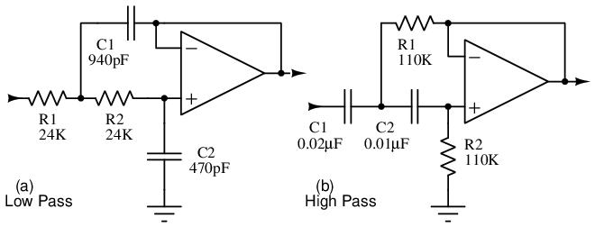

  

---

# Lessons In Electric Circuits \-- Volume III

# Chapter 10

# ACTIVE FILTERS

- [[Two pole active filters]](#xtocid15706430)

**\*\*\* PENDING \*\*\***

## Two pole active filters{ #sec:xtocid15706430 }

@fig:03515

{ #fig:03515 width=75% }

_(a) 10Khz Low-pass filter. (b) 100Hz cutoff high-pass filter_

Test

{ #fig:13105 width=75% }

\

---

_Lessons In Electric Circuits_ copyright (C) 2000-2023 Tony R. Kuphaldt, under the terms and conditions of the [CC BY License](SEMI_A3.html).

  
