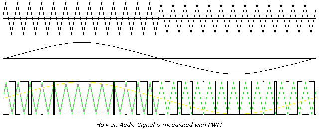
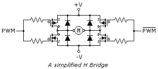

  

---

# Lessons In Electric Circuits --- Volume III

# Chapter 11

# DC MOTOR DRIVES

- [[Pulse Width Modulation]](#xtocid15706520)
- [[Contributors]](#xtocid15706521)

**\*\*\* INCOMPLETE \*\*\***

## Pulse Width Modulation{ #sec:xtocid15706520 }

Pulse Width Modulation (PWM) uses digital signals to control power applications, as well as being fairly easy to convert back to analog with a minimum of hardware.

Analog systems, such as linear power supplies, tend to generate a lot of heat since they are basically variable resistors carrying a lot of current. Digital systems don't generally generate as much heat. Almost all the heat generated by a switching device is during the transition (which is done quickly), while the device is neither on nor off, but in between. This is because power follows the following formula:

P = E I, or Watts = Voltage X Current

If either voltage or current is near zero then power will be near zero. PWM takes full advantage of this fact.

PWM can have many of the characteristics of an analog control system, in that the digital signal can be free wheeling. PWM does not have to capture data, although there are exceptions to this with higher end controllers.

One of the parameters of any square wave is duty cycle. Most square waves are 50%, this is the norm when discussing them, but they don't have to be symmetrical. The ON time can be varied completely between signal being off to being fully on, 0% to 100%, and all ranges between.

Shown below are examples of a 10%, 50%, and 90% duty cycle. While the frequency is the same for each, this is not a requirement.

{ #fig:43003 width=75% }

The reason PWM is popular is simple. Many loads, such as resistors, integrate the power into a number matching the percentage. Conversion into its analog equivalent value is straightforward. LEDs are very nonlinear in their response to current, give an LED half its rated current you you still get more than half the light the LED can produce. With PWM the light level produced by the LED is very linear. Motors, which will be covered later, are also very responsive to PWM.

One of several ways PWM can be produced is by using a sawtooth waveform and a comparator. As shown below the sawtooth (or triangle wave) need not be symmetrical, but linearity of the waveform is important. The frequency of the sawtooth waveform is the sampling rate for the signal.

{ #fig:43004 width=75% }

If there isn't any computation involved PWM can be fast. The limiting factor is the comparators frequency response. This may not be an issue since quite a few of the uses are fairly low speed. Some microcontrollers have PWM built in, and can record or create signals on demand.

Uses for PWM vary widely. It is the heart of Class D audio amplifiers, by increasing the voltages you increase the maximum output, and by selecting a frequency beyond human hearing (typically 44Khz) PWM can be used. The speakers do not respond to the high frequency, but duplicates the low frequency, which is the audio signal. Higher sampling rates can be used for even better fidelity, and 100Khz or much higher is not unheard of.

{ #fig:43005 width=75% }

Another popular application is motor speed control. Motors as a class require very high currents to operate. Being able to vary their speed with PWM increases the efficiency of the total system by quite a bit. PWM is more effective at controlling motor speeds at low RPM than linear methods.

PWM is often used in conjunction with an H-Bridge. This configuration is so named because it resembles the letter H, and allows the effective voltage across the load to be doubled, since the power supply can be switched across both sides of the load. In the case of inductive loads, such as motors, diodes are used to suppress inductive spikes, which may damage the transistors. The inductance in a motor also tends to reject the high frequency component of the waveform. This configuration can also be used with speakers for Class D audio amps.

While basically accurate, this schematic of an H-Bridge has one serious flaw, it is possible while transitioning between the MOSFETs that both transistors on top and bottom will be on simultaneously, and will take the full brunt of what the power supply can provide. This condition is referred to as _shoot through_, and can happen with any type of transistor used in a H-Bridge. If the power supply is powerful enough the transistors will not survive. It is handled by using drivers in front of the transistors that allow one to turn off before allowing the other to turn on.

{ #fig:43006 width=75% }

Switching Mode Power Supplies (SMPS) can also use PWM, although other methods also exist. Adding topologies that use the stored power in both inductors and capacitors after the main switching components can boost the efficiencies for these devices quite high, exceeding 90% in some cases. Below is an example of such a configuration.

{ #fig:43007 width=75% }

Efficiency in this case is measured as wattage. If you have a SMPS with 90% efficiency, and it converts 12VDC to 5VDC at 10 Amps, the 12V side will be pulling approximately 4.6 Amps. The 10% (5 watts) not accounted for will show up as waste heat. While being slightly noisier, this type of regulator will run much cooler than its linear counterpart.

## Contributors{ #sec:xtocid15706521 }

Contributors to this chapter are listed in chronological order of their contributions, from most recent to first. See Appendix 2 (Contributor List) for dates and contact information.

**Bill Marsden** (February 2010) Author of "Pulse Width Modulation" section.

\

---

_Lessons In Electric Circuits_ copyright (C) 2000-2023 Tony R. Kuphaldt, under the terms and conditions of the [CC BY License](SEMI_A3.html).

  
