  

---

# Lessons In Electric Circuits \-- Volume III

# Chapter 13

# ELECTRON TUBES

- [[Introduction]](#xtocid15706700)
- [[Early tube history]](#xtocid15706701)
- [[The triode]](#xtocid15706702)
- [[The tetrode]](#xtocid15706703)
- [[Beam power tubes]](#xtocid15706704)
- [[The pentode]](#xtocid15706705)
- [[Combination tubes]](#xtocid15706706)
- [[Tube parameters]](#xtocid15706707)
- [[Ionization (gas-filled) tubes]](#xtocid15706708)
- [[Display tubes]](#xtocid15706709)
- [[Microwave tubes]](#xtocid157067010)
- [[Tubes versus Semiconductors]](#xtocid157067011)

## Introduction{ #sec:xtocid15706700 }

An often neglected area of study in modern electronics is that of _tubes_, more precisely known as _vacuum tubes_ or _electron tubes_. Almost completely overshadowed by semiconductor, or \"solid-state\" components in most modern applications, tube technology once dominated electronic circuit design.

In fact, the historical transition from \"electric\" to \"electronic\" circuits really began with tubes, for it was with tubes that we entered into a whole new realm of circuit function: a way of controlling the flow of electrons (current) in a circuit by means of another electric signal (in the case of most tubes, the controlling signal is a small voltage). The semiconductor counterpart to the tube, of course, is the transistor. Transistors perform much the same function as tubes: controlling the flow of electrons in a circuit by means of another flow of electrons in the case of the bipolar transistor, and controlling the flow of electrons by means of a voltage in the case of the field-effect transistor. In either case, a relatively small electric signal controls a relatively large electric current. This is the essence of the word \"electronic,\" so as to distinguish it from \"electric,\" which has more to do with how electron flow is regulated by Ohm\'s Law and the physical attributes of wire and components.

Though tubes are now obsolete for all but a few specialized applications, they are still a worthy area of study. If nothing else, it is fascinating to explore \"the way things used to be done\" in order to better appreciate modern technology.

## Early tube history{ #sec:xtocid15706701 }

Thomas Edison, that prolific American inventor, is often credited with the invention of the incandescent lamp. More accurately, it could be said that Edison was the man who _perfected_ the incandescent lamp. Edison\'s successful design of 1879 was actually preceded by 77 years by the British scientist Sir Humphry Davy, who first demonstrated the principle of using electric current to heat a thin strip of metal (called a \"filament\") to the point of incandescence (glowing white hot).

Edison was able to achieve his success by placing his filament (made of carbonized sewing thread) inside of a clear glass bulb from which the air had been forcibly removed. In this vacuum, the filament could glow at white-hot temperatures without being consumed by combustion:

{ #fig:03001 width=75% }

In the course of his experimentation (sometime around 1883), Edison placed a strip of metal inside of an evacuated (vacuum) glass bulb along with the filament. Between this metal strip and one of the filament connections he attached a sensitive ammeter. What he found was that electrons would flow through the meter whenever the filament was hot, but ceased when the filament cooled down:

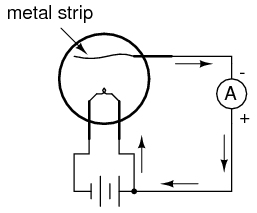{ #fig:03002 width=75% }

The white-hot filament in Edison\'s lamp was liberating free electrons into the vacuum of the lamp, those electrons finding their way to the metal strip, through the galvanometer, and back to the filament. His curiosity piqued, Edison then connected a fairly high-voltage battery in the galvanometer circuit to aid the small current:

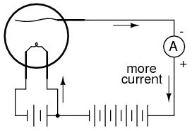{ #fig:03003 width=75% }

Sure enough, the presence of the battery created a much larger current from the filament to the metal strip. However, when the battery was turned around, there was little to no current at all!

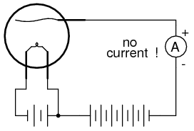{ #fig:03004 width=75% }

In effect, what Edison had stumbled upon was a diode! Unfortunately, he saw no practical use for such a device and proceeded with further refinements in his lamp design.

The one-way electron flow of this device (known as the _Edison Effect_) remained a curiosity until J. A. Fleming experimented with its use in 1895. Fleming marketed his device as a \"valve,\" initiating a whole new area of study in electric circuits. Vacuum tube diodes \-- Fleming\'s \"valves\" being no exception \-- are not able to handle large amounts of current, and so Fleming\'s invention was impractical for any application in AC power, only for small electric signals.

Then in 1906, another inventor by the name of Lee De Forest started playing around with the \"Edison Effect,\" seeing what more could be gained from the phenomenon. In doing so, he made a startling discovery: by placing a metal screen between the glowing filament and the metal strip (which by now had taken the form of a plate for greater surface area), the stream of electrons flowing from filament to plate could be regulated by the application of a small voltage between the metal screen and the filament:

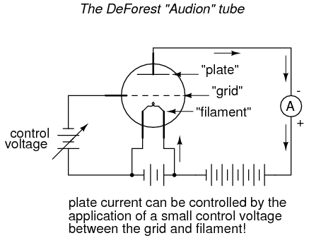{ #fig:03005 width=75% }

De Forest called this metal screen between filament and plate a _grid_. It wasn\'t just the amount of voltage between grid and filament that controlled current from filament to plate, it was the polarity as well. A negative voltage applied to the grid with respect to the filament would tend to choke off the natural flow of electrons, whereas a positive voltage would tend to enhance the flow. Although there was some amount of current through the grid, it was very small; much smaller than the current through the plate.

Perhaps most importantly was his discovery that the small amounts of grid voltage and grid current were having large effects on the amount of plate voltage (with respect to the filament) and plate current. In adding the grid to Fleming\'s \"valve,\" De Forest had made the valve adjustable: it now functioned as an _amplifying_ device, whereby a small electrical signal could take control over a larger electrical quantity.

The closest semiconductor equivalent to the Audion tube, and to all of its more modern tube equivalents, is an n-channel D-type MOSFET. It is a voltage-controlled device with a large current gain.

Calling his invention the \"Audion,\" he vigorously applied it to the development of communications technology. In 1912 he sold the rights to his Audion tube as a telephone signal amplifier to the American Telephone and Telegraph Company (AT and T), which made long-distance telephone communication practical. In the following year he demonstrated the use of an Audion tube for generating radio-frequency AC signals. In 1915 he achieved the remarkable feat of broadcasting voice signals via radio from Arlington, Virginia to Paris, and in 1916 inaugurated the first radio news broadcast. Such accomplishments earned De Forest the title \"Father of Radio\" in America.

## The triode{ #sec:xtocid15706702 }

De Forest\'s Audion tube came to be known as the _triode_ tube, because it had three elements: filament, grid, and plate (just as the \"di\" in the name _diode_ refers to two elements, filament and plate). Later developments in diode tube technology led to the refinement of the electron emitter: instead of using the filament directly as the emissive element, another metal strip called the _cathode_ could be heated by the filament.

This refinement was necessary in order to avoid some undesired effects of an incandescent filament as an electron emitter. First, a filament experiences a voltage drop along its length, as current overcomes the resistance of the filament material and dissipates heat energy. This meant that the voltage potential between different points along the length of the filament wire and other elements in the tube would not be constant. For this and similar reasons, alternating current used as a power source for heating the filament wire would tend to introduce unwanted AC \"noise\" in the rest of the tube circuit. Furthermore, the surface area of a thin filament was limited at best, and limited surface area on the electron emitting element tends to place a corresponding limit on the tube\'s current-carrying capacity.

The cathode was a thin metal cylinder fitting snugly over the twisted wire of the filament. The cathode cylinder would be heated by the filament wire enough to freely emit electrons, without the undesirable side effects of actually carrying the heating current as the filament wire had to. The tube symbol for a triode with an indirectly-heated cathode looks like this:

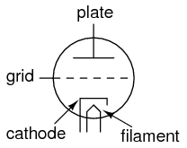{ #fig:03006 width=75% }

Since the filament is necessary for all but a few types of vacuum tubes, it is often omitted in the symbol for simplicity, or it may be included in the drawing but with no power connections drawn to it:

{ #fig:03007 width=75% }

A simple triode circuit is shown to illustrate its basic operation as an amplifier:

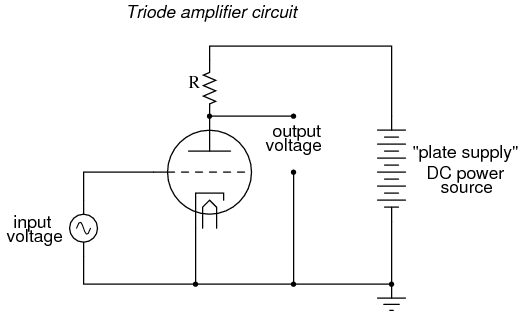{ #fig:03008 width=75% }

The low-voltage AC signal connected between the grid and cathode alternately suppresses, then enhances the electron flow between cathode and plate. This causes a change in voltage on the output of the circuit (between plate and cathode). The AC voltage and current magnitudes on the tube\'s grid are generally quite small compared with the variation of voltage and current in the plate circuit. Thus, the triode functions as an amplifier of the incoming AC signal (taking high-voltage, high-current DC power supplied from the large DC source on the right and \"throttling\" it by means of the tube\'s controlled conductivity).

In the triode, the amount of current from cathode to plate (the \"controlled\" current is a function both of grid-to-cathode voltage (the controlling signal) and the plate-to-cathode voltage (the electromotive force available to push electrons through the vacuum). Unfortunately, neither of these independent variables have a purely linear effect on the amount of current through the device (often referred to simply as the \"plate current\"). That is, triode current does not necessarily respond in a direct, proportional manner to the voltages applied.

In this particular amplifier circuit the nonlinearities are compounded, as plate voltage (with respect to cathode) changes along with the grid voltage (also with respect to cathode) as plate current is throttled by the tube. The result will be an output voltage waveform that doesn\'t precisely resemble the waveform of the input voltage. In other words, the quirkiness of the triode tube and the dynamics of this particular circuit will _distort_ the waveshape. If we really wanted to get complex about how we stated this, we could say that the tube introduces _harmonics_ by failing to exactly reproduce the input waveform.

Another problem with triode behavior is that of stray capacitance. Remember that any time we have two conductive surfaces separated by an insulating medium, a capacitor will be formed. Any voltage between those two conductive surfaces will generate an electric field within that insulating region, potentially storing energy and introducing reactance into a circuit. Such is the case with the triode, most problematically between the grid and the plate. It is as if there were tiny capacitors connected between the pairs of elements in the tube:

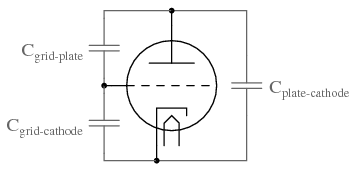{ #fig:03009 width=75% }

Now, this stray capacitance is quite small, and the reactive impedances usually high. Usually, that is, unless radio frequencies are being dealt with. As we saw with De Forest\'s Audion tube, radio was probably the prime application for this new technology, so these \"tiny\" capacitances became more than just a potential problem. Another refinement in tube technology was necessary to overcome the limitations of the triode.

## The tetrode{ #sec:xtocid15706703 }

As the name suggests, the _tetrode_ tube contained four elements: cathode (with the implicit filament, or \"heater\"), grid, plate, and a new element called the _screen_. Similar in construction to the grid, the screen was a wire mesh or coil positioned between the grid and plate, connected to a source of positive DC potential (with respect to the cathode, as usual) equal to a fraction of the plate voltage. When connected to ground through an external capacitor, the screen had the effect of electrostatically shielding the grid from the plate. Without the screen, the capacitive linking between the plate and the grid could cause significant signal feedback at high frequencies, resulting in unwanted oscillations.

The screen, being of less surface area and lower positive potential than the plate, didn\'t attract many of the electrons passing through the grid from the cathode, so the vast majority of electrons in the tube still flew by the screen to be collected by the plate:

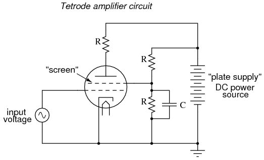{ #fig:03010 width=75% }

With a constant DC screen voltage, electron flow from cathode to plate became almost exclusively dependent upon grid voltage, meaning the plate voltage could vary over a wide range with little effect on plate current. This made for more stable gains in amplifier circuits, and better linearity for more accurate reproduction of the input signal waveform.

Despite the advantages realized by the addition of a screen, there were some disadvantages as well. The most significant disadvantage was related to something known as _secondary emission_. When electrons from the cathode strike the plate at high velocity, they can cause free electrons to be jarred loose from atoms in the metal of the plate. These electrons, knocked off the plate by the impact of the cathode electrons, are said to be \"secondarily emitted.\" In a triode tube, secondary emission is not that great a problem, but in a tetrode with a positively-charged screen grid in close proximity, these secondary electrons will be attracted to the screen rather than the plate from which they came, resulting in a loss of plate current. Less plate current means less gain for the amplifier, which is not good.

Two different strategies were developed to address this problem of the tetrode tube: _beam power_ tubes and _pentodes_. Both solutions resulted in new tube designs with approximately the same electrical characteristics.

## Beam power tubes{ #sec:xtocid15706704 }

In the beam power tube, the basic four-element structure of the tetrode was maintained, but the grid and screen wires were carefully arranged along with a pair of auxiliary plates to create an interesting effect: focused beams or \"sheets\" of electrons traveling from cathode to plate. These electron beams formed a stationary \"cloud\" of electrons between the screen and plate (called a \"space charge\") which acted to repel secondary electrons emitted from the plate back to the plate. A set of \"beam-forming\" plates, each connected to the cathode, were added to help maintain proper electron beam focus. Grid and screen wire coils were arranged in such a way that each turn or wrap of the screen fell directly behind a wrap of the grid, which placed the screen wires in the \"shadow\" formed by the grid. This precise alignment enabled the screen to still perform its shielding function with minimal interference to the passage of electrons from cathode to plate.

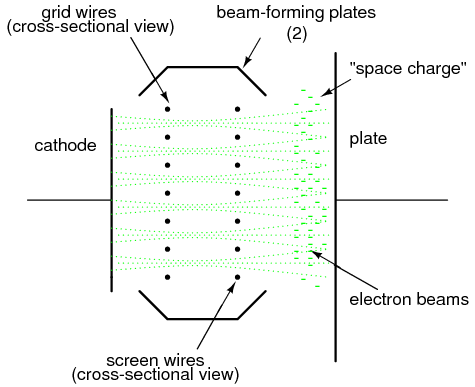{ #fig:03011 width=75% }

This resulted in lower screen current (and more plate current!) than an ordinary tetrode tube, with little added expense to the construction of the tube.

Beam power tetrodes were often distinguished from their non-beam counterparts by a different schematic symbol, showing the beam-forming plates:

{ #fig:03172 width=75% }

## The pentode{ #sec:xtocid15706705 }

Another strategy for addressing the problem of secondary electrons being attracted by the screen was the addition of a fifth wire element to the tube structure: a _suppressor_. These five-element tubes were naturally called _pentodes_.

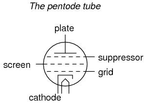{ #fig:03012 width=75% }

The suppressor was another wire coil or mesh situated between the screen and the plate, usually connected directly to ground potential. In some pentode tube designs, the suppressor was internally connected to the cathode so as to minimize the number of connection pins having to penetrate the tube envelope:

{ #fig:03013 width=75% }

The suppressor\'s job was to repel any secondarily emitted electrons back to the plate: a structural equivalent of the beam power tube\'s space charge. This, of course, increased plate current and decreased screen current, resulting in better gain and overall performance. In some instances it allowed for greater operating plate voltage as well.

## Combination tubes{ #sec:xtocid15706706 }

Similar in thought to the idea of the integrated circuit, tube designers tried integrating different tube functions into single tube envelopes to reduce space requirements in more modern tube-type electronic equipment. A common combination seen within a single glass shell was two either diodes or two triodes. The idea of fitting pairs of diodes inside a single envelope makes a lot of sense in light of power supply full-wave rectifier designs, always requiring multiple diodes.

Of course, it would have been quite impossible to combine thousands of tube elements into a single tube envelope the way that thousands of transistors can be etched onto a single piece of silicon, but engineers still did their best to push the limits of tube miniaturization and consolidation. Some of these tubes, whimsically called _compactrons_, held four or more complete tube elements within a single envelope.

Sometimes the functions of two different tubes could be integrated into a single, combination tube in a way that simply worked more elegantly than two tubes ever could. An example of this was the _pentagrid converter_, more generally called a _heptode_, used in some superheterodyne radio designs. These tubes contained seven elements: 5 grids plus a cathode and a plate. Two of the grids were normally reserved for signal input, the other three relegated to screening and suppression (performance-enhancing) functions. Combining the superheterodyne functions of oscillator and signal mixer together in one tube, the signal coupling between these two stages was intrinsic. Rather than having separate oscillator and mixer circuits, the oscillator creating an AC voltage and the mixer \"mixing\" that voltage with another signal, the pentagrid converter\'s oscillator section created an electron stream that oscillated in intensity which then directly passed through another grid for \"mixing\" with another signal.

This same tube was sometimes used in a different way: by applying a DC voltage to one of the control grids, the gain of the tube could be changed for a signal impressed on the other control grid. This was known as _variable-mu_ operation, because the \"mu\" (µ) of the tube (its amplification factor, measured as a ratio of plate-to-cathode voltage change over grid-to-cathode voltage change with a constant plate current) could be altered at will by a DC control voltage signal.

Enterprising electronics engineers also discovered ways to exploit such multi-variable capabilities of \"lesser\" tubes such as tetrodes and pentodes. One such way was the so-called _ultralinear_ audio power amplifier, invented by a pair of engineers named Hafler and Keroes, utilizing a tetrode tube in combination with a \"tapped\" output transformer to provide substantial improvements in amplifier linearity (decreases in distortion levels). Consider a \"single-ended\" triode tube amplifier with an output transformer coupling power to the speaker:

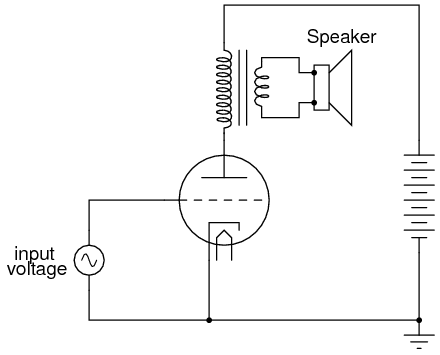{ #fig:03325 width=75% }

If we substitute a tetrode for a triode in this circuit, we will see improvements in circuit gain resulting from the electrostatic shielding offered by the screen, preventing unwanted feedback between the plate and control grid:

{ #fig:03326 width=75% }

However, the tetrode\'s screen may be used for functions other than merely shielding the grid from the plate. It can also be used as another control element, like the grid itself. If a \"tap\" is made on the transformer\'s primary winding, and this tap connected to the screen, the screen will receive a voltage that varies with the signal being amplified (feedback). More specifically, the feedback signal is proportional to the rate-of-change of magnetic flux in the transformer core (dΦ/dt), thus improving the amplifier\'s ability to reproduce the input signal waveform at the speaker terminals and not just in the primary winding of the transformer:

{ #fig:03327 width=75% }

This signal feedback results in significant improvements in amplifier linearity (and consequently, distortion), so long as precautions are taken against \"overpowering\" the screen with too great a positive voltage with respect to the cathode. As a concept, the ultralinear (screen-feedback) design demonstrates the flexibility of operation granted by multiple grid-elements inside a single tube: a capability rarely matched by semiconductor components.

Some tube designs combined multiple tube functions in a most economic way: dual plates with a single cathode, the currents for each of the plates controlled by separate sets of control grids. Common examples of these tubes were _triode-heptode_ and _triode-hexode_ tubes (a hexode tube is a tube with four grids, one cathode, and one plate).

Other tube designs simply incorporated separate tube structures inside a single glass envelope for greater economy. Dual diode (rectifier) tubes were quite common, as were dual triode tubes, especially when the power dissipation of each tube was relatively low.

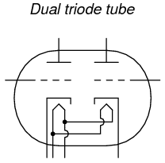{ #fig:03328 width=75% }

The 12AX7 and 12AU7 models are common examples of dual-triode tubes, both of low-power rating. The 12AX7 is especially common as a preamplifier tube in electric guitar amplifier circuits.

## Tube parameters{ #sec:xtocid15706707 }

For bipolar junction transistors, the fundamental measure of amplification is the Beta ratio (β), defined as the ratio of collector current to base current (I~C~/I~B~). Other transistor characteristics such as junction resistance, which in some amplifier circuits may impact performance as much as β, are quantified for the benefit of circuit analysis. Electron tubes are no different, their performance characteristics having been explored and quantified long ago by electrical engineers.

Before we can speak meaningfully on these characteristics, we must define several mathematical variables used for expressing common voltage, current, and resistance measurements as well as some of the more complex quantities:

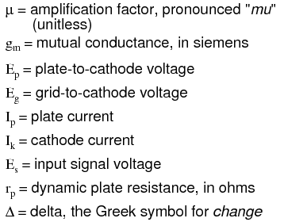{ #fig:13038 width=75% }

The two most basic measures of an amplifying tube\'s characteristics are its amplification factor (µ) and its mutual conductance (g~m~), also known as _transconductance_. Transconductance is defined here just the same as it is for field-effect transistors, another category of voltage-controlled devices. Here are the two equations defining each of these performance characteristics:

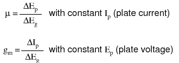{ #fig:13039 width=75% }

Another important, though more abstract, measure of tube performance is its _plate resistance_. This is the measurement of plate voltage change over plate current change for a constant value of grid voltage. In other words, this is an expression of how much the tube acts like a resistor for any given amount of grid voltage, analogous to the operation of a JFET in its ohmic mode:

{ #fig:13040 width=75% }

The astute reader will notice that plate resistance may be determined by dividing the amplification factor by the transconductance:

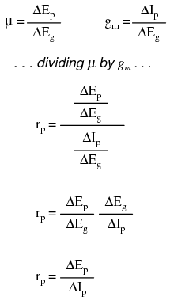{ #fig:13041 width=75% }

These three performance measures of tubes are subject to change from tube to tube (just as β ratios between two \"identical\" bipolar transistors are never precisely the same) and between different operating conditions. This variability is due partly to the unavoidable nonlinearities of electron tubes and partly due to how they are defined. Even supposing the existence of a perfectly linear tube, it will be impossible for all three of these measures to be constant over the allowable ranges of operation. Consider a tube that _perfectly_ regulates current at any given amount of grid voltage (like a bipolar transistor with an absolutely constant β): that tube\'s plate resistance _must_ vary with plate voltage, because plate current will not change even though plate voltage does.

Nevertheless, tubes were (and are) rated by these values at given operating conditions, and may have their characteristic curves published just like transistors.

## [[Ionization (gas-filled) tubes]{#xtocid15706708}]

So far, we\'ve explored tubes which are totally \"evacuated\" of all gas and vapor inside their glass envelopes, properly known as _vacuum tubes_. With the addition of certain gases or vapors, however, tubes take on significantly different characteristics, and are able to fulfill certain special roles in electronic circuits.

When a high enough voltage is applied across a distance occupied by a gas or vapor, or when that gas or vapor is heated sufficiently, the electrons of those gas molecules will be stripped away from their respective nuclei, creating a condition of _ionization_. Having freed the electrons from their electrostatic bonds to the atoms\' nuclei, they are free to migrate in the form of a current, making the ionized gas a relatively good conductor of electricity. In this state, the gas is more properly referred to as a _plasma_.

Ionized gas is not a perfect conductor. As such, the flow of electrons through ionized gas will tend to dissipate energy in the form of heat, thereby helping to keep the gas in a state of ionization. The result of this is a tube that will begin to conduct under certain conditions, then tend to stay in a state of conduction until the applied voltage across the gas and/or the heat-generating current drops to a minimum level.

The astute observer will note that this is precisely the kind of behavior exhibited by a class of semiconductor devices called \"thyristors,\" which tend to stay \"on\" once turned \"on\" and tend to stay \"off\" once turned \"off.\" Gas-filled tubes, it can be said, manifest this same property of _hysteresis_.

Unlike their vacuum counterparts, ionization tubes were often manufactured with no filament (heater) at all. These were called _cold-cathode_ tubes, with the heated versions designated as _hot-cathode_ tubes. Whether or not the tube contained a source of heat obviously impacted the characteristics of a gas-filled tube, but not to the extent that lack of heat would impact the performance of a hard-vacuum tube.

The simplest type of ionization device is not necessarily a tube at all; rather, it is constructed of two electrodes separated by a gas-filled gap. Simply called a _spark gap_, the gap between the electrodes may be occupied by ambient air, other times a special gas, in which case the device must have a sealed envelope of some kind.

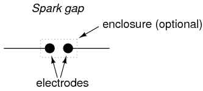{ #fig:03014 width=75% }

A prime application for spark gaps is in overvoltage protection. Engineered not to ionize, or \"break down\" (begin conducting), with normal system voltage applied across the electrodes, the spark gap\'s function is to conduct in the event of a significant increase in voltage. Once conducting, it will act as a heavy load, holding the system voltage down through its large current draw and subsequent voltage drop along conductors and other series impedances. In a properly engineered system, the spark gap will stop conducting (\"extinguish\") when the system voltage decreases to a normal level, well below the voltage required to initiate conduction.

One major caveat of spark gaps is their significantly finite life. The discharge generated by such a device can be quite violent, and as such will tend to deteriorate the surfaces of the electrodes through pitting and/or melting.

Spark gaps can be made to conduct on command by placing a third electrode (usually with a sharp edge or point) between the other two and applying a high voltage pulse between that electrode and one of the other electrodes. The pulse will create a small spark between the two electrodes, ionizing part of the pathway between the two large electrodes, and enabling conduction between them if the applied voltage is high enough:

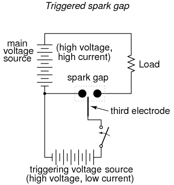{ #fig:03015 width=75% }

Spark gaps of both the triggered and untriggered variety can be built to handle huge amounts of current, some even into the range of mega-amps (millions of amps)! Physical size is the primary limiting factor to the amount of current a spark gap can safely and reliably handle.

When the two main electrodes are placed in a sealed tube filled with a special gas, a _discharge tube_ is formed. The most common type of discharge tube is the neon light, used popularly as a source of colorful illumination, the color of the light emitted being dependent on the type of gas filling the tube.

Construction of neon lamps closely resembles that of spark gaps, but the operational characteristics are quite different:

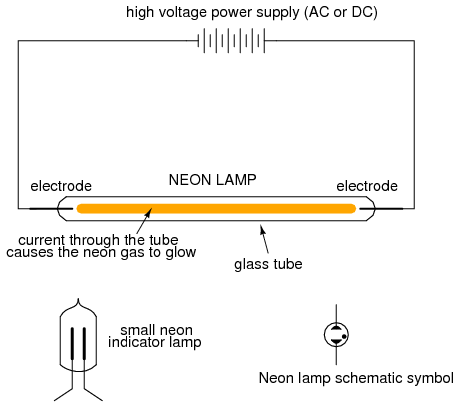{ #fig:03016 width=75% }

By controlling the spacing of the electrodes and the type of gas in the tube, neon lights can be made to conduct without drawing the excessive currents that spark gaps do. They still exhibit hysteresis in that it takes a higher voltage to initiate conduction than it does to make them \"extinguish,\" and their resistance is definitely nonlinear (the more voltage applied across the tube, the more current, thus more heat, thus lower resistance). Given this nonlinear tendency, the voltage across a neon tube must not be allowed to exceed a certain limit, lest the tube be damaged by excessive temperatures.

This nonlinear tendency gives the neon tube an application other than colorful illumination: it can act somewhat like a zener diode, \"clamping\" the voltage across it by drawing more and more current if the voltage decreases. When used in this fashion, the tube is known as a _glow tube_, or _voltage-regulator tube_, and was a popular means of voltage regulation in the days of electron tube circuit design.

{ #fig:03017 width=75% }

Please take note of the black dot found in the tube symbol shown above (and in the neon lamp symbol shown before that). That marker indicates the tube is gas-filled. It is a common marker used in all gas-filled tube symbols.

One example of a glow tube designed for voltage regulation was the VR-150, with a nominal regulating voltage of 150 volts. Its resistance throughout the allowable limits of current could vary from 5 kΩ to 30 kΩ, a 6:1 span. Like zener diode regulator circuits of today, glow tube regulators could be coupled to amplifying tubes for better voltage regulation and higher load current ranges.

If a regular triode was filled with gas instead of a hard vacuum, it would manifest all the hysteresis and nonlinearity of other gas tubes with one major advantage: the amount of voltage applied between grid and cathode would determine the minimum plate-to cathode voltage necessary to initiate conduction. In essence, this tube was the equivalent of the semiconductor SCR (Silicon-Controlled Rectifier), and was called the _thyratron_.

{ #fig:03018 width=75% }

It should be noted that the schematic shown above is greatly simplified for most purposes and thyratron tube designs. Some thyratrons, for instance, required that the grid voltage switch polarity between their \"on\" and \"off\" states in order to properly work. Also, some thyratrons had more than one grid!

Thyratrons found use in much the same way as SCR\'s find use today: controlling rectified AC to large loads such as motors. Thyratron tubes have been manufactured with different types of gas fillings for different characteristics: inert (chemically non-reactive) gas, hydrogen gas, and mercury (vaporized into a gas form when activated). Deuterium, a rare isotope of hydrogen, was used in some special applications requiring the switching of high voltages.

## Display tubes{ #sec:xtocid15706709 }

In addition to performing tasks of amplification and switching, tubes can be designed to serve as display devices.

Perhaps the best-known display tube is the _cathode ray tube_, or _CRT_. Originally invented as an instrument to study the behavior of \"cathode rays\" (electrons) in a vacuum, these tubes developed into instruments useful in detecting voltage, then later as video projection devices with the advent of television. The main difference between CRTs used in oscilloscopes and CRTs used in televisions is that the oscilloscope variety exclusively use electrostatic (plate) deflection, while televisions use electromagnetic (coil) deflection. Plates function much better than coils over a wider range of signal frequencies, which is great for oscilloscopes but irrelevant for televisions, since a television electron beam sweeps vertically and horizontally at fixed frequencies. Electromagnetic deflection coils are much preferred in television CRT construction because they do not have to penetrate the glass envelope of the tube, thus decreasing the production costs and increasing tube reliability.

An interesting \"cousin\" to the CRT is the _Cat-Eye_ or _Magic-Eye_ indicator tube. Essentially, this tube is a voltage-measuring device with a display resembling a glowing green ring. Electrons emitted by the cathode of this tube impinge on a fluorescent screen, causing the green-colored light to be emitted. The shape of the glow produced by the fluorescent screen varies as the amount of voltage applied to a grid changes:

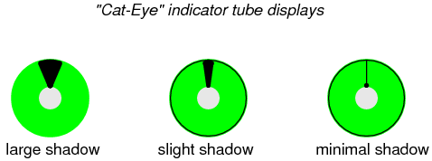{ #fig:03021 width=75% }

The width of the shadow is directly determined by the potential difference between the control electrode and the fluorescent screen. The control electrode is a narrow rod placed between the cathode and the fluorescent screen. If that control electrode (rod) is significantly more negative than the fluorescent screen, it will deflect some electrons away from the that area of the screen. The area of the screen \"shadowed\" by the control electrode will appear darker when there is a significant voltage difference between the two. When the control electrode and fluorescent screen are at equal potential (zero voltage between them), the shadowing effect will be minimal and the screen will be equally illuminated.

The schematic symbol for a \"cat-eye\" tube looks something like this:

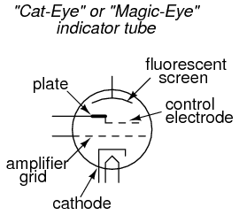{ #fig:03019 width=75% }

Here is a photograph of a cat-eye tube, showing the circular display region as well as the glass envelope, socket (black, at far end of tube), and some of its internal structure:

Normally, only the end of the tube would protrude from a hole in an instrument panel, so the user could view the circular, fluorescent screen.

In its simplest usage, a \"cat-eye\" tube could be operated without the use of the amplifier grid. However, in order to make it more sensitive, the amplifier grid _is_ used, and it is used like this:

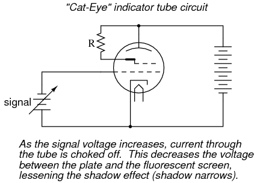{ #fig:03020 width=75% }

The cathode, amplifier grid, and plate act as a triode to create large changes in plate-to-cathode voltage for small changes in grid-to-cathode voltage. Because the control electrode is internally connected to the plate, it is electrically common to it and therefore possesses the same amount of voltage with respect to the cathode that the plate does. Thus, the large voltage changes induced on the plate due to small voltage changes on the amplifier grid end up causing large changes in the width of the shadow seen by whoever is viewing the tube.

{ #fig:03029 width=75% }

\"Cat-eye\" tubes were never accurate enough to be equipped with a graduated scale as is the case with CRT\'s and electromechanical meter movements, but they served well as null detectors in bridge circuits, and as signal strength indicators in radio tuning circuits. An unfortunate limitation to the \"cat-eye\" tube as a null detector was the fact that it was not directly capable of voltage indication in both polarities.

## Microwave tubes{ #sec:xtocid157067010 }

For extremely high-frequency applications (above 1 GHz), the interelectrode capacitances and transit-time delays of standard electron tube construction become prohibitive. However, there seems to be no end to the creative ways in which tubes may be constructed, and several high-frequency electron tube designs have been made to overcome these challenges.

It was discovered in 1939 that a toroidal cavity made of conductive material called a _cavity resonator_ surrounding an electron beam of oscillating intensity could extract power from the beam without actually intercepting the beam itself. The oscillating electric and magnetic fields associated with the beam \"echoed\" inside the cavity, in a manner similar to the sounds of traveling automobiles echoing in a roadside canyon, allowing radio-frequency energy to be transferred from the beam to a waveguide or coaxial cable connected to the resonator with a coupling loop. The tube was called an _inductive output tube_, or _IOT_:

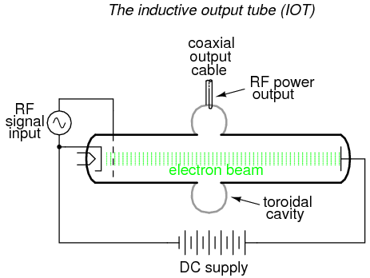{ #fig:03173 width=75% }

Two of the researchers instrumental in the initial development of the IOT, a pair of brothers named Sigurd and Russell Varian, added a second cavity resonator for signal input to the inductive output tube. This input resonator acted as a pair of inductive grids to alternately \"bunch\" and release packets of electrons down the drift space of the tube, so the electron beam would be composed of electrons traveling at different velocities. This \"velocity modulation\" of the beam translated into the same sort of amplitude variation at the output resonator, where energy was extracted from the beam. The Varian brothers called their invention a _klystron_.

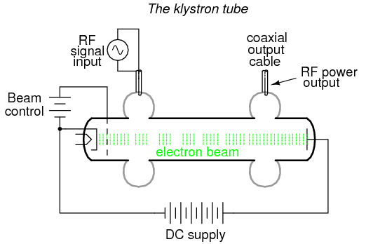{ #fig:03174 width=75% }

Another invention of the Varian brothers was the _reflex klystron_ tube. In this tube, electrons emitted from the heated cathode travel through the cavity grids toward the repeller plate, then are repelled and returned back the way they came (hence the name _reflex_) through the cavity grids. Self-sustaining oscillations would develop in this tube, the frequency of which could be changed by adjusting the repeller voltage. Hence, this tube operated as a voltage-controlled oscillator.

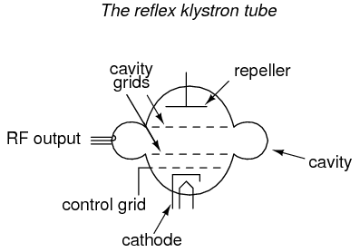{ #fig:03175 width=75% }

As a voltage-controlled oscillator, reflex klystron tubes served commonly as \"local oscillators\" for radar equipment and microwave receivers:

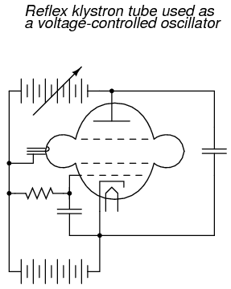{ #fig:03176 width=75% }

Initially developed as low-power devices whose output required further amplification for radio transmitter use, reflex klystron design was refined to the point where the tubes could serve as power devices in their own right. Reflex klystrons have since been superseded by semiconductor devices in the application of local oscillators, but amplification klystrons continue to find use in high-power, high-frequency radio transmitters and in scientific research applications.

One microwave tube performs its task so well and so cost-effectively that it continues to reign supreme in the competitive realm of consumer electronics: the magnetron tube. This device forms the heart of every microwave oven, generating several hundred watts of microwave RF energy used to heat food and beverages, and doing so under the most grueling conditions for a tube: powered on and off at random times and for random durations.

Magnetron tubes are representative of an entirely different kind of tube than the IOT and klystron. Whereas the latter tubes use a linear electron beam, the magnetron directs its electron beam in a circular pattern by means of a strong magnetic field:

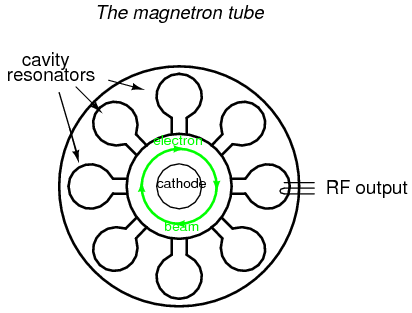{ #fig:03177 width=75% }

Once again, cavity resonators are used as microwave-frequency \"tank circuits,\" extracting energy from the passing electron beam inductively. Like all microwave-frequency devices using a cavity resonator, at least one of the resonator cavities is tapped with a _coupling loop_: a loop of wire magnetically coupling the coaxial cable to the resonant structure of the cavity, allowing RF power to be directed out of the tube to a load. In the case of the microwave oven, the output power is directed through a waveguide to the food or drink to be heated, the water molecules within acting as tiny load resistors, dissipating the electrical energy in the form of heat.

The magnet required for magnetron operation is not shown in the diagram. Magnetic flux runs perpendicular to the plane of the circular electron path. In other words, from the view of the tube shown in the diagram, you are looking straight at one of the magnetic poles.

## Tubes versus Semiconductors{ #sec:xtocid157067011 }

Devoting a whole chapter in a modern electronics text to the design and function of electron tubes may seem a bit strange, seeing as how semiconductor technology has all but obsoleted tubes in almost every application. However, there is merit in exploring tubes not just for historical purposes, but also for those niche applications that necessitate the qualifying phrase \"_almost_ every application\" in regard to semiconductor supremacy.

In some applications, electron tubes not only continue to see practical use, but perform their respective tasks better than any solid-state device yet invented. In some cases the performance and reliability of electron tube technology is _far_ superior.

In the fields of high-power, high-speed circuit switching, specialized tubes such as hydrogen thyratrons and krytrons are able to switch far larger amounts of current, far faster than any semiconductor device designed to date. The thermal and temporal limits of semiconductor physics place limitations on switching ability that tubes \-- which do not operate on the same principles \-- are exempt from.

In high-power microwave transmitter applications, the excellent thermal tolerance of tubes alone secures their dominance over semiconductors. Electron conduction through semiconducting materials is greatly impacted by temperature. Electron conduction through a vacuum is not. As a consequence, the practical thermal limits of semiconductor devices are rather low compared to that of tubes. Being able to operate tubes at far greater temperatures than equivalent semiconductor devices allows tubes to dissipate more thermal energy for a given amount of dissipation area, which makes them smaller and lighter in continuous high power applications.

Another decided advantage of tubes over semiconductor components in high-power applications is their rebuildability. When a large tube fails, it may be disassembled and repaired at far lower cost than the purchase price of a new tube. When a semiconductor component fails, large or small, there is generally no means of repair.

The following photograph shows the front panel of a 1960\'s vintage 5 kW AM radio transmitter. One of two \"Eimac\" brand power tubes can be seen in a recessed area, behind the glass door. According to the station engineer who gave the facility tour, the rebuild cost for such a tube is only \$800: quite inexpensive compared to the cost of a new tube, and still quite reasonable in contrast to the price of a new, comparable semiconductor component!

Tubes, being less complex in their manufacture than semiconductor components, are potentially cheaper to produce as well, although the huge volume of semiconductor device production in the world greatly offsets this theoretical advantage. Semiconductor manufacture is quite complex, involving many dangerous chemical substances and necessitating super-clean assembly environments. Tubes are essentially nothing more than glass and metal, with a vacuum seal. Physical tolerances are \"loose\" enough to permit hand-assembly of vacuum tubes, and the assembly work need not be done in a \"clean room\" environment as is necessary for semiconductor manufacture.

One modern area where electron tubes enjoy supremacy over semiconductor components is in the professional and high-end audio amplifier markets, although this is partially due to musical culture. Many professional guitar players, for example, prefer tube amplifiers over transistor amplifiers because of the specific distortion produced by tube circuits. An electric guitar amplifier is designed to _produce distortion_ rather than avoid distortion as is the case with audio-reproduction amplifiers (this is why an electric guitar sounds so much different than an acoustical guitar), and the type of distortion produced by an amplifier is as much a matter of personal taste as it is technical measurement. Since rock music in particular was born with guitarists playing tube-amplifier equipment, there is a significant level of \"tube appeal\" inherent to the genre itself, and this appeal shows itself in the continuing demand for \"tubed\" guitar amplifiers among rock guitarists.

As an illustration of the attitude among some guitarists, consider the following quote taken from the technical glossary page of a tube-amplifier website which will remain nameless:

> **Solid State:** _A component that has been specifically designed to make a guitar amplifier sound bad. Compared to tubes, these devices can have a very long lifespan, which guarantees that your amplifier will retain its thin, lifeless, and buzzy sound for a long time to come._

In the area of audio reproduction amplifiers (music studio amplifiers and home entertainment amplifiers), it is best for an amplifier to reproduce the musical signal with as _little_ distortion as possible. Paradoxically, in contrast to the guitar amplifier market where distortion is a design goal, high-end audio is another area where tube amplifiers enjoy continuing consumer demand. Though one might suppose the objective, technical requirement of low distortion would eliminate any subjective bias on the part of audiophiles, one would be very wrong. The market for high-end \"tubed\" amplifier equipment is quite volatile, changing rapidly with trends and fads, driven by highly subjective claims of \"magical\" sound from audio system reviewers and salespeople. As in the electric guitar world, there is no small measure of cult-like devotion to tube amplifiers among some quarters of the audiophile world. As an example of this irrationality, consider the design of many ultra-high-end amplifiers, with chassis built to display the working tubes openly, even though this physical exposure of the tubes obviously enhances the undesirable effect of _microphonics_ (changes in tube performance as a result of sound waves vibrating the tube structure).

Having said this, though, there is a wealth of technical literature contrasting tubes against semiconductors for audio power amplifier use, especially in the area of distortion analysis. More than a few competent electrical engineers prefer tube amplifier designs over transistors, and are able to produce experimental evidence in support of their choice. The primary difficulty in quantifying audio system performance is the uncertain response of human hearing. _All_ amplifiers distort their input signal to some degree, especially when overloaded, so the question is which type of amplifier design distorts the least. However, since human hearing is very nonlinear, people do not interpret all types of acoustic distortion equally, and so some amplifiers will sound \"better\" than others even if a quantitative distortion analysis with electronic instruments indicates similar distortion levels. To determine what type of audio amplifier will distort a musical signal \"the least,\" we must regard the human ear and brain as part of the whole acoustical system. Since no complete model yet exists for human auditory response, objective assessment is difficult at best. However, some research indicates that the characteristic distortion of tube amplifier circuits (especially when overloaded) is less objectionable than distortion produced by transistors.

Tubes also possess the distinct advantage of low \"drift\" over a wide range of operating conditions. Unlike semiconductor components, whose barrier voltages, β ratios, bulk resistances, and junction capacitances may change substantially with changes in device temperature and/or other operating conditions, the fundamental characteristics of a vacuum tube remain nearly constant over a wide range in operating conditions, because those characteristics are determined primarily by the physical dimensions of the tube\'s structural elements (cathode, grid(s), and plate) rather than the interactions of subatomic particles in a crystalline lattice.

This is one of the major reasons solid-state amplifier designers typically engineer their circuits to maximize power-efficiency even when it compromises distortion performance, because a power-inefficient amplifier dissipates a lot of energy in the form of waste heat, and transistor characteristics tend to change substantially with temperature. Temperature-induced \"drift\" makes it difficult to stabilize \"Q\" points and other important performance-related measures in an amplifier circuit. Unfortunately, power efficiency and low distortion seem to be mutually exclusive design goals.

For example, class A audio amplifier circuits typically exhibit very low distortion levels, but are very wasteful of power, meaning that it would be difficult to engineer a solid-state class A amplifier of any substantial power rating due to the consequent drift of transistor characteristics. Thus, most solid-state audio amplifier designers choose class B circuit configurations for greater efficiency, even though class B designs are notorious for producing a type of distortion known as _crossover distortion_. However, with tubes it is easy to design a stable class A audio amplifier circuit because tubes are not as adversely affected by the changes in temperature experienced in a such a power-inefficient circuit configuration.

Tube performance parameters, though, tend to \"drift\" more than semiconductor devices when measured over long periods of time (years). One major mechanism of tube \"aging\" appears to be vacuum leaks: when air enters the inside of a vacuum tube, its electrical characteristics become irreversibly altered. This same phenomenon is a major cause of tube mortality, or why tubes typically do not last as long as their respective solid-state counterparts. When tube vacuum is maintained at a high level, though, excellent performance and life is possible. An example of this is a klystron tube (used to produce the high-frequency radio waves used in a radar system) that lasted for 240,000 hours of operation (cited by Robert S. Symons of Litton Electron Devices Division in his informative paper, \"Tubes: Still vital after all these years,\" printed in the April 1998 issue of _IEEE Spectrum_ magazine).

If nothing else, the tension between audiophiles over tubes versus semiconductors has spurred a remarkable degree of experimentation and technical innovation, serving as an excellent resource for those wishing to educate themselves on amplifier theory. Taking a wider view, the versatility of electron tube technology (different physical configurations, multiple control grids) hints at the potential for circuit designs of far greater variety than is possible using semiconductors. For this and other reasons, electron tubes will never be \"obsolete,\" but will continue to serve in niche roles, and to foster innovation for those electronics engineers, inventors, and hobbyists who are unwilling to let their minds by stifled by convention.

\

---

_Lessons In Electric Circuits_ copyright (C) 2000-2023 Tony R. Kuphaldt, under the terms and conditions of the [CC BY License](SEMI_A3.html).

  
