  

---

# Lessons In Electric Circuits \-- Volume III

# Chapter 4

# BIPOLAR JUNCTION TRANSISTORS

- [[Introduction]](#xtocid15705890)
- [[The transistor as a switch]](#xtocid15705891)
- [[Meter check of a transistor]](#xtocid15705892)
- [[Active mode operation]](#xtocid15705893)
- [[The common-emitter amplifier]](#xtocid15705894)
- [[The common-collector amplifier]](#xtocid15705895)
- [[The common-base amplifier]](#xtocid15705896)
- [[The cascode amplifier]](#xtocid15705897)
- [[Biasing techniques]](#xtocid15705898)
- [[Biasing calculations]](#xtocid15705899)
  - [[Base Bias]](#xtocid157058910)
  - [[Collector-feedback bias]](#xtocid157058911)
  - [[Emitter-bias]](#xtocid157058912)
  - [[Voltage divider bias]](#xtocid157058913)
- [[Input and output coupling]](#xtocid157058914)
- [[Feedback]](#xtocid157058915)
- [[Amplifier impedances]](#xtocid157058916)
- [[Current mirrors]](#xtocid157058917)
- [[Transistor ratings and packages]](#xtocid157058918)
- [[BJT quirks]](#xtocid157058919)
  - [[Nonlinearity]](#xtocid157058920)
  - [[Temperature drift]](#xtocid157058921)
  - [[Thermal runaway]](#xtocid157058922)
  - [[Junction capacitance]](#xtocid157058923)
  - [[Noise]](#xtocid157058924)
  - [[Thermal mismatch (problem with paralleling transistors)]](#xtocid157058925)
  - [[High frequency effects]](#xtocid157058926)
- [Bibliography](#xtocid157058927)

## Introduction{ #sec:xtocid15705890 }

The invention of the bipolar transistor in 1948 ushered in a revolution in electronics. Technical feats previously requiring relatively large, mechanically fragile, power-hungry vacuum tubes were suddenly achievable with tiny, mechanically rugged, power-thrifty specks of crystalline silicon. This revolution made possible the design and manufacture of lightweight, inexpensive electronic devices that we now take for granted. Understanding how transistors function is of paramount importance to anyone interested in understanding modern electronics.

My intent here is to focus as exclusively as possible on the practical function and application of bipolar transistors, rather than to explore the quantum world of semiconductor theory. Discussions of holes and electrons are better left to another chapter in my opinion. Here I want to explore how to _use_ these components, not analyze their intimate internal details. I don\'t mean to downplay the importance of understanding semiconductor physics, but sometimes an intense focus on solid-state physics detracts from understanding these devices\' functions on a component level. In taking this approach, however, I assume that the reader possesses a certain minimum knowledge of semiconductors: the difference between "P" and "N" doped semiconductors, the functional characteristics of a PN (diode) junction, and the meanings of the terms "reverse biased" and "forward biased." If these concepts are unclear to you, it is best to refer to earlier chapters in this book before proceeding with this one.

A bipolar transistor consists of a three-layer "sandwich" of doped (extrinsic) semiconductor materials, either P-N-P in @fig:03071(b) or N-P-N at (d). Each layer forming the transistor has a specific name, and each layer is provided with a wire contact for connection to a circuit. The schematic symbols are shown in @fig:03071(a) and (d).

{ #fig:03071 width=75% }

_BJT transistor: (a) PNP schematic symbol, (b) physical layout (c) NPN symbol, (d) layout._

The functional difference between a PNP transistor and an NPN transistor is the proper biasing (polarity) of the junctions when operating. For any given state of operation, the current directions and voltage polarities for each kind of transistor are exactly opposite each other.

Bipolar transistors work as current-controlled current _regulators_. In other words, transistors restrict the amount of current passed according to a smaller, controlling current. The main current that is _controlled_ goes from collector to emitter, or from emitter to collector, depending on the type of transistor it is (PNP or NPN, respectively). The small current that _controls_ the main current goes from base to emitter, or from emitter to base, once again depending on the kind of transistor it is (PNP or NPN, respectively). According to the standards of semiconductor symbology, the arrow always points _against_ the direction of electron flow. (@fig:03073)

{ #fig:03073 width=75% }

_Small Base-Emitter current controls large Collector-Emitter current flowing against emitter arrow._

Bipolar transistors are called *bi*polar because the main flow of electrons through them takes place in _two_ types of semiconductor material: P and N, as the main current goes from emitter to collector (or vice versa). In other words, two types of charge carriers \-- electrons and holes \-- comprise this main current through the transistor.

[]{#Kirchhoff's Current Law}

As you can see, the _controlling_ current and the _controlled_ current always mesh together through the emitter wire, and their electrons always flow _against_ the direction of the transistor\'s arrow. This is the first and foremost rule in the use of transistors: all currents must be going in the proper directions for the device to work as a current regulator. The small, controlling current is usually referred to simply as the _base current_ because it is the only current that goes through the base wire of the transistor. Conversely, the large, controlled current is referred to as the _collector current_ because it is the only current that goes through the collector wire. The emitter current is the sum of the base and collector currents, in compliance with Kirchhoff\'s Current Law.

No current through the base of the transistor, shuts it off like an open switch and prevents current through the collector. A base current, turns the transistor on like a closed switch and allows a proportional amount of current through the collector. Collector current is primarily limited by the base current, regardless of the amount of voltage available to push it. The next section will explore in more detail the use of bipolar transistors as switching elements.

- **REVIEW:**
- Bipolar transistors are so named because the controlled current must go through _two_ types of semiconductor material: P and N. The current consists of both electron and hole flow, in different parts of the transistor.
- Bipolar transistors consist of either a P-N-P or an N-P-N semiconductor "sandwich" structure.
- The three leads of a bipolar transistor are called the _Emitter_, _Base_, and _Collector_.
- Transistors function as current regulators by allowing a small current to _control_ a larger current. The amount of current allowed between collector and emitter is primarily determined by the amount of current moving between base and emitter.
- In order for a transistor to properly function as a current regulator, the controlling (base) current and the controlled (collector) currents must be going in the proper directions: meshing additively at the emitter and going _against_ the emitter arrow symbol.

## The transistor as a switch{ #sec:xtocid15705891 }

Because a transistor\'s collector current is proportionally limited by its base current, it can be used as a sort of current-controlled switch. A relatively small flow of electrons sent through the base of the transistor has the ability to exert control over a much larger flow of electrons through the collector.

Suppose we had a lamp that we wanted to turn on and off with a switch. Such a circuit would be extremely simple as in @fig:03075(a).

For the sake of illustration, let\'s insert a transistor in place of the switch to show how it can control the flow of electrons through the lamp. Remember that the controlled current through a transistor must go between collector and emitter. Since it is the current through the lamp that we want to control, we must position the collector and emitter of our transistor where the two contacts of the switch were. We must also make sure that the lamp\'s current will move _against_ the direction of the emitter arrow symbol to ensure that the transistor\'s junction bias will be correct as in @fig:03075(b).

{ #fig:03075 width=75% }

_(a) mechanical switch, (b) NPN transistor switch, (c) PNP transistor switch._

A PNP transistor could also have been chosen for the job. Its application is shown in @fig:03075(c).

The choice between NPN and PNP is really arbitrary. All that matters is that the proper current directions are maintained for the sake of correct junction biasing (electron flow going _against_ the transistor symbol\'s arrow).

Going back to the NPN transistor in our example circuit, we are faced with the need to add something more so that we can have base current. Without a connection to the base wire of the transistor, base current will be zero, and the transistor cannot turn on, resulting in a lamp that is always off. Remember that for an NPN transistor, base current must consist of electrons flowing from emitter to base (against the emitter arrow symbol, just like the lamp current). Perhaps the simplest thing to do would be to connect a switch between the base and collector wires of the transistor as in @fig:03078 (a).

{ #fig:03078 width=75% }

_Transistor: (a) cutoff, lamp off; (b) saturated, lamp on._

If the switch is open as in @fig:03078 (a), the base wire of the transistor will be left "floating" (not connected to anything) and there will be no current through it. In this state, the transistor is said to be _cutoff_. If the switch is closed as in @fig:03078 (b), electrons will be able to flow from the emitter through to the base of the transistor, through the switch, up to the left side of the lamp, back to the positive side of the battery. This base current will enable a much larger flow of electrons from the emitter through to the collector, thus lighting up the lamp. In this state of maximum circuit current, the transistor is said to be _saturated_.

Of course, it may seem pointless to use a transistor in this capacity to control the lamp. After all, we\'re still using a switch in the circuit, aren\'t we? If we\'re still using a switch to control the lamp \-- if only indirectly \-- then what\'s the point of having a transistor to control the current? Why not just go back to our original circuit and use the switch directly to control the lamp current?

Two points can be made here, actually. First is the fact that when used in this manner, the switch contacts need only handle what little base current is necessary to turn the transistor on; the transistor itself handles most of the lamp\'s current. This may be an important advantage if the switch has a low current rating: a small switch may be used to control a relatively high-current load. More importantly, the current-controlling behavior of the transistor enables us to use something completely different to turn the lamp on or off. Consider @fig:03079, where a pair of solar cells provides 1 V to overcome the 0.7 V~BE~ of the transistor to cause base current flow, which in turn controls the lamp.

{ #fig:03079 width=75% }

_Solar cell serves as light sensor._

Or, we could use a thermocouple (many connected in series) to provide the necessary base current to turn the transistor on in @fig:03080.

{ #fig:03080 width=75% }

_A single thermocouple provides less than 40 mV. Many in series could produce in excess of the 0.7 V transistor V~BE~ to cause base current flow and consequent collector current to the lamp._

Even a microphone (@fig:03081) with enough voltage and current (from an amplifier) output could turn the transistor on, provided its output is rectified from AC to DC so that the emitter-base PN junction within the transistor will always be forward-biased:

{ #fig:03081 width=75% }

_Amplified microphone signal is rectified to DC to bias the base of the transistor providing a larger collector current._

The point should be quite apparent by now: _any_ sufficient source of DC current may be used to turn the transistor on, and that source of current only need be a fraction of the current needed to energize the lamp. Here we see the transistor functioning not only as a switch, but as a true _amplifier_: using a relatively low-power signal to _control_ a relatively large amount of power. Please note that the actual power for lighting up the lamp comes from the battery to the right of the schematic. It is not as though the small signal current from the solar cell, thermocouple, or microphone is being magically transformed into a greater amount of power. Rather, those small power sources are simply _controlling_ the battery\'s power to light up the lamp.

- **REVIEW:**
- Transistors may be used as switching elements to control DC power to a load. The switched (controlled) current goes between emitter and collector; the controlling current goes between emitter and base.
- When a transistor has zero current through it, it is said to be in a state of _cutoff_ (fully nonconducting).
- When a transistor has maximum current through it, it is said to be in a state of _saturation_ (fully conducting).

## Meter check of a transistor{ #sec:xtocid15705892 }

Bipolar transistors are constructed of a three-layer semiconductor "sandwich," either PNP or NPN. As such, transistors register as two diodes connected back-to-back when tested with a multimeter\'s "resistance" or "diode check" function as illustrated in Figure below. Low resistance readings on the base with the black negative (-) leads correspond to an N-type material in the base of a PNP transistor. On the symbol, the N-type material is \"pointed\" to by the arrow of the base-emitter junction, which is the base for this example. The P-type emitter corresponds to the other end of the arrow of the base-emitter junction, the emitter. The collector is very similar to the emitter, and is also a P-type material of the PN junction.

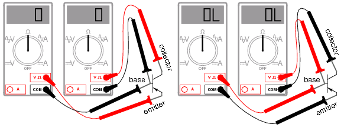{ #fig:03077 width=75% }

_PNP transistor meter check: (a) forward B-E, B-C, resistance is low; (b) reverse B-E, B-C, resistance is ∞._

Here I\'m assuming the use of a multimeter with only a single continuity range (resistance) function to check the PN junctions. Some multimeters are equipped with two separate continuity check functions: resistance and "diode check," each with its own purpose. If your meter has a designated "diode check" function, use that rather than the "resistance" range, and the meter will display the actual forward voltage of the PN junction and not just whether or not it conducts current.

Meter readings will be exactly opposite, of course, for an NPN transistor, with both PN junctions facing the other way. Low resistance readings with the red (+) lead on the base is the "opposite" condition for the NPN transistor.

If a multimeter with a "diode check" function is used in this test, it will be found that the emitter-base junction possesses a slightly greater forward voltage drop than the collector-base junction. This forward voltage difference is due to the disparity in doping concentration between the emitter and collector regions of the transistor: the emitter is a much more heavily doped piece of semiconductor material than the collector, causing its junction with the base to produce a higher forward voltage drop.

Knowing this, it becomes possible to determine which wire is which on an unmarked transistor. This is important because transistor packaging, unfortunately, is not standardized. All bipolar transistors have three wires, of course, but the positions of the three wires on the actual physical package are not arranged in any universal, standardized order.

Suppose a technician finds a bipolar transistor and proceeds to measure continuity with a multimeter set in the "diode check" mode. Measuring between pairs of wires and recording the values displayed by the meter, the technician obtains the data in @fig:03084.

[]{#03084.png <="" a=""}

+-----------------------+-----------------------+-----------------------+ | 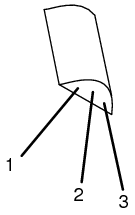{ #fig:03084 width=75% } | | - Meter touching | | | | wire 1 (+) and 2 | | | | (-): "OL" | | | | - Meter touching | | | | wire 1 (-) and 2 | | | | (+): "OL" | | | | - Meter touching | | | | wire 1 (+) and 3 | | | | (-): 0.655 V | | | | - Meter touching | | | | wire 1 (-) and 3 | | | | (+): "OL" | | | | - Meter touching | | | | wire 2 (+) and 3 | | | | (-): 0.621 V | | | | - Meter touching | | | | wire 2 (-) and 3 | | | | (+): "OL" | +-----------------------+-----------------------+-----------------------+

_Unknown bipolar transistor. Which terminals are emitter, base, and collector? Ω-meter readings between terminals._

The only combinations of test points giving conducting meter readings are wires 1 and 3 (red test lead on 1 and black test lead on 3), and wires 2 and 3 (red test lead on 2 and black test lead on 3). These two readings _must_ indicate forward biasing of the emitter-to-base junction (0.655 volts) and the collector-to-base junction (0.621 volts).

Now we look for the one wire common to both sets of conductive readings. It must be the base connection of the transistor, because the base is the only layer of the three-layer device common to both sets of PN junctions (emitter-base and collector-base). In this example, that wire is number 3, being common to both the 1-3 and the 2-3 test point combinations. In both those sets of meter readings, the _black_ (-) meter test lead was touching wire 3, which tells us that the base of this transistor is made of N-type semiconductor material (black = negative). Thus, the transistor is a PNP with base on wire 3, emitter on wire 1 and collector on wire 2 as described in @fig:03085.

[]{#03085.png <="" a=""}

+-----------------------+-----------------------+-----------------------+ | 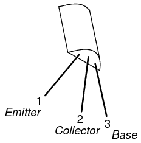{ #fig:03085 width=75% } | | - E and C high R: 1 | | | | (+) and 2 (-): | | | | "OL" | | | | - C and E high R: 1 | | | | (-) and 2 (+): | | | | "OL" | | | | - E and B forward: | | | | 1 (+) and 3 (-): | | | | 0.655 V | | | | - E and B reverse: | | | | 1 (-) and 3 (+): | | | | "OL" | | | | - C and B forward: | | | | 2 (+) and 3 (-): | | | | 0.621 V | | | | - C and B reverse: | | | | 2 (-) and 3 (+): | | | | "OL" | +-----------------------+-----------------------+-----------------------+

_BJT terminals identified by Ω-meter._

Please note that the base wire in this example is _not_ the middle lead of the transistor, as one might expect from the three-layer "sandwich" model of a bipolar transistor. This is quite often the case, and tends to confuse new students of electronics. The only way to be sure which lead is which is by a meter check, or by referencing the manufacturer\'s "data sheet" documentation on that particular part number of transistor.

Knowing that a bipolar transistor behaves as two back-to-back diodes when tested with a conductivity meter is helpful for identifying an unknown transistor purely by meter readings. It is also helpful for a quick functional check of the transistor. If the technician were to measure continuity in any more than two or any less than two of the six test lead combinations, he or she would immediately know that the transistor was defective (or else that it _wasn\'t_ a bipolar transistor but rather something else \-- a distinct possibility if no part numbers can be referenced for sure identification!). However, the "two diode" model of the transistor fails to explain how or why it acts as an amplifying device.

To better illustrate this paradox, let\'s examine one of the transistor switch circuits using the physical diagram in @fig:03086 rather than the schematic symbol to represent the transistor. This way the two PN junctions will be easier to see.

{ #fig:03086 width=75% }

_A small base current flowing in the forward biased base-emitter junction allows a large current flow through the reverse biased base-collector junction._

A grey-colored diagonal arrow shows the direction of electron flow through the emitter-base junction. This part makes sense, since the electrons are flowing from the N-type emitter to the P-type base: the junction is obviously forward-biased. However, the base-collector junction is another matter entirely. Notice how the grey-colored thick arrow is pointing in the direction of electron flow (up-wards) from base to collector. With the base made of P-type material and the collector of N-type material, this direction of electron flow is clearly backwards to the direction normally associated with a PN junction! A normal PN junction wouldn\'t permit this "backward" direction of flow, at least not without offering significant opposition. However, a saturated transistor shows very little opposition to electrons, all the way from emitter to collector, as evidenced by the lamp\'s illumination!

Clearly then, something is going on here that defies the simple "two-diode" explanatory model of the bipolar transistor. When I was first learning about transistor operation, I tried to construct my own transistor from two back-to-back diodes, as in @fig:03087.

{ #fig:03087 width=75% }

_A pair of back-to-back diodes don\'t act like a transistor!_

My circuit didn\'t work, and I was mystified. However useful the "two diode" description of a transistor might be for testing purposes, it doesn\'t explain how a transistor behaves as a controlled switch.

What happens in a transistor is this: the reverse bias of the base-collector junction prevents collector current when the transistor is in cutoff mode (that is, when there is no base current). If the base-emitter junction is forward biased by the controlling signal, the normally-blocking action of the base-collector junction is overridden and current is permitted through the collector, despite the fact that electrons are going the "wrong way" through that PN junction. This action is dependent on the quantum physics of semiconductor junctions, and can only take place when the two junctions are properly spaced and the doping concentrations of the three layers are properly proportioned. Two diodes wired in series fail to meet these criteria; the top diode can never "turn on" when it is reversed biased, no matter how much current goes through the bottom diode in the base wire loop. See [Bipolar junction transistors, Ch 2](SEMI_2.html#BJTtheory) for more details.

That doping concentrations play a crucial part in the special abilities of the transistor is further evidenced by the fact that collector and emitter are not interchangeable. If the transistor is merely viewed as two back-to-back PN junctions, or merely as a plain N-P-N or P-N-P sandwich of materials, it may seem as though either end of the transistor could serve as collector or emitter. This, however, is not true. If connected "backwards" in a circuit, a base-collector current will fail to control current between collector and emitter. Despite the fact that both the emitter and collector layers of a bipolar transistor are of the same doping _type_ (either N or P), collector and emitter are definitely not identical!

Current through the emitter-base junction allows current through the reverse-biased base-collector junction. The action of base current can be thought of as "opening a gate" for current through the collector. More specifically, any given amount of emitter-to-base current _permits a limited amount_ of base-to-collector current. For every electron that passes through the emitter-base junction and on through the base wire, a certain, number of electrons pass through the base-collector junction and no more.

In the next section, this current-limiting of the transistor will be investigated in more detail.

- **REVIEW:**
- Tested with a multimeter in the "resistance" or "diode check" modes, a transistor behaves like two back-to-back PN (diode) junctions.
- The emitter-base PN junction has a slightly greater forward voltage drop than the collector-base PN junction, because of heavier doping of the emitter semiconductor layer.
- The reverse-biased base-collector junction normally blocks any current from going through the transistor between emitter and collector. However, that junction begins to conduct if current is drawn through the base wire. Base current may be thought of as "opening a gate" for a certain, limited amount of current through the collector.

## Active mode operation{ #sec:xtocid15705893 }

When a transistor is in the fully-off state (like an open switch), it is said to be _cutoff_. Conversely, when it is fully conductive between emitter and collector (passing as much current through the collector as the collector power supply and load will allow), it is said to be _saturated_. These are the two modes of operation explored thus far in using the transistor as a switch.

However, bipolar transistors don\'t have to be restricted to these two extreme modes of operation. As we learned in the previous section, base current "opens a gate" for a limited amount of current through the collector. If this limit for the controlled current is greater than zero but less than the maximum allowed by the power supply and load circuit, the transistor will "throttle" the collector current in a mode somewhere between cutoff and saturation. This mode of operation is called the _active_ mode.

An automotive analogy for transistor operation is as follows: _cutoff_ is the condition of no motive force generated by the mechanical parts of the car to make it move. In cutoff mode, the brake is engaged (zero base current), preventing motion (collector current). _Active mode_ is the automobile cruising at a constant, controlled speed (constant, controlled collector current) as dictated by the driver. _Saturation_ the automobile driving up a steep hill that prevents it from going as fast as the driver wishes. In other words, a "saturated" automobile is one with the accelerator pedal pushed all the way down (base current calling for more collector current than can be provided by the power supply/load circuit).

Let\'s set up a circuit for SPICE simulation to demonstrate what happens when a transistor is in its active mode of operation. (@fig:03088)

[]{#03088.png <="" a=""}

+-----------------------+-----------------------+-----------------------+ | 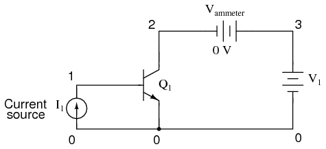{ #fig:03088 width=75% } | | bipolar t | | | | ransistor simulation | | | | i1 0 1 dc 20u | | | | q1 2 1 0 mod1 | | | | vammeter 3 2 dc 0 | | | | v1 3 0 dc | | | | .model mod1 npn | | | | .dc v1 0 2 0.05 | | | | | | | | .plot dc i(vammeter) | | | | .end | +-----------------------+-----------------------+-----------------------+

_Circuit for "active mode" SPICE simulation, and netlist._

"Q" is the standard letter designation for a transistor in a schematic diagram, just as "R" is for resistor and "C" is for capacitor. In this circuit, we have an NPN transistor powered by a battery (V~1~) and controlled by current through a _current source_ (I~1~). A current source is a device that outputs a specific amount of current, generating as much or as little voltage across its terminals to ensure that exact amount of current through it. Current sources are notoriously difficult to find in nature (unlike voltage sources, which by contrast attempt to maintain a constant voltage, outputting as much or as little current in the fulfillment of that task), but can be simulated with a small collection of electronic components. As we are about to see, transistors themselves tend to mimic the constant-current behavior of a current source in their ability to _regulate_ current at a fixed value.

In the SPICE simulation, we\'ll set the current source at a constant value of 20 µA, then vary the voltage source (V~1~) over a range of 0 to 2 volts and monitor how much current goes through it. The "dummy" battery (V~ammeter~) in @fig:03088 with its output of 0 volts serves merely to provide SPICE with a circuit element for current measurement.

\

{ #fig:23000 width=75% }

_A Sweeping collector voltage 0 to 2 V with base current constant at 20 µA yields constant 2 mA collector current in the saturation region._

\

The constant base current of 20 µA sets a collector current limit of 2 mA, exactly 100 times as much. Notice how flat the curve is in (@fig:23001) for collector current over the range of battery voltage from 0 to 2 volts. The only exception to this featureless plot is at the very beginning, where the battery increases from 0 volts to 0.25 volts. There, the collector current increases rapidly from 0 amps to its limit of 2 mA.

Let\'s see what happens if we vary the battery voltage over a wider range, this time from 0 to 50 volts. We\'ll keep the base current steady at 20 µA. (@fig:23001)

[]{#23001.png <="" a=""}

+-----------------------+-----------------------+-----------------------+ | { #fig:23001 width=75% } | | bipolar t | | | | ransistor simulation | | | | i1 0 1 dc 20u | | | | q1 2 1 0 mod1 | | | | vammeter 3 2 dc 0 | | | | v1 3 0 dc | | | | .model mod1 npn | | | | .dc v1 0 50 2 | | | | | | | | .plot dc i(vammeter) | | | | .end | +-----------------------+-----------------------+-----------------------+

_Sweeping collector voltage 0 to 50 V with base current constant at 20 µA yields constant 2 mA collector current._

Same result! The collector current in @fig:23001 holds absolutely steady at 2 mA, although the battery (v1) voltage varies all the way from 0 to 50 volts. It would appear from our simulation that collector-to-emitter voltage has little effect over collector current, except at very low levels (just above 0 volts). The transistor is acting as a current regulator, allowing exactly 2 mA through the collector and no more.

Now let\'s see what happens if we increase the controlling (I~1~) current from 20 µA to 75 µA, once again sweeping the battery (V~1~) voltage from 0 to 50 volts and graphing the collector current in @fig:23002.

[]{#23002.png <="" a=""}

+-----------------------+-----------------------+-----------------------+ | 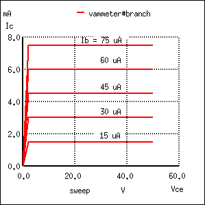{ #fig:23002 width=75% } | | bipolar t | | | | ransistor simulation | | | | i1 0 1 dc 75u | | | | q1 2 1 0 mod1 | | | | vammeter 3 2 dc 0 | | | | v1 3 0 dc | | | | .model mod1 npn | | | | .dc v1 | | | | 0 50 2 i1 15u 75u 15u | | | | | | | | .plot dc i(vammeter) | | | | .end | +-----------------------+-----------------------+-----------------------+

_Sweeping collector voltage 0 to 50 V (.dc v1 0 50 2) with base current constant at 75 µA yields constant 7.5 mA collector current. Other curves are generated by current sweep (i1 15u 75u 15u) in DC analysis statement (.dc v1 0 50 2 i1 15u 75u 15u)._

Not surprisingly, SPICE gives us a similar plot: a flat line, holding steady this time at 7.5 mA \-- exactly 100 times the base current \-- over the range of battery voltages from just above 0 volts to 50 volts. It appears that the base current is the deciding factor for collector current, the V~1~ battery voltage being irrelevant as long as it is above a certain minimum level.

This voltage/current relationship is entirely different from what we\'re used to seeing across a resistor. With a resistor, current increases linearly as the voltage across it increases. Here, with a transistor, current from emitter to collector stays limited at a fixed, maximum value no matter how high the voltage across emitter and collector increases.

Often it is useful to superimpose several collector current/voltage graphs for different base currents on the same graph as in @fig:03089. A collection of curves like this \-- one curve plotted for each distinct level of base current \-- for a particular transistor is called the transistor\'s _characteristic curves_:

{ #fig:03089 width=75% }

_Voltage collector to emitter vs collector current for various base currents._

Each curve on the graph reflects the collector current of the transistor, plotted over a range of collector-to-emitter voltages, for a given amount of base current. Since a transistor tends to act as a current regulator, limiting collector current to a proportion set by the base current, it is useful to express this proportion as a standard transistor performance measure. Specifically, the ratio of collector current to base current is known as the _Beta_ ratio (symbolized by the Greek letter β):

{ #fig:13016 width=75% }

Sometimes the β ratio is designated as "h~fe~," a label used in a branch of mathematical semiconductor analysis known as "hybrid parameters" which strives to achieve precise predictions of transistor performance with detailed equations. Hybrid parameter variables are many, but each is labeled with the general letter "h" and a specific subscript. The variable "h~fe~" is just another (standardized) way of expressing the ratio of collector current to base current, and is interchangeable with "β." The β ratio is unitless.

β for any transistor is determined by its design: it cannot be altered after manufacture. It is rare to have two transistors of the same design exactly match because of the physical variables afecting β . If a circuit design relies on equal β ratios between multiple transistors, "matched sets" of transistors may be purchased at extra cost. However, it is generally considered bad design practice to engineer circuits with such dependencies.

The β of a transistor does not remain stable for all operating conditions. For an actual transistor, the β ratio may vary by a factor of over 3 within its operating current limits. For example, a transistor with advertised β of 50 may actually test with I~c~/I~b~ ratios as low as 30 and as high as 100, depending on the amount of collector current, the transistor\'s temperature, and frequency of amplified signal, among other factors. For tutorial purposes it is adequate to assume a constant β for any given transistor; realize that real life is not that simple!

Sometimes it is helpful for comprehension to "model" complex electronic components with a collection of simpler, better-understood components. The model in @fig:03090 is used in many introductory electronics texts.

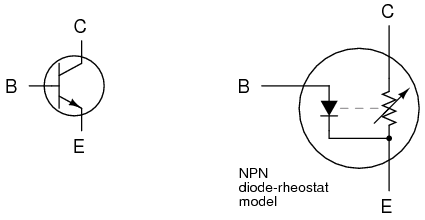{ #fig:03090 width=75% }

_Elementary diode resistor transistor model._

This model casts the transistor as a combination of diode and rheostat (variable resistor). Current through the base-emitter diode controls the resistance of the collector-emitter rheostat (as implied by the dashed line connecting the two components), thus controlling collector current. An NPN transistor is modeled in the figure shown, but a PNP transistor would be only slightly different (only the base-emitter diode would be reversed). This model succeeds in illustrating the basic concept of transistor amplification: how the base current signal can exert control over the collector current. However, I don\'t like this model because it miscommunicates the notion of a set amount of collector-emitter resistance for a given amount of base current. If this were true, the transistor wouldn\'t _regulate_ collector current at all like the characteristic curves show. Instead of the collector current curves flattening out after their brief rise as the collector-emitter voltage increases, the collector current would be directly proportional to collector-emitter voltage, rising steadily in a straight line on the graph.

A better transistor model, often seen in more advanced textbooks, is shown in @fig:03091.

{ #fig:03091 width=75% }

_Current source model of transistor._

It casts the transistor as a combination of diode and current source, the output of the current source being set at a multiple (β ratio) of the base current. This model is far more accurate in depicting the true input/output characteristics of a transistor: base current establishes a certain amount of collector _current_, rather than a certain amount of collector-emitter _resistance_ as the first model implies. Also, this model is favored when performing network analysis on transistor circuits, the current source being a well-understood theoretical component. Unfortunately, using a current source to model the transistor\'s current-controlling behavior can be misleading: in no way will the transistor ever act as a _source_ of electrical energy. The current source does not model the fact that its source of energy is a external power supply, similar to an amplifier.

- **REVIEW:**
- A transistor is said to be in its _active_ mode if it is operating somewhere between fully on (saturated) and fully off (cutoff).
- Base current regulates collector current. By _regulate_, we mean that no more collector current can exist than what is allowed by the base current.
- The ratio between collector current and base current is called "Beta" (β) or "h~fe~".
- β ratios are different for every transistor, and
- β changes for different operating conditions.

## [[The common-emitter amplifier]{#xtocid15705894}]

At the beginning of this chapter we saw how transistors could be used as switches, operating in either their "saturation" or "cutoff" modes. In the last section we saw how transistors behave within their "active" modes, between the far limits of saturation and cutoff. Because transistors are able to control current in an analog (infinitely divisible) fashion, they find use as amplifiers for analog signals.

One of the simpler transistor amplifier circuits to study previously illustrated the transistor\'s switching ability. (Figure [below](@fig:03079a))

[]{#03079a.png}

{ #fig:03079 width=75% }

_NPN transistor as a simple switch._

It is called the _common-emitter_ configuration because (ignoring the power supply battery) both the signal source and the load share the emitter lead as a common connection point shown in @fig:03102. This is not the only way in which a transistor may be used as an amplifier, as we will see in later sections of this chapter.

{ #fig:03102 width=75% }

_Common-emitter amplifier: The input and output signals both share a connection to the emitter._

Before, a small solar cell current saturated a transistor, illuminating a lamp. Knowing now that transistors are able to "throttle" their collector currents according to the amount of base current supplied by an input signal source, we should see that the brightness of the lamp in this circuit is controllable by the solar cell\'s light exposure. When there is just a little light shone on the solar cell, the lamp will glow dimly. The lamp\'s brightness will steadily increase as more light falls on the solar cell.

Suppose that we were interested in using the solar cell as a light intensity instrument. We want to measure the intensity of incident light with the solar cell by using its output current to drive a meter movement. It is possible to directly connect a meter movement to a solar cell (@fig:03093) for this purpose. In fact, the simplest light-exposure meters for photography work are designed like this.

{ #fig:03093 width=75% }

_High intensity light directly drives light meter._

Although this approach might work for moderate light intensity measurements, it would not work as well for low light intensity measurements. Because the solar cell has to supply the meter movement\'s power needs, the system is necessarily limited in its sensitivity. Supposing that our need here is to measure very low-level light intensities, we are pressed to find another solution.

Perhaps the most direct solution to this measurement problem is to use a transistor (@fig:03094) to _amplify_ the solar cell\'s current so that more meter deflection may be obtained for less incident light.

{ #fig:03094 width=75% }

_Cell current must be amplified for low intensity light._

Current through the meter movement in this circuit will be β times the solar cell current. With a transistor β of 100, this represents a substantial increase in measurement sensitivity. It is prudent to point out that the additional power to move the meter needle comes from the battery on the far right of the circuit, not the solar cell itself. All the solar cell\'s current does is _control_ battery current to the meter to provide a greater meter reading than the solar cell could provide unaided.

Because the transistor is a current-regulating device, and because meter movement indications are based on the current through the movement coil, meter indication in this circuit should depend only on the current from the solar cell, not on the amount of voltage provided by the battery. This means the accuracy of the circuit will be independent of battery condition, a significant feature! All that is required of the battery is a certain minimum voltage and current output ability to drive the meter full-scale.

Another way in which the common-emitter configuration may be used is to produce an output _voltage_ derived from the input signal, rather than a specific output _current_. Let\'s replace the meter movement with a plain resistor and measure voltage between collector and emitter in @fig:03095

{ #fig:03095 width=75% }

_Common emitter amplifier develops voltage output due to current through load resistor._

With the solar cell darkened (no current), the transistor will be in cutoff mode and behave as an open switch between collector and emitter. This will produce maximum voltage drop between collector and emitter for maximum V~output~, equal to the full voltage of the battery.

At full power (maximum light exposure), the solar cell will drive the transistor into saturation mode, making it behave like a closed switch between collector and emitter. The result will be minimum voltage drop between collector and emitter, or almost zero output voltage. In actuality, a saturated transistor can never achieve zero voltage drop between collector and emitter because of the two PN junctions through which collector current must travel. However, this "collector-emitter saturation voltage" will be fairly low, around several tenths of a volt, depending on the specific transistor used.

For light exposure levels somewhere between zero and maximum solar cell output, the transistor will be in its active mode, and the output voltage will be somewhere between zero and full battery voltage. An important quality to note here about the common-emitter configuration is that the output voltage is _inverted_ with respect to the input signal. That is, the output voltage decreases as the input signal increases. For this reason, the common-emitter amplifier configuration is referred to as an _inverting_ amplifier.

A quick SPICE simulation (@fig:23003) of the circuit in @fig:03096 will verify our qualitative conclusions about this amplifier circuit.

[]{#03096.png <="" a=""}

+-----------------------+-----------------------+-----------------------+ | { #fig:03096 width=75% } | | \*comm | | | | on-emitter amplifier | | | | i1 0 1 dc | | | | q1 2 1 0 mod1 | | | | r 3 2 5000 | | | | v1 3 0 dc 15 | | | | .model mod1 npn | | | | .dc i1 0 50u 2u | | | | .plot dc v(2,0) | | | | .end | +-----------------------+-----------------------+-----------------------+

_Common emitter schematic with node numbers and corresponding SPICE netlist._

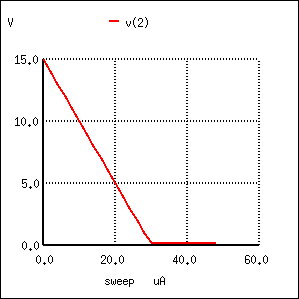{ #fig:23003 width=75% }

_Common emitter: collector voltage output vs base current input._

At the beginning of the simulation in @fig:23003 where the current source (solar cell) is outputting zero current, the transistor is in cutoff mode and the full 15 volts from the battery is shown at the amplifier output (between nodes 2 and 0). As the solar cell\'s current begins to increase, the output voltage proportionally decreases, until the transistor reaches saturation at 30 µA of base current (3 mA of collector current). Notice how the output voltage trace on the graph is perfectly linear (1 volt steps from 15 volts to 1 volt) until the point of saturation, where it never quite reaches zero. This is the effect mentioned earlier, where a saturated transistor can never achieve exactly zero voltage drop between collector and emitter due to internal junction effects. What we do see is a sharp output voltage decrease from 1 volt to 0.2261 volts as the input current increases from 28 µA to 30 µA, and then a continuing decrease in output voltage from then on (albeit in progressively smaller steps). The lowest the output voltage ever gets in this simulation is 0.1299 volts, asymptotically approaching zero.

So far, we\'ve seen the transistor used as an amplifier for DC signals. In the solar cell light meter example, we were interested in amplifying the DC output of the solar cell to drive a DC meter movement, or to produce a DC output voltage. However, this is not the only way in which a transistor may be employed as an amplifier. Often an _AC_ amplifier for amplifying _alternating_ current and voltage signals is desired. One common application of this is in audio electronics (radios, televisions, and public-address systems). Earlier, we saw an example of the audio output of a tuning fork activating a transistor switch. (Figure [below](@fig:03081a)) Let\'s see if we can modify that circuit to send power to a speaker rather than to a lamp in @fig:03097.

[]{#03081a.png}

{ #fig:03081 width=75% }

_Transistor switch activated by audio._

In the original circuit, a full-wave bridge rectifier was used to convert the microphone\'s AC output signal into a DC voltage to drive the input of the transistor. All we cared about here was turning the lamp on with a sound signal from the microphone, and this arrangement sufficed for that purpose. But now we want to actually reproduce the AC signal and drive a speaker. This means we cannot rectify the microphone\'s output anymore, because we need undistorted AC signal to drive the transistor! Let\'s remove the bridge rectifier and replace the lamp with a speaker:

{ #fig:03097 width=75% }

_Common emitter amplifier drives speaker with audio frequency signal._

Since the microphone may produce voltages exceeding the forward voltage drop of the base-emitter PN (diode) junction, I\'ve placed a resistor in series with the microphone. Let\'s simulate the circuit in @fig:03098 with SPICE. The netlist is included in (@fig:23004)

{ #fig:03098 width=75% }

_SPICE version of common emitter audio amplifier._

[]{#23004.png <="" a=""}

+-----------------------+-----------------------+-----------------------+ | 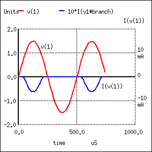{ #fig:23004 width=75% } | | comm | | | | on-emitter amplifier | | | | vinput 1 0 | | | | sin (0 1.5 2000 0 0) | | | | r1 1 2 1k | | | | q1 3 2 0 mod1 | | | | rspkr 3 4 8 | | | | v1 4 0 dc 15 | | | | .model mod1 npn | | | | .tran 0.02m 0.74m | | | | .p | | | | lot tran v(1,0) i(v1) | | | | .end | +-----------------------+-----------------------+-----------------------+

_Signal clipped at collector due to lack of DC base bias._

The simulation plots (@fig:23004) both the input voltage (an AC signal of 1.5 volt peak amplitude and 2000 Hz frequency) and the current through the 15 volt battery, which is the same as the current through the speaker. What we see here is a full AC sine wave alternating in both positive and negative directions, and a half-wave output current waveform that only pulses in one direction. If we were actually driving a speaker with this waveform, the sound produced would be horribly distorted.

What\'s wrong with the circuit? Why won\'t it faithfully reproduce the entire AC waveform from the microphone? The answer to this question is found by close inspection of the transistor diode current source model in Figure [below](@fig:03091a).

[]{#03091a.png}

{ #fig:03091 width=75% }

_The model shows that base current flow in on direction._

Collector current is controlled, or regulated, through the constant-current mechanism according to the pace set by the current through the base-emitter diode. Note that both current paths through the transistor are monodirectional: _one way only!_ Despite our intent to use the transistor to amplify an _AC_ signal, it is essentially a _DC_ device, capable of handling currents in a single direction. We may apply an AC voltage input signal between the base and emitter, but electrons cannot flow in that circuit during the part of the cycle that reverse-biases the base-emitter diode junction. Therefore, the transistor will remain in cutoff mode throughout that portion of the cycle. It will "turn on" in its active mode only when the input voltage is of the correct polarity to forward-bias the base-emitter diode, and only when that voltage is sufficiently high to overcome the diode\'s forward voltage drop. Remember that bipolar transistors are _current-controlled devices_: they regulate collector current based on the existence of base-to-emitter _current_, not base-to-emitter _voltage_.

The only way we can get the transistor to reproduce the entire waveform as current through the speaker is to keep the transistor in its active mode the entire time. This means we must maintain current through the base during the entire input waveform cycle. Consequently, the base-emitter diode junction must be kept forward-biased at all times. Fortunately, this can be accomplished with a DC _bias voltage_ added to the input signal. By connecting a sufficient DC voltage in series with the AC signal source, forward-bias can be maintained at all points throughout the wave cycle. (@fig:03099)

{ #fig:03099 width=75% }

_V~bias~ keeps transistor in the active region._

[]{#23005.png <="" a=""}

+-----------------------+-----------------------+-----------------------+ | { #fig:23005 width=75% } | | comm | | | | on-emitter amplifier | | | | vinput 1 5 | | | | sin (0 1.5 2000 0 0) | | | | vbias 5 0 dc 2.3 | | | | r1 1 2 1k | | | | q1 3 2 0 mod1 | | | | rspkr 3 4 8 | | | | v1 4 0 dc 15 | | | | .model mod1 npn | | | | .tran 0.02m 0.78m | | | | .p | | | | lot tran v(1,0) i(v1) | | | | .end | +-----------------------+-----------------------+-----------------------+

_Undistorted output current I(v(1) due to Vbias_

With the bias voltage source of 2.3 volts in place, the transistor remains in its active mode throughout the entire cycle of the wave, faithfully reproducing the waveform at the speaker. (@fig:23005) Notice that the input voltage (measured between nodes 1 and 0) fluctuates between about 0.8 volts and 3.8 volts, a peak-to-peak voltage of 3 volts just as expected (source voltage = 1.5 volts peak). The output (speaker) current varies between zero and almost 300 mA, 180^o^ out of phase with the input (microphone) signal.

The illustration in @fig:03110 is another view of the same circuit, this time with a few oscilloscopes ("scopemeters") connected at crucial points to display all the pertinent signals.

{ #fig:03110 width=75% }

_Input is biased upward at base. Output is inverted._

The need for biasing a transistor amplifier circuit to obtain full waveform reproduction is an important consideration. A separate section of this chapter will be devoted entirely to the subject biasing and biasing techniques. For now, it is enough to understand that biasing may be necessary for proper voltage and current output from the amplifier.

Now that we have a functioning amplifier circuit, we can investigate its voltage, current, and power gains. The generic transistor used in these SPICE analyses has a β of 100, as indicated by the short transistor statistics printout included in the text output in Table [below](#bjt1.tbl) (these statistics were cut from the last two analyses for brevity\'s sake).

[]{#bjt1.tbl}

_BJT SPICE model parameters._

    type        npn
    is        1.00E-16
    bf         100.000
    nf           1.000
    br           1.000
    nr           1.000

β is listed under the abbreviation "bf," which actually stands for "**b**eta, **f**orward". If we wanted to insert our own β ratio for an analysis, we could have done so on the `.model` line of the SPICE netlist.

Since β is the ratio of collector current to base current, and we have our load connected in series with the collector terminal of the transistor and our source connected in series with the base, the ratio of output current to input current is equal to beta. Thus, our current gain for this example amplifier is 100, or 40 dB.

Voltage gain is a little more complicated to figure than current gain for this circuit. As always, voltage gain is defined as the ratio of output voltage divided by input voltage. In order to experimentally determine this, we modify our last SPICE analysis to plot output voltage rather than output current so we have two voltage plots to compare in @fig:23006.

[]{#23006.png <="" a=""}

+-----------------------+-----------------------+-----------------------+ | { #fig:23006 width=75% } | | com | | | | mon-emitter amplifier | | | | vinput 1 5 | | | | sin (0 1.5 2000 0 0) | | | | vbias 5 0 dc 2.3 | | | | r1 1 2 1k | | | | q1 3 2 0 mod1 | | | | rspkr 3 4 8 | | | | v1 4 0 dc 15 | | | | .model mod1 npn | | | | .tran 0.02m 0.78m | | | | . | | | | plot tran v(1,0) v(3) | | | | .end | +-----------------------+-----------------------+-----------------------+

_V(3), the output voltage across r~spkr~, compared to the input._

Plotted on the same scale (from 0 to 4 volts), we see that the output waveform in @fig:23006 has a smaller peak-to-peak amplitude than the input waveform , in addition to being at a lower bias voltage, not elevated up from 0 volts like the input. Since voltage gain for an AC amplifier is defined by the ratio of AC amplitudes, we can ignore any DC bias separating the two waveforms. Even so, the input waveform is still larger than the output, which tells us that the voltage gain is less than 1 (a negative dB figure).

To be honest, this low voltage gain is not characteristic to _all_ common-emitter amplifiers. It is a consequence of the great disparity between the input and load resistances. Our input resistance (R~1~) here is 1000 Ω, while the load (speaker) is only 8 Ω. Because the current gain of this amplifier is determined solely by the β of the transistor, and because that β figure is fixed, the current gain for this amplifier won\'t change with variations in either of these resistances. However, voltage gain _is_ dependent on these resistances. If we alter the load resistance, making it a larger value, it will drop a proportionately greater voltage for its range of load currents, resulting in a larger output waveform. Let\'s try another simulation, only this time with a 30 Ω in @fig:23007 load instead of an 8 Ω load.

[]{#23007.png <="" a=""}

+-----------------------+-----------------------+-----------------------+ | { #fig:23007 width=75% } | | com | | | | mon-emitter amplifier | | | | vinput 1 5 | | | | sin (0 1.5 2000 0 0) | | | | vbias 5 0 dc 2.3 | | | | r1 1 2 1k | | | | q1 3 2 0 mod1 | | | | rspkr 3 4 30 | | | | v1 4 0 dc 15 | | | | .model mod1 npn | | | | .tran 0.02m 0.78m | | | | . | | | | plot tran v(1,0) v(3) | | | | .end | +-----------------------+-----------------------+-----------------------+

_Increasing r~spkr~ to 30 Ω increases the output voltage._

This time the output voltage waveform in @fig:23007 is significantly greater in amplitude than the input waveform. Looking closely, we can see that the output waveform crests between 0 and about 9 volts: approximately 3 times the amplitude of the input voltage.

We can do another computer analysis of this circuit, this time instructing SPICE to analyze it from an AC point of view, giving us peak voltage figures for input and output instead of a time-based plot of the waveforms. (Table [below](#bjt2.tbl))

[]{#bjt2.tbl}

_SPICE netlist for printing AC input and output voltages._

    common-emitter amplifier
    vinput 1 5 ac 1.5
    vbias 5 0 dc 2.3
    r1 1 2 1k
    q1 3 2 0 mod1
    rspkr 3 4 30
    v1 4 0 dc 15
    .model mod1 npn
    .ac lin 1 2000 2000
    .print ac v(1,0) v(4,3)
    .end

    freq          v(1)        v(4,3)
    2.000E+03     1.500E+00   4.418E+00

Peak voltage measurements of input and output show an input of 1.5 volts and an output of 4.418 volts. This gives us a voltage gain ratio of 2.9453 (4.418 V / 1.5 V), or 9.3827 dB.

{ #fig:13018 width=75% }

Because the current gain of the common-emitter amplifier is fixed by β, and since the input and output voltages will be equal to the input and output currents multiplied by their respective resistors, we can derive an equation for approximate voltage gain:

{ #fig:13017 width=75% }

As you can see, the predicted results for voltage gain are quite close to the simulated results. With perfectly linear transistor behavior, the two sets of figures would exactly match. SPICE does a reasonable job of accounting for the many "quirks" of bipolar transistor function in its analysis, hence the slight mismatch in voltage gain based on SPICE\'s output.

These voltage gains remain the same regardless of where we measure output voltage in the circuit: across collector and emitter, or across the series load resistor as we did in the last analysis. The amount of output voltage _change_ for any given amount of input voltage will remain the same. Consider the two following SPICE analyses as proof of this. The first simulation in @fig:23008 is time-based, to provide a plot of input and output voltages. You will notice that the two signals are 180^o^ out of phase with each other. The second simulation in Table [below](#bjt3.tbl) is an AC analysis, to provide simple, peak voltage readings for input and output.

[]{#23008.png <="" a=""}

+-----------------------+-----------------------+-----------------------+ | { #fig:23008 width=75% } | | com | | | | mon-emitter amplifier | | | | vinput 1 5 | | | | sin (0 1.5 2000 0 0) | | | | vbias 5 0 dc 2.3 | | | | r1 1 2 1k | | | | q1 3 2 0 mod1 | | | | rspkr 3 4 30 | | | | v1 4 0 dc 15 | | | | .model mod1 npn | | | | .tran 0.02m 0.74m | | | | .pl | | | | ot tran v(1,0) v(3,0) | | | | .end | +-----------------------+-----------------------+-----------------------+

_Common-emitter amplifier shows a voltage gain with R~spkr~=30Ω_

[]{#bjt3.tbl}

_SPICE netlist for AC analysis_

    common-emitter amplifier
    vinput 1 5 ac 1.5
    vbias 5 0 dc 2.3
    r1 1 2 1k
    q1 3 2 0 mod1
    rspkr 3 4 30
    v1 4 0 dc 15
    .model mod1 npn
    .ac lin 1 2000 2000
    .print ac v(1,0) v(3,0)
    .end

    freq          v(1)        v(3)
    2.000E+03     1.500E+00   4.418E+00

We still have a peak output voltage of 4.418 volts with a peak input voltage of 1.5 volts. The only difference from the last set of simulations is the _phase_ of the output voltage.

So far, the example circuits shown in this section have all used NPN transistors. PNP transistors are just as valid to use as NPN in _any_ amplifier configuration, as long as the proper polarity and current directions are maintained, and the common-emitter amplifier is no exception. The output invertion and gain of a PNP transistor amplifier are the same as its NPN counterpart, just the battery polarities are different. (@fig:03112)

{ #fig:03112 width=75% }

_PNP version of common emitter amplifier._

- **REVIEW:**

- _Common-emitter_ transistor amplifiers are so-called because the input and output voltage points share the emitter lead of the transistor in common with each other, not considering any power supplies.

- Transistors are essentially DC devices: they cannot directly handle voltages or currents that reverse direction. To make them work for amplifying AC signals, the input signal must be offset with a DC voltage to keep the transistor in its active mode throughout the entire cycle of the wave. This is called _biasing_.

- If the output voltage is measured between emitter and collector on a common-emitter amplifier, it will be 180^o^ out of phase with the input voltage waveform. Thus, the common-emitter amplifier is called an _inverting_ amplifier circuit.

- The current gain of a common-emitter transistor amplifier with the load connected in series with the collector is equal to β. The voltage gain of a common-emitter transistor amplifier is approximately given here:

- 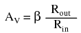{ #fig:13019 width=75% }

- Where "R~out~" is the resistor connected in series with the collector and "R~in~" is the resistor connected in series with the base.

## [[The common-collector amplifier]{#xtocid15705895}]

Our next transistor configuration to study is a bit simpler for gain calculations. Called the _common-collector_ configuration, its schematic diagram is shown in @fig:03100.

{ #fig:03100 width=75% }

_Common collector amplifier has collector common to both input and output._

It is called the _common-collector_ configuration because (ignoring the power supply battery) both the signal source and the load share the collector lead as a common connection point as in @fig:03101.

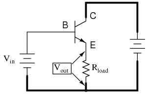{ #fig:03101 width=75% }

_Common collector: Input is applied to base and collector. Output is from emitter-collector circuit._

It should be apparent that the load resistor in the common-collector amplifier circuit receives both the base and collector currents, being placed in series with the emitter. Since the emitter lead of a transistor is the one handling the most current (the sum of base and collector currents, since base and collector currents always mesh together to form the emitter current), it would be reasonable to presume that this amplifier will have a very large current gain. This presumption is indeed correct: the current gain for a common-collector amplifier is quite large, larger than any other transistor amplifier configuration. However, this is not necessarily what sets it apart from other amplifier designs.

Let\'s proceed immediately to a SPICE analysis of this amplifier circuit, and you will be able to immediately see what is unique about this amplifier. The circuit is in @fig:03103. The netlist is in @fig:23009.

{ #fig:03103 width=75% }

_Common collector amplifier for SPICE._

[]{#23009.png <="" a=""}

+-----------------------+-----------------------+-----------------------+ | 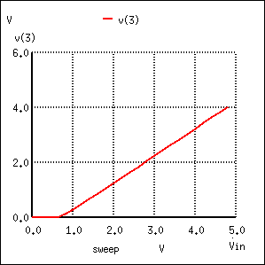{ #fig:23009 width=75% } | | common | | | | -collector amplifier | | | | vin 1 0 | | | | q1 2 1 3 mod1 | | | | v1 2 0 dc 15 | | | | rload 3 0 5k | | | | .model mod1 npn | | | | .dc vin 0 5 0.2 | | | | .plot dc v(3,0) | | | | .end | +-----------------------+-----------------------+-----------------------+

_Common collector: Output equals input less a 0.7 V V~BE~ drop._

Unlike the common-emitter amplifier from the previous section, the common-collector produces an output voltage in _direct_ rather than _inverse_ proportion to the rising input voltage. See @fig:23009. As the input voltage increases, so does the output voltage. Moreover, a close examination reveals that the output voltage is nearly _identical_ to the input voltage, lagging behind by about 0.7 volts.

This is the unique quality of the common-collector amplifier: an output voltage that is nearly equal to the input voltage. Examined from the perspective of output voltage _change_ for a given amount of input voltage _change_, this amplifier has a voltage gain of almost exactly unity (1), or 0 dB. This holds true for transistors of any β value, and for load resistors of any resistance value.

It is simple to understand why the output voltage of a common-collector amplifier is always nearly equal to the input voltage. Referring to the diode current source transistor model in @fig:03104, we see that the base current must go through the base-emitter PN junction, which is equivalent to a normal rectifying diode. If this junction is forward-biased (the transistor conducting current in either its active or saturated modes), it will have a voltage drop of approximately 0.7 volts, assuming silicon construction. This 0.7 volt drop is largely irrespective of the actual magnitude of base current; thus, we can regard it as being constant:

{ #fig:03104 width=75% }

_Emitter follower: Emitter voltage follows base voltage (less a 0.7 V V~BE~ drop.)_

[]{#Kirchhoff's Voltage Law}

Given the voltage polarities across the base-emitter PN junction and the load resistor, we see that these _must_ add together to equal the input voltage, in accordance with Kirchhoff\'s Voltage Law. In other words, the load voltage will always be about 0.7 volts less than the input voltage for all conditions where the transistor is conducting. Cutoff occurs at input voltages below 0.7 volts, and saturation at input voltages in excess of battery (supply) voltage plus 0.7 volts.

Because of this behavior, the common-collector amplifier circuit is also known as the _voltage-follower_ or _emitter-follower_ amplifier, because the emitter load voltages follow the input so closely.

Applying the common-collector circuit to the amplification of AC signals requires the same input "biasing" used in the common-emitter circuit: a DC voltage must be added to the AC input signal to keep the transistor in its active mode during the entire cycle. When this is done, the result is the non-inverting amplifier in @fig:03105.

[]{#03105.png <="" a=""}

+-----------------------+-----------------------+-----------------------+ | { #fig:03105 width=75% } | | commo | | | | n-collector amplifier | | | | vin 1 | | | | 4 sin(0 1.5 2000 0 0) | | | | vbias 4 0 dc 2.3 | | | | q1 2 1 3 mod1 | | | | v1 2 0 dc 15 | | | | rload 3 0 5k | | | | .model mod1 npn | | | | .tran .02m .78m | | | | .pl | | | | ot tran v(1,0) v(3,0) | | | | .end | +-----------------------+-----------------------+-----------------------+

_Common collector (emitter-follower) amplifier._

The results of the SPICE simulation in @fig:23010 show that the output follows the input. The output is the same peak-to-peak amplitude as the input. Though, the DC level is shifted downward by one V~BE~ diode drop.

{ #fig:23010 width=75% }

_Common collector (emitter-follower): Output V3 follows input V1 less a 0.7 V VBE drop._

\

Here\'s another view of the circuit (@fig:03111) with oscilloscopes connected to several points of interest.

{ #fig:03111 width=75% }

_Common collector non-inverting voltage gain is 1._

Since this amplifier configuration doesn\'t provide any voltage gain (in fact, in practice it actually has a voltage gain of slightly _less_ than 1), its only amplifying factor is current. The common-emitter amplifier configuration examined in the previous section had a current gain equal to the β of the transistor, being that the input current went through the base and the output (load) current went through the collector, and β by definition is the ratio between the collector and base currents. In the common-collector configuration, though, the load is situated in series with the emitter, and thus its current is equal to the emitter current. With the emitter carrying collector current _and_ base current, the load in this type of amplifier has all the current of the collector running through it _plus_ the input current of the base. This yields a current gain of β plus 1:

{ #fig:13020 width=75% }

Once again, PNP transistors are just as valid to use in the common-collector configuration as NPN transistors. The gain calculations are all the same, as is the non-inverting of the amplified signal. The only difference is in voltage polarities and current directions shown in @fig:03113.

{ #fig:03113 width=75% }

_PNP version of the common-collector amplifier._

A popular application of the common-collector amplifier is for regulated DC power supplies, where an unregulated (varying) source of DC voltage is clipped at a specified level to supply regulated (steady) voltage to a load. Of course, zener diodes already provide this function of voltage regulation shown in @fig:03106.

{ #fig:03106 width=75% }

_Zener diode voltage regulator._

However, when used in this direct fashion, the amount of current that may be supplied to the load is usually quite limited. In essence, this circuit regulates voltage across the load by keeping current through the series resistor at a high enough level to drop all the excess power source voltage across it, the zener diode drawing more or less current as necessary to keep the voltage across itself steady. For high-current loads, a plain zener diode voltage regulator would have to shunt a heavy current through the diode to be effective at regulating load voltage in the event of large load resistance or voltage source changes.

One popular way to increase the current-handling ability of a regulator circuit like this is to use a common-collector transistor to amplify current to the load, so that the zener diode circuit only has to handle the amount of current necessary to drive the base of the transistor. (@fig:03107)

{ #fig:03107 width=75% }

_Common collector application: voltage regulator._

There\'s really only one caveat to this approach: the load voltage will be approximately 0.7 volts less than the zener diode voltage, due to the transistor\'s 0.7 volt base-emitter drop. Since this 0.7 volt difference is fairly constant over a wide range of load currents, a zener diode with a 0.7 volt higher rating can be chosen for the application.

Sometimes the high current gain of a single-transistor, common-collector configuration isn\'t enough for a particular application. If this is the case, multiple transistors may be staged together in a popular configuration known as a _Darlington pair_, just an extension of the common-collector concept shown in @fig:03108.

{ #fig:03108 width=75% }

_An NPN darlington pair._

Darlington pairs essentially place one transistor as the common-collector load for another transistor, thus multiplying their individual current gains. Base current through the upper-left transistor is amplified through that transistor\'s emitter, which is directly connected to the base of the lower-right transistor, where the current is again amplified. The overall current gain is as follows:

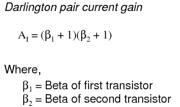{ #fig:13021 width=75% }

Voltage gain is still nearly equal to 1 if the entire assembly is connected to a load in common-collector fashion, although the load voltage will be a full 1.4 volts less than the input voltage shown in @fig:03109.

{ #fig:03109 width=75% }

_Darlington pair based common-collector amplifier loses two V~BE~ diode drops._

Darlington pairs may be purchased as discrete units (two transistors in the same package), or may be built up from a pair of individual transistors. Of course, if even more current gain is desired than what may be obtained with a pair, Darlington triplet or quadruplet assemblies may be constructed.

- **REVIEW:**
- _Common-collector_ transistor amplifiers are so-called because the input and output voltage points share the collector lead of the transistor in common with each other, not considering any power supplies.
- The common-collector amplifier is also known as an emitter-follower.
- The output voltage on a common-collector amplifier will be in phase with the input voltage, making the common-collector a _non-inverting_ amplifier circuit.
- The current gain of a common-collector amplifier is equal to β plus 1. The voltage gain is approximately equal to 1 (in practice, just a little bit less).
- A _Darlington pair_ is a pair of transistors "piggybacked" on one another so that the emitter of one feeds current to the base of the other in common-collector form. The result is an overall current gain equal to the product (multiplication) of their individual common-collector current gains (β plus 1).

## [[The common-base amplifier]{#xtocid15705896}]

The final transistor amplifier configuration (@fig:03114) we need to study is the _common-base_. This configuration is more complex than the other two, and is less common due to its strange operating characteristics.

{ #fig:03114 width=75% }

_Common-base amplifier_

It is called the _common-base_ configuration because (DC power source aside), the signal source and the load share the base of the transistor as a common connection point shown in @fig:03115.

{ #fig:03115 width=75% }

_Common-base amplifier: Input between emitter and base, output between collector and base._

Perhaps the most striking characteristic of this configuration is that the input signal source must carry the full emitter current of the transistor, as indicated by the heavy arrows in the first illustration. As we know, the emitter current is greater than any other current in the transistor, being the sum of base and collector currents. In the last two amplifier configurations, the signal source was connected to the base lead of the transistor, thus handling the _least_ current possible.

Because the input current exceeds all other currents in the circuit, including the output current, the current gain of this amplifier is actually _less than 1_ (notice how R~load~ is connected to the collector, thus carrying slightly less current than the signal source). In other words, it _attenuates_ current rather than _amplifying_ it. With common-emitter and common-collector amplifier configurations, the transistor parameter most closely associated with gain was β. In the common-base circuit, we follow another basic transistor parameter: the ratio between collector current and emitter current, which is a fraction always less than 1. This fractional value for any transistor is called the _alpha_ ratio, or α ratio.

Since it obviously can\'t boost signal current, it only seems reasonable to expect it to boost signal voltage. A SPICE simulation of the circuit in @fig:03116 will vindicate that assumption.

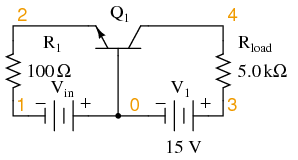{ #fig:03116 width=75% }

_Common-base circuit for DC SPICE analysis._

[]{#23011.png <="" a=""}

+-----------------------+-----------------------+-----------------------+ | 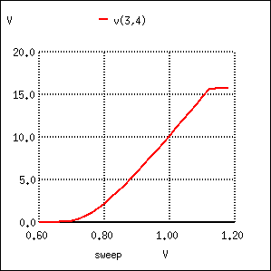{ #fig:23011 width=75% } | | | | | | common-base amplifier | | | | vin 0 1 | | | | r1 1 2 100 | | | | q1 4 0 2 mod1 | | | | v1 3 0 dc 15 | | | | rload 3 4 5k | | | | .model mod1 npn | | | | | | | | .dc vin 0.6 1.2 .02 | | | | .plot dc v(3,4) | | | | .end | +-----------------------+-----------------------+-----------------------+

_Common-base amplifier DC transfer function._

Notice in @fig:23011 that the output voltage goes from practically nothing (cutoff) to 15.75 volts (saturation) with the input voltage being swept over a range of 0.6 volts to 1.2 volts. In fact, the output voltage plot doesn\'t show a rise until about 0.7 volts at the input, and cuts off (flattens) at about 1.12 volts input. This represents a rather large voltage gain with an output voltage span of 15.75 volts and an input voltage span of only 0.42 volts: a gain ratio of 37.5, or 31.48 dB. Notice also how the output voltage (measured across R~load~) actually exceeds the power supply (15 volts) at saturation, due to the series-aiding effect of the input voltage source.

A second set of SPICE analyses (circuit in @fig:03117) with an AC signal source (and DC bias voltage) tells the same story: a high voltage gain

{ #fig:03117 width=75% }

_Common-base circuit for SPICE AC analysis._

As you can see, the input and output waveforms in @fig:23012 are in phase with each other. This tells us that the common-base amplifier is non-inverting.

[]{#23012.png <="" a=""}

+-----------------------+-----------------------+-----------------------+ | { #fig:23012 width=75% } | | | | | | common-base amplifier | | | | vin 5 2 | | | | sin (0 0.12 2000 0 0) | | | | | | | | vbias 0 1 dc 0.95 | | | | r1 2 1 100 | | | | q1 4 0 5 mod1 | | | | v1 3 0 dc 15 | | | | rload 3 4 5k | | | | .model mod1 npn | | | | .tran 0.02m 0.78m | | | | . | | | | plot tran v(5,2) v(4) | | | | .end | +-----------------------+-----------------------+-----------------------+

The AC SPICE analysis in Table [below](#bjt4.tbl) at a single frequency of 2 kHz provides input and output voltages for gain calculation.

[]{#bjt4.tbl}

_Common-base AC analysis at 2 kHz-- netlist followed by output._

    common-base amplifier
    vin 5 2  ac 0.1 sin
    vbias 0 1  dc 0.95
    r1 2 1 100
    q1 4 0 5 mod1
    v1 3 0 dc 15
    rload 3 4 5k
    .model mod1 npn
    .ac dec 1 2000 2000
    .print ac vm(5,2) vm(4,3)
    .end

    frequency       mag(v(5,2))     mag(v(4,3))
    --------------------------------------------
    0.000000e+00    1.000000e-01    4.273864e+00

Voltage figures from the second analysis (Table [above](#bjt4.tbl)) show a voltage gain of 42.74 (4.274 V / 0.1 V), or 32.617 dB:

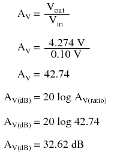{ #fig:13022 width=75% }

Here\'s another view of the circuit in @fig:03118, summarizing the phase relations and DC offsets of various signals in the circuit just simulated.

{ #fig:03118 width=75% }

_Phase relationships and offsets for NPN common base amplifier._

. . . and for a PNP transistor: @fig:03119.

{ #fig:03119 width=75% }

_Phase relationships and offsets for PNP common base amplifier._

Predicting voltage gain for the common-base amplifier configuration is quite difficult, and involves approximations of transistor behavior that are difficult to measure directly. Unlike the other amplifier configurations, where voltage gain was either set by the ratio of two resistors (common-emitter), or fixed at an unchangeable value (common-collector), the voltage gain of the common-base amplifier depends largely on the amount of DC bias on the input signal. As it turns out, the internal transistor resistance between emitter and base plays a major role in determining voltage gain, and this resistance changes with different levels of current through the emitter.

While this phenomenon is difficult to explain, it is rather easy to demonstrate through the use of computer simulation. What I\'m going to do here is run several SPICE simulations on a common-base amplifier circuit (Figure [previous](@fig:03117){ #fig:03117 width=75% }), changing the DC bias voltage slightly (vbias in Figure [below](#bjt5.tbl) ) while keeping the AC signal amplitude and all other circuit parameters constant. As the voltage gain changes from one simulation to another, different output voltage amplitudes will be noted.

Although these analyses will all be conducted in the "transfer function" mode, each was first "proofed" in the transient analysis mode (voltage plotted over time) to ensure that the entire wave was being faithfully reproduced and not "clipped" due to improper biasing. See \"\*.tran 0.02m 0.78m\" in Figure [below](#bjt5.tbl), the "commented out" transient analysis statement. Gain calculations cannot be based on waveforms that are distorted. SPICE can calculate the small signal DC gain for us with the ".tf v(4) vin" statement. The output is **v(4)** and the input as **vin**.

[]{#bjt5.tbl <="" a=""}

+-----------------------+-----------------------+-----------------------+ | common | | common- | | -base amp vbias=0.85V | | base amp current gain | | vin 5 2 | | Iin 55 5 0A | | sin (0 0.12 2000 0 0) | | vin 55 2 | | | | sin (0 0.12 2000 0 0) | | vbias 0 1 dc 0.85 | | | | r1 2 1 100 | | vbias 0 1 dc 0.8753 | | q1 4 0 5 mod1 | | r1 2 1 100 | | v1 3 0 dc 15 | | q1 4 0 5 mod1 | | rload 3 4 5k | | v1 3 0 dc 15 | | .model mod1 npn | | rload 3 4 5k | | | | .model mod1 npn | | _.tran 0.02m 0.78m | | | | .tf v(4) vin | | _.tran 0.02m 0.78m | | .end | | .tf I(v1) Iin | | | | .end | | | | Transfer | | | | function information: | | | | transfer fu | | | | nction = 9.900990e-01 | | | | iin input imp | | | | edance = 9.900923e+11 | | | | v1 output imp | | | | edance = 1.000000e+20 | +-----------------------+-----------------------+-----------------------+

_SPICE net list: Common-base, transfer function (voltage gain) for various DC bias voltages. SPICE net list: Common-base amp current gain; Note .tf v(4) vin statement. Transfer function for DC current gain I(vin)/Iin; Note .tf I(vin) Iin statement._

At the command line, **spice -b filename.cir** produces a printed output due to the **.tf** statement: transfer_function, output_impedance, and input_impedance. The abbreviated output listing is from runs with **vbias** at 0.85, 0.90, 0.95, 1.00 V as recorded in Table [below](#bjt6.tbl).

[]{#bjt6.tbl}

_SPICE output: Common-base transfer function._

    Circuit: common-base amp vbias=0.85V
    transfer_function = 3.756565e+01
    output_impedance_at_v(4) = 5.000000e+03
    vin#input_impedance = 1.317825e+02

    Circuit: common-base amp vbias=0.8753V Ic=1 mA
    Transfer function information:
    transfer_function = 3.942567e+01
    output_impedance_at_v(4) = 5.000000e+03
    vin#input_impedance = 1.255653e+02

    Circuit: common-base amp vbias=0.9V
    transfer_function = 4.079542e+01
    output_impedance_at_v(4) = 5.000000e+03
    vin#input_impedance = 1.213493e+02

    Circuit: common-base amp vbias=0.95V
    transfer_function = 4.273864e+01
    output_impedance_at_v(4) = 5.000000e+03
    vin#input_impedance = 1.158318e+02

    Circuit: common-base amp vbias=1.00V
    transfer_function = 4.401137e+01
    output_impedance_at_v(4) = 5.000000e+03
    vin#input_impedance = 1.124822e+02

A trend should be evident in Table [above](#bjt6.tbl). With increases in DC bias voltage, voltage gain (transfer_function) increases as well. We can see that the voltage gain is increasing because each subsequent simulation (vbias= 0.85, 0.8753, 0.90, 0.95, 1.00 V) produces greater gain (transfer_function= 37.6, 39.4 40.8, 42.7, 44.0), respectively. The changes are largely due to minuscule variations in bias voltage.

The last three lines of Table [above](#bjt6.tbl)(right) show the **I(v1)/Iin** current gain of 0.99. (The last two lines look invalid.) This makes sense for β=100; α= β/(β+1), α=0.99=100/(100-1). The combination of low current gain (always less than 1) and somewhat unpredictable voltage gain conspire against the common-base design, relegating it to few practical applications.

Those few applications include radio frequency amplifiers. The grounded base helps shield the input at the emitter from the collector output, preventing instability in RF amplifiers. The common base configuration is usable at higher frequencies than common emitter or common collector. See "Class C common-base 750 mW RF power amplifier" [Ch 9](SEMI_9.html#03478.png){ #fig:03478 width=75% } . For a more elaborate circuit see "Class A common-base small-signal high gain amplifier"[Ch 9](SEMI_9.html#03479.png){ #fig:03479 width=75% } .

- **REVIEW:**
- _Common-base_ transistor amplifiers are so-called because the input and output voltage points share the base lead of the transistor in common with each other, not considering any power supplies.
- The current gain of a common-base amplifier is always less than 1. The voltage gain is a function of input and output resistances, and also the internal resistance of the emitter-base junction, which is subject to change with variations in DC bias voltage. Suffice to say that the voltage gain of a common-base amplifier can be very high.
- The ratio of a transistor\'s collector current to emitter current is called α. The α value for any transistor is always less than unity, or in other words, less than 1.

## The cascode amplifier{ #sec:xtocid15705897 }

While the C-B (common-base) amplifier is known for wider bandwidth than the C-E (common-emitter) configuration, the low input impedance (10s of Ω) of C-B is a limitation for many applications. The solution is to precede the C-B stage by a low gain C-E stage which has moderately high input impedance (kΩs). See @fig:03500. The stages are in a _cascode_ configuration, stacked in series, as opposed to cascaded for a standard amplifier chain. See "Capacitor coupled three stage common-emitter amplifier" [Capacitor coupled](#03142L) for a cascade example. The cascode amplifier configuration has both wide bandwidth and a moderately high input impedance.

{ #fig:03500 width=75% }

_The cascode amplifier is combined common-emitter and common-base. This is an AC circuit equivalent with batteries and capacitors replaced by short circuits._

The key to understanding the wide bandwidth of the cascode configuration is the _Miller effect_. The [Miller effect](#MILLER) is the multiplication of the bandwidth robbing collector-base capacitance by voltage gain A~v~. This C-B capacitance is smaller than the E-B capacitance. Thus, one would think that the C-B capacitance would have little effect. However, in the C-E configuration, the collector output signal is out of phase with the input at the base. The collector signal capacitively coupled back opposes the base signal. Moreover, the collector feedback is (1-A~v~) times larger than the base signal. Keep in mind that A~v~ is a negative number for the inverting C-E amplifier. Thus, the small C-B capacitance appears (1+A\|~v~\|) times larger than its actual value. This capacitive gain reducing feedback increases with frequency, reducing the high frequency response of a C-E amplifier.

The approximate voltage gain of the C-E amplifier in @fig:03502 is -R~L~/r~EE~. The emitter current is set to 1.0 mA by biasing. R~EE~= 26mV/I~E~ = 26mV/1.0ma = 26 Ω. Thus, A~v~ = -R~L~/R~EE~ = -4700/26 = -181. The pn2222 datasheet list C~cbo~ = 8 pF.@FAR The miller capacitance is C~cbo~(1-A~v~). Gain A~v~ = -181, negative since it is inverting gain. C~miller~ = C~cbo~(1-A~v~) = 8pF(1-(-181)=1456pF

A common-base configuration is not subject to the Miller effect because the grounded base shields the collector signal from being fed back to the emitter input. Thus, a C-B amplifier has better high frequency response. To have a moderately high input impedance, the C-E stage is still desirable. The key is to reduce the gain (to about 1) of the C-E stage which reduces the Miller effect C-B feedback to 1·C~CBO~. The total C-B feedback is the feedback capacitance 1·C~CB~ plus the actual capacitance C~CB~ for a total of 2·C~CBO~. This is a considerable reduction from 181·C~CBO~. The miller capacitance for a gain of -2 C-E stage is C~miller~ = C~cbo~(1-A~v~)= C~miller~ = C~cbo~(1-(-1)) = C~cbo~·2.

The way to reduce the common-emitter gain is to reduce the load resistance. The gain of a C-E amplifier is approximately R~C~/R~E~. The internal emitter resistance r~EE~ at 1mA emitter current is 26Ω. For details on the 26Ω, see "Derivation of R~EE~", see [REE](#emb5.tbl). The collector load R~C~ is the resistance of the emitter of the C-B stage loading the C-E stage, 26Ω again. CE gain amplifier gain is approximately A~v~ = R~C~/R~E~=26/26=1. This Miller capacitance is C~miller~ = C~cbo~(1-A~v~) = 8pF(1-(-1)=16pF. We now have a moderately high input impedance C-E stage without suffering the Miller effect, but no C-E dB voltage gain. The C-B stage provides a high voltage gain, A~V~ = -181. Current gain of cascode is β of the C-E stage, 1 for the C-B, β overall. Thus, the cascode has moderately high input impedance of the C-E, good gain, and good bandwidth of the C-B.

[]{#CASCODES <="" a=""}

{ #fig:03502 width=75% }

_SPICE: Cascode and common-emitter for comparison._

The SPICE version of both a cascode amplifier, and for comparison, a common-emitter amplifier is shown in @fig:03502. The netlist is in Table [below](#cascode.tbl). The AC source V3 drives both amplifiers via node 4. The bias resistors for this circuit are calculated in an example problem [cascode](#CASCODEB).

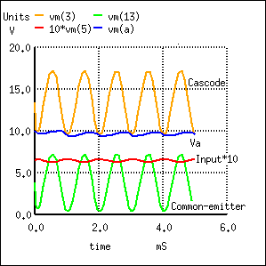{ #fig:23044 width=75% }

_SPICE waveforms. Note that Input is multiplied by 10 for visibility._

[]{#cascode.tbl}

_SPICE netlist for printing AC input and output voltages._

    *SPICE circuit <03502.eps> from XCircuit v3.20
    V1 19 0 10
    Q1 13 15 0 q2n2222
    Q2 3 2 A q2n2222
    R1 19 13 4.7k
    V2 16 0 1.5
    C1 4 15 10n
    R2 15 16 80k
    Q3 A 5 0 q2n2222
    V3 4 6 SIN(0 0.1 1k)  ac 1
    R3 1 2 80k
    R4 3 9 4.7k
    C2 2 0 10n
    C3 4 5 10n
    R5 5 6 80k
    V4 1 0 11.5
    V5 9 0 20
    V6 6 0 1.5
    .model q2n2222 npn (is=19f bf=150
    + vaf=100 ikf=0.18 ise=50p ne=2.5 br=7.5
    + var=6.4 ikr=12m isc=8.7p nc=1.2 rb=50
    + re=0.4 rc=0.3 cje=26p tf=0.5n
    + cjc=11p tr=7n xtb=1.5 kf=0.032f af=1)
    .tran 1u 5m
    .AC DEC 10 1k 100Meg
    .end

The waveforms in @fig:23044 show the operation of the cascode stage. The input signal is displayed multiplied by 10 so that it may be shown with the outputs. Note that both the Cascode, Common-emitter, and Va (intermediate point) outputs are inverted from the input. Both the Cascode and Common emitter have large amplitude outputs. The Va point has a DC level of about 10V, about half way between 20V and ground. The signal is larger than can be accounted for by a C-E gain of 1, It is three times larger than expected.

{ #fig:23043 width=75% }

_Cascode vs common-emitter banwidth._

@fig:23043 shows the frequency response to both the cascode and common-emitter amplifiers. The SPICE statements responsible for the AC analysis, extracted from the listing:

\

    V3 4 6 SIN(0 0.1 1k)  ac 1
    .AC DEC 10 1k 100Meg

\

Note the "ac 1" is necessary at the end of the V3 statement. The cascode has marginally better mid-band gain. However, we are primarily looking for the bandwidth measured at the -3dB points, down from the midband gain for each amplifier. This is shown by the vertical solid lines in @fig:23043. It is also possible to print the data of interest from nutmeg to the screen, the SPICE graphical viewer (command, first line):

    nutmeg 6 -> print frequency db(vm(3)) db(vm(13))

    Index   frequency     db(vm(3))  db(vm(13))
    22      0.158MHz      47.54      45.41
    33      1.995MHz      46.95      42.06
    37      5.012MHz      44.63      36.17

Index 22 gives the midband dB gain for Cascode vm(3)=47.5dB and Common-emitter vm(13)=45.4dB. Out of many printed lines, Index 33 was the closest to being 3dB down from 45.4dB at 42.0dB for the Common-emitter circuit. The corresponding Index 33 frequency is approximately 2Mhz, the common-emitter bandwidth. Index 37 vm(3)=44.6db is approximately 3db down from 47.5db. The corresponding Index37 frequency is 5Mhz, the cascode bandwidth. Thus, the cascode amplifier has a wider bandwidth. We are not concerned with the low frequency degradation of gain. It is due to the capacitors, which could be remedied with larger ones.

The 5MHz bandwith of our cascode example, while better than the common-emitter example, is not exemplary for an RF (radio frequency) amplifier. A pair of RF or microwave transistors with lower interelectrode capacitances should be used for higher bandwidth. Before the invention of the RF dual gate MOSFET, the BJT cascode amplifier could have been found in UHF (ultra high frequency) TV tuners.

- REVIEW
- A _cascode_ amplifier consists of a common-emitter stage loaded by the emitter of a common-base stage.
- The heavily loaded C-E stage has a low gain of 1, overcoming the _Miller effect_
- A cascode amplifier has a high gain, moderately high input impedance, a high output impedance, and a high bandwidth.

## Biasing techniques{ #sec:xtocid15705898 }

In the common-emitter section of this chapter, we saw a SPICE analysis where the output waveform resembled a half-wave rectified shape: only half of the input waveform was reproduced, with the other half being completely cut off. Since our purpose at that time was to reproduce the entire waveshape, this constituted a problem. The solution to this problem was to add a small bias voltage to the amplifier input so that the transistor stayed in active mode throughout the entire wave cycle. This addition was called a _bias voltage_.

A half-wave output is not problematic for some applications. In fact, some applications may _necessitate_ this very kind of amplification. Because it is possible to operate an amplifier in modes other than full-wave reproduction and specific applications require different ranges of reproduction, it is useful to describe the degree to which an amplifier reproduces the input waveform by designating it according to _class_. Amplifier class operation is categorized with alphabetical letters: A, B, C, and AB.

_For Class A_ operation, the entire input waveform is faithfully reproduced. Although I didn\'t introduce this concept back in the common-emitter section, this is what we were hoping to attain in our simulations. Class A operation can only be obtained when the transistor spends its entire time in the active mode, never reaching either cutoff or saturation. To achieve this, sufficient DC bias voltage is usually set at the level necessary to drive the transistor exactly halfway between cutoff and saturation. This way, the AC input signal will be perfectly "centered" between the amplifier\'s high and low signal limit levels.

{ #fig:03124 width=75% }

_Class A: The amplifier output is a faithful reproduction of the input._

_Class B_ operation is what we had the first time an AC signal was applied to the common-emitter amplifier with no DC bias voltage. The transistor spent half its time in active mode and the other half in cutoff with the input voltage too low (or even of the wrong polarity!) to forward-bias its base-emitter junction.

{ #fig:03125 width=75% }

_Class B: Bias is such that half (180^o^) of the waveform is reproduced._

By itself, an amplifier operating in class B mode is not very useful. In most circumstances, the severe distortion introduced into the waveshape by eliminating half of it would be unacceptable. However, class B operation is a useful mode of biasing if two amplifiers are operated as a _push-pull_ pair, each amplifier handling only half of the waveform at a time:

{ #fig:03126 width=75% }

_Class B push pull amplifier: Each transistor reproduces half of the waveform. Combining the halves produces a faithful reproduction of the whole wave._

Transistor Q~1~ "pushes" (drives the output voltage in a positive direction with respect to ground), while transistor Q~2~ "pulls" the output voltage (in a negative direction, toward 0 volts with respect to ground). Individually, each of these transistors is operating in class B mode, active only for one-half of the input waveform cycle. Together, however, both function as a team to produce an output waveform identical in shape to the input waveform.

A decided advantage of the class B (push-pull) amplifier design over the class A design is greater output power capability. With a class A design, the transistor dissipates considerable energy in the form of heat because it never stops conducting current. At all points in the wave cycle it is in the active (conducting) mode, conducting substantial current and dropping substantial voltage. There is substantial power dissipated by the transistor throughout the cycle. In a class B design, each transistor spends half the time in cutoff mode, where it dissipates zero power (zero current = zero power dissipation). This gives each transistor a time to "rest" and cool while the other transistor carries the burden of the load. Class A amplifiers are simpler in design, but tend to be limited to low-power signal applications for the simple reason of transistor heat dissipation.

Another class of amplifier operation known as _class AB_, is somewhere between class A and class B: the transistor spends more than 50% but less than 100% of the time conducting current.

If the input signal bias for an amplifier is slightly negative (opposite of the bias polarity for class A operation), the output waveform will be further "clipped" than it was with class B biasing, resulting in an operation where the transistor spends most of the time in cutoff mode:

{ #fig:03127 width=75% }

_Class C: Conduction is for less than a half cycle (\< 180^o^)._

At first, this scheme may seem utterly pointless. After all, how useful could an amplifier be if it clips the waveform as badly as this? If the output is used directly with no conditioning of any kind, it would indeed be of questionable utility. However, with the application of a tank circuit (parallel resonant inductor-capacitor combination) to the output, the occasional output surge produced by the amplifier can set in motion a higher-frequency oscillation maintained by the tank circuit. This may be likened to a machine where a heavy flywheel is given an occasional "kick" to keep it spinning:

{ #fig:03128 width=75% }

_Class C amplifier driving a resonant circuit._

Called _class C_ operation, this scheme also enjoys high power efficiency due to the fact that the transistor(s) spend the vast majority of time in the cutoff mode, where they dissipate zero power. The rate of output waveform decay (decreasing oscillation amplitude between "kicks" from the amplifier) is exaggerated here for the benefit of illustration. Because of the tuned tank circuit on the output, this circuit is usable only for amplifying signals of definite, fixed amplitude. A class C amplifier may used in an FM (frequency modulation) radio transmitter. However, the class C amplifier may not directly amplify an AM (amplitude modulated) signal due to distortion.

Another kind of amplifier operation, significantly different from Class A, B, AB, or C, is called _Class D_. It is not obtained by applying a specific measure of bias voltage as are the other classes of operation, but requires a radical re-design of the amplifier circuit itself. It is a little too early in this chapter to investigate exactly how a class D amplifier is built, but not too early to discuss its basic principle of operation.

A class D amplifier reproduces the profile of the input voltage waveform by generating a rapidly-pulsing squarewave output. The duty cycle of this output waveform (time "on" versus total cycle time) varies with the instantaneous amplitude of the input signal. The plots in (@fig:03230 demonstrate this principle.

{ #fig:03230 width=75% }

_Class D amplifier: Input signal and unfiltered output._

The greater the instantaneous voltage of the input signal, the greater the duty cycle of the output squarewave pulse. If there can be any goal stated of the class D design, it is to avoid active-mode transistor operation. Since the output transistor of a class D amplifier is never in the active mode, only cutoff or saturated, there will be little heat energy dissipated by it. This results in very high power efficiency for the amplifier. Of course, the disadvantage of this strategy is the overwhelming presence of harmonics on the output. Fortunately, since these harmonic frequencies are typically much greater than the frequency of the input signal, these can be filtered out by a low-pass filter with relative ease, resulting in an output more closely resembling the original input signal waveform. Class D technology is typically seen where extremely high power levels and relatively low frequencies are encountered, such as in industrial inverters (devices converting DC into AC power to run motors and other large devices) and high-performance audio amplifiers.

A term you will likely come across in your studies of electronics is something called _quiescent_, which is a modifier designating the zero input condition of a circuit. Quiescent current, for example, is the amount of current in a circuit with zero input signal voltage applied. Bias voltage in a transistor circuit forces the transistor to operate at a different level of collector current with zero input signal voltage than it would without that bias voltage. Therefore, the amount of bias in an amplifier circuit determines its quiescent values.

In a class A amplifier, the quiescent current should be exactly half of its saturation value (halfway between saturation and cutoff, cutoff by definition being zero). Class B and class C amplifiers have quiescent current values of zero, since these are supposed to be cutoff with no signal applied. Class AB amplifiers have very low quiescent current values, just above cutoff. To illustrate this graphically, a "load line" is sometimes plotted over a transistor\'s characteristic curves to illustrate its range of operation while connected to a load resistance of specific value shown in @fig:03144.

{ #fig:03144 width=75% }

_Example load line drawn over transistor characteristic curves from V~supply~ to saturation current._

A load line is a plot of collector-to-emitter voltage over a range of collector currents. At the lower-right corner of the load line, voltage is at maximum and current is at zero, representing a condition of cutoff. At the upper-left corner of the line, voltage is at zero while current is at a maximum, representing a condition of saturation. Dots marking where the load line intersects the various transistor curves represent realistic operating conditions for those base currents given.

Quiescent operating conditions may be shown on this graph in the form of a single dot along the load line. For a class A amplifier, the quiescent point will be in the middle of the load line as in (@fig:03145.

{ #fig:03145 width=75% }

_Quiescent point (dot) for class A._

In this illustration, the quiescent point happens to fall on the curve representing a base current of 40 µA. If we were to change the load resistance in this circuit to a greater value, it would affect the slope of the load line, since a greater load resistance would limit the maximum collector current at saturation, but would not change the collector-emitter voltage at cutoff. Graphically, the result is a load line with a different upper-left point and the same lower-right point as in (@fig:03146)

{ #fig:03146 width=75% }

_Load line resulting from increased load resistance._

Note how the new load line doesn\'t intercept the 75 µA curve along its flat portion as before. This is very important to realize because the non-horizontal portion of a characteristic curve represents a condition of saturation. Having the load line intercept the 75 µA curve outside of the curve\'s horizontal range means that the amplifier will be saturated at that amount of base current. Increasing the load resistor value is what caused the load line to intercept the 75 µA curve at this new point, and it indicates that saturation will occur at a lesser value of base current than before.

With the old, lower-value load resistor in the circuit, a base current of 75 µA would yield a proportional collector current (base current multiplied by β). In the first load line graph, a base current of 75 µA gave a collector current almost twice what was obtained at 40 µA, as the β ratio would predict. However, collector current increases marginally between base currents 75 µA and 40 µA, because the transistor begins to lose sufficient collector-emitter voltage to continue to regulate collector current.

To maintain linear (no-distortion) operation, transistor amplifiers shouldn\'t be operated at points where the transistor will saturate; that is, where the load line will not potentially fall on the horizontal portion of a collector current curve. We\'d have to add a few more curves to the graph in @fig:03147 before we could tell just how far we could "push" this transistor with increased base currents before it saturates.

{ #fig:03147 width=75% }

_More base current curves shows saturation detail._

It appears in this graph that the highest-current point on the load line falling on the straight portion of a curve is the point on the 50 µA curve. This new point should be considered the maximum allowable input signal level for class A operation. Also for class A operation, the bias should be set so that the quiescent point is halfway between this new maximum point and cutoff shown in @fig:03148.

{ #fig:03148 width=75% }

_New quiescent point avoids saturation region._

Now that we know a little more about the consequences of different DC bias voltage levels, it is time to investigate practical biasing techniques. So far, I\'ve shown a small DC voltage source (battery) connected in series with the AC input signal to bias the amplifier for whatever desired class of operation. In real life, the connection of a precisely-calibrated battery to the input of an amplifier is simply not practical. Even if it were possible to customize a battery to produce just the right amount of voltage for any given bias requirement, that battery would not remain at its manufactured voltage indefinitely. Once it started to discharge and its output voltage drooped, the amplifier would begin to drift toward class B operation.

Take this circuit, illustrated in the common-emitter section for a SPICE simulation, for instance, in Figure [below](@fig:03099a).

[]{#03099a.png}

{ #fig:03099 width=75% }

_Impractical base battery bias._

That 2.3 volt "V~bias~" battery would not be practical to include in a real amplifier circuit. A far more practical method of obtaining bias voltage for this amplifier would be to develop the necessary 2.3 volts using a voltage divider network connected across the 15 volt battery. After all, the 15 volt battery is already there by necessity, and voltage divider circuits are easy to design and build. Let\'s see how this might look in @fig:03130.

{ #fig:03130 width=75% }

_Voltage divider bias._

If we choose a pair of resistor values for R~2~ and R~3~ that will produce 2.3 volts across R~3~ from a total of 15 volts (such as 8466 Ω for R~2~ and 1533 Ω for R~3~), we should have our desired value of 2.3 volts between base and emitter for biasing with no signal input. The only problem is, this circuit configuration places the AC input signal source directly in parallel with R~3~ of our voltage divider. This is not acceptable, as the AC source will tend to overpower any DC voltage dropped across R~3~. Parallel components _must_ have the same voltage, so if an AC voltage source is directly connected across one resistor of a DC voltage divider, the AC source will "win" and there will be no DC bias voltage added to the signal.

One way to make this scheme work, although it may not be obvious _why_ it will work, is to place a _coupling capacitor_ between the AC voltage source and the voltage divider as in @fig:03131.

{ #fig:03131 width=75% }

_Coupling capacitor prevents voltage divider bias from flowing into signal generator._

The capacitor forms a high-pass filter between the AC source and the DC voltage divider, passing almost all of the AC signal voltage on to the transistor while blocking all DC voltage from being shorted through the AC signal source. This makes much more sense if you understand the superposition theorem and how it works. According to superposition, any linear, bilateral circuit can be analyzed in a piecemeal fashion by only considering one power source at a time, then algebraically adding the effects of all power sources to find the final result. If we were to separate the capacitor and R~2~\--R~3~ voltage divider circuit from the rest of the amplifier, it might be easier to understand how this superposition of AC and DC would work.

With only the AC signal source in effect, and a capacitor with an arbitrarily low impedance at signal frequency, almost all the AC voltage appears across R~3~:

{ #fig:03133 width=75% }

_Due to the coupling capacitor\'s very low impedance at the signal frequency, it behaves much like a piece of wire, thus can be omitted for this step in superposition analysis._

With only the DC source in effect, the capacitor appears to be an open circuit, and thus neither it nor the shorted AC signal source will have any effect on the operation of the R~2~\--R~3~ voltage divider in @fig:03134.

{ #fig:03134 width=75% }

_The capacitor appears to be an open circuit as far at the DC analysis is concerned_

Combining these two separate analyses in @fig:03132, we get a superposition of (almost) 1.5 volts AC and 2.3 volts DC, ready to be connected to the base of the transistor.

{ #fig:03132 width=75% }

_Combined AC and DC circuit._

Enough talk \-- its about time for a SPICE simulation of the whole amplifier circuit in @fig:23013. We will use a capacitor value of 100 µF to obtain an arbitrarily low (0.796 Ω) impedance at 2000 Hz:

[]{#23013.png <="" a=""}

+-----------------------+-----------------------+-----------------------+ | { #fig:23013 width=75% } | | vo | | | | ltage divider biasing | | | | vinput 1 0 | | | | sin (0 1.5 2000 0 0) | | | | c1 1 5 100u | | | | r1 5 2 1k | | | | r2 4 5 8466 | | | | r3 5 0 1533 | | | | q1 3 2 0 mod1 | | | | rspkr 3 4 8 | | | | v1 4 0 dc 15 | | | | .model mod1 npn | | | | .tran 0.02m 0.78m | | | | .p | | | | lot tran v(1,0) i(v1) | | | | .end | +-----------------------+-----------------------+-----------------------+

_SPICE simulation of voltage divider bias._

Note the substantial distortion in the output waveform in @fig:23013. The sine wave is being clipped during most of the input signal\'s negative half-cycle. This tells us the transistor is entering into cutoff mode when it shouldn\'t (I\'m assuming a goal of class A operation as before). Why is this? This new biasing technique should give us exactly the same amount of DC bias voltage as before, right?

With the capacitor and R~2~\--R~3~ resistor network unloaded, it will provide exactly 2.3 volts worth of DC bias. However, once we connect this network to the transistor, it is no longer unloaded. Current drawn through the base of the transistor will load the voltage divider, thus reducing the DC bias voltage available for the transistor. Using the diode current source transistor model in @fig:03135 to illustrate, the bias problem becomes evident.

{ #fig:03135 width=75% }

_Diode transistor model shows loading of voltage divider._

A voltage divider\'s output depends not only on the size of its constituent resistors, but also on how much current is being divided away from it through a load. The base-emitter PN junction of the transistor is a load that decreases the DC voltage dropped across R~3~, due to the fact that the bias current joins with R~3~\'s current to go through R~2~, upsetting the divider ratio formerly set by the resistance values of R~2~ and R~3~. To obtain a DC bias voltage of 2.3 volts, the values of R~2~ and/or R~3~ must be adjusted to compensate for the effect of base current loading. To _increase_ the DC voltage dropped across R~3~, lower the value of R~2~, raise the value of R~3~, or both.

[]{#23014.png <="" a=""}

+-----------------------+-----------------------+-----------------------+ | { #fig:23014 width=75% } | | vo | | | | ltage divider biasing | | | | vinput 1 0 | | | | sin (0 1.5 2000 0 0) | | | | c1 1 5 100u | | | | r1 5 2 1k | | | | r2 4 5 6k <-- | | | | - R2 decreased to 6 k | | | | r3 5 0 4k <-- | | | | - R3 increased to 4 k | | | | q1 3 2 0 mod1 | | | | rspkr 3 4 8 | | | | v1 4 0 dc 15 | | | | .model mod1 npn | | | | .tran 0.02m 0.78m | | | | .pl | | | | ot tran v(1,0) i(v1) | | | | .end | +-----------------------+-----------------------+-----------------------+

_No distortion of the output after adjusting R2 and R3._

The new resistor values of 6 kΩ and 4 kΩ (R~2~ and R~3~, respectively) in @fig:23014 results in class A waveform reproduction, just the way we wanted.

- **REVIEW:**
- _Class A_ operation is an amplifier biased to be in the active mode throughout the entire waveform cycle, thus faithfully reproducing the whole waveform.
- _Class B_ operation is an amplifier biased so that only half of the input waveform gets reproduced: either the positive half or the negative half. The transistor spends half its time in the active mode and half its time cutoff. Complementary pairs of transistors running in class B operation are often used to deliver high power amplification in audio signal systems, each transistor of the pair handling a separate half of the waveform cycle. Class B operation delivers better power efficiency than a class A amplifier of similar output power.
- _Class AB_ operation is an amplifier is biased at a point somewhere between class A and class B.
- _Class C_ is an amplifier biased to amplify only a small portion of the waveform. Most of the transistor\'s time is spent in cutoff mode. In order for there to be a complete waveform at the output, a resonant tank circuit is often used as a "flywheel" to maintain oscillations for a few cycles after each "kick" from the amplifier. Because the transistor is not conducting most of the time, power efficiencies are high for a class C amplifier.
- _Class D_ operation requires an advanced circuit design, and functions on the principle of representing instantaneous input signal amplitude by the duty cycle of a high-frequency squarewave. The output transistor(s) never operate in active mode, only cutoff and saturation. Little heat energy dissipated makes energy efficiency high.
- DC bias voltage on the input signal, necessary for certain classes of operation (especially class A and class C), may be obtained through the use of a voltage divider and _coupling capacitor_ rather than a battery connected in series with the AC signal source.

## Biasing calculations{ #sec:xtocid15705899 }

Although transistor switching circuits operate without bias, it is unusual for analog circuits to operate without bias. One of the few examples is "TR One, one transistor radio" [TR One, Ch 9](SEMI_9.html#TRone) with an amplified AM (amplitude modulation) detector. Note the lack of a bias resistor at the base in that circuit. In this section we look at a few basic bias circuits which can set a selected emitter current I~E~. Given a desired emitter current I~E~, what values of bias resistors are required, R~B~, R~E~, etc?

### Base Bias{ #sec:xtocid157058910 }

The simplest biasing applies a _base-bias_ resistor between the base and a base battery V~BB~. It is convenient to use the existing V~CC~ supply instead of a new bias supply. An example of an audio amplifier stage using base-biasing is "Crystal radio with one transistor . . . " [crystal radio, Ch 9](SEMI_9.html#TRtwo) . Note the resistor from the base to the battery terminal. A similar circuit is shown in @fig:03487.

Write a KVL (Krichhoff\'s voltage law) equation about the loop containing the battery, R~B~, and the V~BE~ diode drop on the transistor in @fig:03487. Note that we use V~BB~ for the base supply, even though it is actually V~CC~. If β is large we can make the approximation that I~C~ =I~E~. For silicon transistors V~BE~≅0.7V.

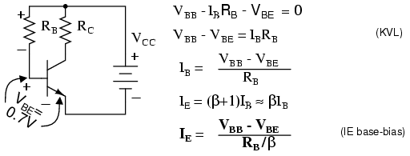{ #fig:03487 width=75% }

_Base-bias_

Silicon small signal transistors typically have a β in the range of 100-300. Assuming that we have a β=100 transistor, what value of base-bias resistor is required to yield an emitter current of 1mA?

Solving the IE base-bias equation for R~B~ and substituting β, V~BB~, V~BE~, and I~E~ yields 930kΩ. The closest standard value is 910kΩ.

{ #fig:13060 width=75% }

What is the emitter current with a 910kΩ resistor? What is the emitter current if we randomly get a β=300 transistor?

{ #fig:13065 width=75% }

The emitter current is little changed in using the standard value 910kΩ resistor. However, with a change in β from 100 to 300, the emitter current has tripled. This is not acceptable in a power amplifier if we expect the collector voltage to swing from near V~CC~ to near ground. However, for low level signals from micro-volts to a about a volt, the bias point can be centered for a β of square root of (100·300)=173. The bias point will still drift by a considerable amount . However, low level signals will not be clipped.

Base-bias by its self is not suitable for high emitter currents, as used in power amplifiers. The base-biased emitter current is not temperature stable. _Thermal run away_ is the result of high emitter current causing a temperature increase which causes an increase in emitter current, which further increases temperature.

### [[Collector-feedback bias]{#xtocid157058911}]

Variations in bias due to temperature and beta may be reduced by moving the V~BB~ end of the base-bias resistor to the collector as in @fig:03490. If the emitter current were to increase, the voltage drop across R~C~ increases, decreasing V~C~, decreasing I~B~ fed back to the base. This, in turn, decreases the emitter current, correcting the original increase.

Write a KVL equation about the loop containing the battery, R~C~ , R~B~ , and the V~BE~ drop. Substitute I~C~≅I~E~ and I~B~≅I~E~/β. Solving for I~E~ yields the IE CFB-bias equation. Solving for I~B~ yields the IB CFB-bias equation.

{ #fig:03490 width=75% }

_Collector-feedback bias._

Find the required collector feedback bias resistor for an emitter current of 1 mA, a 4.7K collector load resistor, and a transistor with β=100 . Find the collector voltage V~C~. It should be approximately midway between V~CC~ and ground.

{ #fig:13063 width=75% }

The closest standard value to the 460k collector feedback bias resistor is 470k. Find the emitter current I~E~ with the 470 K resistor. Recalculate the emitter current for a transistor with β=100 and β=300.

{ #fig:13064 width=75% }

We see that as beta changes from 100 to 300, the emitter current increases from 0.989mA to 1.48mA. This is an improvement over the previous base-bias circuit which had an increase from 1.02mA to 3.07mA. Collector feedback bias is twice as stable as base-bias with respect to beta variation.

### [[Emitter-bias]{#xtocid157058912}]

Inserting a resistor R~E~ in the emitter circuit as in @fig:03488 causes _degeneration_, also known as negative feedback. This opposes a change in emitter current I~E~ due to temperature changes, resistor tolerances, beta variation, or power supply tolerance. Typical tolerances are as follows: resistor--- 5%, beta--- 100-300, power supply--- 5%. Why might the emitter resistor stabilize a change in current? The polarity of the voltage drop across R~E~ is due to the collector battery V~CC~. The end of the resistor closest to the (-) battery terminal is (-), the end closest to the (+) terminal it (+). Note that the (-) end of R~E~ is connected via V~BB~ battery and R~B~ to the base. Any increase in current flow through R~E~ will increase the magnitude of negative voltage applied to the base circuit, decreasing the base current, decreasing the emitter current. This decreasing emitter current partially compensates the original increase.

{ #fig:03488 width=75% }

_Emitter-bias_

Note that base-bias battery V~BB~ is used instead of V~CC~ to bias the base in @fig:03488. Later we will show that the emitter-bias is more effective with a lower base bias battery. Meanwhile, we write the KVL equation for the loop through the base-emitter circuit, paying attention to the polarities on the components. We substitute I~B~≅I~E~/β and solve for emitter current I~E~. This equation can be solved for R~B~ , equation: RB emitter-bias, @fig:03488.

Before applying the equations: RB emitter-bias and IE emitter-bias, @fig:03488, we need to choose values for R~C~ and R~E~ . R~C~ is related to the collector supply V~CC~ and the desired collector current I~C~ which we assume is approximately the emitter current I~E~. Normally the bias point for V~C~ is set to half of V~CC~. Though, it could be set higher to compensate for the voltage drop across the emitter resistor R~E~. The collector current is whatever we require or choose. It could range from micro-Amps to Amps depending on the application and transistor rating. We choose I~C~ = 1mA, typical of a small-signal transistor circuit. We calculate a value for R~C~ and choose a close standard value. An emitter resistor which is 10-50% of the collector load resistor usually works well.

{ #fig:13069 width=75% }

Our first example sets the base-bias supply to high at V~BB~ = V~CC~ = 10V to show why a lower voltage is desirable. Determine the required value of base-bias resistor R~B~. Choose a standard value resistor. Calculate the emitter current for β=100 and β=300. Compare the stabilization of the current to prior bias circuits.

{ #fig:13061 width=75% }

An 883k resistor was calculated for R~B~, an 870k chosen. At β=100, I~E~ is 1.01mA.

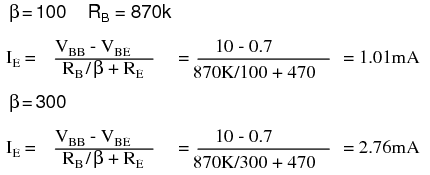{ #fig:13066 width=75% }

For β=300 the emitter currents are shown in Table [below](#emb1.tbl).

[]{#emb1.tbl}

_Emitter current comparison for β=100, β=300._

Bias circuit IC β=100 IC β=300

---

base-bias 1.02mA 3.07mA collector feedback bias 0.989mA 1.48mA emitter-bias, V~BB~=10V 1.01mA 2.76mA

Table [above](#emb1.tbl) shows that for V~BB~ = 10V, emitter-bias does not do a very good job of stabilizing the emitter current. The emitter-bias example is better than the previous base-bias example, but, not by much. The key to effective emitter bias is lowering the base supply V~BB~ nearer to the amount of emitter bias.

How much emitter bias do we Have? Rounding, that is emitter current times emitter resistor: I~E~R~E~ = (1mA)(470) = 0.47V. In addition, we need to overcome the V~BE~ = 0.7V. Thus, we need a V~BB~ \>(0.47 + 0.7)V or \>1.17V. If emitter current deviates, this number will change compared with the fixed base supply V~BB~,causing a correction to base current I~B~ and emitter current I~E~. A good value for V~B~ \>1.17V is 2V.

[]{#13067L <="" a=""}

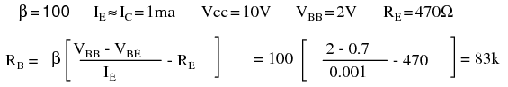{ #fig:13067 width=75% }

The calculated base resistor of 83k is much lower than the previous 883k. We choose 82k from the list of standard values. The emitter currents with the 82k R~B~ for β=100 and β=300 are:

{ #fig:13068 width=75% }

Comparing the emitter currents for emitter-bias with V~BB~ = 2V at β=100 and β=300 to the previous bias circuit examples in Table [below](#emb2.tbl), we see considerable improvement at 1.75mA, though, not as good as the 1.48mA of collector feedback.

[]{#emb2.tbl}

_Emitter current comparison for β=100, β=300._

Bias circuit IC β=100 IC β=300

---

base-bias 1.02mA 3.07mA collector feedback bias 0.989mA 1.48mA emitter-bias, V~BB~=10V 1.01mA 2.76mA emitter-bias, V~BB~=2V 1.01mA 1.75mA

How can we improve the performance of emitter-bias? Either increase the emitter resistor R~E~ or decrease the base-bias supply V~BB~ or both. As an example, we double the emitter resistor to the nearest standard value of 910Ω.

{ #fig:13071 width=75% }

The calculated R~B~ = 39k is a standard value resistor. No need to recalculate I~E~ for β = 100. For β = 300, it is:

{ #fig:13072 width=75% }

The performance of the emitter-bias circuit with a 910 emitter resistor is much improved. See Table [below](#emb3.tbl).

[]{#emb3.tbl}

_Emitter current comparison for β=100, β=300._

Bias circuit IC β=100 IC β=300

---

base-bias 1.02mA 3.07mA collector feedback bias 0.989mA 1.48mA emitter-bias, V~BB~=10V 1.01mA 2.76mA emitter-bias, V~BB~=2V, R~E~=470 1.01mA 1.75mA emitter-bias, V~BB~=2V, R~E~=910 1.00mA 1.25mA

As an exercise, rework the emitter-bias example with the emitter resistor reverted back to 470Ω, and the base-bias supply reduced to 1.5V.\

{ #fig:13073 width=75% }

The 33k base resistor is a standard value, emitter current at β = 100 is OK. The emitter current at β = 300 is:

{ #fig:13074 width=75% }

Table [below](#emb4.tbl) below compares the exercise results 1mA and 1.38mA to the previous examples.

[]{#emb4.tbl}

_Emitter current comparison for β=100, β=300._

Bias circuit IC β=100 IC β=300

---

base-bias 1.02mA 3.07mA collector feedback bias 0.989mA 1.48mA emitter-bias, V~BB~=10V 1.01mA 2.76mA emitter-bias, V~BB~=2V, R~B~=470 1.01mA 1.75mA emitter-bias, V~BB~=2V, R~B~=910 1.00mA 1.25mA emitter-bias, V~BB~=1.5V, R~B~=470 1.00mA 1.38mA

The emitter-bias equations have been repeated in @fig:03489 with the internal emitter resistance included for better accuracy. The _internal emitter resistance_ is the resistance in the emitter circuit contained within the transistor package. This internal resistance r~EE~ is significant when the (external) emitter resistor R~E~ is small, or even zero. The value of internal resistance R~EE~ is a function of emitter current I~E~, Table [below](#emb5.tbl).

[]{#emb5.tbl}

_Derivation of r~EE~_

             rEE = KT/IEm
             where:
                     K=1.38×10-23 watt-sec/oC, Boltzman's constant
                     T= temperature in Kelvins ≅300.
                     IE = emitter current
                     m = varies from 1 to 2 for Silicon
             rEE ≅ 0.026V/IE = 26mV/IE

For reference the 26mV approximation is listed as equation r~EE~ in @fig:03489.

{ #fig:03489 width=75% }

_Emitter-bias equations with internal emitter resistance r~EE~ included.._

The more accurate emitter-bias equations in @fig:03489 may be derived by writing a KVL equation. Alternatively, start with equations IE emitter-bias and R~B~ emitter-bias in Figure [previous](@fig:03488){ #fig:03488 width=75% }, substituting R~E~ with r~EE~+R~E~. The result is equations IE EB and RB EB, respectively in @fig:03489.

Redo the R~B~ calculation in the previous example [emitter-bias](#13067L) with the inclusion of r~EE~ and compare the results.

{ #fig:13062 width=75% }

The inclusion of r~EE~ in the calculation results in a lower value of the base resistor R~B~ a shown in Table [below](#emb6.tbl). It falls below the standard value 82k resistor instead of above it.

[]{#emb6.tbl}

_Effect of inclusion of r~EE~ on calculated R~B~_

r~EE~? r~EE~ Value

---

Without r~EE~ 83k With r~EE~ 80.4k

\
**Bypass Capacitor for R~E~**

One problem with emitter bias is that a considerable part of the output signal is dropped across the emitter resistor R~E~ (@fig:03499). This voltage drop across the emitter resistor is in series with the base and of opposite polarity compared with the input signal. (This is similar to a common collector configuration having \<1 gain.) This degeneration severely reduces the gain from base to collector. The solution for AC signal amplifiers is to bypass the emitter resistor with a capacitor. This restores the AC gain since the capacitor is a short for AC signals. The DC emitter current still experiences degeneration in the emitter resistor, thus, stabilizing the DC current.

{ #fig:03499 width=75% }

_Cbypass is required to prevent AC gain reduction._

What value should the bypass capacitor be? That depends on the lowest frequency to be amplified. For radio frequencies Cbpass would be small. For an audio amplifier extending down to 20Hz it will be large. A "rule of thumb" for the bypass capacitor is that the reactance should be 1/10 of the emitter resistance or less. The capacitor should be designed to accommodate the lowest frequency being amplified. The capacitor for an audio amplifier covering 20Hz to 20kHz would be:

{ #fig:13077 width=75% }

Note that the internal emitter resistance r~EE~ is not bypassed by the bypass capacitor.

### Voltage divider bias{ #sec:xtocid157058913 }

Stable emitter bias requires a low voltage base bias supply, @fig:03494. The alternative to a base supply V~BB~ is a voltage divider based on the collector supply V~CC~.

{ #fig:03494 width=75% }

_Voltage Divider bias replaces base battery with voltage divider._

The design technique is to first work out an emitter-bias design, Then convert it to the voltage divider bias configuration by using Thevenin\'s Theorem. @TK1 The steps are shown graphically in @fig:03495. Draw the voltage divider without assigning values. Break the divider loose from the base. (The base of the transistor is the load.) Apply Thevenin\'s Theorem to yield a single Thevenin equivalent resistance Rth and voltage source Vth.

{ #fig:03495 width=75% }

_Thevenin\'s Theorem converts voltage divider to single supply Vth and resistance Rth._

The Thevenin equivalent resistance is the resistance from load point (arrow) with the battery (V~CC~) reduced to 0 (ground). In other words, R1\|\|R2.The Thevenin equivalent voltage is the open circuit voltage (load removed). This calculation is by the voltage divider ratio method. R1 is obtained by eliminating R2 from the pair of equations for Rth and Vth. The equation of R1 is in terms of known quantities Rth, Vth, Vcc. Note that Rth is R~B~ , the bias resistor from the emitter-bias design. The equation for R2 is in terms of R1 and Rth.

{ #fig:13075 width=75% }

Convert this previous emitter-bias example to voltage divider bias.

{ #fig:03496 width=75% }

_Emitter-bias example converted to voltage divider bias._

These values were previously selected or calculated for an emitter-bias example

{ #fig:13073 width=75% }

Substituting V~CC~ , V~BB~ , R~B~ yields R1 and R2 for the voltage divider bias configuration.

{ #fig:13076 width=75% }

R1 is a standard value of 220K. The closest standard value for R2 corresponding to 38.8k is 39k. This does not change I~E~ enough for us to calculate it.

[]{#CASCODEB <="" a=""}

**Problem:** Calculate the bias resistors for the cascode amplifier in @fig:03501. V~B2~ is the bias voltage for the common emitter stage. V~B1~ is a fairly high voltage at 11.5 because we want the common-base stage to hold the emitter at 11.5-0.7=10.8V, about 11V. (It will be 10V after accounting for the voltage drop across R~B1~ .) That is, the common-base stage is the load, substitute for a resistor, for the common-emitter stage\'s collector. We desire a 1mA emitter current.

{ #fig:03501 width=75% }

_Bias for a cascode amplifier._

**Problem:** Convert the base bias resistors for the cascode amplifier to voltage divider bias resistors driven by the V~CC~ of 20V.

{ #fig:13078 width=75% }

{ #fig:13079 width=75% }

The final circuit diagram is shown in the "Practical Analog Circuits" chapter, "Class A cascode amplifier . . . " [cascode, Ch 9](SEMI_9.html#CASCODEA) .

- **REVIEW:**
- See @fig:03497.
- Select bias circuit configuration
- Select R~C~ and I~E~ for the intended application. The values for R~C~ and I~E~ should normally set collector voltage V~C~ to 1/2 of V~CC~.
- Calculate base resistor R~B~ to achieve desired emitter current.
- Recalculate emitter current I~E~ for standard value resistors if necessary.
- For voltage divider bias, perform emitter-bias calculations first, then determine R1 and R2.
- For AC amplifiers, a bypass capacitor in parallel with R~E~ improves AC gain. Set X~C~≤0.10R~E~ for lowest frequency.

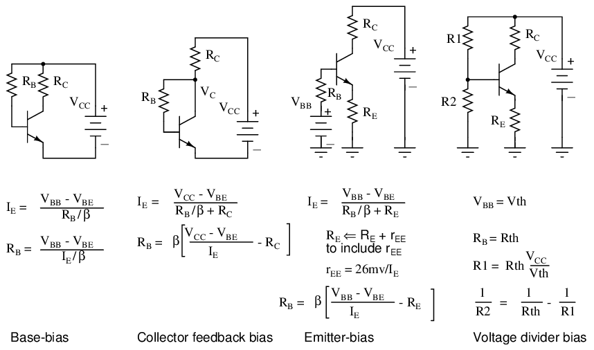{ #fig:03497 width=75% }

_Biasing equations summary._

## Input and output coupling{ #sec:xtocid157058914 }

To overcome the challenge of creating necessary DC bias voltage for an amplifier\'s input signal without resorting to the insertion of a battery in series with the AC signal source, we used a voltage divider connected across the DC power source. To make this work in conjunction with an AC input signal, we "coupled" the signal source to the divider through a capacitor, which acted as a high-pass filter. With that filtering in place, the low impedance of the AC signal source couldn\'t "short out" the DC voltage dropped across the bottom resistor of the voltage divider. A simple solution, but not without any disadvantages.

Most obvious is the fact that using a high-pass filter capacitor to couple the signal source to the amplifier means that the amplifier can only amplify AC signals. A steady, DC voltage applied to the input would be blocked by the coupling capacitor just as much as the voltage divider bias voltage is blocked from the input source. Furthermore, since capacitive reactance is frequency-dependent, lower-frequency AC signals will not be amplified as much as higher-frequency signals. Non-sinusoidal signals will tend to be distorted, as the capacitor responds differently to each of the signal\'s constituent harmonics. An extreme example of this would be a low-frequency square-wave signal in @fig:03136.

{ #fig:03136 width=75% }

_Capacitively coupled low frequency square-wave shows distortion._

Incidentally, this same problem occurs when oscilloscope inputs are set to the "AC coupling" mode as in @fig:03137. In this mode, a coupling capacitor is inserted in series with the measured voltage signal to eliminate any vertical offset of the displayed waveform due to DC voltage combined with the signal. This works fine when the AC component of the measured signal is of a fairly high frequency, and the capacitor offers little impedance to the signal. However, if the signal is of a low frequency, or contains considerable levels of harmonics over a wide frequency range, the oscilloscope\'s display of the waveform will not be accurate. (@fig:03137) Low frequency signals may be viewed by setting the oscilloscope to "DC coupling" in @fig:03139.

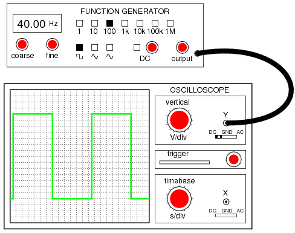{ #fig:03139 width=75% }

_With DC coupling, the oscilloscope properly indicates the shape of the square wave coming from the signal generator._

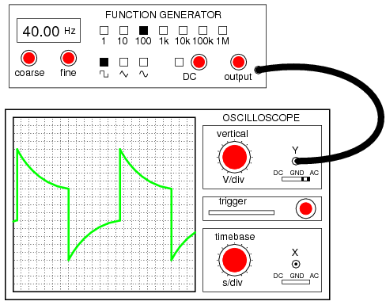{ #fig:03137 width=75% }

_Low frequency: With AC coupling, the high-pass filtering of the coupling capacitor distorts the square wave\'s shape so that what is seen is not an accurate representation of the real signal._

In applications where the limitations of capacitive coupling (@fig:03136) would be intolerable, another solution may be used: _direct coupling_. Direct coupling avoids the use of capacitors or any other frequency-dependent coupling component in favor of resistors. A direct-coupled amplifier circuit is shown in @fig:03138.

{ #fig:03138 width=75% }

_Direct coupled amplifier: direct coupling to speaker._

With no capacitor to filter the input signal, this form of coupling exhibits no frequency dependence. DC and AC signals alike will be amplified by the transistor with the same gain (the transistor itself may tend to amplify some frequencies better than others, but that is another subject entirely!).

If direct coupling works for DC as well as for AC signals, then why use capacitive coupling for _any_ application? One reason might be to avoid any _unwanted_ DC bias voltage naturally present in the signal to be amplified. Some AC signals may be superimposed on an uncontrolled DC voltage right from the source, and an uncontrolled DC voltage would make reliable transistor biasing impossible. The high-pass filtering offered by a coupling capacitor would work well here to avoid biasing problems.

Another reason to use capacitive coupling rather than direct is its relative lack of signal attenuation. Direct coupling through a resistor has the disadvantage of diminishing, or attenuating, the input signal so that only a fraction of it reaches the base of the transistor. In many applications, some attenuation is necessary anyway to prevent signal levels from "overdriving" the transistor into cutoff and saturation, so any attenuation inherent to the coupling network is useful anyway. However, some applications require that there be _no_ signal loss from the input connection to the transistor\'s base for maximum voltage gain, and a direct coupling scheme with a voltage divider for bias simply won\'t suffice.

So far, we\'ve discussed a couple of methods for coupling an _input_ signal to an amplifier, but haven\'t addressed the issue of coupling an amplifier\'s _output_ to a load. The example circuit used to illustrate input coupling will serve well to illustrate the issues involved with output coupling.

In our example circuit, the load is a speaker. Most speakers are electromagnetic in design: that is, they use the force generated by an lightweight electromagnet coil suspended within a strong permanent-magnet field to move a thin paper or plastic cone, producing vibrations in the air which our ears interpret as sound. An applied voltage of one polarity moves the cone outward, while a voltage of the opposite polarity will move the cone inward. To exploit cone\'s full freedom of motion, the speaker must receive true (unbiased) AC voltage. DC bias applied to the speaker coil offsets the cone from its natural center position, and this limits the back-and-forth motion it can sustain from the applied AC voltage without overtraveling. However, our example circuit (@fig:03138) applies a varying voltage of only _one_ polarity across the speaker, because the speaker is connected in series with the transistor which can only conduct current one way. This would be unacceptable for any high-power audio amplifier.

Somehow we need to isolate the speaker from the DC bias of the collector current so that it only receives AC voltage. One way to achieve this goal is to couple the transistor collector circuit to the speaker through a transformer in @fig:03140)

{ #fig:03140 width=75% }

_Transformer coupling isolates DC from the load (speaker)._

Voltage induced in the secondary (speaker-side) of the transformer will be strictly due to _variations_ in collector current, because the mutual inductance of a transformer only works on _changes_ in winding current. In other words, only the AC portion of the collector current signal will be coupled to the secondary side for powering the speaker. The speaker will "see" true alternating current at its terminals, without any DC bias.

Transformer output coupling works, and has the added benefit of being able to provide impedance matching between the transistor circuit and the speaker coil with custom winding ratios. However, transformers tend to be large and heavy, especially for high-power applications. Also, it is difficult to engineer a transformer to handle signals over a wide range of frequencies, which is almost always required for audio applications. To make matters worse, DC current through the primary winding adds to the magnetization of the core in one polarity only, which tends to make the transformer core saturate more easily in one AC polarity cycle than the other. This problem is reminiscent of having the speaker directly connected in series with the transistor: a DC bias current tends to limit how much output signal amplitude the system can handle without distortion. Generally, though, a transformer can be designed to handle a lot more DC bias current than a speaker without running into trouble, so transformer coupling is still a viable solution in most cases. See the coupling transformer between Q4 and the speaker, [Regency TR1, Ch 9](SEMI_9.html#RegencyTr1) as an example of transformer coupling.

Another method to isolate the speaker from DC bias in the output signal is to alter the circuit a bit and use a coupling capacitor in a manner similar to coupling the input signal (@fig:03141) to the amplifier.

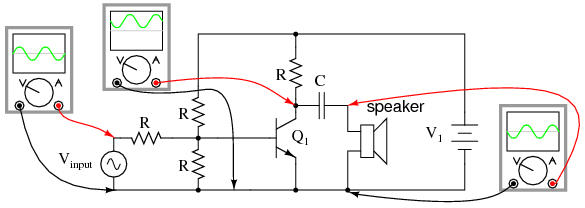{ #fig:03141 width=75% }

_Capacitor coupling isolates DC from the load._

This circuit in @fig:03141 resembles the more conventional form of common-emitter amplifier, with the transistor collector connected to the battery through a resistor. The capacitor acts as a high-pass filter, passing most of the AC voltage to the speaker while blocking all DC voltage. Again, the value of this coupling capacitor is chosen so that its impedance at the expected signal frequency will be arbitrarily low.

The blocking of DC voltage from an amplifier\'s output, be it via a transformer or a capacitor, is useful not only in coupling an amplifier to a load, but also in coupling one amplifier to another amplifier. "Staged" amplifiers are often used to achieve higher power gains than what would be possible using a single transistor as in @fig:03142.

[]{#03142L <="" a=""}

{ #fig:03142 width=75% }

_Capacitor coupled three stage common-emitter amplifier._

While it is possible to directly couple each stage to the next (via a resistor rather than a capacitor), this makes the whole amplifier _very_ sensitive to variations in the DC bias voltage of the first stage, since that DC voltage will be amplified along with the AC signal until the last stage. In other words, the biasing of the first stage will affect the biasing of the second stage, and so on. However, if the stages are capacitively coupled shown in the above illustration, the biasing of one stage has no effect on the biasing of the next, because DC voltage is blocked from passing on to the next stage.

Transformer coupling between amplifier stages is also a possibility, but less often seen due to some of the problems inherent to transformers mentioned previously. One notable exception to this rule is in radio-frequency amplifiers (@fig:03143) with small coupling transformers, having air cores (making them immune to saturation effects), that are part of a resonant circuit to block unwanted harmonic frequencies from passing on to subsequent stages. The use of resonant circuits assumes that the signal frequency remains constant, which is typical of radio circuitry. Also, the "flywheel" effect of LC tank circuits allows for class C operation for high efficiency.

{ #fig:03143 width=75% }

_Three stage tuned RF amplifier illustrates transformer coupling._

Note the transformer coupling between transistors Q1, Q2, Q3, and Q4, [Regency TR1, Ch 9](SEMI_9.html#RegencyTr1) . The three intermediate frequency (IF) transformers within the dashed boxes couple the IF signal from collector to base of following transistor IF amplifiers. The _intermediate freqency_ ampliers are RF amplifiers, though, at a different frequency than the antenna RF input.

Having said all this, it must be mentioned that it _is_ possible to use direct coupling within a multi-stage transistor amplifier circuit. In cases where the amplifier is expected to handle DC signals, this is the only alternative.

The trend of electronics to more widespread use of integrated circuits has encouraged the use of direct coupling over transformer or capacitor coupling. The only easily manufactured integrated circuit component is the transistor. Moderate quality resistors can also be produced. Though, transistors are favored. Integrated capacitors to only a few 10\'s of pF are possible. Large capacitors are not integrable. If necessary, these can be external components. The same is true of transformers. Since integrated transistors are inexpensive, as many transistors as possible are substituted for the offending capacitors and transformers. As much direct coupled gain as possible is designed into ICs between the external coupling components. While external capacitors and transformers are used, these are even being designed out if possible. The result is that a modern IC radio (See "IC radio", [Ch 9](SEMI_9.html#03476.png){ #fig:03476 width=75% } ) looks nothing like the original 4-transistor radio [Regency TR1, Ch 9](SEMI_9.html#RegencyTr1) .

Even discrete transistors are inexpensive compared with transformers. Bulky audio transformers can be replaced by transistors. For example, a common-collector (emitter follower) configuration can impedance match a low output impedance like a speaker. It is also possible to replace large coupling capacitors with transistor circuitry.

We still like to illustrate texts with transformer coupled audio amplifiers. The circuits are simple. The component count is low. And, these are good introductory circuits--- easy to understand.

The circuit in @fig:03474 (a) is a simplified transformer coupled _push-pull_ audio amplifier. In push-pull, pair of transistors alternately amplify the positive and negative portions of the input signal. Neither transistor nor the other conducts for no signal input. A positive input signal will be positive at the top of the transformer secondary causing the top transistor to conduct. A negative input will yield a positive signal at the bottom of the secondary, driving the bottom transistor into conduction. Thus the transistors amplify alternate halves of a signal. As drawn, neither transistor in @fig:03474 (a) will conduct for an input below 0.7 Vpeak. A practical circuit connects the secondary center tap to a 0.7 V (or greater) resistor divider instead of ground to bias both transistor for true class B.

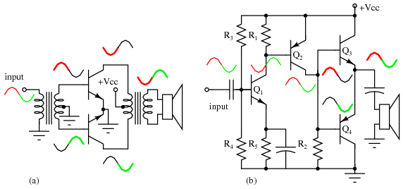{ #fig:03474 width=75% }

*(a) Transformer coupled push-pull amplifier. (b) Direct coupled *complementary-pair* amplifier replaces transformers with transistors.*

The circuit in @fig:03474 (b) is the modern version which replaces the transformer functions with transistors. Transistors Q~1~ and Q~2~ are common emitter amplifiers, inverting the signal with gain from base to collector. Transistors Q~3~ and Q~4~ are known as a _complementary pair_ because these NPN and PNP transistors amplify alternate halves (positive and negative, respectively) of the waveform. The parallel connection the bases allows phase splitting without an input transformer at (a). The speaker is the emitter load for Q~3~ and Q~4~. Parallel connection of the emitters of the NPN and PNP transistors eliminates the center-tapped output transformer at (a) The low output impedance of the emitter follower serves to match the low 8 Ω impedance of the speaker to the preceding common emitter stage. Thus, inexpensive transistors replace transformers. For the complete circuit see" Direct coupled complementary symmetry 3 w audio amplifier,"[Ch 9](SEMI_9.html#03475.png){ #fig:03475 width=75% }

- **REVIEW:**
- Capacitive coupling acts like a high-pass filter on the input of an amplifier. This tends to make the amplifier\'s voltage gain decrease at lower signal frequencies. Capacitive-coupled amplifiers are all but unresponsive to DC input signals.
- Direct coupling with a series resistor instead of a series capacitor avoids the problem of frequency-dependent gain, but has the disadvantage of reducing amplifier gain for all signal frequencies by attenuating the input signal.
- Transformers and capacitors may be used to couple the output of an amplifier to a load, to eliminate DC voltage from getting to the load.
- Multi-stage amplifiers often make use of capacitive coupling between stages to eliminate problems with the bias from one stage affecting the bias of another.

[]{#FBtheory <="" a=""}

## Feedback{ #sec:xtocid157058915 }

If some percentage of an amplifier\'s output signal is connected to the input, so that the amplifier amplifies part of its own output signal, we have what is known as _feedback_. Feedback comes in two varieties: _positive_ (also called _regenerative_), and _negative_ (also called _degenerative_). Positive feedback reinforces the direction of an amplifier\'s output voltage change, while negative feedback does just the opposite.

A familiar example of feedback happens in public-address ("PA") systems where someone holds the microphone too close to a speaker: a high-pitched "whine" or "howl" ensues, because the audio amplifier system is detecting and amplifying its own noise. Specifically, this is an example of _positive_ or _regenerative_ feedback, as any sound detected by the microphone is amplified and turned into a louder sound by the speaker, which is then detected by the microphone again, and so on . . . the result being a noise of steadily increasing volume until the system becomes "saturated" and cannot produce any more volume.

One might wonder what possible benefit feedback is to an amplifier circuit, given such an annoying example as PA system "howl." If we introduce positive, or regenerative, feedback into an amplifier circuit, it has the tendency of creating and sustaining oscillations, the frequency of which determined by the values of components handling the feedback signal from output to input. This is one way to make an _oscillator_ circuit to produce AC from a DC power supply. Oscillators are very useful circuits, and so feedback has a definite, practical application for us. See "Phase shift oscillator" [, Ch 9](SEMI_9.html#03473.png){ #fig:03473 width=75% } for a practical application of positive feedback.

Negative feedback, on the other hand, has a "dampening" effect on an amplifier: if the output signal happens to increase in magnitude, the feedback signal introduces a decreasing influence into the input of the amplifier, thus opposing the change in output signal. While positive feedback drives an amplifier circuit toward a point of instability (oscillations), negative feedback drives it the opposite direction: toward a point of stability.

An amplifier circuit equipped with some amount of negative feedback is not only more stable, but it distorts the input waveform less and is generally capable of amplifying a wider range of frequencies. The tradeoff for these advantages (there just _has_ to be a disadvantage to negative feedback, right?) is decreased gain. If a portion of an amplifier\'s output signal is "fed back" to the input to oppose any changes in the output, it will require a greater input signal amplitude to drive the amplifier\'s output to the same amplitude as before. This constitutes a decreased gain. However, the advantages of stability, lower distortion, and greater bandwidth are worth the tradeoff in reduced gain for many applications.

Let\'s examine a simple amplifier circuit and see how we might introduce negative feedback into it, starting with @fig:03311.

{ #fig:03311 width=75% }

_Common-emitter amplifier without feedback._

The amplifier configuration shown here is a common-emitter, with a resistor bias network formed by R~1~ and R~2~. The capacitor couples V~input~ to the amplifier so that the signal source doesn\'t have a DC voltage imposed on it by the R~1~/R~2~ divider network. Resistor R~3~ serves the purpose of controlling voltage gain. We could omit it for maximum voltage gain, but since base resistors like this are common in common-emitter amplifier circuits, we\'ll keep it in this schematic.

Like all common-emitter amplifiers, this one _inverts_ the input signal as it is amplified. In other words, a positive-going input voltage causes the output voltage to decrease, or move toward negative, and vice versa. The oscilloscope waveforms are shown in @fig:03312.

{ #fig:03312 width=75% }

_Common-emitter amplifier, no feedback, with reference waveforms for comparison._

Because the output is an inverted, or mirror-image, reproduction of the input signal, any connection between the output (collector) wire and the input (base) wire of the transistor in @fig:03313 will result in _negative_ feedback.

{ #fig:03313 width=75% }

_Negative feedback, collector feedback, decreases the output signal._

The resistances of R~1~, R~2~, R~3~, and R~feedback~ function together as a signal-mixing network so that the voltage seen at the base of the transistor (with respect to ground) is a weighted average of the input voltage and the feedback voltage, resulting in signal of reduced amplitude going into the transistor. So, the amplifier circuit in @fig:03313 will have reduced voltage gain, but improved linearity (reduced distortion) and increased bandwidth.

A resistor connecting collector to base is not the only way to introduce negative feedback into this amplifier circuit, though. Another method, although more difficult to understand at first, involves the placement of a resistor between the transistor\'s emitter terminal and circuit ground in @fig:03314.

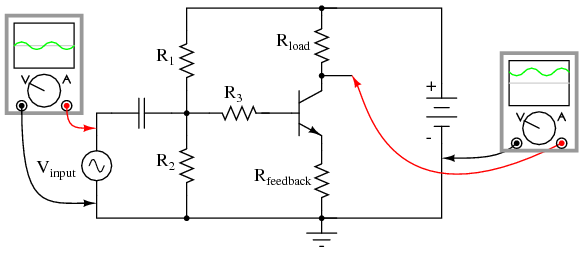{ #fig:03314 width=75% }

_Emitter feedback: A different method of introducing negative feedback into a circuit._

This new feedback resistor drops voltage proportional to the emitter current through the transistor, and it does so in such a way as to oppose the input signal\'s influence on the base-emitter junction of the transistor. Let\'s take a closer look at the emitter-base junction and see what difference this new resistor makes in @fig:03315.

With no feedback resistor connecting the emitter to ground in @fig:03315 (a) , whatever level of input signal (V~input~) makes it through the coupling capacitor and R~1~/R~2~/R~3~ resistor network will be impressed directly across the base-emitter junction as the transistor\'s input voltage (V~B-E~). In other words, with no feedback resistor, V~B-E~ equals V~input~. Therefore, if V~input~ increases by 100 mV, then V~B-E~ increases by 100 mV: a change in one is the same as a change in the other, since the two voltages are equal to each other.

Now let\'s consider the effects of inserting a resistor (R~feedback~) between the transistor\'s emitter lead and ground in @fig:03315 (b).

[]{#03315.png <="" a=""}

---

{ #fig:03315 width=75% } { #fig:03316 width=75% }

---

_(a) No feedback vs (b) emitter feedback. A waveform at the collector is inverted with respect to the base. At (b) the emitter waveform is in-phase (emitter follower) with base, out of phase with collector. Therefore, the emitter signal subtracts from the collector output signal._

Note how the voltage dropped across R~feedback~ adds with V~B-E~ to equal V~input~. With R~feedback~ in the V~input~ \-- V~B-E~ loop, V~B-E~ will no longer be equal to V~input~. We know that R~feedback~ will drop a voltage proportional to emitter current, which is in turn controlled by the base current, which is in turn controlled by the voltage dropped across the base-emitter junction of the transistor (V~B-E~). Thus, if V~input~ were to increase in a positive direction, it would increase V~B-E~, causing more base current, causing more collector (load) current, causing more emitter current, and causing more feedback voltage to be dropped across R~feedback~. This increase of voltage drop across the feedback resistor, though, _subtracts_ from V~input~ to reduce the V~B-E~, so that the actual voltage increase for V~B-E~ will be less than the voltage increase of V~input~. No longer will a 100 mV increase in V~input~ result in a full 100 mV increase for V~B-E~, because the two voltages are _not_ equal to each other.

Consequently, the input voltage has less control over the transistor than before, and the voltage gain for the amplifier is reduced: just what we expected from negative feedback.

In practical common-emitter circuits, negative feedback isn\'t just a luxury; its a necessity for stable operation. In a perfect world, we could build and operate a common-emitter transistor amplifier with no negative feedback, and have the full amplitude of V~input~ impressed across the transistor\'s base-emitter junction. This would give us a large voltage gain. Unfortunately, though, the relationship between base-emitter voltage and base-emitter current changes with temperature, as predicted by the "diode equation." As the transistor heats up, there will be less of a forward voltage drop across the base-emitter junction for any given current. This causes a problem for us, as the R~1~/R~2~ voltage divider network is designed to provide the correct quiescent current through the base of the transistor so that it will operate in whatever class of operation we desire (in this example, I\'ve shown the amplifier working in class-A mode). If the transistor\'s voltage/current relationship changes with temperature, the amount of DC bias voltage necessary for the desired class of operation will change. A hot transistor will draw more bias current for the same amount of bias voltage, making it heat up even more, drawing even more bias current. The result, if unchecked, is called _thermal runaway_.

Common-collector amplifiers, (@fig:03317) however, do not suffer from thermal runaway. Why is this? The answer has everything to do with negative feedback.

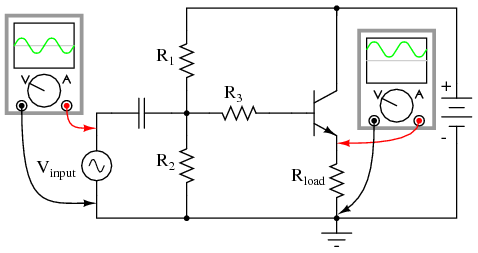{ #fig:03317 width=75% }

_Common collector (emitter follower) amplifier._

Note that the common-collector amplifier (@fig:03317) has its load resistor placed in exactly the same spot as we had the R~feedback~ resistor in the last circuit in @fig:03315 (b): between emitter and ground. This means that the only voltage impressed across the transistor\'s base-emitter junction is the _difference_ between V~input~ and V~output~, resulting in a very low voltage gain (usually close to 1 for a common-collector amplifier). Thermal runaway is impossible for this amplifier: if base current happens to increase due to transistor heating, emitter current will likewise increase, dropping more voltage across the load, which in turn _subtracts_ from V~input~ to reduce the amount of voltage dropped between base and emitter. In other words, the negative feedback afforded by placement of the load resistor makes the problem of thermal runaway _self-correcting_. In exchange for a greatly reduced voltage gain, we get superb stability and immunity from thermal runaway.

By adding a "feedback" resistor between emitter and ground in a common-emitter amplifier, we make the amplifier behave a little less like an "ideal" common-emitter and a little more like a common-collector. The feedback resistor value is typically quite a bit less than the load, minimizing the amount of negative feedback and keeping the voltage gain fairly high.

Another benefit of negative feedback, seen clearly in the common-collector circuit, is that it tends to make the voltage gain of the amplifier less dependent on the characteristics of the transistor. Note that in a common-collector amplifier, voltage gain is nearly equal to unity (1), regardless of the transistor\'s β. This means, among other things, that we could replace the transistor in a common-collector amplifier with one having a different β and not see any significant changes in voltage gain. In a common-emitter circuit, the voltage gain is highly dependent on β. If we were to replace the transistor in a common-emitter circuit with another of differing β, the voltage gain for the amplifier would change significantly. In a common-emitter amplifier equipped with negative feedback, the voltage gain will still be dependent upon transistor β to some degree, but not as much as before, making the circuit more predictable despite variations in transistor β.

The fact that we have to introduce negative feedback into a common-emitter amplifier to avoid thermal runaway is an unsatisfying solution. Is it possibe to avoid thermal runaway without having to suppress the amplifier\'s inherently high voltage gain? A best-of-both-worlds solution to this dilemma is available to us if we closely examine the problem: the voltage gain that we have to minimize in order to avoid thermal runaway is the _DC_ voltage gain, not the _AC_ voltage gain. After all, it isn\'t the AC input signal that fuels thermal runaway: its the DC bias voltage required for a certain class of operation: that quiescent DC signal that we use to "trick" the transistor (fundamentally a DC device) into amplifying an AC signal. We can suppress DC voltage gain in a common-emitter amplifier circuit without suppressing AC voltage gain if we figure out a way to make the negative feedback only function with DC. That is, if we only feed back an inverted DC signal from output to input, but not an inverted AC signal.

The R~feedback~ emitter resistor provides negative feedback by dropping a voltage proportional to load current. In other words, negative feedback is accomplished by inserting an impedance into the emitter current path. If we want to feed back DC but not AC, we need an impedance that is high for DC but low for AC. What kind of circuit presents a high impedance to DC but a low impedance to AC? A high-pass filter, of course!

By connecting a capacitor in parallel with the feedback resistor in @fig:03318, we create the very situation we need: a path from emitter to ground that is easier for AC than it is for DC.

{ #fig:03318 width=75% }

_High AC voltage gain reestablished by adding C~bypass~ in parallel with R~feedback~_

The new capacitor "bypasses" AC from the transistor\'s emitter to ground, so that no appreciable AC voltage will be dropped from emitter to ground to "feed back" to the input and suppress voltage gain. Direct current, on the other hand, cannot go through the bypass capacitor, and so must travel through the feedback resistor, dropping a DC voltage between emitter and ground which lowers the DC voltage gain and stabilizes the amplifier\'s DC response, preventing thermal runaway. Because we want the reactance of this capacitor (X~C~) to be as low as possible, C~bypass~ should be sized relatively large. Because the polarity across this capacitor will never change, it is safe to use a polarized (electrolytic) capacitor for the task.

Another approach to the problem of negative feedback reducing voltage gain is to use multi-stage amplifiers rather than single-transistor amplifiers. If the attenuated gain of a single transistor is insufficient for the task at hand, we can use more than one transistor to make up for the reduction caused by feedback. An example circuit showing negative feedback in a three-stage common-emitter amplifier is @fig:03321.

{ #fig:03321 width=75% }

_Feedback around an "odd" number of direct coupled stages produce negative feedback._

The feedback path from the final output to the input is through a single resistor, R~feedback~. Since each stage is a common-emitter amplifier (thus inverting), the odd number of stages from input to output will invert the output signal; the feedback will be negative (degenerative). Relatively large amounts of feedback may be used without sacrificing voltage gain, because the three amplifier stages provide much gain to begin with.

At first, this design philosophy may seem inelegant and perhaps even counter-productive. Isn\'t this a rather crude way to overcome the loss in gain incurred through the use of negative feedback, to simply recover gain by adding stage after stage? What is the point of creating a huge voltage gain using three transistor stages if we\'re just going to attenuate all that gain anyway with negative feedback? The point, though perhaps not apparent at first, is increased predictability and stability from the circuit as a whole. If the three transistor stages are designed to provide an arbitrarily high voltage gain (in the tens of thousands, or greater) with no feedback, it will be found that the addition of negative feedback causes the overall voltage gain to become less dependent of the individual stage gains, and approximately equal to the simple ratio R~feedback~/R~in~. The more voltage gain the circuit has (without feedback), the more closely the voltage gain will approximate R~feedback~/R~in~ once feedback is established. In other words, voltage gain in this circuit is fixed by the values of two resistors, and nothing more.

This is an advantage for mass-production of electronic circuitry: if amplifiers of predictable gain may be constructed using transistors of widely varied β values, it eases the selection and replacement of components. It also means the amplifier\'s gain varies little with changes in temperature. This principle of stable gain control through a high-gain amplifier "tamed" by negative feedback is elevated almost to an art form in electronic circuits called _operational amplifiers_, or _op-amps_. You may read much more about these circuits in a later chapter of this book!

- **REVIEW:**
- _Feedback_ is the coupling of an amplifier\'s output to its input.
- _Positive_, or _regenerative_ feedback has the tendency of making an amplifier circuit unstable, so that it produces oscillations (AC). The frequency of these oscillations is largely determined by the components in the feedback network.
- _Negative_, or _degenerative_ feedback has the tendency of making an amplifier circuit more stable, so that its output changes _less_ for a given input signal than without feedback. This reduces the gain of the amplifier, but has the advantage of decreasing distortion and increasing bandwidth (the range of frequencies the amplifier can handle).
- Negative feedback may be introduced into a common-emitter circuit by coupling collector to base, or by inserting a resistor between emitter and ground.
- An emitter-to-ground "feedback" resistor is usually found in common-emitter circuits as a preventative measure against _thermal runaway_.
- Negative feedback also has the advantage of making amplifier voltage gain more dependent on resistor values and less dependent on the transistor\'s characteristics.
- Common-collector amplifiers have much negative feedback, due to the placement of the load resistor between emitter and ground. This feedback accounts for the extremely stable voltage gain of the amplifier, as well as its immunity against thermal runaway.
- Voltage gain for a common-emitter circuit may be re-established without sacrificing immunity to thermal runaway, by connecting a _bypass capacitor_ in parallel with the emitter "feedback resistor."
- If the voltage gain of an amplifier is arbitrarily high (tens of thousands, or greater), and negative feedback is used to reduce the gain to reasonable levels, it will be found that the gain will approximately equal R~feedback~/R~in~. Changes in transistor β or other internal component values will have little effect on voltage gain with feedback in operation, resulting in an amplifier that is stable and easy to design.

## Amplifier impedances{ #sec:xtocid157058916 }

Input impedance varies considerably with the circuit configuration shown in @fig:03486. It also varies with biasing. Not considered here, the input impedance is complex and varies with frequency. For the common-emitter and common-collector it is base resistance times β. The base resistance can be both internal and external to the transistor. For the common-collector:

             Rin = βRE

It is a bit more complicated for the common-emitter circuit. We need to know the internal emitter resistance r~EE~. This is given by:

             rEE = KT/IEm
             where:
                     K=1.38×10-23 watt-sec/oC, Boltzman's constant
                     T= temperature in Kelvins ≅300.
                     IE = emitter current
                     m = varies from 1 to 2 for Silicon
             RE ≅ 0.026V/IE = 26mV/IE

Thus, for the common-emitter circuit Rin is

             Rin = βrEE

As an example the input resistance of a, β = 100, CE configuration biased at 1 mA is:

            rEE = 26mV/1mA = 26Ω
             Rin = βrEE = 100(26) = 2600Ω

Moreover, a more accurate Rin for the common-collector should have included r~EE~

             Rin = β(RE + rEE)

This equation (above) is also applicable to a common-emitter configuration with an emitter resistor.

Input impedance for the common-base configuration is Rin = r~EE~.

The high input impedance of the common-collector configuration matches high impedance sources. A crystal or ceramic microphone is one such high impedance source. The common-base arrangement is sometimes used in RF (radio frequency) circuits to match a low impedance source, for example, a 50 Ω coaxial cable feed. For moderate impedance sources, the common-emitter is a good match. An example is a dynamic microphone.

The output impedances of the three basic configurations are listed in @fig:03486. The moderate output impedance of the common-emitter configuration helps make it a popular choice for general use. The Low output impedance of the common-collector is put to good use in impedance matching, for example, tranformerless matching to a 4 Ohm speaker. There do not appear to be any simple formulas for the output impedances. However, R. Victor Jones develops expressions for output resistance. @RVJ

{ #fig:03486 width=75% }

_Amplifier characteristics, adapted from GE Transistor Manual, Figure 1.21.@GET_

- **REVIEW:**
- See @fig:03486.

## Current mirrors{ #sec:xtocid157058917 }

An often-used circuit applying the bipolar junction transistor is the so-called _current mirror_, which serves as a simple current regulator, supplying nearly constant current to a load over a wide range of load resistances.

We know that in a transistor operating in its active mode, collector current is equal to base current multiplied by the ratio β. We also know that the ratio between collector current and emitter current is called α. Because collector current is equal to base current multiplied by β, and emitter current is the sum of the base and collector currents, α should be mathematically derivable from β. If you do the algebra, you\'ll find that α = β/(β+1) for any transistor.

We\'ve seen already how maintaining a constant base current through an active transistor results in the regulation of collector current, according to the β ratio. Well, the α ratio works similarly: if emitter current is held constant, collector current will remain at a stable, regulated value so long as the transistor has enough collector-to-emitter voltage drop to maintain it in its active mode. Therefore, if we have a way of holding emitter current constant through a transistor, the transistor will work to regulate collector current at a constant value.

Remember that the base-emitter junction of a BJT is nothing more than a PN junction, just like a diode, and that the "diode equation" specifies how much current will go through a PN junction given forward voltage drop and junction temperature:

{ #fig:13047 width=75% }

If both junction voltage and temperature are held constant, then the PN junction current will be constant. Following this rationale, if we were to hold the base-emitter voltage of a transistor constant, then its emitter current will be constant, given a constant temperature. (@fig:03279)

{ #fig:03279 width=75% }

_Constant V~BE~ gives constant I~B~, constant I~E~, and constant I~C~._

This constant emitter current, multiplied by a constant α ratio, gives a constant collector current through R~load~, if enough battery voltage is available to keep the transistor in its active mode for any change in R~load~\'s resistance.

To maintain a constant voltage across the transistor\'s base-emitter junction use a forward-biased diode to establish a constant voltage of approximately 0.7 volts, and connect it in parallel with the base-emitter junction as in @fig:03280.

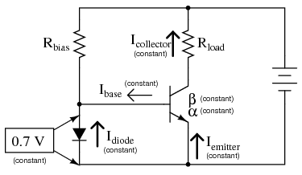{ #fig:03280 width=75% }

_Diode junction 0.7 V maintains constant base voltage, and constant base current._

The voltage dropped across the diode probably won\'t be 0.7 volts exactly. The exact amount of forward voltage dropped across it depends on the current through the diode, and the diode\'s temperature, all in accordance with the diode equation. If diode current is increased (say, by reducing the resistance of R~bias~), its voltage drop will increase slightly, increasing the voltage drop across the transistor\'s base-emitter junction, which will increase the emitter current by the same proportion, assuming the diode\'s PN junction and the transistor\'s base-emitter junction are well-matched to each other. In other words, transistor emitter current will closely equal diode current at any given time. If you change the diode current by changing the resistance value of R~bias~, then the transistor\'s emitter current will follow suit, because the emitter current is described by the same equation as the diode\'s, and both PN junctions experience the same voltage drop.

Remember, the transistor\'s collector current is almost equal to its emitter current, as the α ratio of a typical transistor is almost unity (1). If we have control over the transistor\'s emitter current by setting diode current with a simple resistor adjustment, then we likewise have control over the transistor\'s collector current. In other words, collector current mimics, or _mirrors_, diode current.

Current through resistor R~load~ is therefore a function of current set by the bias resistor, the two being nearly equal. This is the function of the current mirror circuit: to regulate current through the load resistor by conveniently adjusting the value of R~bias~. Current through the diode is described by a simple equation: power supply voltage minus diode voltage (almost a constant value), divided by the resistance of R~bias~.

To better match the characteristics of the two PN junctions (the diode junction and the transistor base-emitter junction), a transistor may be used in place of a regular diode, as in @fig:03281 (a).

[]{#03281.png <="" a=""}

---

{ #fig:03281 width=75% } { #fig:03282 width=75% }

---

_Current mirror circuits._

Because temperature is a factor in the "diode equation," and we want the two PN junctions to behave identically under all operating conditions, we should maintain the two transistors at exactly the same temperature. This is easily done using discrete components by gluing the two transistor cases back-to-back. If the transistors are manufactured together on a single chip of silicon (as a so-called _integrated circuit_, or _IC_), the designers should locate the two transistors close to one another to facilitate heat transfer between them.

[]{#Current sourcing vs. sinking}

The current mirror circuit shown with two NPN transistors in @fig:03281 (a) is sometimes called a _current-sinking_ type, because the regulating transistor conducts current to the load _from ground_ ("sinking" current), rather than _from the positive side of the battery_ ("sourcing" current). If we wish to have a grounded load, and a _current sourcing_ mirror circuit, we may use PNP transistors like @fig:03281 (b).

While resistors can be manufactured in ICs, it is easier to fabricate transistors. IC designers avoid some resistors by replacing load resistors with current sources. A circuit like an operational amplifier built from discrete components will have a few transistors and many resistors. An integrated circuit version will have many transistors and a few resistors. In @fig:03129 One voltage reference, Q1, drives multiple current sources: Q2, Q3, and Q4. If Q2 and Q3 are equal area transistors the load currents I~load~ will be equal. If we need a 2·I~load~, parallel Q2 and Q3. Better yet fabricate one transistor, say Q3 with twice the area of Q2. Current I3 will then be twice I2. In other words, load current scales with transistor area.

{ #fig:03129 width=75% }

_Multiple current mirrors may be slaved from a single (Q1 - R~bias~) voltage source._

Note that it is customary to draw the base voltage line right through the transistor symbols for multiple current mirrors! Or in the case of Q4 in @fig:03129, two current sources are associated with a single transistor symbol. The load resistors are drawn almost invisible to emphasize the fact that these do not exist in most cases. The load is often another (multiple) transistor circuit, say a pair of emitters of a differential amplifier, for example Q3 and Q4 in \"A simple operational amplifier\"[, Ch 8](SEMI_8.html#03322.png){ #fig:03322 width=75% } . Often, the collector load of a transistor is not a resistor but a current mirror. For example the collector load of Q4 collector [, Ch 8](SEMI_8.html#03322.png){ #fig:03322 width=75% } is a current mirror (Q2).

For an example of a current mirror with multiple collector outputs see Q13 in the model 741 op-amp [, Ch 8](SEMI_8.html#03323.png){ #fig:03323 width=75% } . The Q13 current mirror outputs substitute for resistors as collector loads for Q15 and Q17. We see from these examples that current mirrors are preferred as loads over resistors in integrated circuitry.

- **REVIEW:**
- A _current mirror_ is a transistor circuit that regulates current through a load resistance, the regulation point being set by a simple resistor adjustment.
- Transistors in a current mirror circuit must be maintained at the same temperature for precise operation. When using discrete transistors, you may glue their cases together to do this.
- Current mirror circuits may be found in two basic varieties: the current _sinking_ configuration, where the regulating transistor connects the load to ground; and the current _sourcing_ configuration, where the regulating transistor connects the load to the positive terminal of the DC power supply.

## Transistor ratings and packages{ #sec:xtocid157058918 }

Like all electrical and electronic components, transistors are limited in the amounts of voltage and current each one can handle without sustaining damage. Since transistors are more complex than some of the other components you\'re used to seeing at this point, these tend to have more kinds of ratings. What follows is an itemized description of some typical transistor ratings.

_Power dissipation_: When a transistor conducts current between collector and emitter, it also drops voltage between those two points. At any given time, the power dissipated by a transistor is equal to the product (multiplication) of collector current and collector-emitter voltage. Just like resistors, transistors are rated for how many watts each can safely dissipate without sustaining damage. High temperature is the mortal enemy of all semiconductor devices, and bipolar transistors tend to be more susceptible to thermal damage than most. Power ratings are always referenced to the temperature of ambient (surrounding) air. When transistors are to be used in hotter environments (\>25~o~, their power ratings must be _derated_ to avoid a shortened service life.

_Reverse voltages_: As with diodes, bipolar transistors are rated for maximum allowable reverse-bias voltage across their PN junctions. This includes voltage ratings for the emitter-base junction V~EB~ , collector-base junction V~CB~ , and also from collector to emitter V~CE~ .

V~EB~ , the maximum reverse voltage from emitter to base is approximately 7 V for some small signal transistors. Some circuit designers use discrete BJTs as 7 V zener diodes with a series current limiting resistor. Transistor inputs to analog integrated circuits also have a V~EB~ rating, which if exceeded will cause damage, no zenering of the inputs is allowed.

The rating for maximum collector-emitter voltage V~CE~ can be thought of as the maximum voltage it can withstand while in full-cutoff mode (no base current). This rating is of particular importance when using a bipolar transistor as a switch. A typical value for a small signal transistor is 60 to 80 V. In power transistors, this could range to 1000 V, for example, a horizontal deflection transistor in a cathode ray tube display.

_Collector current_: A maximum value for collector current I~C~ will be given by the manufacturer in amps. Typical values for small signal transistors are 10s to 100s of mA, 10s of A for power transistors. Understand that this maximum figure assumes a saturated state (minimum collector-emitter voltage drop). If the transistor is _not_ saturated, and in fact is dropping substantial voltage between collector and emitter, the maximum power dissipation rating will probably be exceeded before the maximum collector current rating. Just something to keep in mind when designing a transistor circuit!

_Saturation voltages_: Ideally, a saturated transistor acts as a closed switch contact between collector and emitter, dropping zero voltage at full collector current. In reality this is _never_ true. Manufacturers will specify the maximum voltage drop of a transistor at saturation, both between the collector and emitter, and also between base and emitter (forward voltage drop of that PN junction). Collector-emitter voltage drop at saturation is generally expected to be 0.3 volts or less, but this figure is of course dependent on the specific type of transistor. Low voltage transistors, low V~CE~ , show lower saturation voltages. The saturation voltage is also lower for higher base drive current.

Base-emitter forward voltage drop, kV~BE~ , is similar to that of an equivalent diode, ≅0.7 V, which should come as no surprise.

_Beta_: The ratio of collector current to base current, β is the fundamental parameter characterizing the amplifying ability of a bipolar transistor. β is usually assumed to be a constant figure in circuit calculations, but unfortunately this is far from true in practice. As such, manufacturers provide a set of β (or "h~fe~") figures for a given transistor over a wide range of operating conditions, usually in the form of maximum/minimum/typical ratings. It may surprise you to see just how widely β can be expected to vary within normal operating limits. One popular small-signal transistor, the 2N3903, is advertised as having a β ranging from 15 to 150 depending on the amount of collector current. Generally, β is highest for medium collector currents, decreasing for very low and very high collector currents. h~fe~ is small signal AC gain; h~FE~ is large AC signal gain or DC gain.

_Alpha_: the ratio of collector current to emitter current, α=I~C~/I~E~ .   α may be derived from β, being α=β/(β+1) .

Bipolar transistors come in a wide variety of physical packages. Package type is primarily dependent upon the required power dissipation of the transistor, much like resistors: the greater the maximum power dissipation, the larger the device has to be to stay cool. @fig:03485 shows several standardized package types for three-terminal semiconductor devices, any of which may be used to house a bipolar transistor. There are many other semiconductor devices other than bipolar transistors which have three connection points. Note that the pin-outs of plastic transistors can vary within a single package type, e.g. TO-92 in @fig:03485. It is _impossible_ to positively identify a three-terminal semiconductor device without referencing the part number printed on it, or subjecting it to a set of electrical tests.

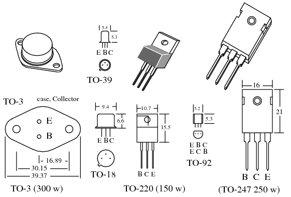{ #fig:03485 width=75% }

_Transistor packages, dimensions in mm._

Small plastic transistor packages like the TO-92 can dissipate a few hundred milliwatts. The metal cans, TO-18 and TO-39 can dissipate more power, several hundred milliwatts. Plastic power transistor packages like the TO-220 and TO-247 dissipate well over 100 watts, approaching the dissipation of the all metal TO-3. The dissipation ratings listed in @fig:03485 are the maximum ever encountered by the author for high powered devices. Most power transistors are rated at half or less than the listed wattage. Consult specific device datasheets for actual ratings. The semiconductor die in the TO-220 and TO-247 plastic packages is mounted to a heat conductive metal slug which transfers heat from the back of the package to a metal _heatsink_, not shown. A thin coating of thermally conductive grease is applied to the metal before mounting the transistor to the heatsink. Since the TO-220 and TO-247 slugs, and the TO-3 case are connected to the collector, it is sometimes necessary to electrically isolate these from a grounded heatsink by an interposed mica or polymer washer. The datasheet ratings for the power packages are only valid when mounted to a heatsink. Without a heatsink, a TO-220 dissipates approximately 1 watt safely in free air.

Datasheet maximum power disipation ratings are difficult to acheive in practice. The maximum power dissipation is based on a heatsink maintaining the transistor case at no more than 25^o^C. This is difficult with an air cooled heatsink. The allowable power dissipation decreases with increasing temperature. This is known as derating. Many power device datasheets include a dissipation versus case termperaure graph.

- **REVIEW:**
- _Power dissipation_: maximum allowable power dissipation on a sustained basis.
- _Reverse voltages_: maximum allowable V~CE~ , V~CB~ , V~EB~ .
- _Collector current_: the maximum allowable collector current.
- _Saturation voltage_ is the V~CE~ voltage drop in a saturated (fully conducting) transistor.
- _Beta_: β=I~C~/I~B~
- _Alpha_: α=I~C~/I~E~    α= β/(β+1)
- Transistor*Packages* are a major factor in power dissipation. Larger packages dissipate more power.

## BJT quirks{ #sec:xtocid157058919 }

An ideal transistor would show 0% distortion in amplifying a signal. Its gain would extend to all frequencies. It would control hundreds of amperes of current, at hundreds of degrees C. In practice, available devices show distortion. Amplification is limited at the high frequency end of the spectrum. Real parts only handle tens of amperes with precautions. Care must be taken when paralleling transistors for higher current. Operation at elevated temperatures can destroy transistors if precautions are not taken.

### Nonlinearity{ #sec:xtocid157058920 }

The class A common-emitter amplifier (similar to Figure [previous](@fig:03110){ #fig:03110 width=75% })is driven almost to clipping in @fig:23039 . Note that the positive peak is flatter than the negative peaks. This distortion is unacceptable in many applications like high-fidelity audio.

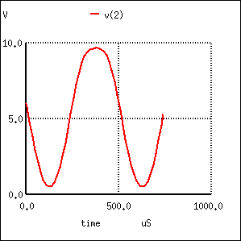{ #fig:23039 width=75% }

_Distortion in large signal common-emitter amplifier._

Small signal amplifiers are relatively linear because they use a small linear section of the transistor characteristics. Large signal amplifiers are not 100% linear because transistor characteristics like β are not constant, but vary with collector current. β is high at low collector current, and low at very low current or high current. Though, we primarily encounter decreasing β with increasing collector current.

[]{#bjt7.tbl <="" a=""}

+-----------------------+-----------------------+-----------------------+ | comm | | spice -b ce.cir | | on-emitter amplifier | | F | | Vbias 4 0 0.74 | | ourier analysis v(2): | | Vsig 5 4 | | THD: 10.4688 % | | sin (0 125m 2000 0 0) | | | | rbias 6 5 2k | | | | q1 2 6 0 q2n2222 | | Har Freq Norm Mag | | r 3 2 1000 | | | | v1 3 0 dc 10 | | --- ---- -------- | | .model q2n22 | | | | 22 npn (is=19f bf=150 | | 0 0 0 | | + vaf=100 ik | | | | f=0.18 ise=50p ne=2.5 | | 1 2000 1 | | + br=7.5 | | | | + var=6.4 ik | | 2 4000 0.097992 | | r=12m isc=8.7p nc=1.2 | | | | + rb=50 | | 3 6000 0.036541 | | + re=0.4 r | | | | c=0.3 cje=26p tf=0.5n | | 4 8000 0.004387 | | + cjc=11p tr | | | | =7n xtb=1.5 kf=0.032f | | 5 10000 0.001158 | | + af=1) | | | | | | 6 12000 0.000893 | | .fourier 2000 v(2) | | | | .tran 0.02m 0.74m | | 7 14000 0.000211 | | .end | | | | | | 8 16000 3.81e-05 | | | | | | | | 9 18000 3.37e-05 | +-----------------------+-----------------------+-----------------------+

_SPICE net list: for transient and fourier analyses. Fourier analysis shows 10% total harmonic distortion (THD)._

The SPICE listing in Table [above](#bjt7.tbl) illustrates how to quantify the amount of distortion. The \".fourier 2000 v(2)\" command tells SPICE to perm a fourier analysis at 2000 Hz on the output v(2). At the command line \"spice -b circuitname.cir\" produces the Fourier analysis output in Table [above](#bjt7.tbl). It shows THD (total harmonic distortion) of over 10%, and the contribution of the individual harmonics.

A partial solution to this distortion is to decrease the collector current or operate the amplifier over a smaller portion of the load line. The ultimate solution is to apply negative feedback. See [Feedback](#FBtheory).

### Temperature drift{ #sec:xtocid157058921 }

Temperature affects the AC and DC characteristics of transistors. The two aspects to this problem are environmental temperature variation and self-heating. Some applications, like military and automotive, require operation over an extended temperature range. Circuits in a benign environment are subject to self-heating, in particular high power circuits.

Leakage current I~CO~ and β increase with temperature. The DC β h~FE~ increases exponentially. The AC β h~fe~ increases, but not as rapidly. It doubles over the range of -55^o^ to 85^o^ C. As temperature increases, the increase in h~fe~ will yield a larger common-emitter output, which could be clipped in extreme cases. The increase in h~FE~ shifts the bias point, possibly clipping one peak. The shift in bias point is amplified in multi-stage direct-coupled amplifiers. The solution is some form of negative feedback to stabilize the bias point. This also stabilizes AC gain.

Increasing temperature in @fig:03484 (a) will decrease V~BE~ from the nominal 0.7V for silicon transistors. Decreasing V~BE~ increases collector current in a common-emitter amplifier, further shifting the bias point. The cure for shifting V~BE~ is a pair of transistors configured as a differential amplifier. If both transistors in @fig:03484 (b) are at the same temperature, the V~BE~ will track with changing temperature and cancel.

{ #fig:03484 width=75% }

_(a) single ended CE amplifier vs (b) differential amplifier with V~BE~ cancellation._

The maximum recommended junction temperature for silicon devices is frequently 125^o^ C. Though, this should be derated for higher reliability. Transistor action ceases beyond 150^o^ C. Silicon carbide and diamond transistors will operate considerably higher.

### Thermal runaway{ #sec:xtocid157058922 }

The problem with increasing temperature causing increasing collector current is that more current increase the power dissipated by the transistor which, in turn, increases its temperature. This self-reinforcing cycle is known as _thermal run away_, which may destroy the transistor. Again, the solution is a bias scheme with some form of negative feedback to stabilize the bias point.

### Junction capacitance{ #sec:xtocid157058923 }

Capacitance exists between the terminals of a transistor. The collector-base capacitance C~CB~ and emitter-base capacitance C~EB~ decrease the gain of a common emitter circuit at higher frequencies.

In a common emitter amplifier, the capacitive feedback from collector to base effectively multiplies C~CB~ by β. The amount of negative gain-reducing feedback is related to both current gain, and amount of collector-base capacitance. This is known as the _Miller effect_, [Miller effect](#MILLER).

### Noise{ #sec:xtocid157058924 }

The ultimate sensitivity of small signal amplifiers is limited by noise due to random variations in current flow. The two major sources of noise in transistors are _shot noise_ due to current flow of carriers in the base and _thermal noise_. The source of thermal noise is device resistance and increases with temperature:

{ #fig:13059 width=75% }

Noise in a transistor amplifier is defined in terms of _excess noise_ generated by the amplifier, not that noise amplified from input to output, but that generated within the amplifier. This is determined by measuring the _signal to noise ratio_ (S/N) at the amplifier input and output. The AC voltage output of an amplifier with a small signal input corresponds to S+N, signal plus noise. The AC voltage with no signal in corresponds to noise N. The _noise figure_ F is defined in terms of S/N of amplifier input and output:

{ #fig:13058 width=75% }

The noise figure F for RF (radio frequency) transistors is usually listed on transistor data sheets in decibels, F~dB~. A good VHF (very high frequency, 30 MHz to 300 Mhz) noise figure is \< 1 dB. The noise figure above VHF increases considerable, 20 dB per decade as shown in @fig:03482.

{ #fig:03482 width=75% }

_Small signal transistor noise figure vs Frequency. After Thiele, Figure 11.147 @AGT_

@fig:03482 also shows that noise at low frequencies increases at 10 dB per decade with decreasing frequency. This noise is known as _1/f noise_.

Noise figure varies with the transistor type (part number). Small signal RF transistors used at the antenna input of a radio receiver are specifically designed for low noise figure. Noise figure varies with bias current and impedance matching. The best noise figure for a transistor is achieved at lower bias current, and possibly with an impedance mismatch.

### [[Thermal mismatch (problem with paralleling transistors)]{#xtocid157058925}]

If two identical power transistors were paralleled for higher current, one would expect them to share current equally. Because of differences in characteristerics, transistors do not share current equally.

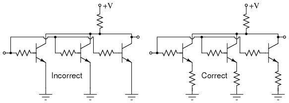{ #fig:03481 width=75% }

_Transistors paralleled for increased power require emitter ballast resistors_

It is not practical to select identical transistors. The β for small signal transistors typically has a range of 100-300, power transistors: 20-50. If each one could be matched, one still might run hotter than the other due to environmental conditions. The hotter transistor draws more current resulting in thermal runaway. The solution when paralleling bipolar transistors is to insert emitter resistors known as _ballast resistors_ of less than an ohm. If the hotter transistor draws more current, the voltage drop across the ballast resistor increases--- negative feedback. This decreases the current. Mounting all transistors on the same heatsink helps equalize current too.

### High frequency effects{ #sec:xtocid157058926 }

The performance of a transistor amplifier is relatively constant, up to a point, as shown by the small signal common-emitter current gain with increasing frequency in @fig:03483. Beyond that point the performance of a transistor degrades as frequency increases.

**Beta cutoff frequency**, f~T~ is the frequency at which common-emitter small signal current gain (h~fe~) falls to unity. (@fig:03483) A practical amplifier must have a gain \>1. Thus, a transistor cannot be used in a practical amplifier at f~T~. A more usable limit for a transistor is 0.1·f~T~.

{ #fig:03483 width=75% }

_Common-emitter small signal current gain (h~fe~) vs frequency._

Some RF silicon bipolar transistors are usable as amplifers up to a few GHz. Silicon-germanium devices extend the upper range to 10 GHz.

**Alpha cutoff frequency**, f~alpha~ is the frequency at which the α falls to 0.707 of low frequency α,~0~ α=0.707α~0~. Alpha cutoff and beta cutoff are nearly equal: f~alpha~≅f~T~ Beta cutoff f~T~ is the preferred figure of merit of high frequency performance.

**f~max~** is the highest frequency of oscillation possible under the most favorable conditions of bias and impedance matching. It is the frequency at which the power gain is unity. All of the output is fed back to the input to sustain oscillations. f~max~ is an upper limit for frequency of operation of a transistor as an active device. Though, a practical amplifier would not be usable at f~max~.

[]{#MILLER <="" a=""}

**Miller effect:** The high frequency limit for a transistor is related to the junction capacitances. For example a PN2222A has an input capacitance C~obo~=9pF and an output capacitance C~ibo~=25pF from C-B and E-B respectively. @FAR Although the C-E capacitance of 25 pF seems large, it is less of a factor than the C-B (9pF) capacitance. because of the _Miller effect_, the C-B capacitance has an effect on the base equivalent to beta times the capacitance in the common-emitter amplifier. Why might this be? A common-emitter amplifier inverts the signal from base to collector. The inverted collector signal fed back to the base opposes the input on the base. The collector signal is beta times larger than the input. For the PN2222A, β=50--300. Thus, the 9pF C-E capacitance looks like 9·50=450pF to 9·300=2700pF.

The solution to the junction capacitance problem is to select a high frequency transistor for wide bandwidth applications--- RF (radio frequency) or microwave transistor. The bandwidth can be extended further by using the common-base instead of the common-emitter configuration. The grounded base shields the emitter input from capacitive collector feedback. A two-transistor cascode arrangement will yield the same bandwidth as the common-base, with the higher input impedance of the common-emitter.

- **REVIEW:**
- Transistor amplifiers exhibit distortion because of β variation with collector current.
- I~c~, V~BE~, β and junction capacitance vary with temperature.
- An increase in temperature can cause an increase in I~C~, causing an increase in temperature, a vicious cycle known as _thermal runaway._
- Junction capacitance limits high frequency gain of a transistor. The _Miller effect_ makes C~cb~ look β times larger at the base of a CE amplifier.
- Transistor noise limits the ability to amplify small signals. _Noise figure_ is a figure of merit concerning transistor noise.
- When paralleling power transistors for increased current, insert _ballast resistors_ in series with the emitters to equalize current.
- F~T~ is the absolute upper frequency limit for a CE amplifier, small signal current gain falls to unity, h~fe~=1.
- F~max~ is the upper frequency limit for an oscillator under the most ideal conditions.

## [Bibliography]{#xtocid157058927}

\

1.  [\[AGT\] A. G. Thiele in Loyd P. Hunter, "Handbook of Semiconductor Electronics," Low Frequency Amplifiers, ISBN -07-031305-9, 1970]{#AGT.bibitem}
2.  [\[GET\] "GE Transistor Manual", General Electric, 1964.]{#GET.bibitem}
3.  [\[RVJ\] R. Victor Jones, "Basic BJT Amplifier Configurations", November 7, 2001. at]{#RVJ.bibitem} <http://people.seas.harvard.edu/~jones/es154/lectures/lecture_3/bjt_amps/bjt_amps.html>
4.  [\[TK1\] Tony Kuphaldt,"Lessons in Electric Circuits", Vol. 1, DC, DC Network Analysis, Thevenin\'s Theorem, at]{#TK1.bibitem} <http://www.openbookproject.net/electricCircuits/DC/DC_10.html#xtocid102679>
5.  [\[FAR\] "PN2222 Datasheet",Fairchild Semiconductor Corporation, 2007 at]{#FAR.bibitem} <http://www.fairchildsemi.com/ds/PN/PN2222A.pdf>

\

---

_Lessons In Electric Circuits_ copyright (C) 2000-2023 Tony R. Kuphaldt, under the terms and conditions of the [CC BY License](SEMI_A3.html).

  
