## Introduction{ #sec:xtocid15705980 }

A _transistor_ is a linear semiconductor device that controls current with the application of a lower-power electrical signal. Transistors may be roughly grouped into two major divisions: _bipolar_ and _field-effect_. In the last chapter we studied bipolar transistors, which utilize a small current to control a large current. In this chapter, we\'ll introduce the general concept of the field-effect transistor \-- a device utilizing a small _voltage_ to control current \-- and then focus on one particular type: the _junction_ field-effect transistor. In the next chapter we\'ll explore another type of field-effect transistor, the _insulated gate_ variety.

All field-effect transistors are _unipolar_ rather than _bipolar_ devices. That is, the main current through them is comprised either of electrons through an N-type semiconductor or holes through a P-type semiconductor. This becomes more evident when a physical diagram of the device is seen:

{ #fig:03149 width=75% }

In a junction field-effect transistor, or JFET, the controlled current passes from source to drain, or from drain to source as the case may be. The controlling voltage is applied between the gate and source. Note how the current does not have to cross through a PN junction on its way between source and drain: the path (called a _channel_) is an uninterrupted block of semiconductor material. In the image just shown, this channel is an N-type semiconductor. P-type channel JFETs are also manufactured:

{ #fig:03150 width=75% }

Generally, N-channel JFETs are more commonly used than P-channel. The reasons for this have to do with obscure details of semiconductor theory, which I\'d rather not discuss in this chapter. As with bipolar transistors, I believe the best way to introduce field-effect transistor usage is to avoid theory whenever possible and concentrate instead on operational characteristics. The only practical difference between N- and P-channel JFETs you need to concern yourself with now is biasing of the PN junction formed between the gate material and the channel.

With no voltage applied between gate and source, the channel is a wide-open path for electrons to flow. However, if a voltage is applied between gate and source of such polarity that it reverse-biases the PN junction, the flow between source and drain connections becomes limited, or regulated, just as it was for bipolar transistors with a set amount of base current. Maximum gate-source voltage \"pinches off\" all current through source and drain, thus forcing the JFET into cutoff mode. This behavior is due to the depletion region of the PN junction expanding under the influence of a reverse-bias voltage, eventually occupying the entire width of the channel if the voltage is great enough. This action may be likened to reducing the flow of a liquid through a flexible hose by squeezing it: with enough force, the hose will be constricted enough to completely block the flow.

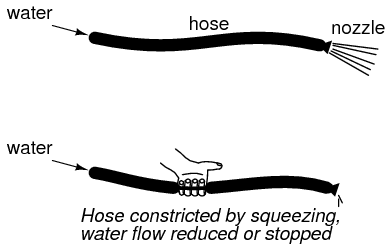{ #fig:03158 width=75% }

Note how this operational behavior is exactly opposite of the bipolar junction transistor. Bipolar transistors are _normally-off_ devices: no current through the base, no current through the collector or the emitter. JFETs, on the other hand, are _normally-on_ devices: no voltage applied to the gate allows maximum current through the source and drain. Also take note that the amount of current allowed through a JFET is determined by a _voltage_ signal rather than a _current_ signal as with bipolar transistors. In fact, with the gate-source PN junction reverse-biased, there should be nearly zero current through the gate connection. For this reason, we classify the JFET as a _voltage-controlled device_, and the bipolar transistor as a _current-controlled device_.

If the gate-source PN junction is forward-biased with a small voltage, the JFET channel will \"open\" a little more to allow greater currents through. However, the PN junction of a JFET is not built to handle any substantial current itself, and thus it is not recommended to forward-bias the junction under any circumstances.

This is a very condensed overview of JFET operation. In the next section, we\'ll explore the use of the JFET as a switching device.

## The transistor as a switch{ #sec:xtocid15705981 }

Like its bipolar cousin, the field-effect transistor may be used as an on/off switch controlling electrical power to a load. Let\'s begin our investigation of the JFET as a switch with our familiar switch/lamp circuit:

{ #fig:03074 width=75% }

Remembering that the _controlled_ current in a JFET flows between source and drain, we substitute the source and drain connections of a JFET for the two ends of the switch in the above circuit:

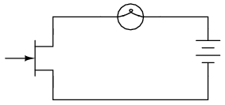{ #fig:03151 width=75% }

If you haven\'t noticed by now, the source and drain connections on a JFET look identical on the schematic symbol. Unlike the bipolar junction transistor where the emitter is clearly distinguished from the collector by the arrowhead, a JFET\'s source and drain lines both run perpendicular into the bar representing the semiconductor channel. This is no accident, as the source and drain lines of a JFET are often interchangeable in practice! In other words, JFETs are usually able to handle channel current in either direction, from source to drain or from drain to source.

Now all we need in the circuit is a way to control the JFET\'s conduction. With zero applied voltage between gate and source, the JFET\'s channel will be \"open,\" allowing full current to the lamp. In order to turn the lamp off, we will need to connect another source of DC voltage between the gate and source connections of the JFET like this:

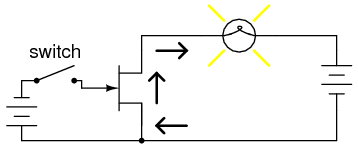{ #fig:03152 width=75% }

Closing this switch will \"pinch off\" the JFET\'s channel, thus forcing it into cutoff and turning the lamp off:

{ #fig:03153 width=75% }

Note that there is no current going through the gate. As a reverse-biased PN junction, it firmly opposes the flow of any electrons through it. As a voltage-controlled device, the JFET requires negligible input current. This is an advantageous trait of the JFET over the bipolar transistor: there is virtually zero power required of the controlling signal.

Opening the control switch again should disconnect the reverse-biasing DC voltage from the gate, thus allowing the transistor to turn back on. Ideally, anyway, this is how it works. In practice this may not work at all:

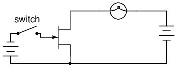{ #fig:03154 width=75% }

Why is this? Why doesn\'t the JFET\'s channel open up again and allow lamp current through like it did before with no voltage applied between gate and source? The answer lies in the operation of the reverse-biased gate-source junction. The depletion region within that junction acts as an insulating barrier separating gate from source. As such, it possesses a certain amount of _capacitance_ capable of storing an electric charge potential. After this junction has been forcibly reverse-biased by the application of an external voltage, it will tend to hold that reverse-biasing voltage as a stored charge even after the source of that voltage has been disconnected. What is needed to turn the JFET on again is to bleed off that stored charge between the gate and source through a resistor:

{ #fig:03155 width=75% }

This resistor\'s value is not very important. The capacitance of the JFET\'s gate-source junction is very small, and so even a rather high-value bleed resistor creates a fast RC time constant, allowing the transistor to resume conduction with little delay once the switch is opened.

Like the bipolar transistor, it matters little where or what the controlling voltage comes from. We could use a solar cell, thermocouple, or any other sort of voltage-generating device to supply the voltage controlling the JFET\'s conduction. All that is required of a voltage source for JFET switch operation is _sufficient_ voltage to achieve pinch-off of the JFET channel. This level is usually in the realm of a few volts DC, and is termed the _pinch-off_ or _cutoff_ voltage. The exact pinch-off voltage for any given JFET is a function of its unique design, and is not a universal figure like 0.7 volts is for a silicon BJT\'s base-emitter junction voltage.

- **REVIEW:**
- Field-effect transistors control the current between source and drain connections by a voltage applied between the gate and source. In a _junction_ field-effect transistor (JFET), there is a PN junction between the gate and source which is normally reverse-biased for control of source-drain current.
- JFETs are normally-on (normally-saturated) devices. The application of a reverse-biasing voltage between gate and source causes the depletion region of that junction to expand, thereby \"pinching off\" the channel between source and drain through which the controlled current travels.
- It may be necessary to attach a \"bleed-off\" resistor between gate and source to discharge the stored charge built up across the junction\'s natural capacitance when the controlling voltage is removed. Otherwise, a charge may remain to keep the JFET in cutoff mode even after the voltage source has been disconnected.

## Meter check of a transistor{ #sec:xtocid15705982 }

Testing a JFET with a multimeter might seem to be a relatively easy task, seeing as how it has only one PN junction to test: either measured between gate and source, or between gate and drain.

{ #fig:03156 width=75% }

\

{ #fig:03157 width=75% }

Testing continuity through the drain-source channel is another matter, though. Remember from the last section how a stored charge across the capacitance of the gate-channel PN junction could hold the JFET in a pinched-off state without any external voltage being applied across it? This can occur even when you\'re holding the JFET in your hand to test it! Consequently, any meter reading of continuity through that channel will be unpredictable, since you don\'t necessarily know if a charge is being stored by the gate-channel junction. Of course, if you know beforehand which terminals on the device are the gate, source, and drain, you may connect a jumper wire between gate and source to eliminate any stored charge and then proceed to test source-drain continuity with no problem. However, if you _don\'t_ know which terminals are which, the unpredictability of the source-drain connection may confuse your determination of terminal identity.

A good strategy to follow when testing a JFET is to insert the pins of the transistor into anti-static foam (the material used to ship and store static-sensitive electronic components) just prior to testing. The conductivity of the foam will make a resistive connection between all terminals of the transistor when it is inserted. This connection will ensure that all residual voltage built up across the gate-channel PN junction will be neutralized, thus \"opening up\" the channel for an accurate meter test of source-to-drain continuity.

Since the JFET channel is a single, uninterrupted piece of semiconductor material, there is usually no difference between the source and drain terminals. A resistance check from source to drain should yield the same value as a check from drain to source. This resistance should be relatively low (a few hundred ohms at most) when the gate-source PN junction voltage is zero. By applying a reverse-bias voltage between gate and source, pinch-off of the channel should be apparent by an increased resistance reading on the meter.

## [[Active-mode operation]{#xtocid15705983}]

JFETs, like bipolar transistors, are able to \"throttle\" current in a mode between cutoff and saturation called the _active_ mode. To better understand JFET operation, let\'s set up a SPICE simulation similar to the one used to explore basic bipolar transistor function:

{ #fig:03159 width=75% }

\

    jfet simulation
    vin 0 1 dc 1
    j1 2 1 0 mod1
    vammeter 3 2 dc 0
    v1 3 0 dc
    .model mod1 njf
    .dc v1 0 2 0.05
    .plot dc i(vammeter)
    .end

Note that the transistor labeled \"Q~1~\" in the schematic is represented in the SPICE netlist as `j1`. Although all transistor types are commonly referred to as \"Q\" devices in circuit schematics \-- just as resistors are referred to by \"R\" designations, and capacitors by \"C\" \-- SPICE needs to be told what type of transistor this is by means of a different letter designation: `q` for bipolar junction transistors, and `j` for junction field-effect transistors.

\
\

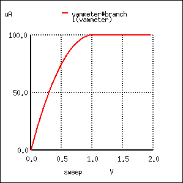{ #fig:23015 width=75% }

\

Here, the controlling signal is a steady voltage of 1 volt, applied with negative towards the JFET gate and positive toward the JFET source, to reverse-bias the PN junction. In the first BJT simulation of chapter 4, a constant-current source of 20 µA was used for the controlling signal, but remember that a JFET is a _voltage-controlled_ device, not a current-controlled device like the bipolar junction transistor.

Like the BJT, the JFET tends to regulate the controlled current at a fixed level above a certain power supply voltage, no matter how high that voltage may climb. Of course, this current regulation has limits in real life \-- no transistor can withstand infinite voltage from a power source \-- and with enough drain-to-source voltage the transistor will \"break down\" and drain current will surge. But within normal operating limits the JFET keeps the drain current at a steady level independent of power supply voltage. To verify this, we\'ll run another computer simulation, this time sweeping the power supply voltage (V~1~) all the way to 50 volts:

\

    jfet simulation
    vin 0 1 dc 1
    j1 2 1 0 mod1
    vammeter 3 2 dc 0
    v1 3 0 dc
    .model mod1 njf
    .dc v1 0 50 2
    .plot dc i(vammeter)
    .end

\
\

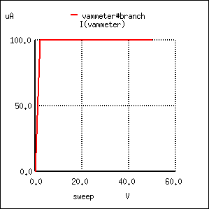{ #fig:23016 width=75% }

\

Sure enough, the drain current remains steady at a value of 100 µA (1.000E-04 amps) no matter how high the power supply voltage is adjusted.

Because the input voltage has control over the constriction of the JFET\'s channel, it makes sense that changing this voltage should be the only action capable of altering the current regulation point for the JFET, just like changing the base current on a BJT is the only action capable of altering collector current regulation. Let\'s decrease the input voltage from 1 volt to 0.5 volts and see what happens:

\

    jfet simulation
    vin 0 1 dc 0.5
    j1 2 1 0 mod1
    vammeter 3 2 dc 0
    v1 3 0 dc
    .model mod1 njf
    .dc v1 0 50 2
    .plot dc i(vammeter)
    .end

\
\

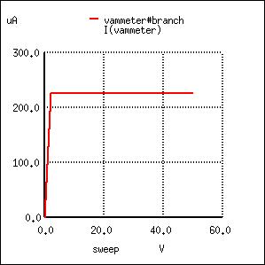{ #fig:23017 width=75% }

\

As expected, the drain current is greater now than it was in the previous simulation. With less reverse-bias voltage impressed across the gate-source junction, the depletion region is not as wide as it was before, thus \"opening\" the channel for charge carriers and increasing the drain current figure.

Please note, however, the actual value of this new current figure: 225 µA (2.250E-04 amps). The last simulation showed a drain current of 100 µA, and that was with a gate-source voltage of 1 volt. Now that we\'ve reduced the controlling voltage by a factor of 2 (from 1 volt down to 0.5 volts), the drain current increased, but not by the same 2:1 proportion! Let\'s reduce our gate-source voltage once more by another factor of 2 (down to 0.25 volts) and see what happens:

\

    jfet simulation
    vin 0 1 dc 0.25
    j1 2 1 0 mod1
    vammeter 3 2 dc 0
    v1 3 0 dc
    .model mod1 njf
    .dc v1 0 50 2
    .plot dc i(vammeter)
    .end

\
\

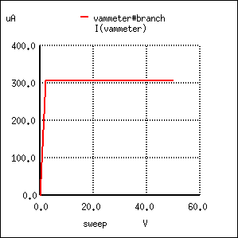{ #fig:23018 width=75% }

\

With the gate-source voltage set to 0.25 volts, one-half what it was before, the drain current is 306.3 µA. Although this is still an increase over the 225 µA from the prior simulation, it isn\'t _proportional_ to the change of the controlling voltage.

To obtain a better understanding of what is going on here, we should run a different kind of simulation: one that keeps the power supply voltage constant and instead varies the controlling (voltage) signal. When this kind of simulation was run on a BJT, the result was a straight-line graph, showing how the input current / output current relationship of a BJT is linear. Let\'s see what kind of relationship a JFET exhibits:

\

    jfet simulation
    vin 0 1 dc
    j1 2 1 0 mod1
    vammeter 3 2 dc 0
    v1 3 0 dc 25
    .model mod1 njf
    .dc vin 0 2 0.1
    .plot dc i(vammeter)
    .end

\
\

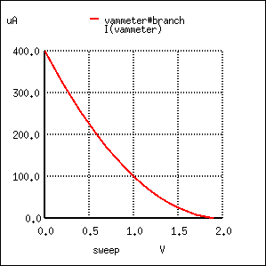{ #fig:23019 width=75% }

\

This simulation directly reveals an important characteristic of the junction field-effect transistor: the control effect of gate voltage over drain current is _nonlinear_. Notice how the drain current does not decrease linearly as the gate-source voltage is increased. With the bipolar junction transistor, collector current was directly proportional to base current: output signal proportionately followed input signal. Not so with the JFET! The controlling signal (gate-source voltage) has less and less effect over the drain current as it approaches cutoff. In this simulation, most of the controlling action (75 percent of drain current decrease \-- from 400 µA to 100 µA) takes place within the first volt of gate-source voltage (from 0 to 1 volt), while the remaining 25 percent of drain current reduction takes another whole volt worth of input signal. Cutoff occurs at 2 volts input.

Linearity is generally important for a transistor because it allows it to faithfully amplify a waveform without distorting it. If a transistor is nonlinear in its input/output amplification, the shape of the input waveform will become corrupted in some way, leading to the production of harmonics in the output signal. The only time linearity is _not_ important in a transistor circuit is when its being operated at the extreme limits of cutoff and saturation (off and on, respectively, like a switch).

A JFET\'s characteristic curves display the same current-regulating behavior as for a BJT, and the nonlinearity between gate-to-source voltage and drain current is evident in the disproportionate vertical spacings between the curves:

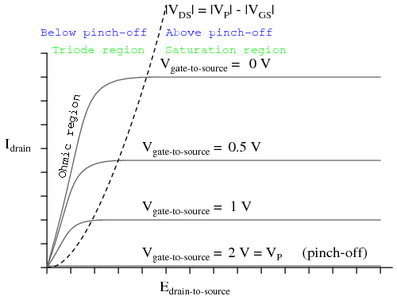{ #fig:03160 width=75% }

To better comprehend the current-regulating behavior of the JFET, it might be helpful to draw a model made up of simpler, more common components, just as we did for the BJT:

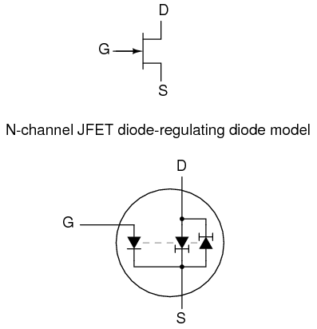{ #fig:03161 width=75% }

In the case of the JFET, it is the _voltage_ across the reverse-biased gate-source diode which sets the current regulation point for the pair of constant-current diodes. A pair of opposing constant-current diodes is included in the model to facilitate current in either direction between source and drain, a trait made possible by the unipolar nature of the channel. With no PN junctions for the source-drain current to traverse, there is no polarity sensitivity in the controlled current. For this reason, JFETs are often referred to as _bilateral_ devices.

A contrast of the JFET\'s characteristic curves against the curves for a bipolar transistor reveals a notable difference: the linear (straight) portion of each curve\'s non-horizontal area is surprisingly long compared to the respective portions of a BJT\'s characteristic curves:

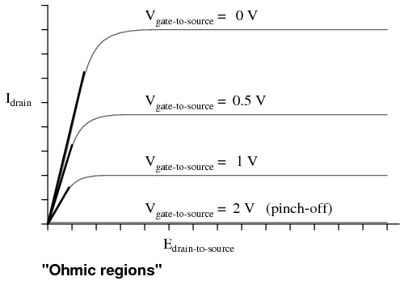{ #fig:03162 width=75% }

\

{ #fig:03163 width=75% }

A JFET transistor operated in the _triode region_ tends to act very much like a plain resistor as measured from drain to source. Like all simple resistances, its current/voltage graph is a straight line. For this reason, the triode region (non-horizontal) portion of a JFET\'s characteristic curve is sometimes referred to as the _ohmic region_. In this mode of operation where there isn\'t enough drain-to-source voltage to bring drain current up to the regulated point, the drain current is directly proportional to the drain-to-source voltage. In a carefully designed circuit, this phenomenon can be used to an advantage. Operated in this region of the curve, the JFET acts like a voltage-controlled _resistance_ rather than a voltage-controlled _current regulator_, and the appropriate model for the transistor is different:

{ #fig:03164 width=75% }

Here and here alone the rheostat (variable resistor) model of a transistor is accurate. It must be remembered, however, that this model of the transistor holds true only for a narrow range of its operation: when it is extremely saturated (far less voltage applied between drain and source than what is needed to achieve full regulated current through the drain). The amount of resistance (measured in ohms) between drain and source in this mode is controlled by how much reverse-bias voltage is applied between gate and source. The less gate-to-source voltage, the less resistance (steeper line on graph).

Because JFETs are _voltage_-controlled current regulators (at least when they\'re allowed to operate in their active), their inherent amplification factor cannot be expressed as a unitless ratio as with BJTs. In other words, there is no β ratio for a JFET. This is true for all voltage-controlled active devices, including other types of field-effect transistors and even electron tubes. There is, however, an expression of controlled (drain) current to controlling (gate-source) voltage, and it is called _transconductance_. Its unit is Siemens, the same unit for conductance (formerly known as the _mho_).

Why this choice of units? Because the equation takes on the general form of current (output signal) divided by voltage (input signal).

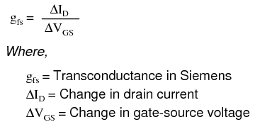{ #fig:13024 width=75% }

Unfortunately, the transconductance value for any JFET is not a stable quantity: it varies significantly with the amount of gate-to-source control voltage applied to the transistor. As we saw in the SPICE simulations, the drain current does not change proportionally with changes in gate-source voltage. To calculate drain current for any given gate-source voltage, there is another equation that may be used. It is obviously nonlinear upon inspection (note the power of 2), reflecting the nonlinear behavior we\'ve already experienced in simulation:

{ #fig:13023 width=75% }

- **REVIEW:**
- In their active modes, JFETs regulate drain current according to the amount of reverse-bias voltage applied between gate and source, much like a BJT regulates collector current according to base current. The mathematical ratio between drain current (output) and gate-to-source voltage (input) is called _transconductance_, and it is measured in units of Siemens.
- The relationship between gate-source (control) voltage and drain (controlled) current is nonlinear: as gate-source voltage is decreased, drain current increases exponentially. That is to say, the transconductance of a JFET is not constant over its range of operation.
- In their triode region, JFETs regulate drain-to-source _resistance_ according to the amount of reverse-bias voltage applied between gate and source. In other words, they act like voltage-controlled resistances.

## [[The common-source amplifier \-- PENDING]{#xtocid15705984}]

**\*\*\* PENDING \*\*\***

- **REVIEW:**
-
-
-

## [[The common-drain amplifier \-- PENDING]{#xtocid15705985}]

**\*\*\* PENDING \*\*\***

- **REVIEW:**
-
-
-

## [[The common-gate amplifier \-- PENDING]{#xtocid15705986}]

**\*\*\* PENDING \*\*\***

- **REVIEW:**
-
-
-

## [[Biasing techniques \-- PENDING]{#xtocid15705987}]

**\*\*\* PENDING \*\*\***

- **REVIEW:**
-
-
-

## [[Transistor ratings and packages \-- PENDING]{#xtocid15705988}]

**\*\*\* PENDING \*\*\***

- **REVIEW:**
-
-
-

## [[JFET quirks \-- PENDING]{#xtocid15705989}]

**\*\*\* PENDING \*\*\***

- **REVIEW:**
-
-
-

\

---

_Lessons In Electric Circuits_ copyright (C) 2000-2023 Tony R. Kuphaldt, under the terms and conditions of the [CC BY License](SEMI_A3.html).

  
