  

---

# Lessons In Electric Circuits \-- Volume III

# Chapter 6

# INSULATED-GATE FIELD-EFFECT TRANSISTORS

- [[Introduction]](#xtocid15706070)
- [[Depletion-type IGFETs]](#xtocid15706071)
- [[Enhancement-type IGFETs \-- PENDING]](#xtocid15706072)
- [[Active-mode operation \-- PENDING]](#xtocid15706073)
- [[The common-source amplifier \-- PENDING]](#xtocid15706074)
- [[The common-drain amplifier \-- PENDING]](#xtocid15706075)
- [[The common-gate amplifier \-- PENDING]](#xtocid15706076)
- [[Biasing techniques \-- PENDING]](#xtocid15706077)
- [[Transistor ratings and packages \-- PENDING]](#xtocid15706078)
- [[IGFET quirks \-- PENDING]](#xtocid15706079)
- [[MESFETs \-- PENDING]](#xtocid157060710)
- [[IGBTs]](#xtocid157060711)

**\*\*\* INCOMPLETE \*\*\***

## Introduction{ #sec:xtocid15706070 }

As was stated in the last chapter, there is more than one type of field-effect transistor. The junction field-effect transistor, or JFET, uses voltage applied across a reverse-biased PN junction to control the width of that junction\'s depletion region, which then controls the conductivity of a semiconductor channel through which the controlled current moves. Another type of field-effect device \-- the insulated gate field-effect transistor, or IGFET \-- exploits a similar principle of a depletion region controlling conductivity through a semiconductor channel, but it differs primarily from the JFET in that there is no _direct_ connection between the gate lead and the semiconductor material itself. Rather, the gate lead is insulated from the transistor body by a thin barrier, hence the term _insulated gate_. This insulating barrier acts like the dielectric layer of a capacitor, and allows gate-to-source voltage to influence the depletion region electrostatically rather than by direct connection.

In addition to a choice of N-channel versus P-channel design, IGFETs come in two major types: _enhancement_ and _depletion_. The depletion type is more closely related to the JFET, so we will begin our study of IGFETs with it.

## [[Depletion-type IGFETs]{#xtocid15706071}]

Insulated gate field-effect transistors are unipolar devices just like JFETs: that is, the controlled current does not have to cross a PN junction. There is a PN junction inside the transistor, but its only purpose is to provide that nonconducting depletion region which is used to restrict current through the channel.

Here is a diagram of an N-channel IGFET of the \"depletion\" type:

{ #fig:03178 width=75% }

Notice how the source and drain leads connect to either end of the N channel, and how the gate lead attaches to a metal plate separated from the channel by a thin insulating barrier. That barrier is sometimes made from silicon dioxide (the primary chemical compound found in sand), which is a very good insulator. Due to this **M**etal (gate) - **O**xide (barrier) - **S**emiconductor (channel) construction, the IGFET is sometimes referred to as a MOSFET. There are other types of IGFET construction, though, and so \"IGFET\" is the better descriptor for this general class of transistors.

Notice also how there are four connections to the IGFET. In practice, the _substrate_ lead is directly connected to the _source_ lead to make the two electrically common. Usually, this connection is made internally to the IGFET, eliminating the separate substrate connection, resulting in a three-terminal device with a slightly different schematic symbol:

{ #fig:03179 width=75% }

With source and substrate common to each other, the N and P layers of the IGFET end up being directly connected to each other through the outside wire. This connection prevents any voltage from being impressed across the PN junction. As a result, a depletion region exists between the two materials, but it can never be expanded or collapsed. JFET operation is based on the expansion of the PN junction\'s depletion region, but here in the IGFET that cannot happen, so IGFET operation must be based on a different effect.

Indeed it is, for when a controlling voltage is applied between gate and source, the conductivity of the channel is changed as a result of the depletion region _moving_ closer to or further away from the gate. In other words, the channel\'s effective width changes just as with the JFET, but this change in channel width is due to depletion region _displacement_ rather than depletion region _expansion_.

In an N-channel IGFET, a controlling voltage applied positive (+) to the gate and negative (-) to the source has the effect of repelling the PN junction\'s depletion region, expanding the N-type channel and increasing conductivity:

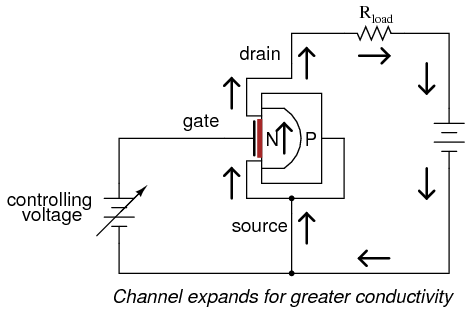{ #fig:03180 width=75% }

Reversing the controlling voltage\'s polarity has the opposite effect, attracting the depletion region and narrowing the channel, consequently reducing channel conductivity:

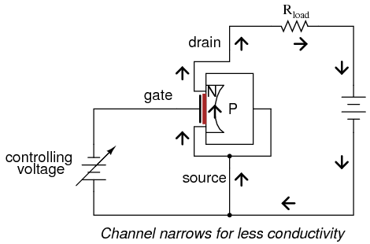{ #fig:03181 width=75% }

The insulated gate allows for controlling voltages of any polarity without danger of forward-biasing a junction, as was the concern with JFETs. This type of IGFET, although its called a \"depletion-type,\" actually has the capability of having its channel _either_ depleted (channel narrowed) _or_ enhanced (channel expanded). Input voltage polarity determines which way the channel will be influenced.

Understanding which polarity has which effect is not as difficult as it may seem. The key is to consider the type of semiconductor doping used in the channel (N-channel or P-channel?), then relate that doping type to the side of the input voltage source connected to the channel by means of the source lead. If the IGFET is an N-channel and the input voltage is connected so that the positive (+) side is on the gate while the negative (-) side is on the source, the channel will be enhanced as extra electrons build up on the channel side of the dielectric barrier. Think, \"negative (-) correlates with _N_-type, thus enhancing the channel with the right type of charge carrier (electrons) and making it more conductive.\" Conversely, if the input voltage is connected to an N-channel IGFET the other way, so that negative (-) connects to the gate while positive (+) connects to the source, free electrons will be \"robbed\" from the channel as the gate-channel capacitor charges, thus depleting the channel of majority charge carriers and making it less conductive.

For P-channel IGFETs, the input voltage polarity and channel effects follow the same rule. That is to say, it takes just the opposite polarity as an N-channel IGFET to either deplete or enhance:

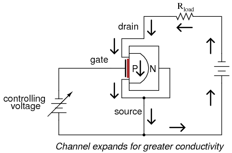{ #fig:03182 width=75% }

\

{ #fig:03183 width=75% }

Illustrating the proper biasing polarities with standard IGFET symbols:

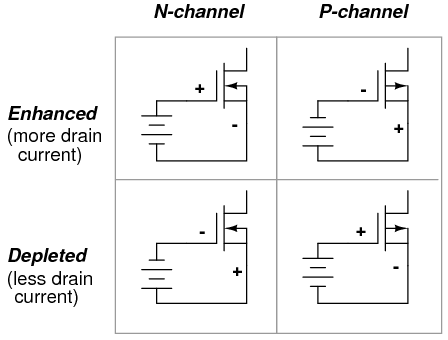{ #fig:03184 width=75% }

When there is zero voltage applied between gate and source, the IGFET will conduct current between source and drain, but not as much current as it would if it were enhanced by the proper gate voltage. This places the depletion-type, or simply _D-type_, IGFET in a category of its own in the transistor world. Bipolar junction transistors are _normally-off_ devices: with no base current, they block any current from going through the collector. Junction field-effect transistors are _normally-on_ devices: with zero applied gate-to-source voltage, they allow maximum drain current (actually, you can coax a JFET into greater drain currents by applying a very small forward-bias voltage between gate and source, but this should never be done in practice for risk of damaging its fragile PN junction). D-type IGFETs, however, are _normally half-on_ devices: with no gate-to-source voltage, their conduction level is somewhere between cutoff and full saturation. Also, they will tolerate applied gate-source voltages of any polarity, the PN junction being immune from damage due to the insulating barrier and especially the direct connection between source and substrate preventing any voltage differential across the junction.

Ironically, the conduction behavior of a D-type IGFET is strikingly similar to that of an electron tube of the triode/tetrode/pentode variety. These devices were voltage-controlled current regulators that likewise allowed current through them with zero controlling voltage applied. A controlling voltage of one polarity (grid negative and cathode positive) would diminish conductivity through the tube while a voltage of the other polarity (grid positive and cathode negative) would enhance conductivity. I find it curious that one of the later transistor designs invented exhibits the same basic properties of the very first active (electronic) device.

A few SPICE analyses will demonstrate the current-regulating behavior of D-type IGFETs. First, a test with zero input voltage (gate shorted to source) and the power supply swept from 0 to 50 volts. The graph shows drain current:

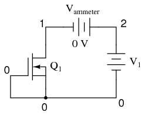{ #fig:03185 width=75% }

\

    n-channel igfet characteristic curve
    m1 1 0 0 0 mod1
    vammeter 2 1 dc 0
    v1 2 0
    .model mod1 nmos vto=-1
    .dc v1 0 50 2
    .plot dc i(vammeter)
    .end

\
\

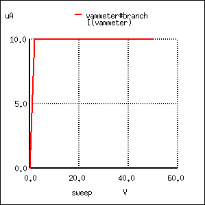{ #fig:23020 width=75% }

\

As expected for any transistor, the controlled current holds steady at a regulated value over a wide range of power supply voltages. In this case, that regulated point is 10 µA (1.000E-05). Now let\'s see what happens when we apply a negative voltage to the gate (with reference to the source) and sweep the power supply over the same range of 0 to 50 volts:

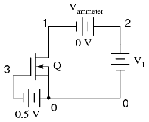{ #fig:03186 width=75% }

\

    n-channel igfet characteristic curve
    m1 1 3 0 0 mod1
    vin 0 3 dc 0.5
    vammeter 2 1 dc 0
    v1 2 0
    .model mod1 nmos vto=-1
    .dc v1 0 50 2
    .plot dc i(vammeter)
    .end

\

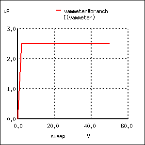{ #fig:23021 width=75% }

\

Not surprisingly, the drain current is now regulated at a lower value of 2.5 µA (down from 10 µA with zero input voltage). Now let\'s apply an input voltage of the other polarity, to _enhance_ the IGFET:

{ #fig:03187 width=75% }

\

    n-channel igfet characteristic curve
    m1 1 3 0 0 mod1
    vin 3 0 dc 0.5
    vammeter 2 1 dc 0
    v1 2 0
    .model mod1 nmos vto=-1
    .dc v1 0 50 2
    .plot dc i(vammeter)
    .end

\

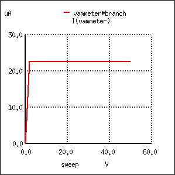{ #fig:23022 width=75% }

\

With the transistor enhanced by the small controlling voltage, the drain current is now at an increased value of 22.5 µA (2.250E-05). It should be apparent from these three sets of voltage and current figures that the relationship of drain current to gate-source voltage is nonlinear just as it was with the JFET. With 1/2 volt of depleting voltage, the drain current is 2.5 µA; with 0 volts input the drain current goes up to 10 µA; and with 1/2 volt of enhancing voltage, the current is at 22.5 µA. To obtain a better understanding of this nonlinearity, we can use SPICE to plot the drain current over a range of input voltage values, sweeping from a negative (depleting) figure to a positive (enhancing) figure, maintaining the power supply voltage of V~1~ at a constant value:

\

    n-channel igfet
    m1 1 3 0 0 mod1
    vin 3 0
    vammeter 2 1 dc 0
    v1 2 0 dc 24
    .model mod1 nmos vto=-1
    .dc vin -1 1 0.1
    .plot dc i(vammeter)
    .end

\

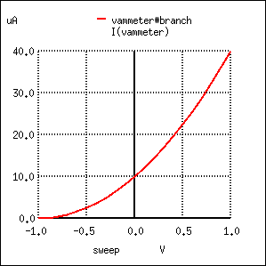{ #fig:23023 width=75% }

\

Just as it was with JFETs, this inherent nonlinearity of the IGFET has the potential to cause distortion in an amplifier circuit, as the input signal will not be reproduced with 100 percent accuracy at the output. Also notice that a gate-source voltage of about 1 volt in the depleting direction is able to pinch off the channel so that there is virtually no drain current. D-type IGFETs, like JFETs, have a certain pinch-off voltage rating. This rating varies with the precise unique of the transistor, and may not be the same as in our simulation here.

Plotting a set of characteristic curves for the IGFET, we see a pattern not unlike that of the JFET:

{ #fig:03188 width=75% }

- **REVIEW:**
-
-
-

## [[Enhancement-type IGFETs \-- PENDING]{#xtocid15706072}]

- **REVIEW:**
-
-
-

## [[Active-mode operation \-- PENDING]{#xtocid15706073}]

- **REVIEW:**
-
-
-

## [[The common-source amplifier \-- PENDING]{#xtocid15706074}]

- **REVIEW:**
-
-
-

## [[The common-drain amplifier \-- PENDING]{#xtocid15706075}]

- **REVIEW:**
-
-
-

## [[The common-gate amplifier \-- PENDING]{#xtocid15706076}]

- **REVIEW:**
-
-
-

## [[Biasing techniques \-- PENDING]{#xtocid15706077}]

- **REVIEW:**
-
-
-

## [[Transistor ratings and packages \-- PENDING]{#xtocid15706078}]

- **REVIEW:**
-
-
-

## [[IGFET quirks \-- PENDING]{#xtocid15706079}]

- **REVIEW:**
-
-
-

## [[MESFETs \-- PENDING]{#xtocid157060710}]

- **REVIEW:**
-
-
-

## IGBTs{ #sec:xtocid157060711 }

Because of their insulated gates, IGFETs of all types have extremely high current gain: there can be no sustained gate current if there is no continuous gate _circuit_ in which electrons may continually flow. The only current we see through the gate terminal of an IGFET, then, is whatever transient (brief surge) may be required to charge the gate-channel capacitance and displace the depletion region as the transistor switches from an \"on\" state to an \"off\" state, or vice versa.

This high current gain would at first seem to place IGFET technology at a decided advantage over bipolar transistors for the control of very large currents. If a bipolar junction transistor is used to control a large collector current, there must be a substantial base current sourced or sunk by some control circuitry, in accordance with the β ratio. To give an example, in order for a power BJT with a β of 20 to conduct a collector current of 100 amps, there must be at least 5 amps of base current, a substantial amount of current in itself for miniature discrete or integrated control circuitry to handle:

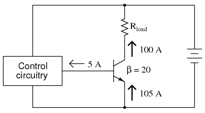{ #fig:03308 width=75% }

It would be nice from the standpoint of control circuitry to have power transistors with high current gain, so that far less current is needed for control of load current. Of course, we can use Darlington pair transistors to increase the current gain, but this kind of arrangement still requires _far_ more controlling current than an equivalent power IGFET:

{ #fig:03309 width=75% }

Unfortunately, though, IGFETs have problems of their own controlling high current: they typically exhibit greater drain-to-source voltage drop while saturated than the collector-to-emitter voltage drop of a saturated BJT. This greater voltage drop equates to higher power dissipation for the same amount of load current, limiting the usefulness of IGFETs as high-power devices. Although some specialized designs such as the so-called VMOS transistor have been designed to minimize this inherent disadvantage, the bipolar junction transistor is still superior in its ability to switch high currents.

An interesting solution to this dilemma leverages the best features of IGFETs with the best of features of BJTs, in one device called an _Insulated-Gate Bipolar Transistor_, or _IGBT_. Also known as an _Bipolar-mode MOSFET_, a _Conductivity-Modulated Field-Effect Transistor_ (_COMFET_), or simply as an _Insulated-Gate Transistor_ (_IGT_), it is equivalent to a Darlington pair of IGFET and BJT:

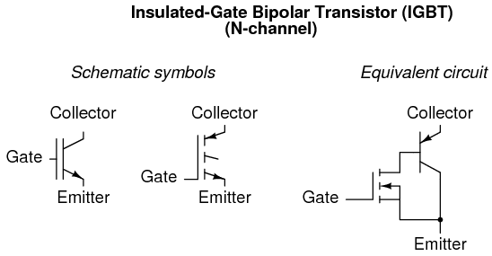{ #fig:03310 width=75% }

In essence, the IGFET controls the base current of a BJT, which handles the main load current between collector and emitter. This way, there is extremely high current gain (since the insulated gate of the IGFET draws practically no current from the control circuitry), but the collector-to-emitter voltage drop during full conduction is as low as that of an ordinary BJT.

One disadvantage of the IGBT over a standard BJT is its slower turn-off time. For _fast_ switching and high current-handling capacity, its difficult to beat the bipolar junction transistor. Faster turn-off times for the IGBT may be achieved by certain changes in design, but only at the expense of a higher saturated voltage drop between collector and emitter. However, the IGBT provides a good alternative to IGFETs and BJTs for high-power control applications.

- **REVIEW:**
-
-
-

\

---

_Lessons In Electric Circuits_ copyright (C) 2000-2023 Tony R. Kuphaldt, under the terms and conditions of the [CC BY License](SEMI_A3.html).

  
