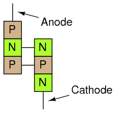
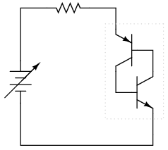
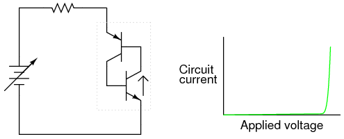
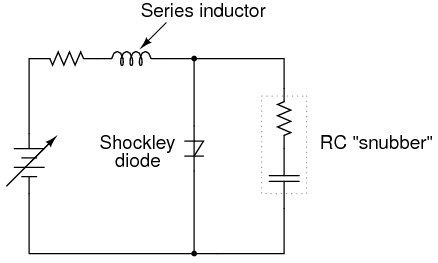
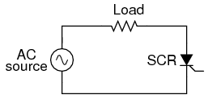
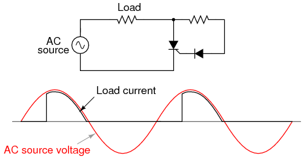
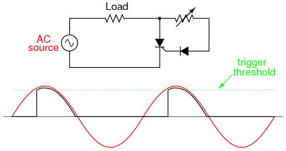
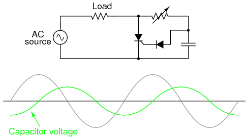
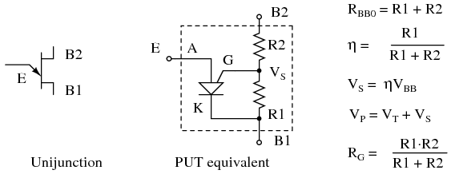
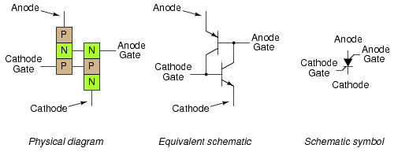

  

---

# Lessons In Electric Circuits \-- Volume III

# Chapter 7

# THYRISTORS

- [[Hysteresis]](#xtocid15706160)
- [[Gas discharge tubes]](#xtocid15706161)
- [[The Shockley Diode]](#xtocid15706162)
- [[The DIAC]](#xtocid15706163)
- [[The Silicon-Controlled Rectifier (SCR)]](#xtocid15706164)
- [[The TRIAC]](#xtocid15706165)
- [[Optothyristors]](#xtocid15706166)
- [[The Unijunction Transistor (UJT)]](#xtocid15706167)
- [[The Silicon-Controlled Switch (SCS)]](#xtocid15706168)
- [[Field-effect-controlled thyristors]](#xtocid15706169)
- [Bibliography](#xtocid157061610)

## Hysteresis{ #sec:xtocid15706160 }

Thyristors are a class of semiconductor components exhibiting _hysteresis_, that property whereby a system fails to return to its original state after some cause of state change has been removed. A very simple example of hysteresis is the mechanical action of a toggle switch: when the lever is pushed, it flips to one of two extreme states (positions) and will remain there even after the source of motion is removed (after you remove your hand from the switch lever). To illustrate the absence of hysteresis, consider the action of a \"momentary\" pushbutton switch, which returns to its original state after the button is no longer pressed: when the stimulus is removed (your hand), the system (switch) immediately and fully returns to its prior state with no \"latching\" behavior.

Bipolar, junction field-effect, and insulated gate field-effect transistors are all non-hysteric devices. That is, these do not inherently \"latch\" into a state after being stimulated by a voltage or current signal. For any given input signal at any given time, a transistor will exhibit a predictable output response as defined by its characteristic curve. Thyristors, on the other hand, are semiconductor devices that tend to stay \"on\" once turned on, and tend to stay \"off\" once turned off. A momentary event is able to flip these devices into either their on or off states where these will remain that way on their own, even after the cause of the state change is taken away. As such, these are useful only as on/off switching devices \-- much like a toggle switch \-- and cannot be used as analog signal amplifiers.

Thyristors are constructed using the same technology as bipolar junction transistors, and in fact may be analyzed as circuits comprised of transistor pairs. How then, can a hysteric device (a thyristor) be made from non-hysteric devices (transistors)? The answer to this question is _positive feedback_, also known as _regenerative feedback_. As you should recall, feedback is the condition where a percentage of the output signal is \"fed back\" to the input of an amplifying device. Negative, or degenerative, feedback results in a diminishing of voltage gain with increases in stability, linearity, and bandwidth. Positive feedback, on the other hand, results in a kind of instability where the amplifier\'s output tends to \"saturate.\" In the case of thyristors, this saturating tendency equates to the device \"wanting\" to stay on once turned on, and off once turned off.

In this chapter we will explore several different kinds of thyristors, most of which stem from a single, basic two-transistor core circuit. Before we do that, though, it would be beneficial to study the technological predecessor to thyristors: gas discharge tubes.

## Gas discharge tubes{ #sec:xtocid15706161 }

If you\'ve ever witnessed a lightning storm, you\'ve seen electrical hysteresis in action (and probably didn\'t realize what you were seeing). The action of strong wind and rain accumulates tremendous static electric charges between cloud and earth, and between clouds as well. Electric charge imbalances manifest themselves as high voltages, and when the electrical resistance of air can no longer hold these high voltages at bay, huge surges of current travel between opposing poles of electrical charge which we call \"lightning.\"

The buildup of high voltages by wind and rain is a fairly continuous process, the rate of charge accumulation increasing under the proper atmospheric conditions. However, lightning bolts are anything but continuous: they exist as relatively brief surges rather than continuous discharges. Why is this? Why don\'t we see soft, glowing lightning _arcs_ instead of violently brief lightning _bolts_? The answer lies in the nonlinear (and hysteric) resistance of air.

Under ordinary conditions, air has an extremely high amount of resistance. It is so high, in fact, that we typically treat its resistance as infinite and electrical conduction through the air as negligible. The presence of water and dust in air lowers its resistance some, but it is still an insulator for most practical purposes. When enough high voltage is applied across a distance of air, though, its electrical properties change: electrons become \"stripped\" from their normal positions around their respective atoms and are liberated to constitute a current. In this state, air is considered to be _ionized_ and is called a _plasma_ rather than a _gas_. This usage of the word \"plasma\" is not to be confused with the medical term (meaning the fluid portion of blood), but is a fourth state of matter, the other three being solid, liquid, and vapor (gas). Plasma is a relatively good conductor of electricity, its specific resistance being much lower than that of the same substance in its gaseous state.

As an electric current moves through the plasma, there is energy dissipated in the plasma in the form of heat, just as current through a solid resistor dissipates energy in the form of heat. In the case of lightning, the temperatures involved are extremely high. High temperatures are also sufficient to convert gaseous air into a plasma or maintain plasma in that state without the presence of high voltage. As the voltage between cloud and earth, or between cloud and cloud, decreases as the charge imbalance is neutralized by the current of the lightning bolt, the heat dissipated by the bolt maintains the air path in a plasma state, keeping its resistance low. The lightning bolt remains a plasma until the voltage decreases to too low a level to sustain enough current to dissipate enough heat. Finally, the air returns to a gaseous state and stops conducting current, thus allowing voltage to build up once more.

Note how throughout this cycle, the air exhibits hysteresis. When not conducting electricity, it tends to _remain an insulator_ until voltage builds up past a critical threshold point. Then, once it changes state and becomes a plasma, it tends to _remain a conductor_ until voltage falls below a lower critical threshold point. Once \"turned on\" it tends to stay \"on,\" and once \"turned off\" it tends to stay \"off.\" This hysteresis, combined with a steady buildup of voltage due to the electrostatic effects of wind and rain, explains the action of lightning as brief bursts.

In electronic terms, what we have here in the action of lightning is a simple _relaxation oscillator_. Oscillators are electronic circuits that produce an oscillating (AC) voltage from a steady supply of DC power. A relaxation oscillator is one that works on the principle of a charging capacitor that is suddenly discharged every time its voltage reaches a critical threshold value. One of the simplest relaxation oscillators in existence is comprised of three components (not counting the DC power supply): a resistor, capacitor, and neon lamp in @fig:03189.

{ #fig:03189 width=75% }

_Simple relaxation oscillator_

Neon lamps are nothing more than two metal electrodes inside a sealed glass bulb, separated by the neon gas inside. At room temperatures and with no applied voltage, the lamp has nearly infinite resistance. However, once a certain threshold voltage is exceeded (this voltage depends on the gas pressure and geometry of the lamp), the neon gas will become ionized (turned into a plasma) and its resistance dramatically reduced. In effect, the neon lamp exhibits the same characteristics as air in a lightning storm, complete with the emission of light as a result of the discharge, albeit on a much smaller scale.

The capacitor in the relaxation oscillator circuit shown above charges at an inverse exponential rate determined by the size of the resistor. When its voltage reaches the threshold voltage of the lamp, the lamp suddenly \"turns on\" and quickly discharges the capacitor to a low voltage value. Once discharged, the lamp \"turns off\" and allows the capacitor to build up a charge once more. The result is a series of brief flashes of light from the lamp, the rate of which is dictated by battery voltage, resistor resistance, capacitor capacitance, and lamp threshold voltage.

While gas-discharge lamps are more commonly used as sources of illumination, their hysteric properties were leveraged in slightly more sophisticated variants known as _thyratron tubes_. Essentially a gas-filled triode tube (a triode being a three-element vacuum electron tube performing much a similar function to the N-channel, D-type IGFET), the thyratron tube could be turned on with a small control voltage applied between grid and cathode, and turned off by reducing the plate-to-cathode voltage.

{ #fig:03018 width=75% }

_Simple thyratron control circuit_

In essence, thyratron tubes were _controlled_ versions of neon lamps built specifically for switching current to a load. The dot inside the circle of the schematic symbol indicates a gas fill, as opposed to the hard vacuum normally seen in other electron tube designs. In the circuit shown above in @fig:03018. the thyratron tube allows current through the load in one direction (note the polarity across the load resistor) when triggered by the small DC control voltage connected between grid and cathode. Note that the load\'s power source is AC, which provides a clue about how the thyratron turns off after its been triggered on: since AC voltage periodically passes through a condition of 0 volts between half-cycles, the current through an AC-powered load must also periodically halt. This brief pause of current between half-cycles gives the tube\'s gas time to cool, letting it return to its normal \"off\" state. Conduction may resume only if enough voltage is applied by the AC power source (some other time in the wave\'s cycle) _and_ if the DC control voltage allows it.

An oscilloscope display of load voltage in such a circuit would look something like @fig:03190.

{ #fig:03190 width=75% }

_Thyratron waveforms_

As the AC supply voltage climbs from zero volts to its first peak, the load voltage remains at zero (no load current) until the threshold voltage is reached. At that point, the tube switches \"on\" and begins to conduct, the load voltage now following the AC voltage through the rest of the half cycle. Load voltage exists (and thus load current) even when the AC voltage waveform has dropped below the threshold value of the tube. This is hysteresis at work: the tube stays in its conductive mode past the point where it first turned on, continuing to conduct until there the supply voltage drops off to almost zero volts. Because thyratron tubes are one-way (diode) devices, no voltage develops across the load through the negative half-cycle of AC. In practical thyratron circuits, multiple tubes arranged in some form of full-wave rectifier circuit to facilitate full-wave DC power to the load.

The thyratron tube has been applied to a relaxation oscillator circuit. @VTS The frequency is controlled by a small DC voltage between grid and cathode. (See @fig:03191) This voltage-controlled oscillator is known as a _VCO_. Relaxation oscillators produce a very non-sinusoidal output, and they exist mostly as demonstration circuits (as is the case here) or in applications where the harmonic rich waveform is desirable. @MET

{ #fig:03191 width=75% }

_Voltage controlled thyratron relaxation oscillator_

I speak of thyratron tubes in the past tense for good reason: modern semiconductor components have obsoleted thyratron tube technology for all but a few very special applications. It is no coincidence that the word _thyristor_ bears so much similarity to the word _thyratron_, for this class of semiconductor components does much the same thing: use *hy*ste*r*etically switch current on and off. It is these modern devices that we now turn our attention to.

- **REVIEW:**
- Electrical _hysteresis_, the tendency for a component to remain \"on\" (conducting) after it begins to conduct and to remain \"off\" (nonconducting) after it ceases to conduct, helps to explain why lightning bolts exist as momentary surges of current rather than continuous discharges through the air.
- Simple gas-discharge tubes such as neon lamps exhibit electrical hysteresis.
- More advanced gas-discharge tubes have been made with control elements so that their \"turn-on\" voltage could be adjusted by an external signal. The most common of these tubes was called the _thyratron_.
- Simple oscillator circuits called _relaxation oscillators_ may be created with nothing more than a resistor-capacitor charging network and a hysteretic device connected across the capacitor.

## The Shockley Diode{ #sec:xtocid15706162 }

Our exploration of thyristors begins with a device called the _four-layer diode_, also known as a _PNPN diode_, or a _Shockley diode_ after its inventor, William Shockley. This is not to be confused with a _Schottky diode_, that two-layer metal-semiconductor device known for its high switching speed. A crude illustration of the Shockley diode, often seen in textbooks, is a four-layer sandwich of P-N-P-N semiconductor material, @fig:03192.

{ #fig:03192 width=75% }

_Shockley or 4-layer diode_

Unfortunately, this simple illustration does nothing to enlighten the viewer on how it works or why. Consider an alternative rendering of the device\'s construction in @fig:03193.

{ #fig:03193 width=75% }

_Transistor equivalent of Shockley diode_

Shown like this, it appears to be a set of interconnected bipolar transistors, one PNP and the other NPN. Drawn using standard schematic symbols, and respecting the layer doping concentrations not shown in the last image, the Shockley diode looks like this (@fig:03194)

{ #fig:03194 width=75% }

_Shockley diode: physical diagram, equivalent schematic diagram, and schematic symbol._

Let\'s connect one of these devices to a source of variable voltage and see what happens: (@fig:03195)

{ #fig:03195 width=75% }

_Powered Shockley diode equivalent circuit._

With no voltage applied, of course there will be no current. As voltage is initially increased, there will still be no current because neither transistor is able to turn on: both will be in cutoff mode. To understand why this is, consider what it takes to turn a bipolar junction transistor on: current through the base-emitter junction. As you can see in the diagram, base current through the lower transistor is controlled by the upper transistor, and the base current through the upper transistor is controlled by the lower transistor. In other words, neither transistor can turn on until the _other_ transistor turns on. What we have here, in vernacular terms, is known as a Catch-22.

So how can a Shockley diode ever conduct current, if its constituent transistors stubbornly maintain themselves in a state of cutoff? The answer lies in the behavior of _real_ transistors as opposed to _ideal_ transistors. An ideal bipolar transistor will never conduct collector current if no base current flows, no matter how much or little voltage we apply between collector and emitter. Real transistors, on the other hand, have definite limits to how much collector-emitter voltage each can withstand before one breaks down and conduct. If two real transistors are connected in this fashion to form a Shockley diode, each one will conduct if sufficient voltage is applied by the battery between anode and cathode to cause one of them to break down. Once one transistor breaks down and begins to conduct, it will allow base current through the other transistor, causing it to turn on in a normal fashion, which then allows base current through the first transistor. The end result is that both transistors will be saturated, now keeping each other turned on instead of off.

So, we can force a Shockley diode to turn on by applying sufficient voltage between anode and cathode. As we have seen, this will inevitably cause one of the transistors to turn on, which then turns the other transistor on, ultimately \"latching\" both transistors on where each will tend to remain. But how do we now get the two transistors to turn off again? Even if the applied voltage is reduced to a point well below what it took to get the Shockley diode conducting, it will remain conducting because both transistors now have base current to maintain regular, controlled conduction. The answer to this is to reduce the applied voltage to a much lower point where too little current flows to maintain transistor bias, at which point one of the transistors will cutoff, which then halts base current through the other transistor, sealing both transistors in the \"off\" state as each one was before any voltage was applied at all.

If we graph this sequence of events and plot the results on an I/V graph, the hysteresis is evident. First, we will observe the circuit as the DC voltage source (battery) is set to zero voltage: (@fig:03196)

{ #fig:03196 width=75% }

_Zero applied voltage; zero current_

Next, we will steadily increase the DC voltage. Current through the circuit is at or nearly at zero, as the breakdown limit has not been reached for either transistor: (@fig:03197)

{ #fig:03197 width=75% }

_Some applied voltage; still no current_

When the voltage breakdown limit of one transistor is reached, it will begin to conduct collector current even though no base current has gone through it yet. Normally, this sort of treatment would destroy a bipolar junction transistor, but the PNP junctions comprising a Shockley diode are engineered to take this kind of abuse, similar to the way a Zener diode is built to handle reverse breakdown without sustaining damage. For the sake of illustration I\'ll assume the lower transistor breaks down first, sending current through the base of the upper transistor: (@fig:03198)

{ #fig:03198 width=75% }

_More voltage applied; lower transistor breaks down_

As the upper transistor receives base current, it turns on as expected. This action allows the lower transistor to conduct normally, the two transistors \"sealing\" themselves in the \"on\" state. Full current is quickly seen in the circuit: (@fig:03199)

{ #fig:03199 width=75% }

_Transistors are now fully conducting._

The positive feedback mentioned earlier in this chapter is clearly evident here. When one transistor breaks down, it allows current through the device structure. This current may be viewed as the \"output\" signal of the device. Once an output current is established, it works to hold both transistors in saturation, thus ensuring the continuation of a substantial output current. In other words, an output current \"feeds back\" positively to the input (transistor base current) to keep both transistors in the \"on\" state, thus reinforcing (or _regenerating_) itself.

With both transistors maintained in a state of saturation with the presence of ample base current, each will continue to conduct even if the applied voltage is greatly reduced from the breakdown level. The effect of positive feedback is to keep both transistors in a state of saturation despite the loss of input stimulus (the original, high voltage needed to break down one transistor and cause a base current through the other transistor): (@fig:03200)

{ #fig:03200 width=75% }

_Current maintained even when voltage is reduced_

If the DC voltage source is turned down too far, though, the circuit will eventually reach a point where there isn\'t enough current to sustain both transistors in saturation. As one transistor passes less and less collector current, it reduces the base current for the other transistor, thus reducing base current for the first transistor. The vicious cycle continues rapidly until both transistors fall into cutoff: (@fig:03201)

{ #fig:03201 width=75% }

_If voltage drops too low, both transistors shut off._

Here, positive feedback is again at work: the fact that the cause/effect cycle between both transistors is \"vicious\" (a decrease in current through one works to decrease current through the other, further decreasing current through the first transistor) indicates a positive relationship between output (controlled current) and input (controlling current through the transistors\' bases).

The resulting curve on the graph is classically hysteretic: as the input signal (voltage) is increased and decreased, the output (current) does not follow the same path going down as it did going up: (@fig:03202)

{ #fig:03202 width=75% }

_Hysteretic curve_

Put in simple terms, the Shockley diode tends to stay on once its turned on, and stay off once its turned off. No \"in-between\" or \"active\" mode in its operation: it is a purely on or off device, as are all thyristors.

A few special terms apply to Shockley diodes and all other thyristor devices built upon the Shockley diode foundation. First is the term used to describe its \"on\" state: _latched_. The word \"latch\" is reminiscent of a door lock mechanism, which tends to keep the door closed once it has been pushed shut. The term _firing_ refers to the initiation of a latched state. To get a Shockley diode to latch, the applied voltage must be increased until _breakover_ is attained. Though this action is best described as transistor break*down*, the term break*over* is used instead because the result is a pair of transistors in mutual saturation rather than destruction of the transistor. A latched Shockley diode is re-set back into its nonconducting state by reducing current through it until _low-current dropout_ occurs.

Note that Shockley diodes may be fired in a way other than breakover: excessive _voltage rise_, or _dv/dt_. If the applied voltage across the diode increases at a high rate of change, it may trigger. This is able to cause latching (turning on) of the diode due to inherent junction capacitances within the transistors. Capacitors, as you may recall, oppose _changes_ in voltage by drawing or supplying current. If the applied voltage across a Shockley diode rises at too fast a rate, those tiny capacitances will draw enough current during that time to activate the transistor pair, turning them both on. Usually, this form of latching is undesirable, and can be minimized by filtering high-frequency (fast voltage rises) from the diode with series inductors and parallel resistor-capacitor networks called _snubbers_: (@fig:03203)

{ #fig:03203 width=75% }

_Both the series inductor and parallel resistor-capacitor "snubber" circuit help minimize the Shockley diode\'s exposure to excessively rising voltage._

The voltage rise limit of a Shockley diode is referred to as the _critical rate of voltage rise_. Manufacturers usually provide this specification for the devices they sell.

- **REVIEW:**
- Shockley diodes are four-layer PNPN semiconductor devices. These behave as a pair of interconnected PNP and NPN transistors.
- Like all thyristors, Shockley diodes tend to stay on once turned on (_latched_), and stay off once turned off.
- To latch a Shockley diode exceed the anode-to-cathode _breakover_ voltage, or exceed the anode-to-cathode _critical rate of voltage rise_.
- To cause a Shockley diode to stop conducting, reduce the current going through it to a level below its _low-current dropout_ threshold.

## The DIAC{ #sec:xtocid15706163 }

Like all diodes, Shockley diodes are unidirectional devices; that is, these only conduct current in one direction. If bidirectional (AC) operation is desired, two Shockley diodes may be joined in parallel facing different directions to form a new kind of thyristor, the _DIAC_: (@fig:03204)

{ #fig:03204 width=75% }

_The DIAC_

A DIAC operated with a DC voltage across it behaves exactly the same as a Shockley diode. With AC, however, the behavior is different from what one might expect. Because alternating current repeatedly reverses direction, DIACs will not stay latched longer than one-half cycle. If a DIAC becomes latched, it will continue to conduct current only as long as voltage is available to push enough current in that direction. When the AC polarity reverses, as it must twice per cycle, the DIAC will drop out due to insufficient current, necessitating another breakover before it conducts again. The result is the current waveform in @fig:03205.

{ #fig:03205 width=75% }

_DIAC waveforms_

DIACs are almost never used alone, but in conjunction with other thyristor devices.

## [[The Silicon-Controlled Rectifier (SCR)]{#xtocid15706164}]

Shockley diodes are curious devices, but rather limited in application. Their usefulness may be expanded, however, by equipping them with another means of latching. In doing so, each becomes true amplifying devices (if only in an on/off mode), and we refer to these as _silicon-controlled rectifiers_, or *SCR*s.

The progression from Shockley diode to SCR is achieved with one small addition, actually nothing more than a third wire connection to the existing PNPN structure: (@fig:03206)

{ #fig:03206 width=75% }

_The Silicon-Controlled Rectifier (SCR)_

If an SCR\'s gate is left _floating_ (disconnected), it behaves exactly as a Shockley diode. It may be latched by breakover voltage or by exceeding the critical rate of voltage rise between anode and cathode, just as with the Shockley diode. Dropout is accomplished by reducing current until one or both internal transistors fall into cutoff mode, also like the Shockley diode. However, because the gate terminal connects directly to the base of the lower transistor, it may be used as an alternative means to latch the SCR. By applying a small voltage between gate and cathode, the lower transistor will be forced _on_ by the resulting base current, which will cause the upper transistor to conduct, which then supplies the lower transistor\'s base with current so that it no longer needs to be activated by a gate voltage. The necessary gate current to initiate latch-up, of course, will be much lower than the current through the SCR from cathode to anode, so the SCR does achieve a measure of amplification.

This method of securing SCR conduction is called _triggering_, and it is by far the most common way that SCRs are latched in actual practice. In fact, SCRs are usually chosen so that their breakover voltage is far beyond the greatest voltage expected to be experienced from the power source, so that it can be turned on _only_ by an intentional voltage pulse applied to the gate.

It should be mentioned that SCRs may _sometimes_ be turned off by directly shorting their gate and cathode terminals together, or by \"reverse-triggering\" the gate with a negative voltage (in reference to the cathode), so that the lower transistor is forced into cutoff. I say this is \"sometimes\" possible because it involves shunting all of the upper transistor\'s collector current past the lower transistor\'s base. This current may be substantial, making triggered shut-off of an SCR difficult at best. A variation of the SCR, called a _Gate-Turn-Off_ thyristor, or _GTO_, makes this task easier. But even with a GTO, the gate current required to turn it off may be as much as 20% of the anode (load) current! The schematic symbol for a GTO is shown in the following illustration: (@fig:03276)

{ #fig:03276 width=75% }

_The Gate Turn-Off thyristor (GTO)_

SCRs and GTOs share the same equivalent schematics (two transistors connected in a positive-feedback fashion), the only differences being details of construction designed to grant the NPN transistor a greater β than the PNP. This allows a smaller gate current (forward or reverse) to exert a greater degree of control over conduction from cathode to anode, with the PNP transistor\'s latched state being more dependent upon the NPN\'s than vice versa. The Gate-Turn-Off thyristor is also known by the name of _Gate-Controlled Switch_, or _GCS_.

A rudimentary test of SCR function, or at least terminal identification, may be performed with an ohmmeter. Because the internal connection between gate and cathode is a single PN junction, a meter should indicate continuity between these terminals with the red test lead on the gate and the black test lead on the cathode like this: (@fig:03207)

{ #fig:03207 width=75% }

_Rudimentary test of SCR_

All other continuity measurements performed on an SCR will show \"open\" (\"OL\" on some digital multimeter displays). It must be understood that this test is very crude and does _not_ constitute a comprehensive assessment of the SCR. It is possible for an SCR to give good ohmmeter indications and still be defective. Ultimately, the only way to test an SCR is to subject it to a load current.

If you are using a multimeter with a \"diode check\" function, the gate-to-cathode junction voltage indication you get may or may not correspond to what\'s expected of a silicon PN junction (approximately 0.7 volts). In some cases, you will read a much lower junction voltage: mere hundredths of a volt. This is due to an internal resistor connected between the gate and cathode incorporated within some SCRs. This resistor is added to make the SCR less susceptible to false triggering by spurious voltage spikes, from circuit \"noise\" or from static electric discharge. In other words, having a resistor connected across the gate-cathode junction requires that a _strong_ triggering signal (substantial current) be applied to latch the SCR. This feature is often found in larger SCRs, not on small SCRs. Bear in mind that an SCR with an internal resistor connected between gate and cathode will indicate continuity _in both directions_ between those two terminals: (@fig:03324)

{ #fig:03324 width=75% }

_Larger SCRs have gate to cathode resistor._

\"Normal\" SCRs, lacking this internal resistor, are sometimes referred to as _sensitive gate_ SCRs due to their ability to be triggered by the slightest positive gate signal.

The test circuit for an SCR is both practical as a diagnostic tool for checking suspected SCRs and also an excellent aid to understanding basic SCR operation. A DC voltage source is used for powering the circuit, and two pushbutton switches are used to latch and unlatch the SCR, respectively: (@fig:03208)

{ #fig:03208 width=75% }

_SCR testing circuit_

Actuating the normally-open \"on\" pushbutton switch connects the gate to the anode, allowing current from the negative terminal of the battery, through the cathode-gate PN junction, through the switch, through the load resistor, and back to the battery. This gate current should force the SCR to latch on, allowing current to go directly from cathode to anode without further triggering through the gate. When the \"on\" pushbutton is released, the load should remain energized.

Pushing the normally-closed \"off\" pushbutton switch breaks the circuit, forcing current through the SCR to halt, thus forcing it to turn off (low-current dropout).

If the SCR fails to latch, the problem may be with the load and not the SCR. A certain minimum amount of load current is required to hold the SCR latched in the \"on\" state. This minimum current level is called the _holding current_. A load with too great a resistance value may not draw enough current to keep an SCR latched when gate current ceases, thus giving the false impression of a bad (unlatchable) SCR in the test circuit. Holding current values for different SCRs should be available from the manufacturers. Typical holding current values range from 1 milliamp to 50 milliamps or more for larger units.

For the test to be fully comprehensive, more than the triggering action needs to be tested. The forward breakover voltage limit of the SCR could be tested by increasing the DC voltage supply (with no pushbuttons actuated) until the SCR latches all on its own. Beware that a breakover test may require very high voltage: many power SCRs have breakover voltage ratings of 600 volts or more! Also, if a pulse voltage generator is available, the critical rate of voltage rise for the SCR could be tested in the same way: subject it to pulsing supply voltages of different V/time rates with no pushbutton switches actuated and see when it latches.

In this simple form, the SCR test circuit could suffice as a start/stop control circuit for a DC motor, lamp, or other practical load: (@fig:03209)

{ #fig:03209 width=75% }

_DC motor start/stop control circuit_

Another practical use for the SCR in a DC circuit is as a _crowbar_ device for overvoltage protection. A \"crowbar\" circuit consists of an SCR placed in parallel with the output of a DC power supply, for placing a direct short-circuit on the output of that supply to prevent excessive voltage from reaching the load. Damage to the SCR and power supply is prevented by the judicious placement of a fuse or substantial series resistance ahead of the SCR to limit short-circuit current: (@fig:03210)

{ #fig:03210 width=75% }

_Crowbar circuit used in DC power supply_

Some device or circuit sensing the output voltage will be connected to the gate of the SCR, so that when an overvoltage condition occurs, voltage will be applied between the gate and cathode, triggering the SCR and forcing the fuse to blow. The effect will be approximately the same as dropping a solid steel crowbar directly across the output terminals of the power supply, hence the name of the circuit.

Most applications of the SCR are for AC power control, despite the fact that SCRs are inherently DC (unidirectional) devices. If bidirectional circuit current is required, multiple SCRs may be used, with one or more facing each direction to handle current through both half-cycles of the AC wave. The primary reason SCRs are used at all for AC power control applications is the unique response of a thyristor to an alternating current. As we saw, the thyratron tube (the electron tube version of the SCR) and the DIAC, a hysteretic device triggered on during a portion of an AC half-cycle will latch and remain on throughout the remainder of the half-cycle until the AC current decreases to zero, as it must to begin the next half-cycle. Just prior to the zero-crossover point of the current waveform, the thyristor will turn off due to insufficient current (this behavior is also known as _natural commutation_) and must be fired again during the next cycle. The result is a circuit current equivalent to a \"chopped up\" sine wave. For review, here is the graph of a DIAC\'s response to an AC voltage whose peak exceeds the breakover voltage of the DIAC: (Figure [below](#03205a.png))

[]{#03205a.png}

{ #fig:03205 width=75% }

_DIAC bidirectional response_

With the DIAC, that breakover voltage limit was a fixed quantity. With the SCR, we have control over exactly when the device becomes latched by triggering the gate at any point in time along the waveform. By connecting a suitable control circuit to the gate of an SCR, we can \"chop\" the sine wave at any point to allow for time-proportioned power control to a load.

Take the circuit in @fig:03211 as an example. Here, an SCR is positioned in a circuit to control power to a load from an AC source.

{ #fig:03211 width=75% }

_SCR control of AC power_

Being a unidirectional (one-way) device, at most we can only deliver half-wave power to the load, in the half-cycle of AC where the supply voltage polarity is positive on the top and negative on the bottom. However, for demonstrating the basic concept of time-proportional control, this simple circuit is better than one controlling full-wave power (which would require two SCRs).

With no triggering to the gate, and the AC source voltage well below the SCR\'s breakover voltage rating, the SCR will never turn on. Connecting the SCR gate to the anode through a standard rectifying diode (to prevent reverse current through the gate in the event of the SCR containing a built-in gate-cathode resistor), will allow the SCR to be triggered almost immediately at the beginning of every positive half-cycle: (@fig:03212)

{ #fig:03212 width=75% }

_Gate connected directly to anode through a diode; nearly complete half-wave current through load._

We can delay the triggering of the SCR, however, by inserting some resistance into the gate circuit, thus increasing the amount of voltage drop required before enough gate current triggers the SCR. In other words, if we make it harder for electrons to flow through the gate by adding a resistance, the AC voltage will have to reach a higher point in its cycle before there will be enough gate current to turn the SCR on. The result is in @fig:03213.

{ #fig:03213 width=75% }

_Resistance inserted in gate circuit; less than half-wave current through load._

With the half-sine wave chopped up to a greater degree by delayed triggering of the SCR, the load receives less average power (power is delivered for less time throughout a cycle). By making the series gate resistor variable, we can make adjustments to the time-proportioned power: (@fig:03214)

{ #fig:03214 width=75% }

_Increasing the resistance raises the threshold level, causing less power to be delivered to the load. Decreasing the resistance lowers the threshold level, causing more power to be delivered to the load._

Unfortunately, this control scheme has a significant limitation. In using the AC source waveform for our SCR triggering signal, we limit control to the first half of the waveform\'s half-cycle. In other words, it is not possible for us to wait until _after_ the wave\'s peak to trigger the SCR. This means we can turn down the power only to the point where the SCR turns on at the very peak of the wave: (@fig:03215)

{ #fig:03215 width=75% }

_Circuit at minimum power setting_

Raising the trigger threshold any more will cause the circuit to not trigger at all, since not even the peak of the AC power voltage will be enough to trigger the SCR. The result will be no power to the load.

An ingenious solution to this control dilemma is found in the addition of a phase-shifting capacitor to the circuit: (@fig:03216)

{ #fig:03216 width=75% }

_Addition of a phase-shifting capacitor to the circuit_

The smaller waveform shown on the graph is voltage across the capacitor. For the sake of illustrating the phase shift, I\'m assuming a condition of maximum control resistance where the SCR is not triggering at all with no load current, save for what little current goes through the control resistor and capacitor. This capacitor voltage will be phase-shifted anywhere from 0^o^ to 90^o^ lagging behind the power source AC waveform. When this phase-shifted voltage reaches a high enough level, the SCR will trigger.

With enough voltage across the capacitor to periodically trigger the SCR, the resulting load current waveform will look something like @fig:03217)

{ #fig:03217 width=75% }

_Phase-shifted signal triggers SCR into conduction._

Because the capacitor waveform is still _rising_ after the main AC power waveform has reached its peak, it becomes possible to trigger the SCR at a threshold level beyond that peak, thus chopping the load current wave further than it was possible with the simpler circuit. In reality, the capacitor voltage waveform is a bit more complex that what is shown here, its sinusoidal shape distorted every time the SCR latches on. However, what I\'m trying to illustrate here is the delayed triggering action gained with the phase-shifting RC network; thus, a simplified, undistorted waveform serves the purpose well.

SCRs may also be triggered, or \"fired,\" by more complex circuits. While the circuit previously shown is sufficient for a simple application like a lamp control, large industrial motor controls often rely on more sophisticated triggering methods. Sometimes, pulse transformers are used to couple a triggering circuit to the gate and cathode of an SCR to provide electrical isolation between the triggering and power circuits: (@fig:03218)

{ #fig:03218 width=75% }

_Transformer coupling of trigger signal provides isolation._

When multiple SCRs are used to control power, their cathodes are often _not_ electrically common, making it difficult to connect a single triggering circuit to all SCRs equally. An example of this is the _controlled bridge rectifier_ shown in @fig:03219.

{ #fig:03219 width=75% }

_Controlled bridge rectifier_

In any bridge rectifier circuit, the rectifying diodes (in this example, the rectifying SCRs) must conduct in opposite pairs. SCR~1~ and SCR~3~ must be fired simultaneously, and SCR~2~ and SCR~4~ must be fired together as a pair. As you will notice, though, these pairs of SCRs do not share the same cathode connections, meaning that it would not work to simply parallel their respective gate connections and connect a single voltage source to trigger both: (@fig:03220)

{ #fig:03220 width=75% }

_This strategy will not work for triggering SCR~2~ and SCR~4~ as a pair._

Although the triggering voltage source shown will trigger SCR~4~, it will not trigger SCR~2~ properly because the two thyristors do not share a common cathode connection to reference that triggering voltage. Pulse transformers connecting the two thyristor gates to a common triggering voltage source _will_ work, however: (@fig:03221)

{ #fig:03221 width=75% }

_Transformer coupling of the gates allows triggering of SCR~2~ and SCR~4~ ._

Bear in mind that this circuit only shows the gate connections for two out of the four SCRs. Pulse transformers and triggering sources for SCR~1~ and SCR~3~, as well as the details of the pulse sources themselves, have been omitted for the sake of simplicity.

Controlled bridge rectifiers are not limited to single-phase designs. In most industrial control systems, AC power is available in three-phase form for maximum efficiency, and solid-state control circuits are built to take advantage of that. A three-phase controlled rectifier circuit built with SCRs, without pulse transformers or triggering circuitry shown, would look like @fig:03222.

{ #fig:03222 width=75% }

_Three-phase bridge SCR control of load_

- **REVIEW:**
- A _Silicon-Controlled Rectifier_, or _SCR_, is essentially a Shockley diode with an extra terminal added. This extra terminal is called the _gate_, and it is used to _trigger_ the device into conduction (latch it) by the application of a small voltage.
- To trigger, or _fire_, an SCR, voltage must be applied between the gate and cathode, positive to the gate and negative to the cathode. When testing an SCR, a momentary connection between the gate and anode is sufficient in polarity, intensity, and duration to trigger it.
- SCRs may be fired by intentional triggering of the gate terminal, excessive voltage (breakdown) between anode and cathode, or excessive rate of voltage rise between anode and cathode. SCRs may be turned off by anode current falling below the _holding current value_ (low-current dropout), or by \"reverse-firing\" the gate (applying a negative voltage to the gate). Reverse-firing is only sometimes effective, and always involves high gate current.
- A variant of the SCR, called a Gate-Turn-Off thyristor (GTO), is specifically designed to be turned off by means of reverse triggering. Even then, reverse triggering requires fairly high current: typically 20% of the anode current.
- SCR terminals may be identified by a continuity meter: the only two terminals showing any continuity between them at all should be the gate and cathode. Gate and cathode terminals connect to a PN junction inside the SCR, so a continuity meter should obtain a diode-like reading between these two terminals with the red (+) lead on the gate and the black (-) lead on the cathode. Beware, though, that some large SCRs have an internal resistor connected between gate and cathode, which will affect any continuity readings taken by a meter.
- SCRs are true _rectifiers_: they only allow current through them in one direction. This means they cannot be used alone for full-wave AC power control.
- If the diodes in a rectifier circuit are replaced by SCRs, you have the makings of a _controlled_ rectifier circuit, whereby DC power to a load may be time-proportioned by triggering the SCRs at different points along the AC power waveform.

## The TRIAC{ #sec:xtocid15706165 }

SCRs are unidirectional (one-way) current devices, making them useful for controlling DC only. If two SCRs are joined in back-to-back parallel fashion just like two Shockley diodes were joined together to form a DIAC, we have a new device known as the _TRIAC_: (@fig:03223)

{ #fig:03223 width=75% }

_The TRIAC SCR equivalent and, TRIAC schematic symbol_

Because individual SCRs are more flexible to use in advanced control systems, these are more commonly seen in circuits like motor drives; TRIACs are usually seen in simple, low-power applications like household dimmer switches. A simple lamp dimmer circuit is shown in @fig:03224, complete with the phase-shifting resistor-capacitor network necessary for after-peak firing.

{ #fig:03224 width=75% }

_TRIAC phase-control of power_

[]{#Harmonic, even vs. odd}

TRIACs are notorious for not firing _symmetrically_. This means these usually won\'t trigger at the exact same gate voltage level for one polarity as for the other. Generally speaking, this is undesirable, because unsymmetrical firing results in a current waveform with a greater variety of harmonic frequencies. Waveforms that are symmetrical above and below their average centerlines are comprised of only odd-numbered harmonics. Unsymmetrical waveforms, on the other hand, contain even-numbered harmonics (which may or may not be accompanied by odd-numbered harmonics as well).

In the interest of reducing total harmonic content in power systems, the fewer and less diverse the harmonics, the better \-- one more reason individual SCRs are favored over TRIACs for complex, high-power control circuits. One way to make the TRIAC\'s current waveform more symmetrical is to use a device external to the TRIAC to time the triggering pulse. A DIAC placed in series with the gate does a fair job of this: (@fig:03225)

{ #fig:03225 width=75% }

_DIAC improves symmetry of control_

DIAC breakover voltages tend to be much more symmetrical (the same in one polarity as the other) than TRIAC triggering voltage thresholds. Since the DIAC prevents any gate current until the triggering voltage has reached a certain, repeatable level in either direction, the firing point of the TRIAC from one half-cycle to the next tends to be more consistent, and the waveform more symmetrical above and below its centerline.

Practically all the characteristics and ratings of SCRs apply equally to TRIACs, except that TRIACs of course are bidirectional (can handle current in both directions). Not much more needs to be said about this device except for an important caveat concerning its terminal designations.

From the equivalent circuit diagram shown earlier, one might think that main terminals 1 and 2 were interchangeable. These are not! Although it is helpful to imagine the TRIAC as being composed of two SCRs joined together, it in fact is constructed from a single piece of semiconducting material, appropriately doped and layered. The actual operating characteristics may differ slightly from that of the equivalent model.

This is made most evident by contrasting two simple circuit designs, one that works and one that doesn\'t. The following two circuits are a variation of the lamp dimmer circuit shown earlier, the phase-shifting capacitor and DIAC removed for simplicity\'s sake. Although the resulting circuit lacks the fine control ability of the more complex version (with capacitor and DIAC), it _does_ function: (@fig:03226)

{ #fig:03226 width=75% }

_This circuit with the gate to MT~2~ does function._

Suppose we were to swap the two main terminals of the TRIAC around. According to the equivalent circuit diagram shown earlier in this section, the swap should make no difference. The circuit ought to work: (@fig:03227)

{ #fig:03227 width=75% }

_With the gate swapped to MT~1~, this circuit does not function._

However, if this circuit is built, it will be found that it does not work! The load will receive no power, the TRIAC refusing to fire at all, no matter how low or high a resistance value the control resistor is set to. The key to successfully triggering a TRIAC is to make sure the gate receives its triggering current from the _main terminal 2_ side of the circuit (the main terminal on the opposite side of the TRIAC symbol from the gate terminal). Identification of the MT~1~ and MT~2~ terminals must be done via the TRIAC\'s part number with reference to a data sheet or book.

- **REVIEW:**
- A _TRIAC_ acts much like two SCRs connected back-to-back for bidirectional (AC) operation.
- TRIAC controls are more often seen in simple, low-power circuits than complex, high-power circuits. In large power control circuits, multiple SCRs tend to be favored.
- When used to control AC power to a load, TRIACs are often accompanied by DIACs connected in series with their gate terminals. The DIAC helps the TRIAC fire more symmetrically (more consistently from one polarity to another).
- Main terminals 1 and 2 on a TRIAC are _not_ interchangeable.
- To successfully trigger a TRIAC, gate current must come from the _main terminal 2_ (MT~2~) side of the circuit!

## Optothyristors{ #sec:xtocid15706166 }

Like bipolar transistors, SCRs and TRIACs are also manufactured as light-sensitive devices, the action of impinging light replacing the function of triggering voltage.

Optically-controlled SCRs are often known by the acronym _LASCR_, or **L**ight **A**ctivated **SCR**. Its symbol, not surprisingly, looks like @fig:03228.

{ #fig:03228 width=75% }

_Light activated SCR_

Optically-controlled TRIACs don\'t receive the honor of having their own acronym, but instead are humbly known as opto-TRIACs. Their schematic symbol is shown in @fig:03229.

{ #fig:03229 width=75% }

_Opto-TRIAC_

Optothyristors (a general term for either the LASCR or the opto-TRIAC) are commonly found inside sealed \"optoisolator\" modules.

## [[The Unijunction Transistor (UJT)]{#xtocid15706167}]

**Unijunction transistor:** Although a unijunction transistor is not a thyristor, this device can trigger larger thyristors with a pulse at base B1. A _unijunction transistor_ is composed of a bar of N-type silicon having a P-type connection in the middle. See @fig:03504(a). The connections at the ends of the bar are known as bases B1 and B2; the P-type mid-point is the emitter. With the emitter disconnected, the total resistance R~BBO~, a datasheet item, is the sum of R~B1~ and R~B2~ as shown in @fig:03504(b). R~BBO~ ranges from 4-12kΩ for different device types. The intrinsic standoff ratio η is the ratio of R~B1~ to R~BBO~. It varies from 0.4 to 0.8 for different devices. The schematic symbol is @fig:03504(c)

{ #fig:03504 width=75% }

_Unijunction transistor: (a) Construction, (b) Model, (c) Symbol_

The Unijunction emitter current vs voltage characteristic curve (@fig:03508(a) ) shows that as V~E~ increases, current I~E~ increases up I~P~ at the peak point. Beyond the peak point, current increases as voltage decreases in the negative resistance region. The voltage reaches a minimum at the valley point. The resistance of R~B1~, the saturation resistance is lowest at the valley point.

I~P~ and I~V~, are datasheet parameters; For a 2n2647, I~P~ and I~V~ are 2µA and 4mA, respectively. @AMS V~P~ is the voltage drop across R~B1~ plus a 0.7V diode drop; see @fig:03508(b). V~V~ is estimated to be approximately 10% of V~BB~.

{ #fig:03508 width=75% }

_Unijunction transistor: (a) emitter characteristic curve, (b) model for V~P\ .~_

The relaxation oscillator in @fig:03506 is an application of the unijunction oscillator. R~E~ charges C~E~ until the peak point. The unijunction emitter terminal has no effect on the capacitor until this point is reached. Once the capacitor voltage, V~E~, reaches the peak voltage point V~P~, the lowered emitter-base1 E-B1 resistance quickly discharges the capacitor. Once the capacitor discharges below the valley point V~V~, the E-RB1 resistance reverts back to high resistance, and the capacitor is free to charge again.

{ #fig:03506 width=75% }

_Unijunction transistor relaxation oscillator and waveforms. Oscillator drives SCR._

During capacitor discharge through the E-B1 saturation resistance, a pulse may be seen on the external B1 and B2 load resistors, @fig:03506. The load resistor at B1 needs to be low to not affect the discharge time. The external resistor at B2 is optional. It may be replaced by a short circuit. The approximate frequency is given by 1/f = T = RC. A more accurate expression for frequency is given in @fig:03506.

The charging resistor R~E~ must fall within certain limits. It must be small enough to allow I~P~ to flow based on the V~BB~ supply less V~P~. It must be large enough to supply I~V~ based on the V~BB~ supply less V~V~. @MHW The equations and an example for a 2n2647:

{ #fig:13080 width=75% }

**Programmable Unijunction Transistor (PUT):** Although the unijunction transistor is listed as obsolete (read expensive if obtainable), the programmable unijunction transistor is alive and well. It is inexpensive and in production. Though it serves a function similar to the unijunction transistor, the PUT is a three terminal thyristor. The PUT shares the four-layer structure typical of thyristors shown in @fig:03507. Note that the gate, an N-type layer near the anode, is known as an "anode gate". Moreover, the gate lead on the schematic symbol is attached to the anode end of the symbol.

{ #fig:03507 width=75% }

_Programmable unijunction transistor: Characteristic curve, internal construction, schematic symbol._

The characteristic curve for the programmable unijunction transistor in @fig:03507 is similar to that of the unijunction transistor. This is a plot of anode current I~A~ versus anode voltage V~A~. The gate lead voltage sets, programs, the peak anode voltage V~P~. As anode current inceases, voltage increases up to the peak point. Thereafter, increasing current results in decreasing voltage, down to the valley point.

The PUT equivalent of the unijunction transistor is shown in @fig:03509. External PUT resistors R1 and R2 replace unijunction transistor internal resistors R~B1~ and R~B2~, respectively. These resistors allow the calculation of the intrinsic standoff ratio η.

{ #fig:03509 width=75% }

_PUT equivalent of unijunction transistor_

@fig:03505 shows the PUT version of the unijunction relaxation oscillator Figure [previous](#03506.png){ #fig:03506 width=75% }. Resistor R charges the capacitor until the peak point, Figure [previous](#03507.png){ #fig:03507 width=75% }, then heavy conduction moves the operating point down the negative resistance slope to the valley point. A current spike flows through the cathode during capacitor discharge, developing a voltage spike across the cathode resistors. After capacitor discharge, the operating point resets back to the slope up to the peak point.

{ #fig:03505 width=75% }

_PUT relaxation oscillator_

**Problem:** What is the range of suitable values for R in @fig:03505, a relaxation oscillator? The charging resistor must be small enough to supply enough current to raise the anode to V~P~ the peak point (Figure [previous](#03507.png){ #fig:03507 width=75% }) while charging the capacitor. Once V~P~ is reached, anode voltage decreases as current increases (negative resistance), which moves the operating point to the valley. It is the job of the capacitor to supply the valley current I~V~. Once it is discharged, the operating point resets back to the upward slope to the peak point. The resistor must be large enough so that it will never supply the high valley current I~P~. If the charging resistor ever could supply that much current, the resistor would supply the valley current after the capacitor was discharged and the operating point would never reset back to the high resistance condition to the left of the peak point.

We select the same V~BB~=10V used for the unijunction transistor example. We select values of R1 and R2 so that η is about 2/3. We calculate η and V~S~. The parallel equivalent of R1, R2 is R~G~, which is only used to make selections from Table [below](#put1.tbl). Along with V~S~=10, the closest value to our 6.3, we find V~T~=0.6V, in Table [below](#put1.tbl) and calculate V~P~.

{ #fig:13081 width=75% }

We also find I~P~ and I~V~, the peak and valley currents, respectively in Table [below](#put1.tbl). We still need V~V~, the valley voltage. We used 10% of V~BB~= 1V, in the previous unijunction example. Consulting the datasheet, we find the forward voltage V~F~=0.8V at I~F~=50mA. The valley current I~V~=70µA is much less than I~F~=50mA. Therefore, V~V~ must be less than V~F~=0.8V. How much less? To be safe we set V~V~=0V. This will raise the lower limit on the resistor range a little.

{ #fig:13082 width=75% }

Choosing R \> 143k guarantees that the operating point can reset from the valley point after capacitor discharge. R \< 755k allows charging up to V~P~ at the peak point.

[]{#put1.tbl}

_Selected 2n6027 PUT parameters, adapted from 2n6027 datasheet. @ON1_

Parameter Conditions min typical max units

---

V~T~         V   V~S~=10V, R~G~=1Meg 0.2 0.7 1.6     V~S~=10V, R~G~=10k 0.2 0.35 0.6   I~P~         µA   V~S~=10V, R~G~=1Meg \- 1.25 2.0     V~S~=10V, R~G~=10k \- 4.0 5.0   I~V~         µA   V~S~=10V, R~G~=1Meg \- 18 50     V~S~=10V, R~G~=10k 70 150 \-     V~S~=10V, R~G~=200Ω 1500 \- \-   V~F~ I~F~=50mA \- 0.8 1.5 V

@fig:03510 show the PUT relaxation oscillator with the final resistor values. A practical application of a PUT triggering an SCR is also shown. This circuit needs a V~BB~ unfiltered supply (not shown) divided down from the bridge rectifier to reset the relaxation oscillator after each power zero crossing. The variable resistor should have a minimum resistor in series with it to prevent a low pot setting from hanging at the valley point.

{ #fig:03510 width=75% }

_PUT relaxation oscillator with component values. PUT drives SCR lamp dimmer._

PUT timing circuits are said to be usable to 10kHz. If a linear ramp is required instead of an exponential ramp, replace the charging resistor with a constant current source such as a FET based constant current diode. A substitute PUT may be built from a PNP and NPN silicon transistor as shown for the SCS equivalent circuit in @fig:03319 by omitting the cathode gate and using the anode gate.

- **REVIEW:**
- A unijunction transistor consists of two bases (B1, B2) attached to a resistive bar of silicon, and an emitter in the center. The E-B1 junction has negative resistance properties; it can switch between high and low resistance.
- A PUT (programmable unijunction transistor) is a 3-terminal 4-layer thyristor acting like a unijunction transistor. An external resistor network "programs" η.
- The intrinsic standoff ratio is η=R1/(R1+R2) for a PUT; substitute R~B1~ and R~B2~, respectively, for a unijunction transistor. The trigger voltage is determined by η.
- Unijunction transistors and programmable unijunction transistors are applied to oscillators, timing circuits, and thyristor triggering.

## [[The Silicon-Controlled Switch (SCS)]{#xtocid15706168}]

If we take the equivalent circuit for an SCR and add another external terminal, connected to the base of the top transistor and the collector of the bottom transistor, we have a device known as a _silicon-controlled-switch_, or _SCS_: (@fig:03319)

{ #fig:03319 width=75% }

_The Silicon-Controlled Switch(SCS)_

This extra terminal allows more control to be exerted over the device, particularly in the mode of _forced commutation_, where an external signal forces it to turn off while the main current through the device has not yet fallen below the holding current value. Note that the motor is in the anode gate circuit in @fig:03320. This is correct, although it doesn\'t look right. The anode lead is required to switch the SCS off. Therefore the motor cannot be in series with the anode.

{ #fig:03320 width=75% }

_SCS: Motor start/stop circuit, equivalent circuit with two transistors._

When the \"on\" pushbutton switch is actuated, the voltage applied between the cathode gate and the cathode, forward-biases the lower transistor\'s base-emitter junction, and turning it on. The top transistor of the SCS is ready to conduct, having been supplied with a current path from its emitter terminal (the SCS\'s anode terminal) through resistor R~2~ to the positive side of the power supply. As in the case of the SCR, both transistors turn on and maintain each other in the \"on\" mode. When the lower transistor turns on, it conducts the motor\'s load current, and the motor starts and runs.

The motor may be stopped by interrupting the power supply, as with an SCR, and this is called _natural commutation_. However, the SCS provides us with another means of turning off: _forced commutation_ by shorting the anode terminal to the cathode. @GE1 If this is done (by actuating the \"off\" pushbutton switch), the upper transistor within the SCS will lose its emitter current, thus halting current through the base of the lower transistor. When the lower transistor turns off, it breaks the circuit for base current through the top transistor (securing its \"off\" state), and the motor (making it stop). The SCS will remain in the off condition until such time that the \"on\" pushbutton switch is re-actuated.

- **REVIEW:**
- A _silicon-controlled switch_, or _SCS_, is essentially an SCR with an extra gate terminal.
- Typically, the load current through an SCS is carried by the _anode gate_ and _cathode_ terminals, with the _cathode gate_ and _anode_ terminals sufficing as control leads.
- An SCS is turned on by applying a positive voltage between the _cathode gate_ and _cathode_ terminals. It may be turned off (forced commutation) by applying a negative voltage between the _anode_ and _cathode_ terminals, or simply by shorting those two terminals together. The _anode_ terminal must be kept positive with respect to the cathode in order for the SCS to latch.

## [[Field-effect-controlled thyristors]{#xtocid15706169}]

Two relatively recent technologies designed to reduce the \"driving\" (gate trigger current) requirements of classic thyristor devices are the _MOS-gated thyristor_ and the _MOS Controlled Thyristor_, or _MCT_.

The MOS-gated thyristor uses a MOSFET to initiate conduction through the upper (PNP) transistor of a standard thyristor structure, thus triggering the device. Since a MOSFET requires negligible current to \"drive\" (cause it to saturate), this makes the thyristor as a whole very easy to trigger: (@fig:03331)

{ #fig:03331 width=75% }

_MOS-gated thyristor equivalent circuit_

Given the fact that ordinary SCRs are quite easy to \"drive\" as it is, the practical advantage of using an even more sensitive device (a MOSFET) to initiate triggering is debatable. Also, placing a MOSFET at the gate input of the thyristor now makes it _impossible_ to turn it off by a reverse-triggering signal. Only low-current dropout can make this device stop conducting after it has been latched.

A device of arguably greater value would be a fully-controllable thyristor, whereby a small gate signal could both trigger the thyristor and force it to turn off. Such a device does exist, and it is called the _MOS Controlled Thyristor_, or _MCT_. It uses a pair of MOSFETs connected to a common gate terminal, one to trigger the thyristor and the other to \"untrigger\" it: (@fig:03332)

{ #fig:03332 width=75% }

_MOS-controlled thyristor (MCT) equivalent circuit_

A positive gate voltage (with respect to the cathode) turns on the upper (N-channel) MOSFET, allowing base current through the upper (PNP) transistor, which latches the transistor pair in an \"on\" state. Once both transistors are fully latched, there will be little voltage dropped between anode and cathode, and the thyristor will remain latched as long as the controlled current exceeds the minimum (holding) current value. However, if a negative gate voltage is applied (with respect to the anode, which is at nearly the same voltage as the cathode in the latched state), the lower MOSFET will turn on and \"short\" between the lower (NPN) transistor\'s base and emitter terminals, thus forcing it into cutoff. Once the NPN transistor cuts off, the PNP transistor will drop out of conduction, and the whole thyristor turns off. Gate voltage has full control over conduction through the MCT: to turn it on and to turn it off.

This device is still a thyristor, though. If zero voltage is applied between gate and cathode, neither MOSFET will turn on. Consequently, the bipolar transistor pair will remain in whatever state it was last in (hysteresis). So, a brief positive pulse to the gate turns the MCT on, a brief negative pulse forces it off, and no applied gate voltage lets it remain in whatever state it is already in. In essence, the MCT is a latching version of the IGBT (Insulated Gate Bipolar Transistor).

- **REVIEW:**
- A _MOS-gated thyristor_ uses an N-channel MOSFET to trigger a thyristor, resulting in an extremely low gate current requirement.
- A _MOS Controlled Thyristor_, or _MCT_, uses two MOSFETS to exert full control over the thyristor. A positive gate voltage triggers the device; a negative gate voltage forces it to turn off. Zero gate voltage allows the thyristor to remain in whatever state it was previously in (off, or latched on).

## [Bibliography]{#xtocid157061610}

\

1.  [\[VTS\]"Phattytron PT-1 Vacuum Tube Synthesizer", The Audio Playground Synthesizer Museum at]{#VTS.bibitem} <http://www.keyboardmuseum.com/ar/m/meta/pt1.html>
2.  [\[MET\]"At last, a pitch source with tube power", METASONIX, PMB 109, 881 11th Street, Lakeport CA 95453 USA at]{#MET.bibitem} <http://www.metasonix.com/index.php?option=com_content&task=view&id=14&Itemid=31>
3.  [\[GE1\]"Silicon Contolled Switches", GE Transistor Manual, The General Electric Company, 1964, Figure 16.19(M).]{#GE1.bibitem}
4.  [\[ON1\] "2N6027, 2N6028 Programmable Unijunction Transistor ", datasheet at]{#ON1.bibitem} <http://www.onsemi.com/pub_link/Collateral/2N6027-D.PDF>
5.  [\[AMS\] "Unijunction Transistor ", American Microsemiconductor, at]{#AMS.bibitem} <http://www.americanmicrosemi.com/tutorials/unijunction.htm>
6.  [\[MHW\]Matthew H. Williams, "Unijunction Transistor ", at]{#MHW.bibitem} <http://baec.tripod.com/DEC90/uni_tran.htm>

\

---

_Lessons In Electric Circuits_ copyright (C) 2000-2023 Tony R. Kuphaldt, under the terms and conditions of the [CC BY License](SEMI_A3.html).

  
